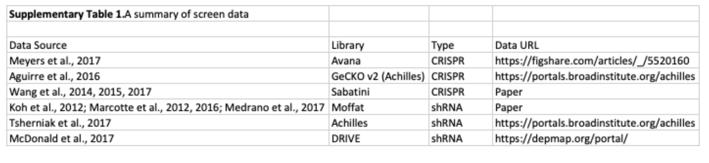

## RNA SS

Re-writing code in pytorch.

## System biology

### Yeast model

Reproduce D-cell paper: see [yeast_model_training/README.md](yeast_model_training/README.md)

Other dataset:
Yeast-Knockout Drug Gene Growth Phenotypes (6000x172)
https://science.sciencemag.org/content/320/5874/362

### Human dataset

Human double knock-out data:

Mapping the Genetic Landscape of Human Cells
https://www.sciencedirect.com/science/article/pii/S0092867418307359
472 x 472 genes representing 111,628 unique combinations,
in two cancer cell lines (K562 & Jurkat).
 Note that they only selected genes that we previously identified in a
 CRISPRi screen as essential for robust cell proliferation or viability
 (I guess this is also why they can use growth as the phenotype).

Other human knock-out data

