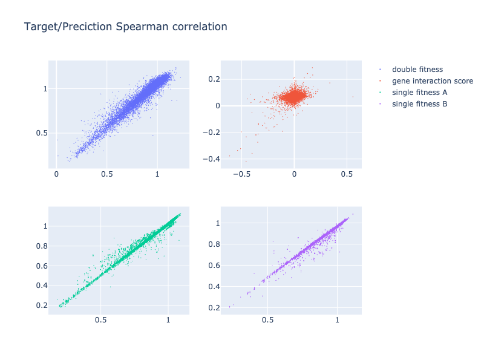
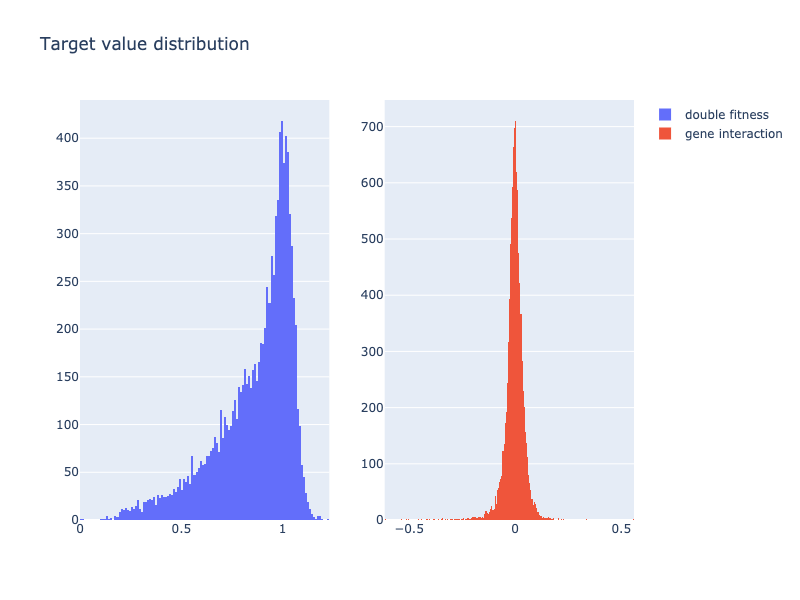

## Whether indirect training successfully learned direct information

For context, see https://github.com/PSI-Lab/alice-sandbox/blob/380a260c4b8c39be9ab644804b170733869607fb/meetings/2020_03_06/yeast_model/README.md#multi-task-learning-without-providing-single-fitness


```
python train_nn_multi.py --data ~/work/psi-lab-sandbox/meetings/2020_02_11/d_cell/data/training/raw_pair_wise/SGA_ExE.txt ~/work/psi-lab-sandbox/meetings/2020_02_11/d_cell/data/training/raw_pair_wise/SGA_ExN_NxE.txt ~/work/psi-lab-sandbox/meetings/2020_02_11/d_cell/data/training/raw_pair_wise/SGA_NxN.txt --result result/run_1 --epoch 50 --hid_sizes 100 100 100 100 50 50 20 10
```

Final performance:

```
Training data performance
2020-03-10 14:47:01,313 [MainThread  ] [INFO ]  correlation (fitness)
2020-03-10 14:47:01,456 [MainThread  ] [INFO ]  (0.9681720768224599, 0.0)
2020-03-10 14:47:01,456 [MainThread  ] [INFO ]  correlation (gi)
2020-03-10 14:47:01,598 [MainThread  ] [INFO ]  (0.44675759545502447, 0.0)
2020-03-10 14:47:01,598 [MainThread  ] [INFO ]  correlation (f1 indirect)
2020-03-10 14:47:01,740 [MainThread  ] [INFO ]  (0.9912668501968521, 0.0)
2020-03-10 14:47:01,740 [MainThread  ] [INFO ]  correlation (f2 indirect)
2020-03-10 14:47:01,882 [MainThread  ] [INFO ]  (0.9846010344832641, 0.0)

Test data performance
2020-03-10 14:51:00,931 [MainThread  ] [INFO ]  correlation (fitness)
2020-03-10 14:51:00,968 [MainThread  ] [INFO ]  (0.9622034461803264, 0.0)
2020-03-10 14:51:00,968 [MainThread  ] [INFO ]  correlation (gi)
2020-03-10 14:51:01,011 [MainThread  ] [INFO ]  (0.2764282831229966, 0.0)
2020-03-10 14:51:01,012 [MainThread  ] [INFO ]  correlation (f1 indirect)
2020-03-10 14:51:01,056 [MainThread  ] [INFO ]  (0.9913894117715958, 0.0)
2020-03-10 14:51:01,056 [MainThread  ] [INFO ]  correlation (f2 indirect)
2020-03-10 14:51:01,096 [MainThread  ] [INFO ]  (0.9845829978928441, 0.0)
```

For plotting purpose, we subset to the first 10000 rows:

```
head -n 10001 pred_train.csv > pred_train_10000.csv
head -n 10001 pred_test.csv > pred_test_10000.csv
```





A few observations from the abpve result:

- Correlation for fd (direct training target) and f1, f2 (indirect training targets) are all really good.
Although this does not translate to a good gi correlation.

- It is interesting/surprising that NN can learn f1 and f2 without those being fed as training target.
Maybe there are something trivial about it?

- Fitness dynamic range much wider than gene interaction.
Although one would imagine that NN should be able to learn gi once converged on fitness.

- gi's close to the origin account for the majority of the data points, and seems to be hard to capture.
Would it possible that those are also more noisy?
Since they represent "no difference" than expected. But how close to the origin is close?

## Bigger NN + add regularization

D-cell paper

any data pre-processing?

they also applied loss function to intermediate layers, right?

12 layers, 2-hot input (we used 2-cold), batch norm after tanh, L2 regularization, intermediate loss (*0.3), mb size 15,000

how complex is their GO-derived architecture?
(two different ontology data source: GO: 97181 neurons, CliXO: 22,167 neurons)

residual?

dropout?

## Add one more layer for gi


## treat as 3-class: no diff, larger, smaller?

reweight training examples based on gi p-val


## Carry-over from last week


TODO set up hyperparam tuning

TODO match D-cell paper NN structure and performance (add residual connection if go deeper?)

- incorporate other prior information to improve performance


- dataset target value distribution, correlation between reps


- KO v.s. KD, different alleles


TODO is 0/1 encoding the best? try 1/-1??


