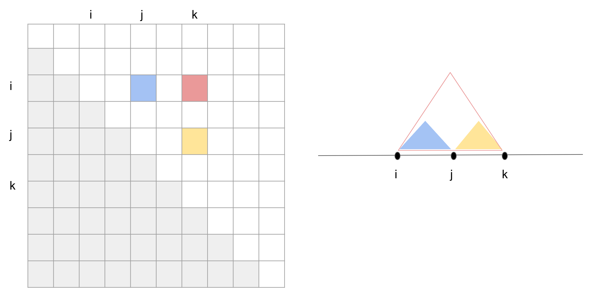

General thinking:



Why we can't naively generate binary labels by "scanning"
(to be precise, in our original model, only the last few layers were auto-regressive, i.e., scanning)
 from the off-diagonal up to the top right corner:
in the above plot, whether i-j form a base pair is not just dependent on the sequence in between i and j,
but also on sequence in between j and k.
This is analogous to the inside algorithm, where at each 'step' (here being each cell),
we can only compute the best (or all possible) partial scores,
and it's up to the later steps (or cells to the top right corner) to decide
how to INTEGRATE these partial scores.
For example, at step j-k, the best combination might be i-j & j-k, or i-j' & j'-k,
depend on which decomposed substructures give the highest score.

This means that, in theory, label cannot be finalized until we finished all score computation (up to top right corner).
After computing all scores, we will need to trace back from the complete sequence,
to decompose into substructures.

How? Still thinking...

## Read text book: Biological sequence analysis by Durbin

See notebook

## ContraFold

https://github.com/csfoo/contrafold-se

(code and training/testing data)

Fixed my c++ compiler. Still can't compile:

```
Utilities.cpp:342:17: error: use of undeclared identifier 'mkdtemp'
    char *ret = mkdtemp(temp_dir_name);
                ^
2 warnings and 1 error generated.
make: *** [Utilities.o] Error 1
```

Key learning from re-reading the paper after reading the textbook:

- ContraFold does not require any specific grammar.
In fact, at the center of all similar methods are the recursion formulation and associated DP,
where the purpose is to enumerate all possibilities (and compute their scores) in an efficient way.
Different methods represent different ways to decompose some score/probability/etc. into reusable sub components,

- Since there is no explicit grammar in ContraFold,
given a sequence and its structure in the training data,
there is a deterministic mapping to the 'feature vector' (also referred to as 'factors' in the paper).
One question I have is whether this is over-simplifying since it does not model the transition probability between states
in the generation process. For example two different structure might have exactly the same
feature vector (is that possible?) thus the same probability as defined by ContraFold,
but since their underlying generation process is different, the actual probabilities are different.
Or maybe I'mmisunderstanding something here?

- When predicting structure from sequence,
the author proposed a DP algorithm (modified inside-outside)
which essentially evaluate all possible structures in an efficient way.

- Constraints (like each base cannot be paired with more than one base)
are implicit given the basic components, which are consists of stems and loops.
Same goes for specifying constraints by grammar.

## general NLP


### Unsupervised Induction of Stochastic Context-Free Grammars using Distributional Clustering

### Natural language grammar induction with a generative constituent-context model


### A Primal-Dual Formulation for Deep Learning with Constraints


## Literature review

Continued from last week: [../2020_06_16/README.md](../2020_06_16/README.md)

### Recurrent Neural Network Grammars

Chris Dyer♠ Adhiguna Kuncoro♠ Miguel Ballesteros♦♠ Noah A. Smith, 2016

code:
c++: https://github.com/clab/rnng
pytorch: https://github.com/kmkurn/pytorch-rnng

podcast: https://soundcloud.com/nlp-highlights/04-recurrent-neural-network-grammars-with-chris-dyer


- explicitly models nested structure.

- reminiscent of probabilistic context-free grammar generation, but decisions are parameterized using RNNs
that condition on the entire syntactic derivation history, greatly relaxing context-free independence assumptions.

- parsing: sequence of words -> parse tree. A stack and a buffer.
Begins with empty stack and all words in buffer.
Three types of operations: NT(X), SHIFT and REDUCE. See Fig 2.

- generation. see Fig 4.

- sequence model defined over generator transitions, parameterized using a continuous space embedding
 of the algorithm state at each time step.
 Algorithm state represented by embedding of the three data structures:
 output buffer, stack, and history of actions. These are of variable length so use RNN to encode.


### Unsupervised Recurrent Neural Network Grammars

Yoon Kim† Alexander M. Rush† Lei Yu3
Adhiguna Kuncoro‡,3 Chris Dyer3 G´abor Melis, 2019

(follow up work from above?)

code: https://github.com/harvardnlp/urnng


### Compound Probabilistic Context-Free Grammars for Grammar Induction *


### Gradient Estimation with Stochastic Softmax Tricks

The Gumbel-Max trick is the basis of many relaxed gradient estimators. These estimators are easy to implement and low variance, but the goal of scaling them comprehensively to large combinatorial distributions is still outstanding. Working within the perturbation model framework, we introduce stochastic softmax tricks, which generalize the Gumbel-Softmax trick to combinatorial spaces. Our framework is a unified perspective on existing relaxed estimators for perturbation models, and it contains many novel relaxations. We design structured relaxations for subset selection, spanning trees, arborescences, and others. When compared to less structured baselines, we find that stochastic softmax tricks can be used to train latent variable models that perform better and discover more latent structure.


### OptNet: Differentiable Optimization as a Layer in Neural Networks

solve Quadratic Programming

constrained optimization

### SATNet: Bridging deep learning and logical reasoning using a differentiable satisfiability solver


slides: https://powei.tw/satnet_slide.pdf

poster: https://powei.tw/satnet_poster.pdf

video: (timestamp 43:00) https://www.facebook.com/icml.imls/videos/3253466301345987/


- jointly learning constraints and solutions, where constraints are represented as logical structures,
which are expressed by satisfiability problems.

- MAXSAT: maximize the number of clauses satisfied

- use differentiable SDP relaxations to capture relationships between discrete variables, fast solver by coordinate descent.

- backward pass computed analytically, no need to unroll the forward pass and store the Jacobians


### Variational Inference for Adaptor Grammars


### SYNTAX-DIRECTED VARIATIONAL AUTOENCODER FOR STRUCTURED DATA


### Sum-Product Networks: A New Deep Architecture

### Improved Semantic Representations From Tree-Structured Long Short-Term Memory Networks


### Simple and Accurate Dependency Parsing Using Bidirectional LSTM Feature Representations

Eliyahu Kiperwasser, Yoav Goldberg, 2016

### Inferring Algorithmic Patterns with Stack-Augmented Recurrent Nets

Armand Joulin, Tomas Mikolov, 2015


### Deep Learning with Dynamic Computation Graphs

Moshe Looks, Marcello Herreshoff, DeLesley Hutchins, Peter Norvig, 2017


### Deep learning of recursive structure: Grammar induction

Jason Eisner, ICLR 2013

talk video link not working: https://cs.jhu.edu/~jason/papers/

slides: https://cs.jhu.edu/~jason/papers/eisner.iclr13.pdf

Really interesting. Need to spend more time reading.

also see intro on grammar induction: https://ocw.mit.edu/courses/electrical-engineering-and-computer-science/6-864-advanced-natural-language-processing-fall-2005/lecture-notes/lec11.pdf


### Adventures with RNA Graphs


## TODOs

reading contrafold + probing + try their code

read RNA as graph paper

learn how to process PDB data

find more details about deep learning grammar induction, his student? Henry Pao?

read paper, compound CFG

ask Alireza/Shreshth whether they are aware of any work that combines deep learning and grammar

## Other random notes


binary tree

component -> NN -> score
score recursion DP
backprop


conditional grammar?

use NN for scoring, combined with discrete back-tracing? (so we incorporate grammar/constraint)

generate decomposition (tree?),1 step

