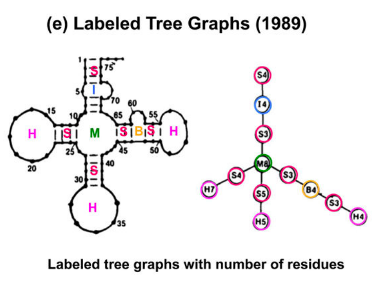
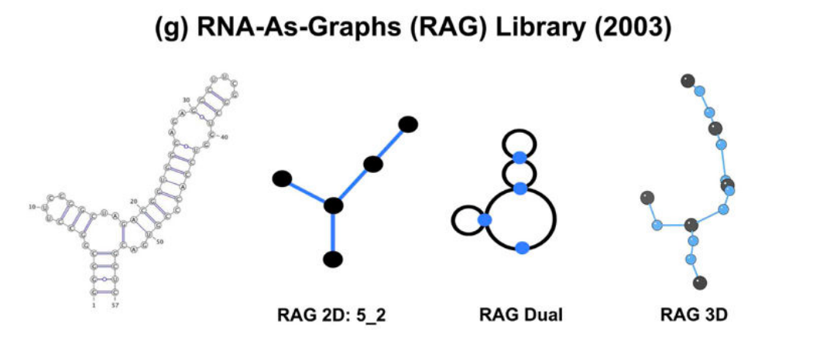
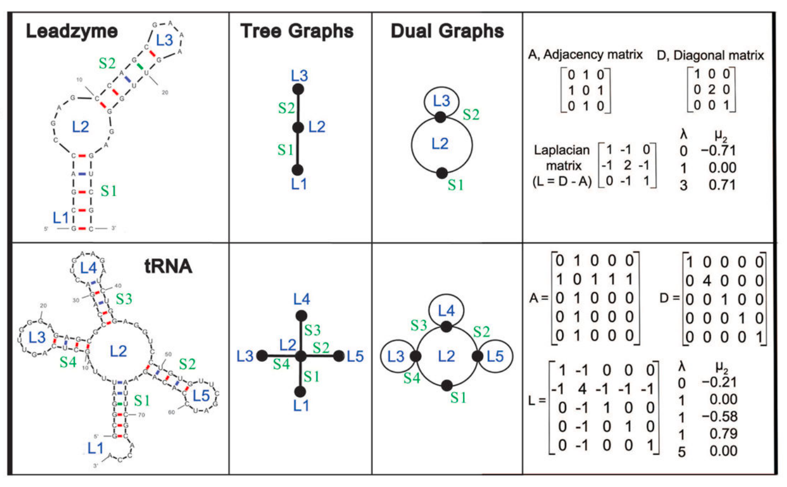
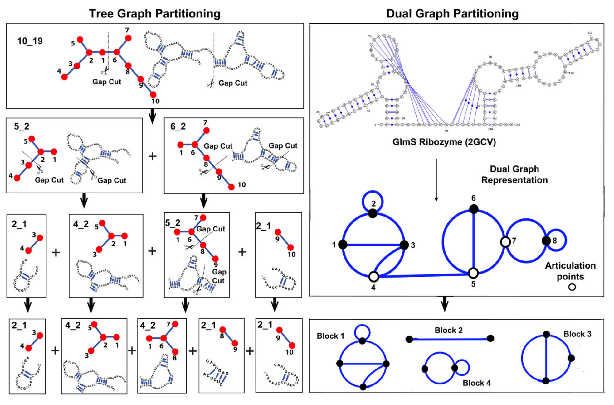
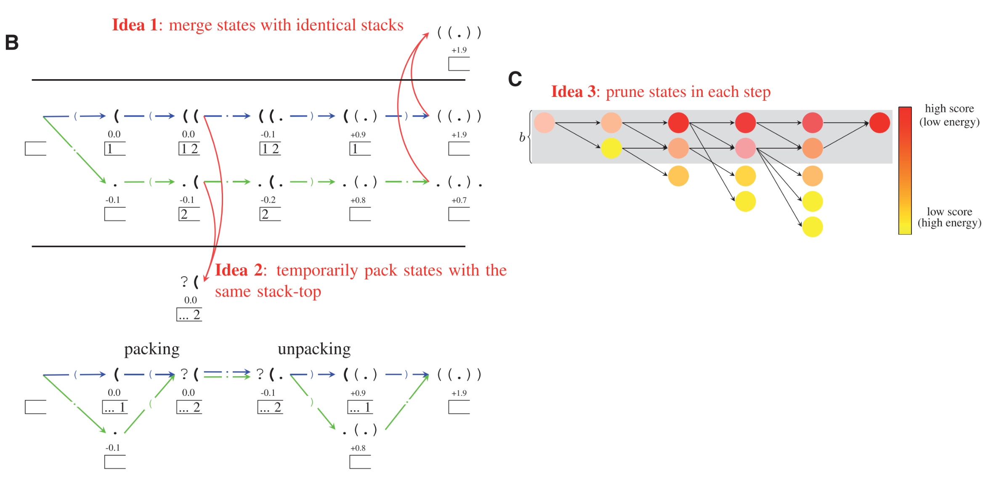

## Literature review

### Adventures with RNA Graphs

Tamar Schlick

Proposed RAG (RNA-As-Graphs) framework which partitions a structure into modular units connected in a network.
This drasticaly reduces the number of possibilities in conformational space,
such that all possible structural motifs can be described explicitly by graph enumeration methods,
since graph motif space is much smaller than sequence space.

- Existing representation of RNA structure

    - Tinoco plot

    - circular linked graph (arcs): easy detection of pesudoknots by crossing of arcs

    - planar graph, with adjacency matrix

    - mountain plot

    - ordered labeled tree graph:
    todo plot + notes

    

    - RAG (RNA-As-Graphs): proposed by this author in 2003.
    Tree graph and dual graph.

- Two RAG graphs for RNA structure

    

    

    - Tree graph:
    bulges, junctions, and loops represented as vertices, stems are edges.

    - Dual graph:
    bulges, junctions, and loops are edges, and stems are vertices.
    Can represent pesudoknot.

- For a structure represented as RAG, we can compute its nxn Laplacian matrix L.
The Laplacian has non-negative eigenvalues and the second eigenvalue λ2 is a measure of overall compactness.
λ2 was used to order our RNA graphs in the RAG catalog.
The second eigenvector μ2 {μ21, …, μ2n} was used for partitioning graphs.

- Partitioning

    

    - tree graph: graph cut.
    divides the graph between the two indices k,m whose respective components of μ2 generate the largest numerical difference,
   This partitioning method leaves junctions intact: todo plot

    - dual graph:
    divides a dual graph into pseudoknot and pseudoknot-free regions.
    todo plot.

- RAG database enumerated all RNA tree graphs in the RAG framework up to 13 vertices using graph enumeration techniques.

- Also proposed framework for 3D structure. TODO read later.

todo DB notes

they have web tool to convert .ct to graph
http://www.biomath.nyu.edu/?q=rag/rna_matrix

can maybe download the software and run locally:
http://www.biomath.nyu.edu/?q=software/RAGTOP

### LinearFold: linear-time approximate RNA folding by 5'-to-3' dynamic programming and beam search

Liang Huang1,2,*, He Zhang2,†, Dezhong Deng1,†, Kai Zhao1,‡, Kaibo Liu1,2, David A. Hendrix1,3 and David H. Mathews, 2019

- Linear time approximation algorithm (compared to original cubic time),
inspired by *incremental parsing* for context-free grammars.
Original DP builds up solution space in a bottom-up manner, for all sub structures between (i, j).
This paper instead propose to scan the sequence from left to right, which, when coupled with
beam pruning heuristic results in *O*(n) run time.

- For illustration purpose, author demonstrate the proposed algorithm using a simplified score decomposition,
where total score is sum of paired scores and unpaired scores, and
w(CG) = w(AU) = w(GU) = 1, w(unpaired) = -0.1.
For example, `CCAGG` with structure `((.))` gets a score of `1.9`.

The naive (brute-force) algorithm: scan the RNA sequence left-to-right,
maintaining a stack along the way, and performing one of the three actions (push, skip or pop) at each step.
The state at step j consists of (sub-structure up to j, unmatched opening bracket positions in stack, j) and the score.
From step j to j+1:

    - push: label x_(j+1) as ‘(’ for it to be paired with a downstream base, and pushing j+1 on to the stack.

    - skip: label x_(j+1) as ‘.’ (unpaired)

    - pop: label x_(j+1) ‘)’, paired with the upstream nucleotide x_i where i is the top of the stack, and pop i.

The algorithm needs to finish with an empty stack, and the brackets need to be balanced
(Alice: I think this essentially eliminates certain state transition in the DP for some intermediate steps).

There are 3 main ideas that contribute to the liberalization of the above canonical DP:

    - Idea 1: erge states with identical stacks.
    Different states can have the same stack.
    They can be merged since the path going forward (to the right) will be identical.

    - Idea 2: pack temporarily equivalent states.
    Different states can have the same stack *top*.
    This means they behave equivalent until the stack top is poped.
    We can temporarily pack them, and the the stack is poped, they get unpacked.

    - Idea 3: beam pruning. This approximation is key in achieving *O*(n) run time.
    Idea is to only keep the b top-scoring (lowest-energy) states and prune the other.
    Author used b=100 in most cases.
    In addition, the author also used k-best parsing (todo: more details).

- In practise, the author converted both RNAfold and Contrafold to linearized version.
See supp B for more details.

- Performance evaluated on `ArchiveII` (also used by E2Efold) and a subset of `RNAcentral`.
On long sequences, LinearFold is strictly near where the traditional DP variants are cubic time.
The author even observed slight performance improvement even though this is a approximation algorithm.
Author provides a few insights:
(1) suboptimal structure might be closer to ground truth since scoring function is not perfect,
(2) pruning results in all prefix being high scoring, which serves as regularization,
(3) left-to-right scan might resemble closer co-transcriptional folding, compared to traditional bottom-up.

- Author mentioned several future directions:

    - computing partition function in a similar way (paper on arXiv now)

    - linear time pseudoknot

    - couple with its owner parameter estimation end to end

- Extra note: this is somewhat very similar to RNN grammar?

### LinearPartition: Linear-Time Approximation of RNA Folding Partition Function and Base Pairing Probabilities

### A New Method of RNA Secondary Structure Prediction Based on Convolutional Neural Network and Dynamic Programming

is this related to what I was thinking? - nope

## carry-overs & other random notes

binary tree

component -> NN -> score
score recursion DP
backprop

conditional grammar?

use NN for scoring, combined with discrete back-tracing? (so we incorporate grammar/constraint)

generate decomposition (tree?),1 step

pseudoknot? decompose into sub structure, but sub structure does
not need to be just stems and loops, it can contain pseudo knots

predict 'bounding boxes' (potentially overlap),
within each box is a sub structure
propose boxes
evalate all combination of boxes

basic types of substructures:
stem, loop?, pseudoknot? (any ideas we can borrow from "RNA as graph" paper)

within each bounding box, predict a distribution over basic components,
where each component is not represented in the raw entry,
but parameterized to reflect the constraints
