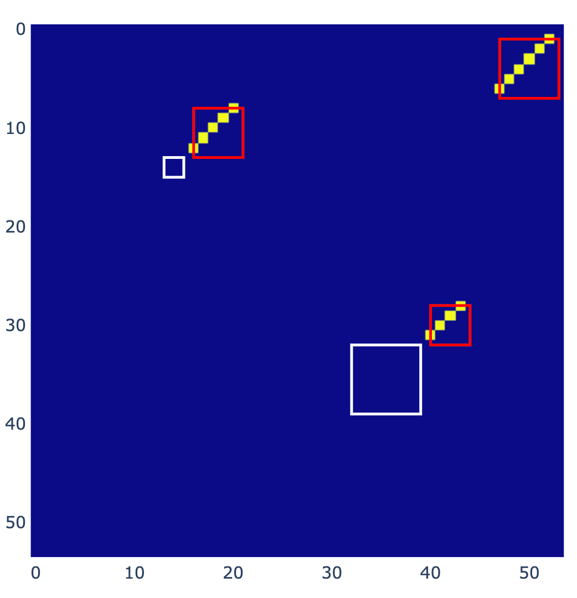

rna_ss top level util:
todo

## Prepare RNA substructure dataset

We consider the following to be local structures on the 2D grid (colored in plot):

- red: stem, diagonal within the square

- cyan: bulge, horizontal or vertical "space" between two stems

- purple: internal loop, rectangular (square being spacial case) "space" between two stems

- white: hairpin loop, square "space" sitting on off-diagonal, adjacent to a stem

On the other hand, external loops and multi-branch loops are NOT 2D-local structures.

TODOs:

    - update data structures so we can represent 'linked' relationship between local struc
no missing corners
    - make sure we can process pesudo-knot

    - process dataset so we use consistent 0-based or 1-based indexing

    - remove triplets

    - process all datasets and extract local structure

## YOLO

https://github.com/eriklindernoren/PyTorch-YOLOv3

train reusing their training pipeline before writing my own code?

## Combine proposed structures

