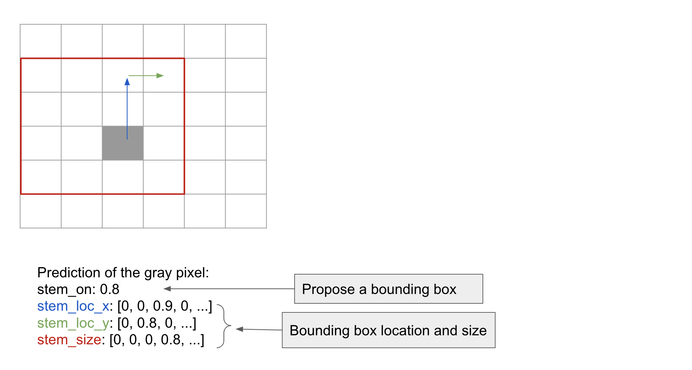
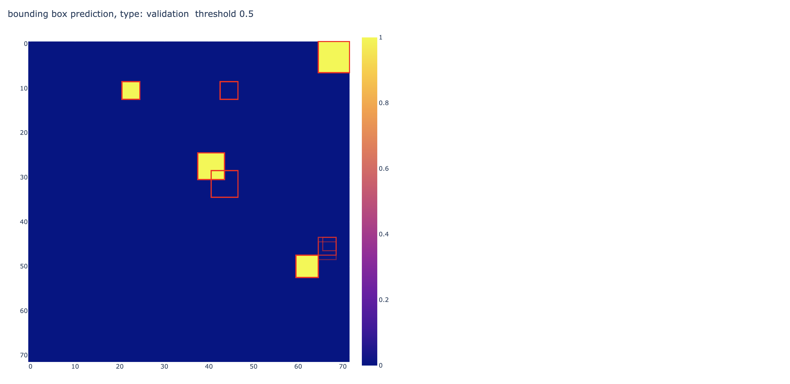

## Ideas

### General code improvement

- make mini dataset for debug use (faster data loading):

```
dcl upload -s '{"description": "small dataset for debug use."}' tmp/local_struct.bp_rna.multiclass.small_debug.pkl.gz
```

DC ID: `p2c99k`

- added Metric class for reporting extra metrics with mask applied, auc, prc (sigmoid), accuracy (softmax)

- added bounding box prediction visualization where box opacity is proportional to probability (on * loc_x * loc_y * siz)

- added soft mask loss

### Description of bounding box prediction

#### Model Output

Current model only predicts stem bounding boxes.
Specifically, for each pixel we predict:

- stem_on: sigmoid, whether this pixel belongs to a stem bounding box

- stem_location_x: softmax, row/vertical distance to reference.
Pixel distance is computed as: (row_idx_this_pixel - row_idx_bb_reference),
where bounding box reference is its top right corner pixel.
By definition, this distance is non-negative.
stem_location_x is the discretized version of shift in pixel, with the following mapping:

```
    softmax index   0  1  ...  9  10  11  11 ...
    pixel shift     0  1  ...  9  10  11  12 ...
```

i.e. we discretize up to and include distance of 10, with one softmax element representing all distances beyond 10.

- stem_location_y: softmax, column/horizontal distance to reference.
This is similar to the above, with some subtle differences.
Pixel distance is computed as: (col_idx_this_pixel - col_idx_bb_reference),
where bounding box reference is its top right corner pixel.
By definition, this distance is non-positive.
stem_location_x is the discretized version of shift in pixel, with the following mapping:

```
    softmax index   0   1  ...   9   10   11   11 ...
    pixel shift     0  -1  ...  -9  -10  -11  -12 ...
```

i.e. we discretize up to and include distance of -10, with one softmax element representing all distances beyond -10.

- stem_size: softmax, bounding box size. This is discretized as follows:

```
    softmax index        0  1  ...  8   9  10  10 ...
    bounding box size    1  2  ...  9  10  11  12 ...
```

i.e. we discretize up to and include size of 10, with one softmax element representing all sizes beyond 10.


#### Bounding Box Proposal

With these 4 predictions, we do the following for each pixel `(i, j)`:

1. Apply a threshold on `stem_on` to determine whether to compute bounding box for that pixel.
A typical threshold is `0.5`, but a different one can be used considering training data class imbalance
(also depend on how we apply mask & whether it's hard/soft mask).
In general, a lower threshold results in more bounding boxes (more FP and less FN),
which might be desirable for downstream assembly.

2. If the pixel has `stem_on` > `threshold`, compute the maximum likelihood bounding box location and size.
Here we maximize probability of `stem_location_x`, `stem_location_y` and `stem_size`,
by taking the argmax index of softmax.
Let the indices be `idx_x`, `idx_y`, `idx_siz`, respectively.
The location of bounding box reference point (top right corner) is:

```
    i_ref = i - idx_x
    j_ref = j + idx_y
```

and its size:

```
    size = idx_size + 1   # since idx 0 corresponds to size 1
```

Note the above does not produce accurate result for bounding box location and size beyond the softmax length (to be worked on in the future).

Above procedure is demonstrated as in the following figure:



3. We can also compute the probability of this bounding box,
by multiplying the sigmoid probability and 3 softmax probability corresponding to the argmax index:

```
    p_box = stem_on * stem_location_x[idx_x] * stem_location_y[idx_y] * stem_size[idx_size]
```

#### Interactive Plot

In the HTML plot, we apply a certain threshold (annotated on each figure)
on `stem_on` to find all pixels where a bounding box should be computed.
Then for each such pixel, we calculate the location and size of bounding box,
and draw the bounding box with opacity set to the probability of the box.
Bounding box proposed from neighbouring pixels can overlap partially or entirely.
Visually, a 'darker' bounding box is a more confident one,
since it corresponds to a high probability box and/or identical proposals from multiple pixels.

A screenshot from HTML plot is included here as a reference:



Predicted bounding boxes in red (different opacity indicates different probabilities,
or overlapping boxes). Solid yellow color blocks are ground truth.


### Pixel-wise encoding of precise location of bounding box

Most of the time, each pixel can be uniquely assigned to one bounding box.
In the case of closing pair of a loop, it's assigned to both the stem and the loop.
In the rare case where the stem is of length 1, and the stem has 2 loops, one on each side,
the pixel is assigned to 2 loops.
Thus, it can be observed that each pixel can be assigned to:

    - 0 or 1 stem box

    - 0, 1 or 2 internal loop box (we'll ignore the case of 2 internal loop for now since it's rare )

    - 0 or 1 hairpin loop

From the above, we conclude that for each pixel we need at most 4 bounding boxes with unique types
(of course each box can be turned on/off independently, like in CV):

    - stem box

    - internal loop box 1

    - internal loop box 2 (rarely used, ignored for now)

    - hairpin loop box

Using the above formulation, we only need to predict the on/off of each box (sigmoid),
without the need to predict its type (also avoid problem of multiple box permutation).

(since we only predict one iloop, in the case there are both
(which only happens for a single pixel at the boundary, and that pixel also needs to be a len=1 stem),
we set that pixel to belong to the box where it is the top right corner)

To encode the location, we use the top right corner as the reference point,
and calculate the distance of the current pixel to the reference,
both horizontally and vertically.
The idea is to predict it using a softmax over finite classes.
Horizontal distance (y/columns) <= 0, e.g. 0, -1, ..., -9, -10, -10_beyond.
Vertical distance (x/rows) >= 0, e.g. 0, 1, ..., 9, 10, 10_beyond.
Basically we assign one class for each integer distance until some distance away (10in the above example).

To encode the size, we use different number of softmax, depending on the box type:

    - stem: one softmax over 1, ..., 9, 10, 10_beyond, since it's square shaped

    - internal loop: two softmax over 1, ..., 9, 10, 10_beyond, one for height one for width

    - hairpin loop: one softmax over 1, ..., 9, 10, 10_beyond, since it's triangle/square shaped
    (caveat: some hairpin loops are very long)


Alternative: encode distance to lower left corner (hairpin is tricky since it's a triangle).

Also: we should still be able to 'decode' boxes > 10 in size, although with reduced accuracy?


Uploaded to DC: `youYTn`

(above from last week)

small dataset for debug: `p2c99k`

train (using small debug dataset):
```
python train_simple_conv_net_pixel_bb.py --data p2c99k --result result/test_simple_conv_pixel_bb_debug --num_filters 16 --filter_width 9 --epoch 10 --batch_size 20 --max_length 80 --cpu 4
```

train on stem pixel bb only for debug:

train (GPU):
```
CUDA_VISIBLE_DEVICES=0 python train_simple_conv_net_pixel_bb.py --data youYTn --result result/simple_conv_net_pixel_bb_1 --num_filters 32 32 64 64 128 128 --filter_width 9 9 9 9 9 9 --epoch 20 --batch_size 40 --max_length 200 --cpu 0
```
(n_cpu set to 0, otherwise oom, need to improve code!)

log & plot: https://drive.google.com/drive/folders/1PA7MvFqJY6v_FQ3VljbP2jZ3DcPK86cV


### stem bb, soft mask

soft mask 0.1, train (GPU):
```
CUDA_VISIBLE_DEVICES=0 python train_simple_conv_net_pixel_bb.py --data youYTn --result result/simple_conv_net_pixel_bb_soft_mask_1 --num_filters 32 32 64 64 128 128 --filter_width 9 9 9 9 9 9 --epoch 20 --mask 0.1 --batch_size 40 --max_length 200 --cpu 0
```


more epochs:
```
CUDA_VISIBLE_DEVICES=0 python train_simple_conv_net_pixel_bb.py --data youYTn --result result/simple_conv_net_pixel_bb_soft_mask_3 --num_filters 32 32 32 64 64 64 128 --filter_width 9 9 9 9 9 9 9 --epoch 50 --mask 0.1 --batch_size 40 --max_length 200 --cpu 0
```

log & plot: https://drive.google.com/drive/folders/1TfEtdxqWk2l0uWOmSxIoP1gTbrqkvqAZ


## Ideas & TODOs

Make sure to log the conclusion for each idea, for future reference.
(make one section for each idea, move above)
(also for each idea include git hash so we can check the associated training code)

- rnafold generated dataset to pre-train bounding box module (pick example with less ensemble diversity?)

- training (all targets, not just stem)


- memory efficiency, especially cpu mem (for Linux machine),
sparse array or just save index myself, expand when making minibatch,
use int instead of float

- make minibatch workflow, pass in training=T/F flag to streamline code

- add structured metric logging (for training curve plot)

- improve plot script to compute bb in vectorized format

- add output specific hidden layer

- rectangle -> sequence A & B 'compatibility'?

- long stem -> break into parts (overlapping?), max len 10

- in theory, stem should be really easy to pick up,
investigate alternative architecture? training on patches?

- use sparse array (numpy? scipy?) to improve data loader (taking too much memory)

- read capsule network paper

- train on smaller patches. in theory this should be roughly equivalent to
applying local un-masking, but it's a good baseline to establish anyways.
We can generate patches that center at different types of structures.

- pre-train stage 1 on very short seq, e.g, miRNA or RNAfold generated dataset


- smaller input region? localize to the structure? (same as masking most of the background)
local un-mask

- toy example?

- per-channel naive guess & performance

- if we come up with a scheme to assign probability/class to every pixel,
then we can compute the joint probability.
to avoid exponentially many assembly possibilities,
we can apply cut off to construct an initial set of proposals
before running the discrete step.

- debug: terminal internal loop? (does not make sense)

- discover intrinsic structure within dataset (e.g. families?) unsupervised?

- deep learning assemble proposal?

- formulate as RL?
