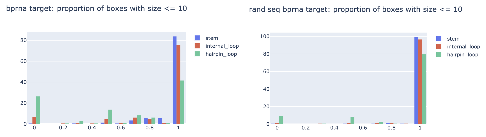

## General implementation and improvements

### Setting up predictor interface and evaluation utils

- Implementation in [utils_model.py]([utils_model.py]).

- Right now predictor takes in as input the pytorch model parameter checkpoint,
but has hard-coded architecture (until training workflow saves parameters in config).

- Predictor class: sequence, threshold -> bounding boxes

- Evaluator obj is initialized with a predictor instance.
Evaluator class: sequence, target, threshold -> bounding boxes, metrics, plots

Usage:

```
from utils_model import Predictor, Evaluator
predictor = Predictor('v0.1')
evaluator = Evaluator(predictor)
evaluator.predict('AGGGTTTTCCCA', [[1, 2, 3], [10, 9, 8]], 0.1)
fig_stem, fig_iloop, fig_hloop = evaluator.plot()
df_result, metrics = evaluator.calculate_metrics()
print(metrics)
```

Above prints:

```
{'stem_identical': 1.0,
 'stem_overlap': 1.0,
 'iloop_identical': nan,
 'iloop_overlap': nan,
 'hloop_identical': 1.0,
 'hloop_overlap': 1.0}
```

This toy example also serves as a sanity check.


### Upload trained model

- `v0.1`: `UGGg0e`, epoch 6, random sequence, trained using:

```
CUDA_VISIBLE_DEVICES=0 python train_simple_conv_net_pixel_bb_all_targets.py --data ZQi8RT --result result/rf_data_all_targets_3 --num_filters 32 32 64 64 64 128 128 --filter_width 9 9 9 9 9 9 9 --epoch 50 --mask 0.1 --batch_size 40 --max_length 200 --cpu 12^C
```

in `meetings/2020_08_25`, git hash `8e604f6569d60f18ce28c42e70014684dd27f865`


## Trying out ideas

### Evaluate rand seq model on bpRNA

Script: [eval_dataset.ipynb](eval_dataset.ipynb)

As a sanity check, we evaluated on te first 200 data points:


This looks much worse than performance on rand seq dataset (see report).

### Bounding box size distribution

Is it possible that bpRNA and synthetic dataset differ a lot in terms of bounding box sizes?



Conclusion: Not a lot. Hairpin loop shows the most significant difference.
In bpRNA vast majority of the bounding boxes are with size <= 10, which means that
in theory we should be able to predict the majority correctly (which is not the case above).


### Train all-target model using bpRNA dataset, save model

```
CUDA_VISIBLE_DEVICES=0 python train_simple_conv_net_pixel_bb_all_targets.py --data DmNgdP --result result/rf_data_all_targets_bprna_1 --num_filters 32 32 64 64 64 128 128 --filter_width 9 9 9 9 9 9 9 --epoch 50 --mask 0.1 --batch_size 20 --max_length 200 --cpu 12
```

running


model upload to DC

eval on bpRNA compare


check how many structures >10 in size?


### less params


```
CUDA_VISIBLE_DEVICES=0 python train_simple_conv_net_pixel_bb_all_targets.py --data DmNgdP --result result/rf_data_all_targets_bprna_2 --num_filters 32 32 32 32 32 32 32 --filter_width 9 9 9 9 9 9 9 --epoch 50 --mask 0.1 --batch_size 20 --max_length 200 --cpu 12
```


## New todos

- predict on bpENA dataset (test set, never seen before), eval bb performance

- NN combinatorics

- RL combinatorics


- ensemble? bb union of v0.1 and v0.2 model

- stage 2: hloop, given top right corner, the size is deterministic, we can discard those whose predicted size does not match

## Ideas & TODOs

Make sure to log the conclusion for each idea, for future reference.
(make one section for each idea, move above)
(also for each idea include git hash so we can check the associated training code)

- update pandas on workstation - done

- save model, implement script to predict on new dataset - done

- now we're saving metadata, update plot code cropping since we no longer need to infer length,
also add evaluation to check identical/overlapping box

- enumerate all valid configurations of bounding boxes, how to do it efficiently?

- train on bigger dataset, with more complicated model, see if we can improve sensitivity

- data generator: return extra info, so that we can store at training/validation minibatch.
e.g. sequence, sequence length, original bounding box list

- vectorize bounding box proposal code

- right now we make separate plot for different box types,
 if we plot all on the same, need to use different color for different box type

- the confidence of a bounding box is reflected by:
(1) the joint probability of sigmoid/softmax output,
(2) how many other bounding box overlap

- ideas for assembly:
start with most confidence box,
for each iloop find the compatible stems on each side,
for each hloop find the compatible stem.
formulate as another prediction problem?
given the sequence and all bounding boxes, predict the 'groud truth' combination of bounding box?
equivalent to predict (globally) on/off of each bounding box? how to represent bounding box, another feature map?

- assembly: how to train the 2nd stage algorithm if he first stage sensitivity is not 100%?
i.e. given that we know what is valid path and we have a way to enumerate all valid paths,
how to define closeness of each path to the ground truth? convert it back to binary matrix and calculate the old metrics?

- validity:
stem is not valid if not joined by loop (e.g. hloop between diagonal),
hloop is not valid if it's not across diagonal,
etc.

- bounding box loss (not differentiable?)
TP & FP at threshold, TP: proposed bb overlapping ground truth,
FP: proposed bb not overlapping ground truth.
For the bb module, we want high TP, even at a cost of high FN.

- bounding box size > 10? how?  re-process dataset to partition into smaller (overlapping) boxes?
how to determine which one to assign for each pixel, the closer one?

- if we have the original target bounding box locations, we can compute the following metrics:
(similar to sensitivity):
% of true bounding box that has: identical proposed box, overlapping proposed box, no proposed box.
(similar to specificity):
% of predicted bounding box that has: identical true box, overlapping true box, no overlapping true box

- fix divide warning:

```
  return np.sum(_x2 == _y2)/float(len(_x2))
train_simple_conv_net_pixel_bb.py:579: RuntimeWarning: invalid value encountered in true_divide
  return np.sum(_x2 == _y2)/float(len(_x2))

```

- rnafold generated dataset to pre-train bounding box module (pick example with less ensemble diversity?)

- training (all targets, not just stem)

- incompatibility: stem_on, location shift > 1, but stem size=1

- not able to predict len=1 stem?


- memory efficiency, especially cpu mem (for Linux machine),
sparse array or just save index myself, expand when making minibatch,
use int instead of float

- make minibatch workflow, pass in training=T/F flag to streamline code

- add structured metric logging (for training curve plot)

- improve plot script to compute bb in vectorized format

- add output specific hidden layer

- rectangle -> sequence A & B 'compatibility'?

- long stem -> break into parts (overlapping?), max len 10

- in theory, stem should be really easy to pick up,
investigate alternative architecture? training on patches?

- use sparse array (numpy? scipy?) to improve data loader (taking too much memory)

- read capsule network paper

- train on smaller patches. in theory this should be roughly equivalent to
applying local un-masking, but it's a good baseline to establish anyways.
We can generate patches that center at different types of structures.

- pre-train stage 1 on very short seq, e.g, miRNA or RNAfold generated dataset


- smaller input region? localize to the structure? (same as masking most of the background)
local un-mask

- toy example?

- per-channel naive guess & performance

- if we come up with a scheme to assign probability/class to every pixel,
then we can compute the joint probability.
to avoid exponentially many assembly possibilities,
we can apply cut off to construct an initial set of proposals
before running the discrete step.

- debug: terminal internal loop? (does not make sense)

- discover intrinsic structure within dataset (e.g. families?) unsupervised?

- deep learning assemble proposal?

- formulate as RL?
