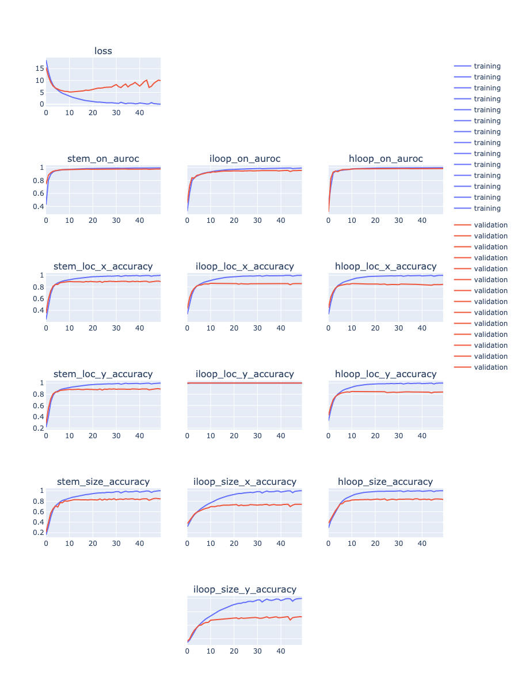
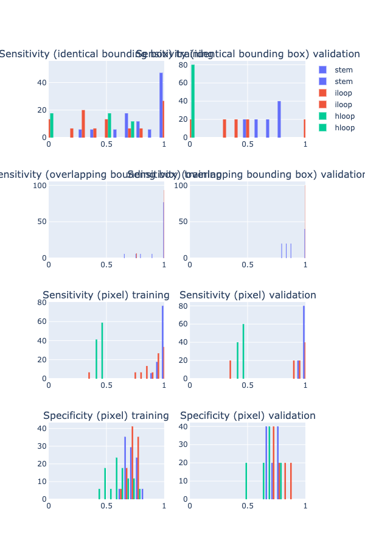
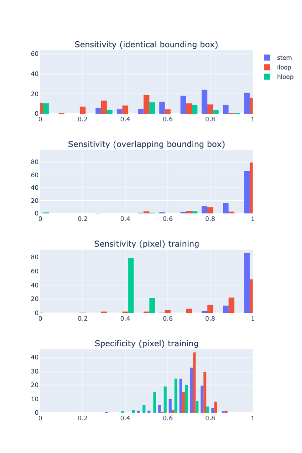
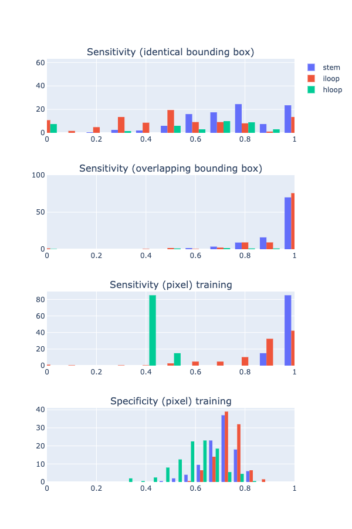

### Debug

Verify that Predictor class is being implemented properly:

(workstation)

```
import numpy as np
import pandas as pd
from utils_model import Predictor, Evaluator, DataEncoder

df = pd.read_pickle('../2020_09_08/result/rf_data_all_targets_bprna_1/pred_ep_49.pkl.gz')
predictor = Predictor('../2020_09_08/result/rf_data_all_targets_bprna_1/model_ckpt_ep_49.pth')

# row = df.iloc[0]  # training example
row = df.iloc[-1]  # validation example

seq = row['seq']
pred_on = row['pred_stem_on']
pred_loc_x = row['pred_stem_location_x']
pred_loc_y = row['pred_stem_location_y']
pred_siz_x = row['pred_stem_size']

# thres = 0.5  # for debug, so that we don't have too many bb's
thres = 0.1

# use prediction array saved from training workflow to get bounding boxes
# stem only for debug
proposed_boxes, pred_box = Predictor.predict_bounidng_box(pred_on, pred_loc_x, pred_loc_y, pred_siz_x, pred_siz_x, thres)

# use predictor interface to predict from sequence directly
yp, pred_bb_stem, pred_bb_iloop, pred_bb_hloop, pred_box_stem, pred_box_iloop, pred_box_hloop = predictor.predict_bb(row['seq'], thres)


df_from_training = pd.DataFrame(proposed_boxes)
df_from_interface = pd.DataFrame(pred_bb_stem)
df_from_training = df_from_training.drop_duplicates(subset=['bb_x', 'bb_y', 'siz_x', 'siz_y'])
df_from_interface = df_from_interface.drop_duplicates(subset=['bb_x', 'bb_y', 'siz_x', 'siz_y'])

# do they match?


# check intermediate numpy array match
pred_diff = np.abs(pred_on[0, :len(seq), len(seq)] - yp['stem_on'][0, :, :])
# these should be small
print(np.mean(pred_diff))  # 0.032623436
print(np.median(pred_diff))  # 0.002665792
print(np.max(pred_diff))  # 0.9999042

# bb's
print(row.subset)
print(df_from_interface)
print(df_from_training)
print(row.bounding_boxes)  # note this is top left corner!

# check metric using each one

```


df prints:

```
In [32]: print(df_from_interface)
     bb_x  bb_y  siz_x  siz_y      prob
0       1    32      7      7  0.076316
1       1   115      9      9  0.083428
2       1   116      9      9  0.592853
3       1   116      8      8  0.212208
11      2    32      7      7  0.189764
..    ...   ...    ...    ...       ...
571    97   107     11     11  0.006249
575    90   116      9      9  0.032013
576    97   107      1      1  0.017415
577    97   109      2      2  0.014114
578    89   116     11     11  0.003138


In [33]: print(df_from_training)
     bb_x  bb_y  siz_x  siz_y      prob
0       1   115      9      9  0.040270
1       1   116      9      9  0.530546
6       1   116      8      8  0.370881
10      2    32      7      7  0.106882
11      2    31      6      6  0.097403
..    ...   ...    ...    ...       ...
560    89   107      1      1  0.006923
561    98   108      2      2  0.013944
562   142   150      7      7  0.020158
563   142   151      8      8  0.014032
564   146   151      8      8  0.007203

[115 rows x 5 columns]
```


Not perfect match but close enough?

### less params (checking result from from 2020_09_08)


```
CUDA_VISIBLE_DEVICES=0 python train_simple_conv_net_pixel_bb_all_targets.py --data DmNgdP --result result/rf_data_all_targets_bprna_2 --num_filters 32 32 32 32 32 32 32 --filter_width 9 9 9 9 9 9 9 --epoch 50 --mask 0.1 --batch_size 20 --max_length 200 --cpu 12
```


todo plot?


add dropout:

```
CUDA_VISIBLE_DEVICES=0 python train_simple_conv_net_pixel_bb_all_targets.py --data DmNgdP --result result/rf_data_all_targets_bprna_3 --dropout 0.5 --num_filters 32 32 32 32 32 32 32 --filter_width 9 9 9 9 9 9 9 --epoch 50 --mask 0.1 --batch_size 20 --max_length 200 --cpu 12
```


with dropout, but more params, more epochs:

```
CUDA_VISIBLE_DEVICES=0 python train_simple_conv_net_pixel_bb_all_targets.py --data DmNgdP --result result/rf_data_all_targets_bprna_4 --dropout 0.5 --num_filters 32 32 64 64 64 128 128 --filter_width 9 9 9 9 9 9 9 --epoch 100 --mask 0.1 --batch_size 20 --max_length 200 --cpu 12
```


todo training performance should be good. check it

### Experiment

todo: Use bpRNA sequence, but generate structure using RNAfold, then train model

In Py3 env (e.g. plot_py3), run:

```
python extract_bprna_seq.py
```

In py2 env (e.g. rna_ss), run:

```
python generate_experimental_dataset_1.py
```

In Py3 env (e.g. plot_py3), run:

```
python generate_experimental_dataset_2.py
```


Dataset upload to DC: `TM4u8E`


train model:

```
CUDA_VISIBLE_DEVICES=0 python train_simple_conv_net_pixel_bb_all_targets.py --data TM4u8E --result result/exp_bprna_rnafold_1 --num_filters 32 32 64 64 64 128 128 --filter_width 9 9 9 9 9 9 9 --epoch 50 --mask 0.1 --batch_size 20 --max_length 200 --cpu 12
```


Visualize training progress:

```
python plot_training.py --in_log result/exp_bprna_rnafold_1/run.log --out_plot result/exp_bprna_rnafold_1/training_progress.html
```




As shown above, if we look at the loss (top left figure), the model start overfitting from around epoch 5,
although the metrics do not seem to overfit even after that.

Analyze ep5 model on ep5 minibatch data (run on workstation):

```
python eval_model_minibatch_data.py --data result/exp_bprna_rnafold_1/pred_ep_5.pkl.gz --model result/exp_bprna_rnafold_1/model_ckpt_ep_5.pth --out_csv result/exp_bprna_rnafold_1/tmp/ep_5.csv --out_plot result/exp_bprna_rnafold_1/tmp/ep_5.html
```




Analyze ep5 model on full dataset (sample 200 data points, limit to length 200 for speed until we vectorize bounding box code):

```
python eval_model_dataset.py --data "`dcl path TM4u8E`" --num 200 --maxl 200 --model result/exp_bprna_rnafold_1/model_ckpt_ep_5.pth --out_csv result/exp_bprna_rnafold_1/tmp/ep_5.l200.s200.csv --out_plot result/exp_bprna_rnafold_1/tmp/ep_5.l200.s200.html
```



Analyze ep5 model on full dataset (sample 200 data points, limit to length 400 for speed until we vectorize bounding box code):

```
python eval_model_dataset.py --data "`dcl path TM4u8E`" --num 200 --maxl 400 --model result/exp_bprna_rnafold_1/model_ckpt_ep_5.pth --out_csv result/exp_bprna_rnafold_1/tmp/ep_5.l400.s200.csv --out_plot result/exp_bprna_rnafold_1/tmp/ep_5.l400.s200.html
```




todo: how similar/different is the RNAfold generated structure compare to the target?


### Train on RNAstralign dataset

Process the dataset into bounding box format:

```
python process_rnastralign.py
```

upload dataset to DC: `6PvUty`


training:

```
CUDA_VISIBLE_DEVICES=0 python train_simple_conv_net_pixel_bb_all_targets.py --data 6PvUty --result result/rnastralign_1 --num_filters 32 32 64 64 64 128 128 --filter_width 9 9 9 9 9 9 9 --epoch 50 --mask 0.1 --batch_size 20 --max_length 200 --cpu 12
```

running


training with longer max sequence length threshold:

```
CUDA_VISIBLE_DEVICES=0 python train_simple_conv_net_pixel_bb_all_targets.py --data 6PvUty --result result/rnastralign_2 --num_filters 32 32 64 64 64 128 128 --filter_width 9 9 9 9 9 9 9 --epoch 50 --mask 0.1 --batch_size 5 --max_length 500 --cpu 12
```

running

### Try toy example, overfitting?


### Vectorize bounding box proposal code


### train on RNAstralign dataset, use their train/valid split

### Read paper: NN on combinatorial problem


## New todos

- dynamic batch size depend on max length?

- training script: instead of saving all predictions,
save the predicted boudning boxes at threshold 0.1 (move inference code to top level?)

- debug inference & eval code

- plot: rand model performance on rand dataset

- plot: number of local structures per sequence length, rand v.s. bpRNA

- try training on other dataset: RNAstralign?

- experiment: use bpRNA seq, use RNAfold to predict structure, then train & test on this dataset,
is the performance better now?

- dropout at inference time

- predict on bpENA dataset (test set, never seen before), eval bb performance

- NN combinatorics

- RL combinatorics

- bounding box indices: memory address, nucleotide: memory content?  RNN?

- ensemble? bb union of v0.1 and v0.2 model

- stage 2: hloop, given top right corner, the size is deterministic, we can discard those whose predicted size does not match

## Ideas & TODOs

Make sure to log the conclusion for each idea, for future reference.
(make one section for each idea, move above)
(also for each idea include git hash so we can check the associated training code)

- update pandas on workstation - done

- save model, implement script to predict on new dataset - done

- now we're saving metadata, update plot code cropping since we no longer need to infer length,
also add evaluation to check identical/overlapping box

- enumerate all valid configurations of bounding boxes, how to do it efficiently?

- train on bigger dataset, with more complicated model, see if we can improve sensitivity

- data generator: return extra info, so that we can store at training/validation minibatch.
e.g. sequence, sequence length, original bounding box list

- vectorize bounding box proposal code

- right now we make separate plot for different box types,
 if we plot all on the same, need to use different color for different box type

- the confidence of a bounding box is reflected by:
(1) the joint probability of sigmoid/softmax output,
(2) how many other bounding box overlap

- ideas for assembly:
start with most confidence box,
for each iloop find the compatible stems on each side,
for each hloop find the compatible stem.
formulate as another prediction problem?
given the sequence and all bounding boxes, predict the 'groud truth' combination of bounding box?
equivalent to predict (globally) on/off of each bounding box? how to represent bounding box, another feature map?

- assembly: how to train the 2nd stage algorithm if he first stage sensitivity is not 100%?
i.e. given that we know what is valid path and we have a way to enumerate all valid paths,
how to define closeness of each path to the ground truth? convert it back to binary matrix and calculate the old metrics?

- validity:
stem is not valid if not joined by loop (e.g. hloop between diagonal),
hloop is not valid if it's not across diagonal,
etc.

- bounding box loss (not differentiable?)
TP & FP at threshold, TP: proposed bb overlapping ground truth,
FP: proposed bb not overlapping ground truth.
For the bb module, we want high TP, even at a cost of high FN.

- bounding box size > 10? how?  re-process dataset to partition into smaller (overlapping) boxes?
how to determine which one to assign for each pixel, the closer one?

- if we have the original target bounding box locations, we can compute the following metrics:
(similar to sensitivity):
% of true bounding box that has: identical proposed box, overlapping proposed box, no proposed box.
(similar to specificity):
% of predicted bounding box that has: identical true box, overlapping true box, no overlapping true box

- fix divide warning:

```
  return np.sum(_x2 == _y2)/float(len(_x2))
train_simple_conv_net_pixel_bb.py:579: RuntimeWarning: invalid value encountered in true_divide
  return np.sum(_x2 == _y2)/float(len(_x2))

```

- rnafold generated dataset to pre-train bounding box module (pick example with less ensemble diversity?)

- training (all targets, not just stem)

- incompatibility: stem_on, location shift > 1, but stem size=1

- not able to predict len=1 stem?


- memory efficiency, especially cpu mem (for Linux machine),
sparse array or just save index myself, expand when making minibatch,
use int instead of float

- make minibatch workflow, pass in training=T/F flag to streamline code

- add structured metric logging (for training curve plot)

- improve plot script to compute bb in vectorized format

- add output specific hidden layer

- rectangle -> sequence A & B 'compatibility'?

- long stem -> break into parts (overlapping?), max len 10

- in theory, stem should be really easy to pick up,
investigate alternative architecture? training on patches?

- use sparse array (numpy? scipy?) to improve data loader (taking too much memory)

- read capsule network paper

- train on smaller patches. in theory this should be roughly equivalent to
applying local un-masking, but it's a good baseline to establish anyways.
We can generate patches that center at different types of structures.

- pre-train stage 1 on very short seq, e.g, miRNA or RNAfold generated dataset


- smaller input region? localize to the structure? (same as masking most of the background)
local un-mask

- toy example?

- per-channel naive guess & performance

- if we come up with a scheme to assign probability/class to every pixel,
then we can compute the joint probability.
to avoid exponentially many assembly possibilities,
we can apply cut off to construct an initial set of proposals
before running the discrete step.

- debug: terminal internal loop? (does not make sense)

- discover intrinsic structure within dataset (e.g. families?) unsupervised?

- deep learning assemble proposal?

- formulate as RL?

