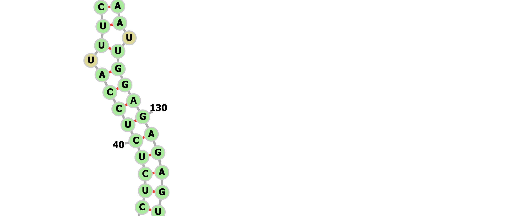
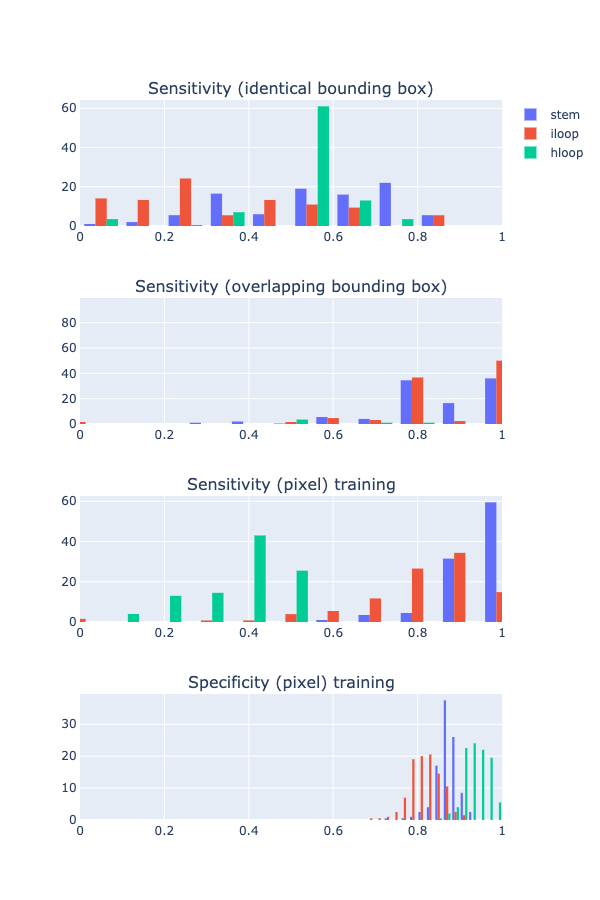
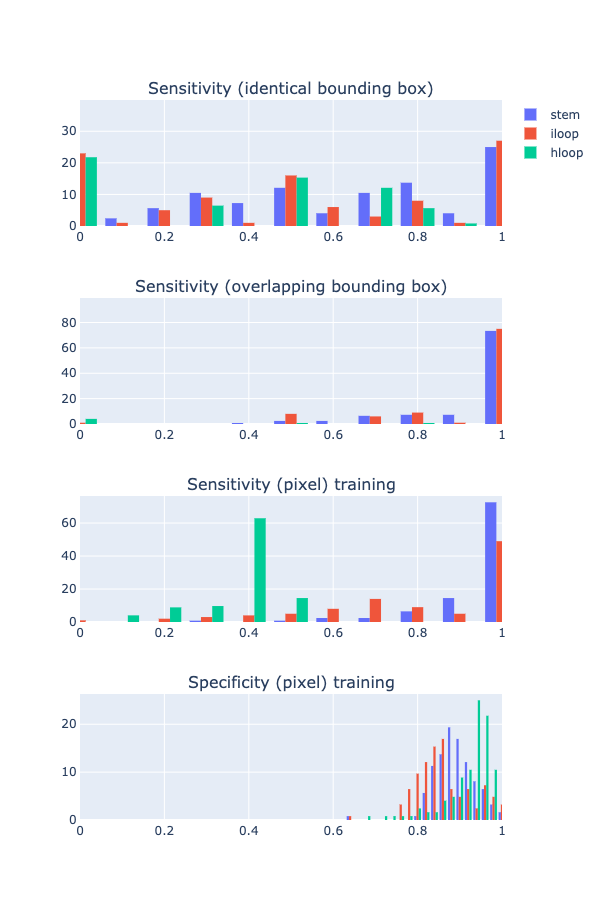
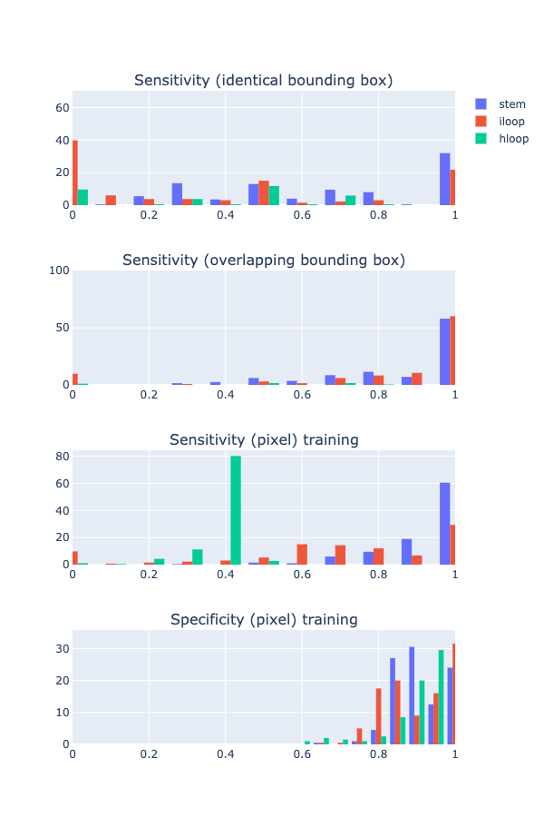
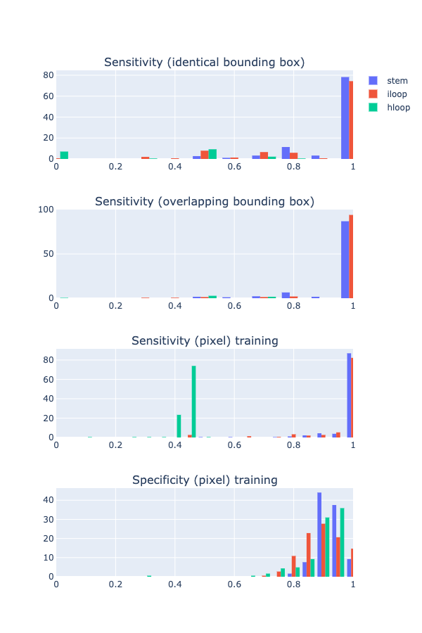
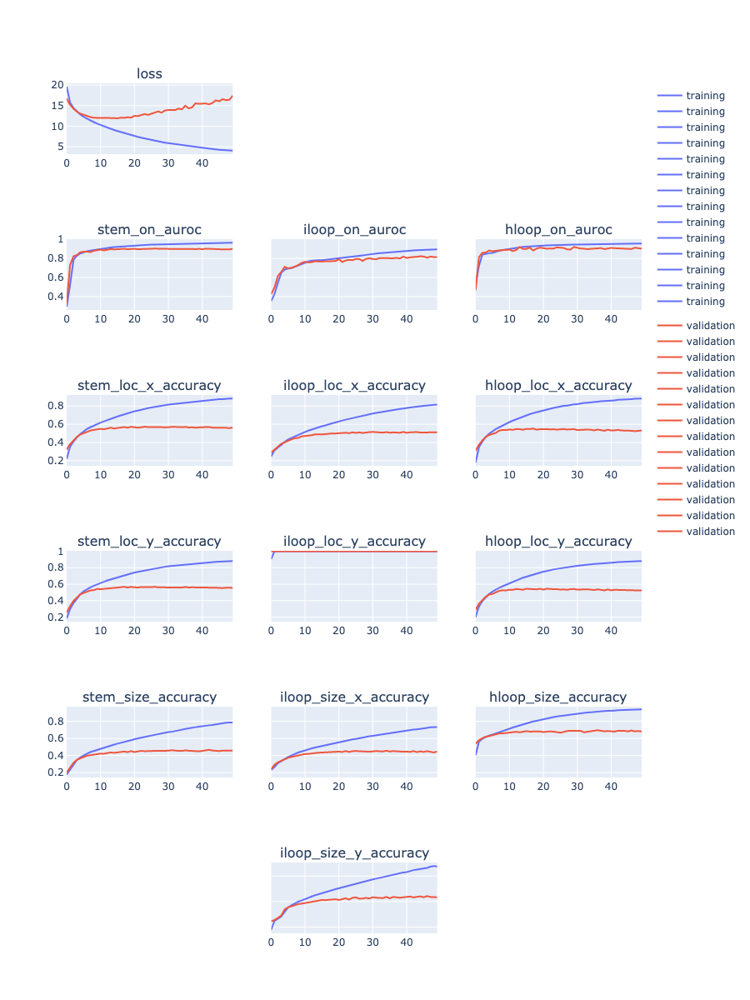
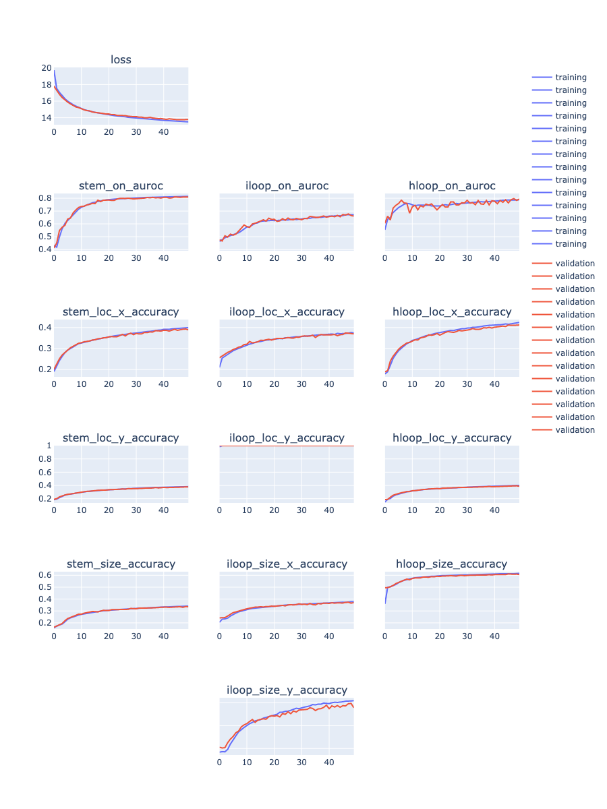
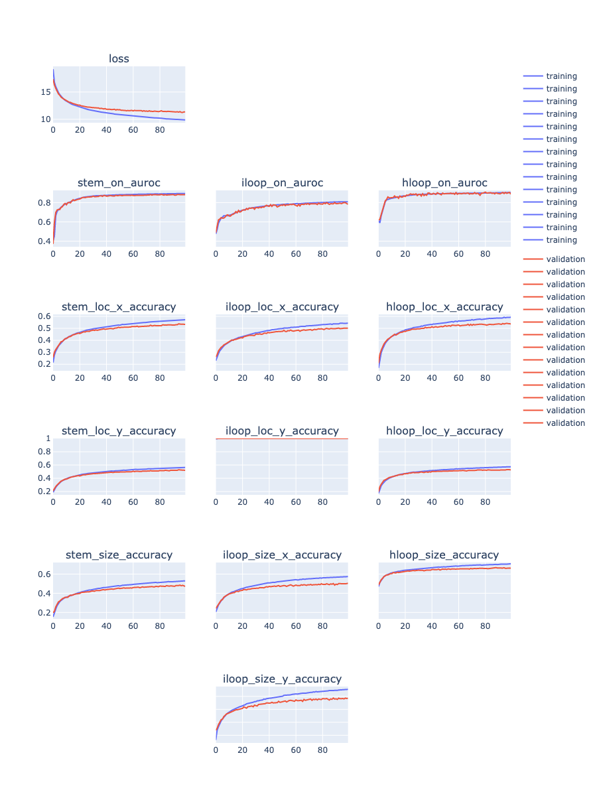

### debug bpRNA dataset

```
import datacorral as dc
import pandas as pd
import sys
sys.path.insert(0, '../../rna_ss/')
from utils import idx2arr, arr2db

dc_client = dc.Client()
df = pd.read_pickle(dc_client.get_path('DmNgdP'), compression='gzip')

row = df.iloc[0]
seq = row['seq']
one_idx = row['one_idx']
bb = row['bounding_boxes']

a = idx2arr(one_idx, len(seq))
db_str, is_pn = arr2db(a)
assert not is_pn

print(seq)
print(db_str)
```

Above prints:

```
GGAGCGAUUGGACCACCUUGCAGUUUCAUGGCACACUCUCUCCAUUUCUCUACCGUUCAUGCAGCGGUUGAUCGAUUGGGUUGCUGGUUGAUUGAUCGAUCGAUGGUCAGGAGUUGGAAGAGAAUUGGAGAGAGUGCAUUGUGAAUUGCGGGGUUGACGAGGCGGAGGG
...............(((((((((((.(((((.(((((((((((.(((((((.((...............((((((((..................))))))))...........))).))))).))))))))))).)))))))))))))))))...............
```

Using http://rna.tbi.univie.ac.at/forna/forna.html to visualize:



Base pairing doesn't look right! Maybe the dataset was not processed properly?

Validation:

data downloaded from SPOT-RNA: bpRNA_dataset/VL0/bpRNA_RFAM_22522.st

```
#Name: bpRNA_RFAM_22522
#Length: 169
#PageNumber: 1
GGAGCGAUUGGACCACCUUGCAGUUUCAUGGCACACUCUCUCCAUUUCUCUACCGUUCAUGCAGCGGUUGAUCGAUUGGGUUGCUGGUUGAUUGAUCGAUCGAUGGUCAGGAGUUGGAAGAGAAUUGGAGAGAGUGCAUUGUGAAUUGCGGGGUUGACGAGGCGGAGGG
...............(((((((((((.(((((.(((((((((((.(((((((.((...............((((((((..................))))))))...........))).))))).))))))))))).)))))))))))))))))...............
```

This is the same as what we recontructed above.

Found on bpRNA website:  http://bprna.cgrb.oregonstate.edu/search.php?query=bpRNA_RFAM_22522

'dot bracket file' has the same dot-bracket notation as the above ones.


bpRNA sub structures (1-based):

```
S1 16..26 "CCUUGCAGUUU" 144..154 "AAUUGCGGGGU"
S2 28..32 "AUGGC" 139..143 "UUGUG"
S3 34..34 "C" 138..138 "A"
S4 35..44 "ACUCUCUCCA" 127..136 "GGAGAGAGUG"
S5 46..46 "U" 126..126 "U"
S6 47..51 "UCUCU" 120..124 "GAGAA"
S7 52..52 "A" 118..118 "A"
S8 54..55 "CG" 116..117 "GG"
S9 71..78 "AUCGAUUG" 97..104 "CGAUCGAU"
H1 79..96 "GGUUGCUGGUUGAUUGAU" (78,97) G:C
B1 27..27 "C" (26,144) U:A (28,143) A:G
B2 33..33 "A" (32,139) C:U (34,138) C:A
B3 45..45 "U" (44,127) A:G (46,126) U:U
B4 53..53 "C" (52,118) A:A (54,117) C:G
B5 119..119 "A" (118,52) A:A (120,51) G:U
B6 125..125 "U" (124,47) A:U (126,46) U:U
B7 137..137 "C" (136,35) G:A (138,34) A:C
I1.1 56..70 "UUCAUGCAGCGGUUG" (55,116) G:G
I1.2 105..115 "GGUCAGGAGUU" (104,71) U:A
E1 1..15 "GGAGCGAUUGGACCA"
E2 155..169 "UGACGAGGCGGAGGG"
```

Compare to our implementation (0-based):

```
[((15, 143), (11, 11), 'stem'),
 ((27, 138), (5, 5), 'stem'),
 ((33, 137), (1, 1), 'stem'),
 ((34, 126), (10, 10), 'stem'),
 ((45, 125), (1, 1), 'stem'),
 ((46, 119), (5, 5), 'stem'),
 ((51, 117), (1, 1), 'stem'),
 ((53, 115), (2, 2), 'stem'),
 ((70, 96), (8, 8), 'stem'),
 ((25, 142), (3, 2), 'bulge'),
 ((31, 137), (3, 2), 'bulge'),
 ((43, 125), (3, 2), 'bulge'),
 ((51, 116), (3, 2), 'bulge'),
 ((33, 135), (2, 3), 'bulge'),
 ((45, 123), (2, 3), 'bulge'),
 ((50, 117), (2, 3), 'bulge'),
 ((54, 103), (17, 13), 'internal_loop'),
 ((77, 77), (20, 20), 'hairpin_loop')]
```

Identical (up to some notation difference). <= reassuring!

Conclusion:

- our processing code seems to be correct

- our local structure and bounding box code seems to be correct

- bpRNA dataset has quite a lot of non-canonical base pairs (not just GU!)
(as a result from comparative methods?)


### bpRNA non-canonical base pairing

todo


### Evaluate bounding box prediction on other dataset

Using model trained on random sequences.


#### rnastralign

(run on workstation)

```
python eval_model_dataset.py --data "`dcl path 6PvUty`" --num 200 --maxl 200 --model UGGg0e --out_csv result/rand_model/rnastralign.l200.s200.csv --out_plot result/rand_model/rnastralign.l200.s200.html
```




#### rfam151

make dataset with bounding boxes:

```
python make_dataset_pixel_bb.py --in_file ../../rna_ss/data_processing/rna_cg/data/rfam.pkl --out_file data/local_struct_pixel_bb.rfam.pkl
```


Upload to DC: `903rfx`

(run on workstation)

```
python eval_model_dataset.py --data "`dcl path 903rfx`" --num 200 --maxl 200 --model UGGg0e --out_csv result/rand_model/rfam151.l200.s200.csv --out_plot result/rand_model/rfam151.l200.s200.html
```




#### s_processed

make dataset with bounding boxes:

```
python make_dataset_pixel_bb.py --in_file ../../rna_ss/data_processing/rna_cg/data/s_processed.pkl --out_file data/local_struct_pixel_bb.s_processed.pkl
```

Upload to DC: `a16nRG`

(run on workstation)

```
python eval_model_dataset.py --data "`dcl path a16nRG`" --num 200 --maxl 200 --model UGGg0e --out_csv result/rand_model/s_processed.l200.s200.csv --out_plot result/rand_model/s_processed.l200.s200.html
```



#### rand (as sanity check)


(run on workstation)

```
python eval_model_dataset.py --data "`dcl path xs5Soq`" --num 200 --maxl 200 --model UGGg0e --out_csv result/rand_model/rand.l200.s200.csv --out_plot result/rand_model/rand.l200.s200.html
```




Sanity check: looking ok!

### less params (checking result from from 2020_09_08)


```
CUDA_VISIBLE_DEVICES=0 python train_simple_conv_net_pixel_bb_all_targets.py --data DmNgdP --result result/rf_data_all_targets_bprna_2 --num_filters 32 32 32 32 32 32 32 --filter_width 9 9 9 9 9 9 9 --epoch 50 --mask 0.1 --batch_size 20 --max_length 200 --cpu 12
```





add dropout:

```
CUDA_VISIBLE_DEVICES=0 python train_simple_conv_net_pixel_bb_all_targets.py --data DmNgdP --result result/rf_data_all_targets_bprna_3 --dropout 0.5 --num_filters 32 32 32 32 32 32 32 --filter_width 9 9 9 9 9 9 9 --epoch 50 --mask 0.1 --batch_size 20 --max_length 200 --cpu 12
```




with dropout, but more params, more epochs:

```
CUDA_VISIBLE_DEVICES=0 python train_simple_conv_net_pixel_bb_all_targets.py --data DmNgdP --result result/rf_data_all_targets_bprna_4 --dropout 0.5 --num_filters 32 32 64 64 64 128 128 --filter_width 9 9 9 9 9 9 9 --epoch 100 --mask 0.1 --batch_size 20 --max_length 200 --cpu 12
```



With dropout, looks like we need even more parameters and epochs?

### With dropout, more params, more epochs


```
CUDA_VISIBLE_DEVICES=0 python train_simple_conv_net_pixel_bb_all_targets.py --data DmNgdP --result result/rf_data_all_targets_bprna_4 --dropout 0.5 --num_filters 128 128 128 128 128 128 128 --filter_width 9 9 9 9 9 9 9 --epoch 200 --mask 0.1 --batch_size 10 --max_length 200 --cpu 12
```


### Train on other dataset?


### Vectorize bounding box proposal code


## New todos

- process all datasets

- bpRNA dataset might be weird, evaluate random-seq-trained model on other datasets,
rnastralign? rfam151?

- upload a few existing models to DC

- bpRNA local structure size histogram

- process bpRNA 1M(90) dataset, also compare my code with their local structures, any mistakes in my code? (why is iloop_loc_y performance always 100%?)

- try to control overfit on bpRNA, regularization?

- bounding box assembly <-> shotgun sequencing? (although we know the location)

- add real value output for loc & size, so we can predict on those with size > 10

- process bpRNA original dataset, use 1M(90)? (with 90% similarity threshold) (be careful to not overfit!)

- try stage 2 ideas in parallel, we can use model trained on synthetic dataset since its bb performance is best

- dynamic batch size depend on max length?

- training script: instead of saving all predictions,
save the predicted boudning boxes at threshold 0.1 (move inference code to top level?)

- debug inference & eval code

- plot: rand model performance on rand dataset

- plot: number of local structures per sequence length, rand v.s. bpRNA

- try training on other dataset: RNAstralign?

- experiment: use bpRNA seq, use RNAfold to predict structure, then train & test on this dataset,
is the performance better now?

- dropout at inference time

- predict on bpENA dataset (test set, never seen before), eval bb performance

- NN combinatorics

- RL combinatorics

- bounding box indices: memory address, nucleotide: memory content?  RNN?

- ensemble? bb union of v0.1 and v0.2 model

- stage 2: hloop, given top right corner, the size is deterministic, we can discard those whose predicted size does not match

## Ideas & TODOs

Make sure to log the conclusion for each idea, for future reference.
(make one section for each idea, move above)
(also for each idea include git hash so we can check the associated training code)

- update pandas on workstation - done

- save model, implement script to predict on new dataset - done

- now we're saving metadata, update plot code cropping since we no longer need to infer length,
also add evaluation to check identical/overlapping box

- enumerate all valid configurations of bounding boxes, how to do it efficiently?

- train on bigger dataset, with more complicated model, see if we can improve sensitivity

- data generator: return extra info, so that we can store at training/validation minibatch.
e.g. sequence, sequence length, original bounding box list

- vectorize bounding box proposal code

- right now we make separate plot for different box types,
 if we plot all on the same, need to use different color for different box type

- the confidence of a bounding box is reflected by:
(1) the joint probability of sigmoid/softmax output,
(2) how many other bounding box overlap

- ideas for assembly:
start with most confidence box,
for each iloop find the compatible stems on each side,
for each hloop find the compatible stem.
formulate as another prediction problem?
given the sequence and all bounding boxes, predict the 'groud truth' combination of bounding box?
equivalent to predict (globally) on/off of each bounding box? how to represent bounding box, another feature map?

- assembly: how to train the 2nd stage algorithm if he first stage sensitivity is not 100%?
i.e. given that we know what is valid path and we have a way to enumerate all valid paths,
how to define closeness of each path to the ground truth? convert it back to binary matrix and calculate the old metrics?

- validity:
stem is not valid if not joined by loop (e.g. hloop between diagonal),
hloop is not valid if it's not across diagonal,
etc.

- bounding box loss (not differentiable?)
TP & FP at threshold, TP: proposed bb overlapping ground truth,
FP: proposed bb not overlapping ground truth.
For the bb module, we want high TP, even at a cost of high FN.

- bounding box size > 10? how?  re-process dataset to partition into smaller (overlapping) boxes?
how to determine which one to assign for each pixel, the closer one?

- if we have the original target bounding box locations, we can compute the following metrics:
(similar to sensitivity):
% of true bounding box that has: identical proposed box, overlapping proposed box, no proposed box.
(similar to specificity):
% of predicted bounding box that has: identical true box, overlapping true box, no overlapping true box

- fix divide warning:

```
  return np.sum(_x2 == _y2)/float(len(_x2))
train_simple_conv_net_pixel_bb.py:579: RuntimeWarning: invalid value encountered in true_divide
  return np.sum(_x2 == _y2)/float(len(_x2))

```

- rnafold generated dataset to pre-train bounding box module (pick example with less ensemble diversity?)

- training (all targets, not just stem)

- incompatibility: stem_on, location shift > 1, but stem size=1

- not able to predict len=1 stem?


- memory efficiency, especially cpu mem (for Linux machine),
sparse array or just save index myself, expand when making minibatch,
use int instead of float

- make minibatch workflow, pass in training=T/F flag to streamline code

- add structured metric logging (for training curve plot)

- improve plot script to compute bb in vectorized format

- add output specific hidden layer

- rectangle -> sequence A & B 'compatibility'?

- long stem -> break into parts (overlapping?), max len 10

- in theory, stem should be really easy to pick up,
investigate alternative architecture? training on patches?

- use sparse array (numpy? scipy?) to improve data loader (taking too much memory)

- read capsule network paper

- train on smaller patches. in theory this should be roughly equivalent to
applying local un-masking, but it's a good baseline to establish anyways.
We can generate patches that center at different types of structures.

- pre-train stage 1 on very short seq, e.g, miRNA or RNAfold generated dataset


- smaller input region? localize to the structure? (same as masking most of the background)
local un-mask

- toy example?

- per-channel naive guess & performance

- if we come up with a scheme to assign probability/class to every pixel,
then we can compute the joint probability.
to avoid exponentially many assembly possibilities,
we can apply cut off to construct an initial set of proposals
before running the discrete step.

- debug: terminal internal loop? (does not make sense)

- discover intrinsic structure within dataset (e.g. families?) unsupervised?

- deep learning assemble proposal?

- formulate as RL?

