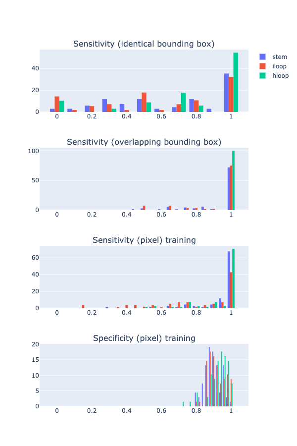

## Compare FE

For predicted best global structure not equal to ground truth,
calculate FE and compare with ground truth.


```
python compare_fe.py ../2020_10_13/data/rand_s1_bb_0p1_global_structs_60.pkl.gz data/rand_s1_bb_0p1_global_structs_60_fe.pkl.gz
```


Result:

- Total: 45885

- With negative free energy (as defined by RNAfold): 32008


- Above plot: comparing FE for all sequences where pred_fe < 0 (as defined by RNAfold)


- Above plot: after removing perfect hits (pred struct == RNAfold MFE struct).

- Interestingly, there are also cases where pred_fe < rnafold_fe.
Note that this means the RNAfold struct is not MFE. Not sure why this can happen.

```
FE: rnafold -1.8, pred -4.2
GUCUCUUCAUGGAAGGUCACGU length 22
...(((((...)))))...... [RNAfold]
(((.((((...))))))).... [pred]

FE: rnafold -9.8, pred -10.5
AUCUAAAAGGAGAACGCAUCCAACAAGUCGGAGGGGCAUCCUAC length 44
.......((((...(.(.(((........)))).)...)))).. [RNAfold]
.......((((...(((.(((........))))))...)))).. [pred]

FE: rnafold -3.7, pred -7.2
AUAAACGGCGAAGGUUAGGCAAUGAUCUAGGGGGU length 35
........(..((((((.....))))))..).... [RNAfold]
....((.((..((((((.....))))))..)).)) [pred]

FE: rnafold -1.3, pred -1.4
GGUCACACAGCACGGUAGCGAUAAGGUU length 28
.(((.(((......)).).)))...... [RNAfold]
.(((((...((...)).)))))...... [pred]

FE: rnafold -6.9, pred -8.8
AUCCAUCCCUGCGUAGAUCUUAUUCCAGGGCUC length 33
......(((((.(((.....)))..)))))... [RNAfold]
......(((((.(((((...))))))))))... [pred]

FE: rnafold -16.6, pred -17.1
CCAUUUUCGCCACGGCACAUCCUGGGCGGUGGCGAUCGACGCAGCCCUACACAACG length 56
......(((((((.((.((...)).)).)))))))..................... [RNAfold]
......(((((((.((.((....)))).)))))))..................... [pred]

FE: rnafold -10.4, pred -11.1
GCACAAUUAUUAGGGGGGGGAGCGAUAGAUACGGAGUCGCACGCAUUCUCAA length 52
............((((((.(.(((((.........))))).).).))))).. [RNAfold]
............((((((((.(((((.........))))).))).))))).. [pred]

FE: rnafold -1.5, pred -2.9
GUUCUGGUGCUAAGGCUGCGUA length 22
......((((....)).))... [RNAfold]
.....(((((....)))))... [pred]

FE: rnafold -2.9, pred -5.7
GGUCGAUACGCAGCAUCAAGUUUGGUUUCU length 30
....((.((..(((.....)))..)).)). [RNAfold]
....((.((.((((.....)))).)).)). [pred]
```

As an example, the first sequence:


Note that both standard and non-standard base pairs exist in the prediction.
(But RNAfold FE computation seems to be OK with it. I think it's using the
full 4x4 stack base pair FE table)

Generated by [plot_fe.ipynb](plot_fe.ipynb)


## Debug stage 1 training

Typo:

https://github.com/PSI-Lab/alice-sandbox/blob/ea338fddfd63358e2b160910773e65a758e4042c/meetings/2020_08_25/train_simple_conv_net_pixel_bb_all_targets.py#L191

Fix:

```
# old
'iloop_location_y': torch.from_numpy(target_hloop_location_y[:, :, np.newaxis]).float(),

# fixed
'iloop_location_y': torch.from_numpy(target_iloop_location_y[:, :, np.newaxis]).float(),
```

Updated script: [train_simple_conv_net_pixel_bb_all_targets.py](train_simple_conv_net_pixel_bb_all_targets.py)


Training:

```
CUDA_VISIBLE_DEVICES=0 python train_simple_conv_net_pixel_bb_all_targets.py --data ZQi8RT --result result/rf_data_all_targets_3 --num_filters 32 32 64 64 64 128 128 --filter_width 9 9 9 9 9 9 9 --epoch 50 --mask 0.1 --batch_size 40 --max_length 200 --cpu 12
```


plot training progress: (first 10 epoch, since it's still running)

```
python model_utils/plot_training.py --in_log result/rf_data_all_targets_3/run.log  --out_plot result/rf_data_all_targets_3/training_progress.html
```


pick best model upload & add to known versions: TODO


## End-to-end predictive workflow

Stage 1 - predict bounding boxes:

```
from model_utils.utils_model import Predictor
model = Predictor('v0.1')
stems, iloops, hloops = model.predict_bb('GUUCUGGUGCUAAGGCUGCGUA', threshold=0.1)
```

Alternatively, stage 1 for RNA-RNA interaction:

```
from model_utils.utils_model import Predictor
model = Predictor('v0.1')
stems, iloops, hloops = model.predict_bb('UUGGGCC', threshold=0.1, seq2='GGCCCAA')
```

(WIP, do we need to flip the second sequence? above example is fully complementary (5->3 to 3->5) direction?)

Stage 2 - global structure assembly (following above step):


```
from model_utils.util_global_struct import make_bb_df, generate_structs
df_stem, df_iloop, df_hloop = make_bb_df(stems, iloops, hloops, min_pixel_pred=3, min_prob=0.5)
df_global_structs = generate_structs(df_stem, df_iloop, df_hloop)
```

Scoring (following above step):

```
from model_utils.util_global_struct import ad_hoc_score
scores = [ad_hoc_score(x) for x in df_global_structs]
```

Result (print df_global_structs and scores):

```
   bb_x  bb_y  siz_x  siz_y bb_type  n_proposal  prob_median  n_proposal_norm
0     5    16      3      3    stem           8     0.085167         0.888889
1     8    18      2      2    stem           4     0.430557         1.000000
1.0882265336904855

   bb_x  bb_y  siz_x  siz_y bb_type  n_proposal  prob_median  n_proposal_norm
0     7    14      8      8   hloop          12     0.231506         0.187500
1     5    16      3      3    stem           8     0.085167         0.888889
0.22711209328493728

   bb_x  bb_y  siz_x  siz_y bb_type  n_proposal  prob_median  n_proposal_norm
0     9    14      6      6   hloop          12     0.213121         0.333333
1     8    15      2      2    stem           3     0.269645         0.750000
0.40446775327008394

   bb_x  bb_y  siz_x  siz_y bb_type  n_proposal  prob_median  n_proposal_norm
0     9    17      9      9   hloop          18     0.274618         0.222222
1     8    18      2      2    stem           4     0.430557         1.000000
0.8611144404055483
```


## Evaluate stage 1 model on dataset

Eval script fix:

    - extend x axis range slightly (otherwise multiple bars will be cut off)

    - apply hard mask when computing pixel

Using model trained on synthetic data, no CV (only affect synthetic dataset)

Using model after ep9 for now (still training).

### On synthetic dataset

```
python model_utils/eval_model_dataset.py --data "`dcl path xs5Soq`" --num 200 --maxl 200 --model result/rf_data_all_targets_3/model_ckpt_ep_9.pth --out_csv result/rand_model/rand.l200.s200.csv --out_plot result/rand_model/rand.l200.s200.html
```


compare with old result (before iloop target bug fix): https://github.com/PSI-Lab/alice-sandbox/tree/f306be2b7412c033c8a810949ef64a50502a29bc/meetings/2020_09_22#rand-as-sanity-check
It might be subtle to see, but the red bars (for iloop) have shifted towards the right hand side.
Although this is a small improvement on bounding box prediction,
this could potentially contribute significantly to stage 2 assembly,
by providing more accurate "starting point" of compatible bounding boxes.

Limit to examples where max bb size <= 11:

```
python model_utils/eval_model_dataset.py --data "`dcl path xs5Soq`" --num 200 --maxl 200 --max_bb_size 11 --model result/rf_data_all_targets_3/model_ckpt_ep_9.pth --out_csv result/rand_model/rand.l200.s200.b10.csv --out_plot result/rand_model/rand.l200.s200.b11.html
```


There is a increase in performance, especially for hloop (which is known to have big loops sometimes)

### On rfam151

```
python model_utils/eval_model_dataset.py --data "`dcl path 903rfx`" --num 200 --maxl 200 --model result/rf_data_all_targets_3/model_ckpt_ep_9.pth --out_csv result/rand_model/rfam151.l200.s200.csv --out_plot result/rand_model/rfam151.l200.s200.html
```


Limit to examples where max bb size <= 11:

```
python model_utils/eval_model_dataset.py --data "`dcl path 903rfx`" --num 200 --maxl 200  --max_bb_size 11 --model result/rf_data_all_targets_3/model_ckpt_ep_9.pth --out_csv result/rand_model/rfam151.l200.s200.b10.csv --out_plot result/rand_model/rfam151.l200.s200.b11.html
```



It's interesting that pixel sensitivity is high but identical bounding box sensitivity is not quite satisfying.
This is not caused by bounding box that's larger than 11, since distribution looks similar after removing those examples.
Taking one example from the dataset (index 51) and investigate predicted bounding box that overlaps (but not identical to)
the target:

```
target bb: (12, 27, 2, 2)
best overlapping bb: (12, 27, 6, 6)
best overlapping area: 4

target bb: (15, 24, 3, 3)
best overlapping bb: (12, 27, 6, 6)
best overlapping area: 9

target bb: (85, 105, 6, 6)
best overlapping bb: (81, 106, 5, 5)
best overlapping area: 4

target bb: (91, 98, 2, 2)
best overlapping bb: (88, 99, 4, 4)
best overlapping area: 2

target bb: (7, 33, 2, 4)
best overlapping bb: (3, 37, 8, 8)
best overlapping area: 8

target bb: (8, 30, 5, 4)
best overlapping bb: (11, 29, 2, 3)
best overlapping area: 6

target bb: (92, 97, 6, 6)
best overlapping bb: (91, 96, 6, 6)
best overlapping area: 25
```

## Run stage 1 model on dataset

### synthetic:

(debug)

```
python model_utils/run_stage_1.py --data "`dcl path xs5Soq`" --num 10 --threshold 0.1 --model result/rf_data_all_targets_3/model_ckpt_ep_5.pth --out_file data/debug.pkl.gz
```


(set num=-1 to run all)

```
python model_utils/run_stage_1.py --data "`dcl path xs5Soq`" --num -1 --threshold 0.1 --model result/rf_data_all_targets_3/model_ckpt_ep_9.pth --out_file data/rand_s1_bb_0p1.pkl.gz
```

### rfam151

```
python model_utils/run_stage_1.py --data "`dcl path 903rfx`" --num -1 --threshold 0.1 --model result/rf_data_all_targets_3/model_ckpt_ep_9.pth --out_file data/rfam151_s1_bb_0p1.pkl.gz
```

## Evaluate stage 2 model on dataset


### synthetic:

(debug)

```
python model_utils/run_stage_2.py
```


### rfam151

```
python model_utils/run_stage_2.py --in_file data/rfam151_s1_bb_0p1.pkl.gz --out_file data/rfam151_s2_3_0p5.pkl.gz --max_len 100 --min_pixel_pred 3 --min_prob 0.5
```


## Dataset cleanup

`6PvUty`: rnastralign?

`903rfx`: rfam151?

`a16nRG`: s_processed?

`xs5Soq`: synthetic?

`ZQi8RT`: synthetic? with prediction?

## TODOs

move to top level util

end to end pipeline

evaluate on examples w/ <= 10 sized bbs

table documenting all DC IDs (datasets, models, etc.)


Heuristics: More structure is better -> if global struct A is subset of B, discard A

For predicted best global structure not equal to ground truth, calculate FE and compare with ground truth

Debug stage 1 iloop data

Pseudo knot?

RNA-RNA interaction? Run stage 1 model three times, A-A, B-B & A-B, 2nd stage will have different constraints

Evaluate on another dataset? rfam151?

Long sequence?

Greedy approach of assembly? Start with high prob bounding boxes, terminate after explored say 100 global structures?

size > 10

RNA-RNA


