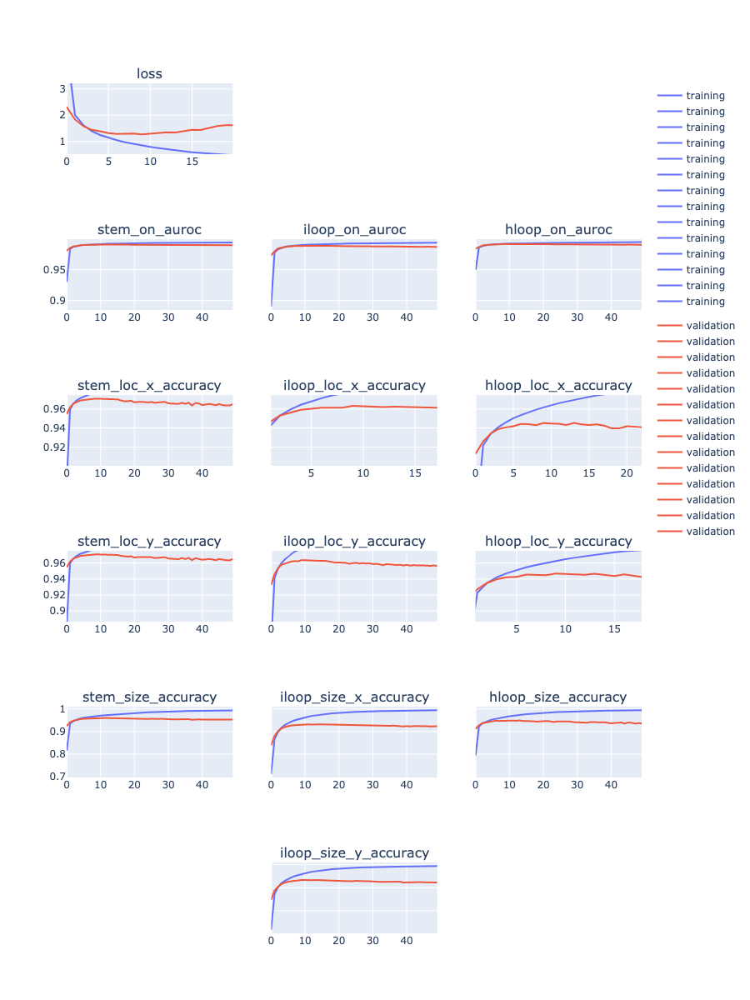
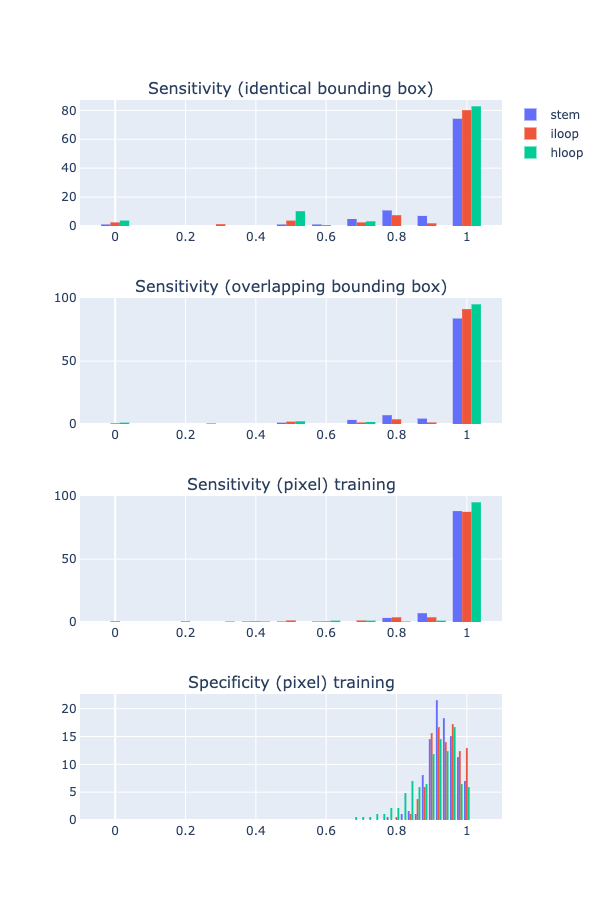
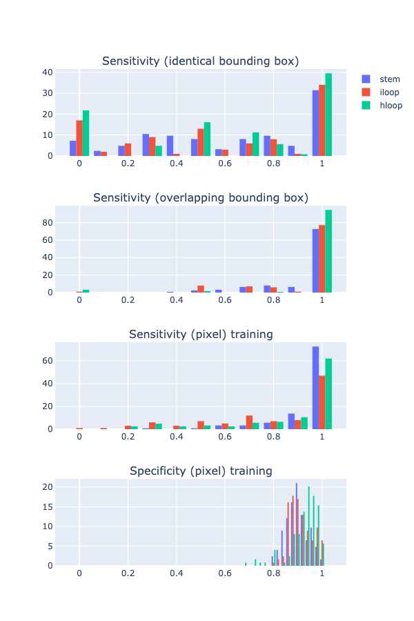

[model_utils/](/model_utils) are copied from last week's work.
Refer to last week's notes on how to use it as a package.

## Stage 1 model training progress

Stage 1 model finished training. Full training progress plot:



From the overall loss, we can see that ep9 has the lowest validation loss.
Uploaded model and updated `utils_model.py` (added this model as version `v0.2`):


    # trained on random sequence, after fixing y_loop target value bug, ep10,
    # produced by: https://github.com/PSI-Lab/alice-sandbox/tree/35b592ffe99d31325ff23a14269cd59fec9d4b53/meetings/2020_11_10#debug-stage-1-training
    'v0.2': 'ZnUH0A',


Produced by running:

```
python model_utils/plot_training.py --in_log result/rf_data_all_targets_3/run.log  --out_plot result/rf_data_all_targets_3/training_progress.html
```


## Stage 1 model performance


### On synthetic dataset

```
python model_utils/eval_model_dataset.py --data "`dcl path xs5Soq`" --num 200 --maxl 200 --model v0.2 --out_csv result/rand_model/rand.l200.s200.csv --out_plot result/rand_model/rand.l200.s200.html
```




### On rfam151

```
python model_utils/eval_model_dataset.py --data "`dcl path 903rfx`" --num 200 --maxl 200 --model v0.2 --out_csv result/rand_model/rfam151.l200.s200.csv --out_plot result/rand_model/rfam151.l200.s200.html
```




## Run stage 1 model on dataset

### rfam151

```
python model_utils/run_stage_1.py --data "`dcl path 903rfx`" --num -1 --threshold 0.1 --model v0.2 --out_file data/rfam151_s1_bb_0p1.pkl.gz
```


## Run stage 2 model on dataset


### rfam151

```
python model_utils/run_stage_2.py --in_file data/rfam151_s1_bb_0p1.pkl.gz --out_file data/rfam151_s2_3_0p5.pkl.gz --max_len 100 --min_pixel_pred 3 --min_prob 0.5
```


## TODOs

- waiting for stage 1 model to finish training

- stage 1 prevent overfitting (note that theoretical upper bound is not 100% due to the way we constructed the predictive problem)

- upload best model to DC?

- evaluate rfam stage 2 predictions, majority are not identical, but are they close enough?

- investigate pseudoknot predictions, synthetic dataset (45886-32008)

- try running RNAfold and allow C-U and U-U (and other) base pairs, can we recover the lower FE structure that our model predicts?

- rfam151 dataset debug, is the ground truth bounding box correct? (make sure there’s no off-by-1 error)

- stage 1 model: iloop size = 0 on my side is bulge, make sure we have those cases!

- RNAfold performance on rfam151


table documenting all DC IDs (datasets, models, etc.)


Heuristics: More structure is better -> if global struct A is subset of B, discard A

Pseudo knot?

RNA-RNA interaction? Run stage 1 model three times, A-A, B-B & A-B, 2nd stage will have different constraints

Long sequence?

Greedy approach of assembly? Start with high prob bounding boxes, terminate after explored say 100 global structures?

size > 10

RNA-RNA


