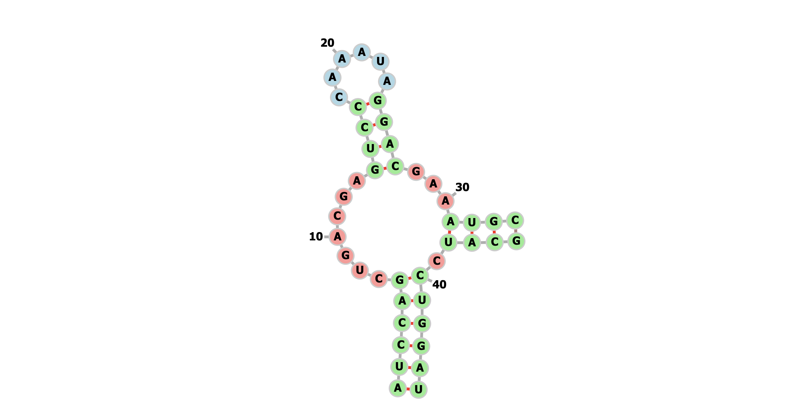
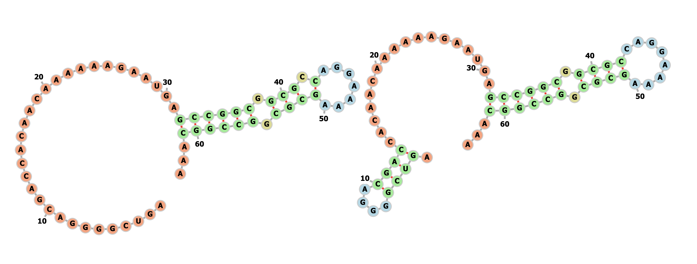
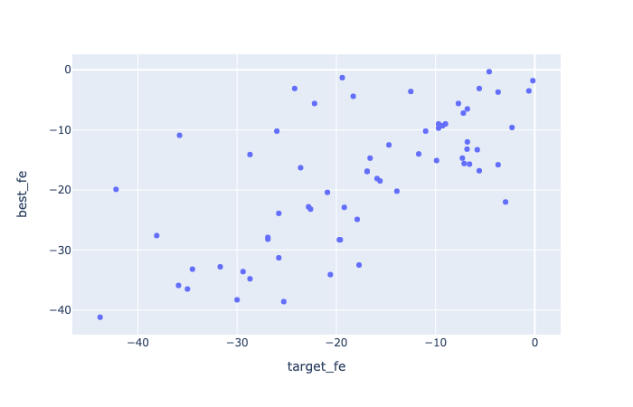

[model_utils/](/model_utils) are copied from last week's work.
Refer to last week's notes on how to use it as a package.

## Stage 1 model training progress

Stage 1 model finished training. Full training progress plot:


From the overall loss, we can see that ep9 has the lowest validation loss.
Uploaded model and updated `utils_model.py` (added this model as version `v0.2`):


    # trained on random sequence, after fixing y_loop target value bug, ep10,
    # produced by: https://github.com/PSI-Lab/alice-sandbox/tree/35b592ffe99d31325ff23a14269cd59fec9d4b53/meetings/2020_11_10#debug-stage-1-training
    'v0.2': 'ZnUH0A',


Produced by running:

```
python model_utils/plot_training.py --in_log result/rf_data_all_targets_3/run.log  --out_plot result/rf_data_all_targets_3/training_progress.html
```


## Stage 1 model performance


### On synthetic dataset

```
python model_utils/eval_model_dataset.py --data "`dcl path xs5Soq`" --num 200 --maxl 200 --model v0.2 --out_csv result/rand_model/rand.l200.s200.csv --out_plot result/rand_model/rand.l200.s200.html
```


### On rfam151

```
python model_utils/eval_model_dataset.py --data "`dcl path 903rfx`" --num 200 --maxl 200 --model v0.2 --out_csv result/rand_model/rfam151.l200.s200.csv --out_plot result/rand_model/rfam151.l200.s200.html
```


## Run stage 1 model on dataset

### rfam151

```
python model_utils/run_stage_1.py --data "`dcl path 903rfx`" --num -1 --threshold 0.1 --model v0.2 --out_file data/rfam151_s1_bb_0p1.pkl.gz
```


## Run stage 2 model on dataset


### rfam151

```
python model_utils/run_stage_2.py --in_file data/rfam151_s1_bb_0p1.pkl.gz --out_file data/rfam151_s2_3_0p5.pkl.gz --max_len 100 --min_pixel_pred 3 --min_prob 0.5
```

## rfam151 structure not compatible with RNAfold energy formulation

rfam ID `RF00163_B`, sequence `AUCCAGCUGACGAGUCCCAAAUAGGACGAAAUGCGCAUCCUGGAU`,
ground truth structure `((((((.......((((......))))...(((()))).))))))`,
RNAfold cannot compute free energy (returns `99983.7`).
Potentially due to 'empty' hairpin loop?




## Evaluate stage 2 prediction

### rfam151

We want to check how much the best predicted structure deviates from the ground truth.
We also keep in mind that model was trained on RNAfold-generated synthetic dataset.
We use RNAfold free energy formulation to compute energy of the
ground truth, as well as all predicted global structures.

As an example, rfam ID `RF00382_A`, sequence:

```
AGUCGGGGACGACCACAACAAAAAAGAAUGAGCCGGCGGCGCCAGGAAAAGCGCGGCCGGCAAA
```

ground truth and free energy (computed by RNAfold):

```
...............................((((((.(((.(.......)))).))))))... -19.6
```

best predicted, ad-hoc score, and free energy (computed by RNAfold):

```
   bb_x  bb_y  siz_x  siz_y bb_type  n_proposal  prob_median  n_proposal_norm
0     4     9      6      6   hloop          15     0.930053         0.416667
1     1    12      4      4    stem          16     0.925148         1.000000
2    41    50     10     10   hloop          45     0.992122         0.450000
3    38    53      4      4    stem          16     0.994010         1.000000
4    36    55      3      3   iloop           9     0.995822         1.000000
5    31    60      6      6    stem          36     0.978096         1.000000
.((((....))))..................((((((.((((........)))).))))))... 13.545206773839391 -28.3
```




correlation between fe, ground truth v.s. best predicted (by fe) (for those examples < 0), each data point is one sequence:



correlation between adhoc score and fe (for those examples < 0), each data point is one global structure for a sequence (thus many more data points):


To reproduce, see [plot_s2.ipynb](plot_s2.ipynb)


## Pseudo knot prediction


## Stage 1 model performance - allowing bounding box offset


## Reading papers

### ORDER MATTERS: SEQUENCE TO SEQUENCE FOR SETS

- input set can be handled with attention in the encoder

- output order matters in practise if we decompose using chain rule (does not matter in theory)

- equivariance permutation of output hurt training

- find optimal ordering for applying chain rule while training


### Image Captioning: Transforming Objects into Words

- generate image caption from object bounding boxes

- transformer with variable number of bounding boxes as input,
encoder with modified attention matrix, where content-based hashing
is combined with spatial-based features.

## Dataset cleanup

`6PvUty`: rnastralign?

`903rfx`: rfam151?

`a16nRG`: s_processed?

`xs5Soq`: synthetic?

`ZQi8RT`: synthetic? with prediction?


## TODOs

- evaluate sensitivity if we allow +/-1 shift/expand of each bb

- if above works and we have a NN for stage 2, we can feed in this extended set of bb proposals!

- waiting for stage 1 model to finish training

- stage 1 prevent overfitting (note that theoretical upper bound is not 100% due to the way we constructed the predictive problem)

- upload best model to DC?

- evaluate rfam stage 2 predictions, majority are not identical, but are they close enough?

- investigate pseudoknot predictions, synthetic dataset (45886-32008)

- try running RNAfold and allow C-U and U-U (and other) base pairs, can we recover the lower FE structure that our model predicts?

- rfam151 dataset debug, is the ground truth bounding box correct? (make sure there’s no off-by-1 error)

- stage 1 model: iloop size = 0 on my side is bulge, make sure we have those cases!

- RNAfold performance on rfam151

- to debug: index 0 with length 117 and n_bbs 21 seems to be stuck during parsing.: python model_utils/run_stage_2.py --in_file data/rfam151_s1_bb_0p1.pkl.gz --out_file data/debug.pkl.gz --min_pixel_pred 3 --min_prob 0.5

- to debug: rfam151, RF00165_A, global structure contain invalid ones (implied iloop and hloop not included):
```
   bb_x  bb_y  siz_x  siz_y bb_type  n_proposal  prob_median  n_proposal_norm
0     1    17      2      2    stem           4     0.137343              1.0
1     4    45      8      8    stem          64     0.859667              1.0
2    27    57     10     10    stem         100     0.721043              1.0
.((.((((((((....)).........((((((((((.))))))))..)))))))))).... 14.362449399658637 100007.1
```

- stage 2, pick the first bb by sampling from all bb's (proportional to the 'likelihood' of the bb?),
then the next ones are picked by some attention based NN? black list & white list?

- extra constraints in stages 2? stem box needs to satisfy G-C, A-U, G-U base pairing (discard those that are not),
min hloop size?

table documenting all DC IDs (datasets, models, etc.)


Heuristics: More structure is better -> if global struct A is subset of B, discard A

Pseudo knot?

RNA-RNA interaction? Run stage 1 model three times, A-A, B-B & A-B, 2nd stage will have different constraints

Long sequence?

Greedy approach of assembly? Start with high prob bounding boxes, terminate after explored say 100 global structures?

size > 10

RNA-RNA


