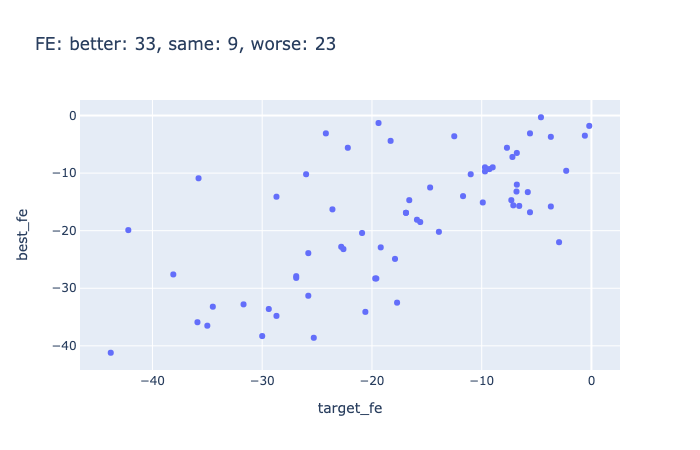
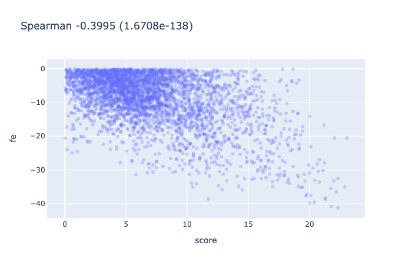

[model_utils/](/model_utils) are copied from last week's work.
Refer to notes from `2020_11_10` on how to use it as a package.

## Stage 2 update

Incorporate in hard constraints for pruning bounding box proposal.
Add as optional parameters.

- discard stems that contain non standard base pairs (standard: A-U, G-C, G-U)

- discard hairpin loops that have size <= 2

For example, this is valid:

```
GUCCCCC
UAGGGGG
```

while this is invalid:

```
GUCCAGUC
GUAGGUCG
```


re-run stage 2 on rfam:

```
python model_utils/run_stage_2.py --in_file data/rfam151_s1_bb_0p1.pkl.gz --out_file data/rfam151_s2_3_0p5.pkl.gz --max_len 100 --min_pixel_pred 3 --min_prob 0.5 --min_hloop_size 2 --discard_ns_stem 2>&1 | tee data/log_rfam151_s2_3_0p5.txt
```


Use RNAfold to compute FE for all predicted structures:

```
python compute_s2_fe.py --in_file data/rfam151_s2_3_0p5.pkl.gz --out_file_fe data/rfam151_s2_3_0p5_fe.pkl.gz --out_file_score data/rfam151_s2_3_0p5_all_scores.pkl.gz
```

Using RNAfold to compute FE for predicted structure and rfam151 ground truth structure:




Compare ad-hoc score with RNAfold FE:




Eval base pair sensitivity & specificity:

TODO

## Generate dataset for S2 training

Synthetic dataset.
separate code (from run_stage_2.py) that prune bounding boxes, save the number of identified boxes and reformatting for self attn NN training: `model_utils/prune_stage_1.py`

```
python model_utils/run_stage_1.py --data "`dcl path xs5Soq`" --num -1 --threshold 0.1 --model v0.2 --out_file data/synthetic_s1_bb_0p1.pkl.gz
python model_utils/prune_stage_1.py --in_file data/synthetic_s1_bb_0p1.pkl.gz --out_file data/synthetic_s1_pruned.pkl.gz --min_pixel_pred 3 --min_prob 0.5 --min_hloop_size 2 --discard_ns_stem 2>&1 | tee data/log_synthetic_s1_pruned.txt
```

## S2 model

Use self attention to address interaction between all bounding boxes.
As an initial attempt, we formulate s2 as predicting the 1/0 label of each bounding box (proposed by s1)
independently. 

For each example, input is a L x 9 matrix, where L is the number of bounding boxes (from s1, variable length),
and 9 is the number of features for each bounding box.
Features include: 1-hot encoding of bb type (stem , iloop, hloop), x/y location of top right corner,
x/y size, median probability (predicted by s1 model), number of pixels proposing the box (normalized by max pixels in the bb).
Output is L x 1 binary matrix indicating whether the bounding box should be included in the final assembly.

To prepare training data for s2, we only use those examples where we can uniquely compute the output label,
i.e. those where s1 bounding box sensitivity is 100%. Note that this can be changed as long as we can come up with 
a good assignment for those non-100% cases. For now we focus on easy cases as a proof of concept.


Architecture: we use multiple layers of self attention,
followed by a per-bounding-box fully connected layer and sigmoid output.

Trainging:

local debug:

```
python train_s2.py --in_file data/rfam151_s2_3_0p5.pkl.gz --config config.yml 
```


GPU using synthetic dataset:

```
CUDA_VISIBLE_DEVICES=1 python train_s2.py --in_file data/synthetic_s1_pruned.pkl.gz --config tmp/config_1.yml 2>&1 | tee data/log_synthetic_s2_training.txt 
```


Note the following suboptimality of the above setup:

- 1/0 assignment of one bounding box affect other bounding boxes, due to the fact that there could be many "modes" that's good enough.
Predicting each one independently from the other is suboptimal.

- Ideally we want to be able to sample bounding box by bounding box, but we don't know the order. Essentially we're trying to predict
a subset from a set. Any prior work on this? (Pointer net wouldn't work since output needs to have an order w.r.t. input)

- One thing we can try is to predict the assignment of each bounding box based on all other (mask-one-out). At test time,
we could random initialize the assignment, sample a new one at a time. Does this work? Might not converge at all?

- Or, we can use the independently(-output) trained model, at test time,
start greedy sampling 1/0 labels (as opposed to apply a fixed 0.5 cutoff), starting with the highest probability one.
The benefit of doing this is that at each step, we can further apply white & black list.


## Read paper

### DeepSets


### Set Transformer


### DeepSetNet: Predicting Sets with Deep Neural Networks

### Joint Learning of Set Cardinality and State Distribution

### BRUNO: A Deep Recurrent Model for Exchangeable Data


### Deep Set Prediction Networks


## TODOs

- rfam151 (and other dataset): evaluate base pair sensitivity and specificity (allow off by 1?)

- evaluate sensitivity if we allow +/-1 shift/expand of each bb

- if above works and we have a NN for stage 2, we can feed in this extended set of bb proposals!

- attention -> output set?

- stage 1 prevent overfitting (note that theoretical upper bound is not 100% due to the way we constructed the predictive problem)

- upload best model to DC?

- evaluate rfam stage 2 predictions, majority are not identical, but are they close enough?

- investigate pseudoknot predictions, synthetic dataset (45886-32008)

- try running RNAfold and allow C-U and U-U (and other) base pairs, can we recover the lower FE structure that our model predicts?

- rfam151 dataset debug, is the ground truth bounding box correct? (make sure there’s no off-by-1 error)

- stage 1 model: iloop size = 0 on my side is bulge, make sure we have those cases!

- RNAfold performance on rfam151

- to debug: index 0 with length 117 and n_bbs 21 seems to be stuck during parsing.: python model_utils/run_stage_2.py --in_file data/rfam151_s1_bb_0p1.pkl.gz --out_file data/debug.pkl.gz --min_pixel_pred 3 --min_prob 0.5

- to debug: rfam151, RF00165_A, global structure contain invalid ones (implied iloop and hloop not included):
```
   bb_x  bb_y  siz_x  siz_y bb_type  n_proposal  prob_median  n_proposal_norm
0     1    17      2      2    stem           4     0.137343              1.0
1     4    45      8      8    stem          64     0.859667              1.0
2    27    57     10     10    stem         100     0.721043              1.0
.((.((((((((....)).........((((((((((.))))))))..)))))))))).... 14.362449399658637 100007.1
```

- stage 2, pick the first bb by sampling from all bb's (proportional to the 'likelihood' of the bb?),
then the next ones are picked by some attention based NN? black list & white list?

- extra constraints in stages 2? stem box needs to satisfy G-C, A-U, G-U base pairing (discard those that are not),
min hloop size?

- table documenting all DC IDs (datasets, models, etc.)


- Heuristics: More structure is better -> if global struct A is subset of B, discard A

- Pseudo knot?

- RNA-RNA interaction? Run stage 1 model three times, A-A, B-B & A-B, 2nd stage will have different constraints

- Long sequence?

- Greedy approach of assembly? Start with high prob bounding boxes, terminate after explored say 100 global structures?

- size > 10
