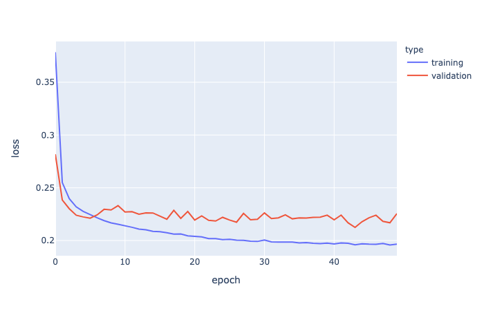
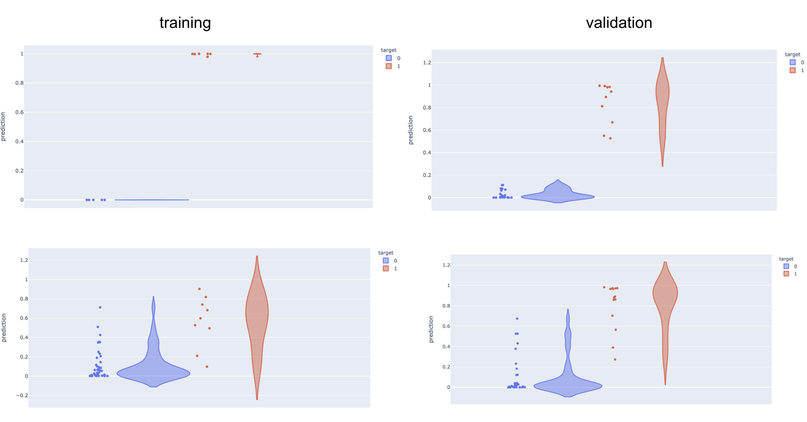

[model_utils/](/model_utils) are copied from last week's work.
Refer to notes from `2020_11_10` on how to use it as a package.

## S2 model update

improve logging + run time profiling

debug

```
python train_s2.py --in_file data/rfam151_s2_3_0p5.pkl.gz --config config.yml
```


1000-example debug:

```
CUDA_VISIBLE_DEVICES=1 python train_s2.py --in_file data/synthetic_s1_pruned_debug1000.pkl.gz --config tmp/config_1.yml 2>&1 | tee data/log_synthetic_s2_training_debug1000.txt
```

10000-example debug:

```
CUDA_VISIBLE_DEVICES=1 python train_s2.py --in_file data/synthetic_s1_pruned_debug10000.pkl.gz --config tmp/config_1.yml 2>&1 | tee data/log_synthetic_s2_training_debug10000.txt
```

50000-example debug:

```
CUDA_VISIBLE_DEVICES=1 python train_s2.py --in_file data/synthetic_s1_pruned_debug50000.pkl.gz --config tmp/config_1.yml 2>&1 | tee data/log_synthetic_s2_training_debug50000.txt
```

GPU:

```
CUDA_VISIBLE_DEVICES=1 python train_s2.py --in_file data/synthetic_s1_pruned.pkl.gz --config tmp/config_1.yml 2>&1 | tee data/log_synthetic_s2_training.txt
```


Result

```
grep  'mean loss' data/log_synthetic_s2_training.txt > data/log_tmp.txt
```




Visualize a few examples:




Produced by [plot_s2_training.ipynb](plot_s2_training.ipynb)


## Read paper

### DeepSets


### Set Transformer


### DeepSetNet: Predicting Sets with Deep Neural Networks

### Joint Learning of Set Cardinality and State Distribution

### BRUNO: A Deep Recurrent Model for Exchangeable Data


### Deep Set Prediction Networks


## TODOs

- s2 training: add batch mode (debug to make sure it works), save model, set up inference utils so we can run the model

- s2 inference: greedy sampling with hard constraints (white & black list)

- rfam151 (and other dataset): evaluate base pair sensitivity and specificity (allow off by 1?)

- evaluate sensitivity if we allow +/-1 shift/expand of each bb

- if above works and we have a NN for stage 2, we can feed in this extended set of bb proposals!

- attention -> output set?

- stage 1 prevent overfitting (note that theoretical upper bound is not 100% due to the way we constructed the predictive problem)

- upload best model to DC?

- evaluate rfam stage 2 predictions, majority are not identical, but are they close enough?

- investigate pseudoknot predictions, synthetic dataset (45886-32008)

- try running RNAfold and allow C-U and U-U (and other) base pairs, can we recover the lower FE structure that our model predicts?

- rfam151 dataset debug, is the ground truth bounding box correct? (make sure there’s no off-by-1 error)

- stage 1 model: iloop size = 0 on my side is bulge, make sure we have those cases!

- RNAfold performance on rfam151

- to debug: index 0 with length 117 and n_bbs 21 seems to be stuck during parsing.: python model_utils/run_stage_2.py --in_file data/rfam151_s1_bb_0p1.pkl.gz --out_file data/debug.pkl.gz --min_pixel_pred 3 --min_prob 0.5

- to debug: rfam151, RF00165_A, global structure contain invalid ones (implied iloop and hloop not included):
```
   bb_x  bb_y  siz_x  siz_y bb_type  n_proposal  prob_median  n_proposal_norm
0     1    17      2      2    stem           4     0.137343              1.0
1     4    45      8      8    stem          64     0.859667              1.0
2    27    57     10     10    stem         100     0.721043              1.0
.((.((((((((....)).........((((((((((.))))))))..)))))))))).... 14.362449399658637 100007.1
```

- stage 2, pick the first bb by sampling from all bb's (proportional to the 'likelihood' of the bb?),
then the next ones are picked by some attention based NN? black list & white list?

- extra constraints in stages 2? stem box needs to satisfy G-C, A-U, G-U base pairing (discard those that are not),
min hloop size?

- table documenting all DC IDs (datasets, models, etc.)


- Heuristics: More structure is better -> if global struct A is subset of B, discard A

- Pseudo knot?

- RNA-RNA interaction? Run stage 1 model three times, A-A, B-B & A-B, 2nd stage will have different constraints

- Long sequence?

- Greedy approach of assembly? Start with high prob bounding boxes, terminate after explored say 100 global structures?

- size > 10
