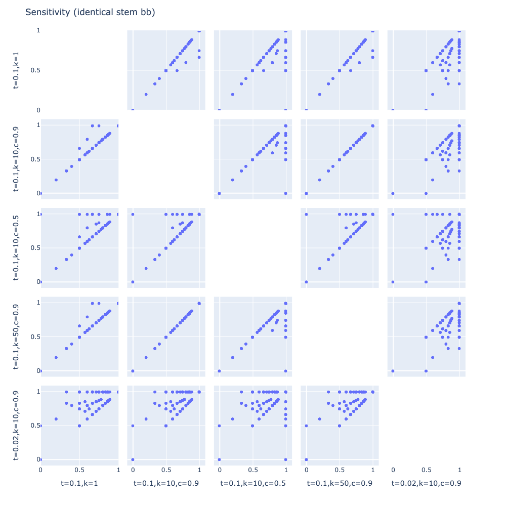
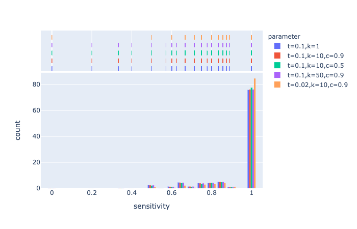
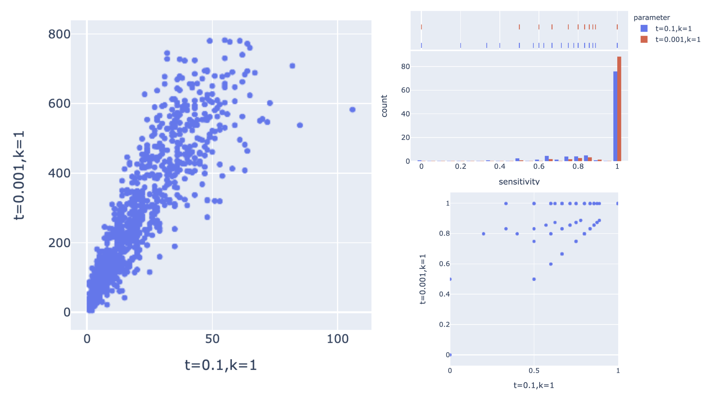

## Update plot from last week

Fixed bug in calculating sensitivity for plotting:
target bb represented in old data format (top left corner as reference),
but prediction in new data format (top right corner reference),
which resulted in very low sensitivity.

Updated plot:


Above plot: scatter plot of per-example identical bb sensitivity, for all parameter pairwise comparison.
Each data point is one example.


Above plot: histogram of per-example identical bb sensitivity for different parameter setting.


produced by make_plot.ipynb.


## Investigate missed bounding boxes

See https://docs.google.com/presentation/d/13zUHleI0qxjxiadpLi_kK5VMamjEQ_hwrLPQinNZ7Ls/edit#slide=id.gb702f07afc_0_0

Produced by [investigate_s1_pred.ipynb](investigate_s1_pred.ipynb)

TODO: investigate

## lower on_prob threshold for inference and check S1 performance

threshold=0.001

```
python model_utils/run_stage_1.py --data "`dcl path ZQi8RT`" --num 1000 --random_state 5555 --threshold 0.001 --topk 1 --perc_cutoff 0 --model v1.0 --out_file data/synthetic_s1_pred_1000_t0p001_k1.pkl.gz
```



Lowering the `on` threshold to 0.001 increased the sensitivity a lot (as expected),
but at a cost of 10x the number of bounding boxes.

Produced by [make_plot_2.ipynb](make_plot_2.ipynb)

## S2 inference & eval

Upload a debug version model:

```
(yeast_d_cell) alicegao@Alices-MacBook-Pro:~/work/psi-lab-sandbox/meetings/2021_01_19(master)$ dcl upload ../2021_01_12/s2_training/result/synthetic/model_ckpt_ep_28.pth
GBTqM9
```

```
model_versions = {
    # debug versions
    'v0.1': 'GBTqM9',  # https://github.com/PSI-Lab/alice-sandbox/tree/f094cf840424327629ed9ef22e642c728e401a6d/meetings/2021_01_12#s2-training-update
}
```

## Batch Mode

WIP

## Read paper

### DeepSets

### DeepSetNet: Predicting Sets with Deep Neural Networks

### Joint Learning of Set Cardinality and State Distribution

### BRUNO: A Deep Recurrent Model for Exchangeable Data


### Deep Set Prediction Networks

## Datasets

(be careful: old dataset using top left corner format)

`6PvUty`: rnastralign?

`903rfx`: rfam151?

`a16nRG`: s_processed?

`xs5Soq`: synthetic?

`ZQi8RT`: synthetic? with prediction?

bpRNA?

Sources:

- S1 training data, synthetic sequences: `ZQi8RT`


Intermediate:


## TODOs

- latent variable model

- when do we predict 'no structure'?

- s1 inference: running on longer sequence, can create a wrapper of the existing interface:
seq -> short seq pairs -> dfs -> translate -> stitch -> prediction. Be careful with boundary effect.
bb across boundary > include all.

- s2 idea: stacked 2D map: seq + binary, one for each local structure (predicted by s1). self attn across 2d maps?

- s2 idea: GNN? 'meta' node connects local structure? predict on/off of meta node? still can't incoportate non-local structure

- S1 inference pipeline for super long sequences: break into chunks and stitch

- dataset: '../2020_11_24/data/rfam151_s1_pruned.pkl.gz'  'data/synthetic_s1_pruned.pkl.gz'

- inference pipeline: deal with cases where some types of bb are empty

- inference pipeline debug + improvement: n_proposal_norm > 1, implementation using queue, terminate condition

- s2 training: stems only? how to pass in background info like sequence? memory network? encoding?

- s2 training: add batch mode (debug to make sure it works), save model, set up inference utils so we can run the model

- s2 inference: greedy sampling with hard constraints (white & black list)

- s2 training dataset, for those example where s1 bb sensitivity < 100%, add in the ground truth bbs for contructing dataset for s2.
How to set features like median_prob and n_proposal_norm? Average in the same example?

- rfam151 (and other dataset): evaluate base pair sensitivity and specificity (allow off by 1?)

- evaluate sensitivity if we allow +/-1 shift/expand of each bb

- if above works and we have a NN for stage 2, we can feed in this extended set of bb proposals!

- attention -> output set?

- stage 1 prevent overfitting (note that theoretical upper bound is not 100% due to the way we constructed the predictive problem)

- upload best model to DC?

- evaluate rfam stage 2 predictions, majority are not identical, but are they close enough?

- investigate pseudoknot predictions, synthetic dataset (45886-32008)

- try running RNAfold and allow C-U and U-U (and other) base pairs, can we recover the lower FE structure that our model predicts?

- rfam151 dataset debug, is the ground truth bounding box correct? (make sure there’s no off-by-1 error)

- stage 1 model: iloop size = 0 on my side is bulge, make sure we have those cases!

- RNAfold performance on rfam151

- to debug: index 0 with length 117 and n_bbs 21 seems to be stuck during parsing.: python model_utils/run_stage_2.py --in_file data/rfam151_s1_bb_0p1.pkl.gz --out_file data/debug.pkl.gz --min_pixel_pred 3 --min_prob 0.5

- to debug: rfam151, RF00165_A, global structure contain invalid ones (implied iloop and hloop not included):
```
   bb_x  bb_y  siz_x  siz_y bb_type  n_proposal  prob_median  n_proposal_norm
0     1    17      2      2    stem           4     0.137343              1.0
1     4    45      8      8    stem          64     0.859667              1.0
2    27    57     10     10    stem         100     0.721043              1.0
.((.((((((((....)).........((((((((((.))))))))..)))))))))).... 14.362449399658637 100007.1
```

- stage 2, pick the first bb by sampling from all bb's (proportional to the 'likelihood' of the bb?),
then the next ones are picked by some attention based NN? black list & white list?

- extra constraints in stages 2? stem box needs to satisfy G-C, A-U, G-U base pairing (discard those that are not),
min hloop size?

- table documenting all DC IDs (datasets, models, etc.)


- Heuristics: More structure is better -> if global struct A is subset of B, discard A

- Pseudo knot?

- RNA-RNA interaction? Run stage 1 model three times, A-A, B-B & A-B, 2nd stage will have different constraints

- Long sequence?

- Greedy approach of assembly? Start with high prob bounding boxes, terminate after explored say 100 global structures?

- size > 10


old dataset in top left corner format, convert everything to top right?
