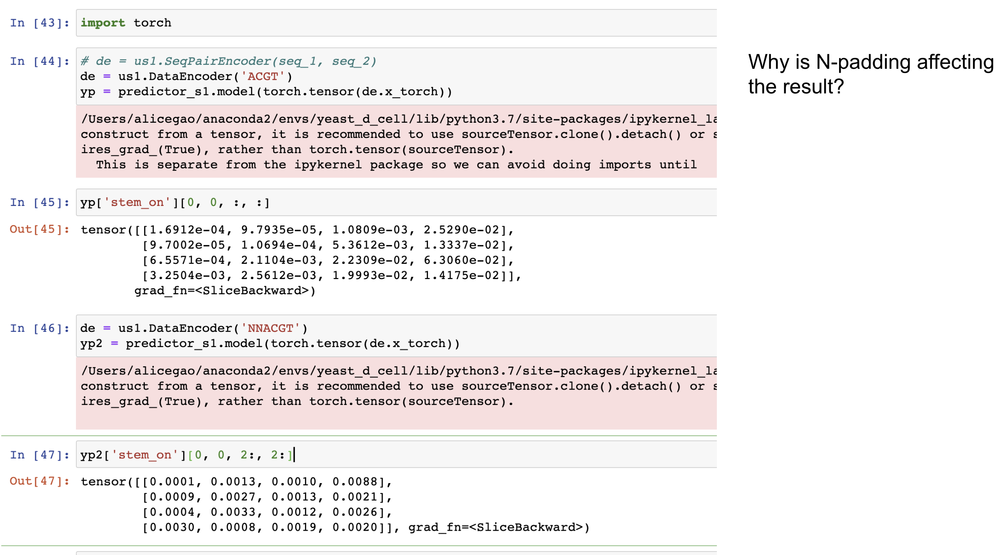

## S2 training

Continued from last week.


### run on full dataset

re-generating data

(backup before pruning)

(need pruning) (also note the params used by s1 inference, make sure to reflect when running inference <- shall we save it in the wrapper as a known version?)


## S1 inference on long sequence

### Update SeqPairEncoder

Updated data encoder. Model works with two input sequences of unequal lengths now.

### array method

predict on patches,
save the prediction matrix and concatenate,
then run bounding box prediction on the concatenated array.

1. determine trim size based on conv filter sizes.
We don't have dilation, and all filter width are odd number, so this is quite straight-forward.
trim_size on each side is: sum_i(layer_i_filter_width//2).
For example, 3 layers of filter with width of 9 will yield trim_size = 12,
i.e. extend 12 bases on each side of the sub sequence.

2. split seq-seq on 2D grid into patches, each patch has a input region and output region,
where input region correspond to the two sub sequences which will be encoded and fed into the NN,
and output region correspond to the pixels from which we get bounding box predictions from.
Pixels fall outside of the output region is trimmed off before concatenation.


3. run predictor on each patch, trim prediction, and assign back to the original-length-shaped
arrays at the corresponding location.

4. after all patches are run, run bounding box prediction on the entire arrays.


Observation: N padding affect output!
-> avoid N padding at boundary, only extend if there is actual sequence.




We also note that for each patch, the input seq_1 and seq_2 do not need to be of equal length.
For example, certain patches might have only one side extended, or some sides extended by smaller than trim_size.
For those cases we make sure to use the corresponding index when slicing the result prediction arrays,
so we still end up with the intended region for output.


testing:

- seq_len=80, patch_size=40, trim_size=28 (working)

- seq_len=60, patch_size=30, trim_size=28 (working)

- seq_len=80, patch_size=50, trim_size=28 (working)

- seq_len=100, patch_size=60, trim_size=28 (working)


### run on rfam

```
python model_utils/run_stage_1.py --data "`dcl path 903rfx`" --num 0 --threshold 0.01 --topk 1 --perc_cutoff 0 --patch_size 100 --model v1.0 --out_file data/rfam_t0p01_k1.pkl.gz
```


### (move to this week) run on s_processed


```
python model_utils/run_stage_1.py --data "`dcl path a16nRG`" --num 0 --threshold 0.01 --topk 1 --perc_cutoff 0 --patch_size 100 --model v1.0 --out_file data/s_processed_t0p01_k1.pkl.gz
```

### (move to this week) run on bpRNA?

```
python model_utils/run_stage_1.py --data "`dcl path DmNgdP`" --num 0 --threshold 0.01 --topk 1 --perc_cutoff 0 --patch_size 200 --model v1.0 --out_file data/bprna_t0p01_k1.pkl.gz
```


### (move to this week) instruction for predicting on long seq

See [sanity_check.ipynb](sanity_check.ipynb) for sanity check on toy examples.

two methods:

array method (implemented as part of predictor class):

- to be implemented: only half of the patches needs to be evaluated! (upper triangular)
    For each patch, check the 'output coordinate', if it's top right corner belongs to the lower triangular matrix,
    the whole patch is within the lower triangular matrix,
    then we can safely skip that patch.


```
import model_utils.utils_model as us1
predictor_s1 = us1.Predictor('v1.0')

seq = 'ACGATGACGATAGACGCGTATTAGACGAGACGGACGTAGACGACGACAGCGATGACGATGACGATAGACGACGACAGCGA'

# non-split (original interface)
stem_1, iloop_1, hloop_1 = predictor_s1.predict_bb(seq, threshold=0.1, topk=1, perc_cutoff=0)

# long seq interface
stem_2, iloop_2, hloop_2 = predictor_s1.predict_bb_split(seq, threshold=0.1, topk=1, perc_cutoff=0,
                                                         patch_size=100)

# above should yield exactly same result
```

bounding box method (implemented as a separate wrapper):

For bounding box method, for each patch, there are a few considerations:

- only half of the patches needs to be evaluated! (upper triangular)

- In the typical inference workflow of predicting on the full sequence, we apply hard mask, i.e. setting all lower triangular to 0's.
 When predicting on patches, most of them don't need hard-masking (since they will be 100% within upper triangular when translated back to the original coordinate).
 The only patches that needs hard masking are those: when translated back to original coordinate, overlapping the diagonal line.
 Also their hard mask won't be simply a lower-triangular-0, it'll depend on the way they overlap the diagonal line.

For implementation, we'll need to update the internal interface to optionally accept a user-set hard mask.
To be implemented in the future.


### S1 inference on long sequence - bounding box method

This rather complicated procedure (as opposed to "array method") is better for longer sequences,
since for those cases, even storing the prediction matrix might be costly.

1. determine trim size based on conv filter sizes.
We don't have dilation, and all filter width are odd number, so this is quite straight-forward.
trim_size on each side is: sum_i(layer_i_filter_width//2).
For example, 3 layers of filter with width of 9 will yield trim_size = 12,
i.e. extend 12 bases on each side of the sub sequence.


2. split seq-seq on 2D grid into patches, each patch has a input region and output region,
where input region correspond to the two sub sequences which will be encoded and fed into the NN,
and output region correspond to the pixels from which we get bounding box predictions from.
Pixels fall outside of the output region is masked at prediction time, i.e. they do not
contribute to bounding box prediction (since these pixel don't 'see' sufficient context)

3. run predictor on each patch with output mask, and 'translate' the patch-predicted bounding boxes
by adding in the patch input coordinate of top left corner.

4. after all patches are run, merge bounding box by their coordinate and size.
This is necessary since bounding box sitting across patches could be predicted by more than one patch.


TODO migrate fix from array method.


## visualize attention weight matrix

visualize attention weight matrix.


Produced by [visualize_attn.ipynb](visualize_attn.ipynb). (rely on a hacked version of predictor class that prints attn softmax, commit `3ffdac2..daa996c`)


## S2 inference

WIP

s2 inference: sampling (instead of argmax at every step)
s2 inference: topn at each step?
s2 inference: maintain max size stack? hard since recursion depth is unknown


## Read paper

### DeepSets

### DeepSetNet: Predicting Sets with Deep Neural Networks

### Joint Learning of Set Cardinality and State Distribution

### BRUNO: A Deep Recurrent Model for Exchangeable Data


### Deep Set Prediction Networks

## Datasets

(be careful: old dataset using top left corner format)

`6PvUty`: rnastralign?

`903rfx`: rfam151?

`a16nRG`: s_processed?

`xs5Soq`: synthetic?

`ZQi8RT`: synthetic? with prediction?

`DmNgdP`: bpRNA?

Sources:

- S1 training data, synthetic sequences: `ZQi8RT`


Intermediate:


## TODOs

- visualize attention matrix

- s2 inference: sampling mode, instead of taking argmax at each step (including the starting bb), sample w.r.t. the model output probability

- latent variable model

- when do we predict 'no structure'?

- try a few more params for S1 comparison plot: (1) t=0.02, k=1,c=0, (2) t=0.1,k=0,c=0.9, (3) t=0.1,k=0,c=0.5, ….etc.
generate another random test dataset (use new data format with top right corner)
try t=0.000001
try t=0.000001 and k=2

- s1 inference: running on longer sequence, can create a wrapper of the existing interface:
seq -> short seq pairs -> dfs -> translate -> stitch -> prediction. Be careful with boundary effect.
bb across boundary > include all.

- s2 idea: stacked 2D map: seq + binary, one for each local structure (predicted by s1). self attn across 2d maps?

- s2 idea: GNN? 'meta' node connects local structure? predict on/off of meta node? still can't incoportate non-local structure

- S1 inference pipeline for super long sequences: break into chunks and stitch

- dataset: '../2020_11_24/data/rfam151_s1_pruned.pkl.gz'  'data/synthetic_s1_pruned.pkl.gz'

- inference pipeline: deal with cases where some types of bb are empty

- inference pipeline debug + improvement: n_proposal_norm > 1, implementation using queue, terminate condition

- s2 training: stems only? how to pass in background info like sequence? memory network? encoding?

- s2 training: add batch mode (debug to make sure it works), save model, set up inference utils so we can run the model

- s2 inference: greedy sampling with hard constraints (white & black list)

- s2 training dataset, for those example where s1 bb sensitivity < 100%, add in the ground truth bbs for contructing dataset for s2.
How to set features like median_prob and n_proposal_norm? Average in the same example?

- rfam151 (and other dataset): evaluate base pair sensitivity and specificity (allow off by 1?)

- evaluate sensitivity if we allow +/-1 shift/expand of each bb

- if above works and we have a NN for stage 2, we can feed in this extended set of bb proposals!

- attention -> output set?

- stage 1 prevent overfitting (note that theoretical upper bound is not 100% due to the way we constructed the predictive problem)

- upload best model to DC?

- evaluate rfam stage 2 predictions, majority are not identical, but are they close enough?

- investigate pseudoknot predictions, synthetic dataset (45886-32008)

- try running RNAfold and allow C-U and U-U (and other) base pairs, can we recover the lower FE structure that our model predicts?

- rfam151 dataset debug, is the ground truth bounding box correct? (make sure there’s no off-by-1 error)

- stage 1 model: iloop size = 0 on my side is bulge, make sure we have those cases!

- RNAfold performance on rfam151

- to debug: index 0 with length 117 and n_bbs 21 seems to be stuck during parsing.: python model_utils/run_stage_2.py --in_file data/rfam151_s1_bb_0p1.pkl.gz --out_file data/debug.pkl.gz --min_pixel_pred 3 --min_prob 0.5

- to debug: rfam151, RF00165_A, global structure contain invalid ones (implied iloop and hloop not included):
```
   bb_x  bb_y  siz_x  siz_y bb_type  n_proposal  prob_median  n_proposal_norm
0     1    17      2      2    stem           4     0.137343              1.0
1     4    45      8      8    stem          64     0.859667              1.0
2    27    57     10     10    stem         100     0.721043              1.0
.((.((((((((....)).........((((((((((.))))))))..)))))))))).... 14.362449399658637 100007.1
```

- stage 2, pick the first bb by sampling from all bb's (proportional to the 'likelihood' of the bb?),
then the next ones are picked by some attention based NN? black list & white list?

- extra constraints in stages 2? stem box needs to satisfy G-C, A-U, G-U base pairing (discard those that are not),
min hloop size?

- table documenting all DC IDs (datasets, models, etc.)


- Heuristics: More structure is better -> if global struct A is subset of B, discard A

- Pseudo knot?

- RNA-RNA interaction? Run stage 1 model three times, A-A, B-B & A-B, 2nd stage will have different constraints

- Long sequence?

- Greedy approach of assembly? Start with high prob bounding boxes, terminate after explored say 100 global structures?

- size > 10


old dataset in top left corner format, convert everything to top right?


