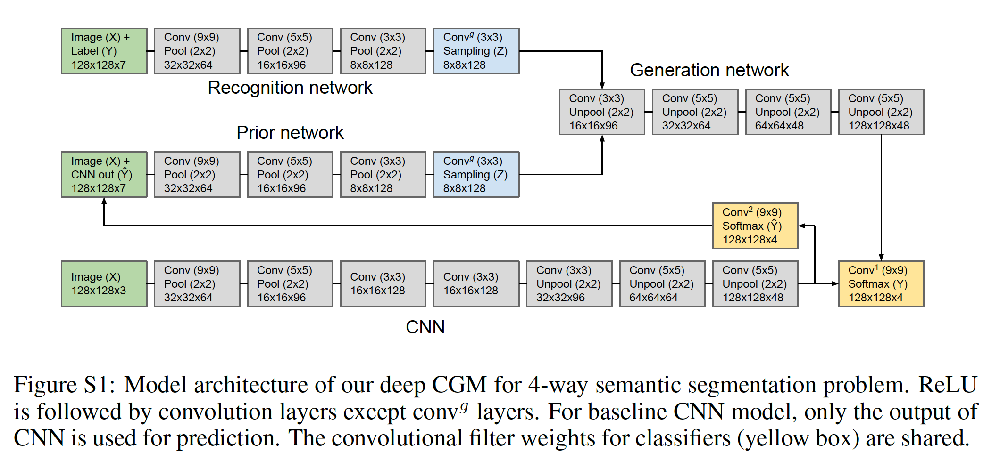
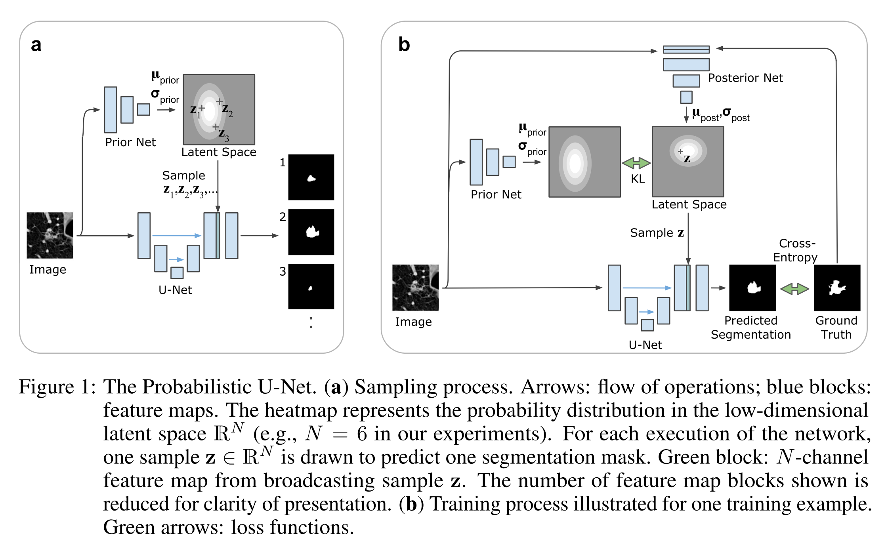
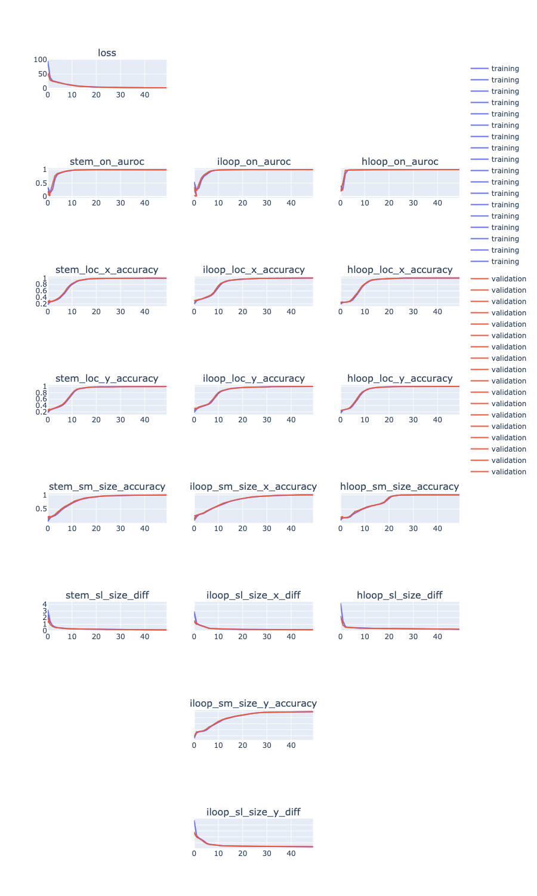
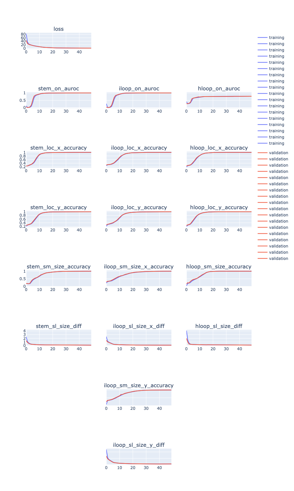

## CVAE: MNIST conditioned on class label

Sanity check it works


see predictions: https://docs.google.com/presentation/d/1XXCik3yw_ww_2h8rPjfEhzn4x4VhH3Oimv5d6HM2BYM/edit#slide=id.p


Model:

```
CVAE(
  (fc1): Linear(in_features=794, out_features=200, bias=True)
  (fc21): Linear(in_features=200, out_features=10, bias=True)
  (fc22): Linear(in_features=200, out_features=10, bias=True)
  (fc3): Linear(in_features=20, out_features=200, bias=True)
  (fc4): Linear(in_features=200, out_features=784, bias=True)
)
```

Optimization:

```
Train Epoch: 0 [0/60000 (0%)]	Loss: 10986.682617 = 10985.231445 + 1.451528
Train Epoch: 0 [2000/60000 (3%)]	Loss: 4360.748535 = 4240.848145 + 119.900520
Train Epoch: 0 [4000/60000 (7%)]	Loss: 3583.112793 = 3400.864990 + 182.247910
...
Train Epoch: 3 [54000/60000 (90%)]	Loss: 2169.500488 = 1847.556763 + 321.943817
Train Epoch: 3 [56000/60000 (93%)]	Loss: 2199.115723 = 1896.604614 + 302.511108
Train Epoch: 3 [58000/60000 (97%)]	Loss: 2363.539551 = 2045.863770 + 317.675720
====> Test set loss: 2173.4973
```


## Image segmentation papers


###Learning Structured Output Representation using Deep Conditional Generative Models

- Two approaches:

    - x->z -> y, here we assume the prior on z depends on x pθ(z|x)

    - x, z -> y, here we assume the prior is independent of x pθ(z)


- multiple sub networks:

    - recognition network: qφ(z|x, y)

    - (conditional) prior network: pθ(z|x)

    - generation network: pθ(y|x, z)

- "recurrent" connection of initial guessˆy to the prior network

- evaluation:

    - set z to E\[z|x\]

    - evaluate of conditonal likelihood of y given x, by sampling z using the prior network,
    and compute MC estimate of p(y|x)

    - similar to above, but using importance sampling from qφ(z|x, y)


- proposed method to close gap between recognition network and prior network:
setting the recognition network the same as the prior network, i.e., qφ(z|x, y) = pθ(z|x).
By doing so we get rid of the KL divergence in the objective.
Author call this:Gaussian stochastic neural network (GSNN).
Overall objective is weighted sum of this and the original objective.




- Model architeture:

    - recognition network input: original image + ground truth y

    - prior network input: original image + predicted y from baseline CNN

    - final output is summation of generation network and baseline CNN


###A Probabilistic U-Net for Segmentation of Ambiguous Images



- loss is a weighted combination of:

    - KL divergence between probabilities parameterized by prior (condition on x)
    and posterior (condition on x and ground truth y) network

    - likelihood of y|x generated from z sampled from posterior network


## CVAE: MNIST conditioned on image


#### Add CNN before conditioning

One layer CNN before combining x with y or z.

https://docs.google.com/presentation/d/1XXCik3yw_ww_2h8rPjfEhzn4x4VhH3Oimv5d6HM2BYM/edit#slide=id.gc11059b81d_0_0


#### Add prior network

- In addition to posterior network: x, y -> z's parameter,
add prior network that maps x to z's parameter

- Minimize KL between posterior and the parameterized prior (as opposed to the fixed N(0,1) prior)

- KL divergence between prior and posterior, when both are parameterized:
https://jamboard.google.com/d/1h3RJg4gkF48me63UrBfoUMALqjxkw3bqtcPAVszGc4M/viewer?f=0

- At test time, use prior network to sample z


tie weights?

Can we think of a better toy problem?


## CVAE adopted to bounding box prediction


### Generate dataset


Generate multiple y's for the same x by sampling RNAfold suboptimal structure: `RNAsubopt`.
For now we're using the `-p` option: randomly draw structures according to their probability in the Boltzmann ensemble.
There is another (mutually exclusive) option `-e` for generating all structures within a delta free energy threshold.

```
mkdir data/
cd s1_vae_data_gen/
python make_data.py --minlen 10 --maxlen 100 --num_seq 1000 --num_sample 10 --out ../data/synthetic_bb_dist.len10_100.num1000.sample10.pkl.gz
```


### Model training: CVAE


- CNN run on 1D input (from outer concat of seq)

- VAE run on each pixel independently (i.e. per-channel NN, or 1x1 conv)

- VAE:

    - input x: feature map of each pixel (denoted as a in the jamboard below),


    - output y: per-pixel bounding box outputs: for each bb type, on/off probability, location and size (softmax/scalar)


### Model training: prior independent of x


- only posterior network ("encoder")

- prior is assumed to be N(0, 1)

- decoder input: x and z, where z is sampled from posterior network (training time) or default prior


https://jamboard.google.com/d/1h3RJg4gkF48me63UrBfoUMALqjxkw3bqtcPAVszGc4M/viewer?f=1


debug:

```
cd s1_training/
CUDA_VISIBLE_DEVICES=1 python train_variational_pixel_bb_cvae_with_prior.py --data ../data/synthetic_bb_dist.len10_100.num1000.sample10.pkl.gz --result result/debug --num_filters 16 16 --filter_width 9 9 --latent_dim 20 --epoch 2 --mask 0.1 --batch_size 20 --max_length 200 --cpu 0
```


#### Run 1

GPU (soft masking disabled):

```
cd s1_training/
CUDA_VISIBLE_DEVICES=1 python train_variational_pixel_bb_cvae_with_prior.py --data ../data/synthetic_bb_dist.len10_100.num1000.sample10.pkl.gz --result result/run_1 --num_filters 32 32 64 64 64 128 128 --filter_width 9 9 9 9 9 9 9 --latent_dim 20 --epoch 50 --mask 0.1 --batch_size 20 --max_length 200 --cpu 4
```

<!--plot training:-->

<!--```-->
<!--# in root dir:-->
<!--python model_utils/plot_training.py --in_log s1_training/result/run_1/run.log --out_plot s1_training/result/run_1/plot_training.html-->
<!--```-->


<!---->


#### Run 2

turn off soft masking (i.e. apply equal loss weighting everywhere) by setting mask=1.0:

```
cd s1_training/
CUDA_VISIBLE_DEVICES=1 python train_variational_pixel_bb_cvae_with_prior.py --data ../data/synthetic_bb_dist.len10_100.num1000.sample10.pkl.gz --result result/run_2 --num_filters 32 32 64 64 64 128 128 --filter_width 9 9 9 9 9 9 9 --latent_dim 20 --epoch 50 --mask 1 --batch_size 20 --max_length 200 --cpu 4
```

<!--plot training:-->

<!--```-->
<!--# in root dir:-->
<!--python model_utils/plot_training.py --in_log s1_training/result/run_2/run.log --out_plot s1_training/result/run_2/plot_training.html-->
<!--```-->

<!---->


Thoughts: current implementation: each pixel has its own mu and log_var.

TODO plot KLD   as

### Inference

<!--Use run_2, last epoch,-->


### TODOs


sanity check prediction


check performance (sanity check) (how to evaluate?)


more latent dimensions?


More data points (above is 1000 x 10), e.g. 10000 x 10?


new inference pipeline v2


TODO


### Model training: Prior depend on x

- use both prior and posterior network

    - prior network input: x

    - posterior network ("encoder") input: x and y


- decoder input: x and z, where z is sampled from posterior network (training time) or prior network (test time)

WIP


TODO implement prior network

TODO inference pipeline v3 (same code as v2 with different options?)
