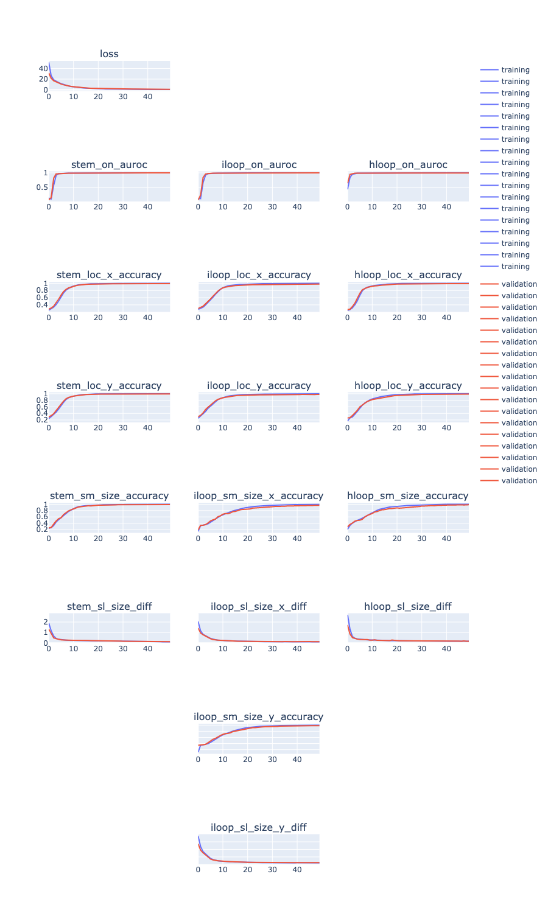

## CVAE adopted to bounding box prediction

Continued from last week.

### Model training: prior independent of x


turn off soft masking (i.e. apply equal loss weighting everywhere) by setting mask=1.0:

```
cd s1_training/
CUDA_VISIBLE_DEVICES=1 python train_variational_pixel_bb_cvae_with_prior.py --data ../data/synthetic_bb_dist.len10_100.num1000.sample10.pkl.gz --result result/run_2 --num_filters 32 32 64 64 64 128 128 --filter_width 9 9 9 9 9 9 9 --latent_dim 20 --epoch 50 --mask 1 --batch_size 20 --max_length 200 --cpu 4
```


plot training:

```
# in root dir:
python model_utils/plot_training.py --in_log s1_training/result/run_2/run.log --out_plot s1_training/result/run_2/plot_training.html
```



Note that although the metrics look all converging, it does not mean model works in
practise. This is because when evaluating those metrics, we were using posterior network (which has access to ground truth y)
to sample z, but in practise we need to sample from prior.


### Inference

Added [model_utils/utils_model_s1_cvae_unconditional_prior.py](model_utils/utils_model_s1_cvae_unconditional_prior.py)
for inference using CVAE trained with unconditional prior.

Usage:

```python
from model_utils.utils_model_s1_cvae_unconditional_prior import Predictor
predictor = Predictor('s1_training/result/run_2/model_ckpt_ep_49.pth')
seq = 'AGTAGTCGTAGCTGATGGGGGGATGAGACGT'

# sample once
uniq_stem, uniq_iloop, uniq_hloop = predictor.predict_bb(seq, threshold=0.1, topk=1, perc_cutoff=0, seq2=None, mask=None, latent_var=None)


# sample N times (only passing through CNN once)
# TODO
```

#### Generate a test set

```
mkdir data/
cd s1_vae_data_gen/
python make_data.py --minlen 10 --maxlen 100 --num_seq 100 --num_sample 100 --out ../data/synthetic_bb_dist.len10_100.num100.sample100.pkl.gz
```

#### Check bounding box prediction

Plot: pg 1 of https://docs.google.com/presentation/d/1F06Ds5e6d7o7EeVda6d6RcjN9mFtnRW1fkYtvhTMCcA/edit#slide=id.gc3bfce0e87_0_0

Produced by https://github.com/PSI-Lab/alice-sandbox/blob/d04686bf63a579a4bdcbfa6c6c742bdcc48af896/meetings/2021_03_09/tmp_inference.ipynb

    - 100 samples
    - each point is a unique bb
    - color/shape: bb_type
    - x axis: tgt count
    - y axis: pred count

As seen from plot, most of the bounding boxes in the ground truth distribution are not being predicted
(those point aligned to the left axis).
We'll try adding in the prior network.


### Model training: prior dependent on x


debug run:

```
cd s1_training/
python train_variational_pixel_bb_cvae_with_conditional_prior.py --data ../../2021_03_02/data/synthetic_bb_dist.len10_100.num1000.sample10.pkl.gz --result result/debug --num_filters 16 16 --filter_width 9 9 --latent_dim 20 --epoch 2 --mask 0.1 --batch_size 20 --max_length 200 --cpu 0
```


"Run 3":

GPU (soft masking):

```
cd s1_training/
CUDA_VISIBLE_DEVICES=1 python train_variational_pixel_bb_cvae_with_conditional_prior.py --data ../../2021_03_02/data/synthetic_bb_dist.len10_100.num1000.sample10.pkl.gz --result result/run_3 --num_filters 32 32 64 64 64 128 128 --filter_width 9 9 9 9 9 9 9 --latent_dim 20 --epoch 50 --mask 0.1 --batch_size 20 --max_length 200 --cpu 4
```


"Run 4":

GPU (soft masking disabled, more epochs):

```
cd s1_training/
CUDA_VISIBLE_DEVICES=1 python train_variational_pixel_bb_cvae_with_conditional_prior.py --data ../../2021_03_02/data/synthetic_bb_dist.len10_100.num1000.sample10.pkl.gz --result result/run_4 --num_filters 32 32 64 64 64 128 128 --filter_width 9 9 9 9 9 9 9 --latent_dim 20 --epoch 100 --mask 1 --batch_size 20 --max_length 200 --cpu 4
```


"Run 5":

GPU, same as run 4, updated script to report p(y|x) loss computed using z sampled from prior network (in addition to posterior) on validation


```
cd s1_training/
CUDA_VISIBLE_DEVICES=1 python train_variational_pixel_bb_cvae_with_conditional_prior.py --data ../../2021_03_02/data/synthetic_bb_dist.len10_100.num1000.sample10.pkl.gz --result result/run_5 --num_filters 32 32 64 64 64 128 128 --filter_width 9 9 9 9 9 9 9 --latent_dim 20 --epoch 100 --mask 1 --batch_size 20 --max_length 200 --cpu 4
```


"Run 6":

GPU, add in prior-network based p(y|x) loss:

```
cd s1_training/
CUDA_VISIBLE_DEVICES=1 python train_variational_pixel_bb_cvae_with_conditional_prior.py --data ../../2021_03_02/data/synthetic_bb_dist.len10_100.num1000.sample10.pkl.gz --result result/run_6 --num_filters 32 32 64 64 64 128 128 --filter_width 9 9 9 9 9 9 9 --latent_dim 20 --epoch 100 --mask 1 --batch_size 20 --max_length 200 --cpu 4
```


"Run 8":

GPU, same as run 6, more latent dim, more epochs:

```
cd s1_training/
CUDA_VISIBLE_DEVICES=1 python train_variational_pixel_bb_cvae_with_conditional_prior.py --data ../../2021_03_02/data/synthetic_bb_dist.len10_100.num1000.sample10.pkl.gz --result result/run_8 --num_filters 32 32 64 64 64 128 128 --filter_width 9 9 9 9 9 9 9 --latent_dim 50 --epoch 200 --mask 1 --batch_size 20 --max_length 200 --cpu 4
```


<!--TODO add more layers in decoder? pass in original x?-->


### Inference

Added  [model_utils/utils_model_s1_cvae_conditional_prior.py](model_utils/utils_model_s1_cvae_conditional_prior.py)
for inference using CVAE trained with conditional prior (including the version with only VAE loss or VAE+GSNN loss,
inference is the same: use prior network to sample z).

Usage:

```python
from model_utils.utils_model_s1_cvae_conditional_prior import Predictor
predictor = Predictor('s1_training/result/run_3/model_ckpt_ep_49.pth')
seq = 'AGTAGTCGTAGCTGATGGGGGGATGAGACGT'

# sample once
uniq_stem, uniq_iloop, uniq_hloop = predictor.predict_bb(seq, threshold=0.1, topk=1, perc_cutoff=0, seq2=None, mask=None)


# sample N times (only passing through CNN once)
# TODO
```


Check prediction on test example:

https://docs.google.com/presentation/d/1AvGDeUpH3jlOSQ7u20TfTbPZ5nBBlbz62knLtr-kqH8/edit#slide=id.gc4187c18e2_0_0

(generated by 'tmp_inference_conditional.ipynb')


## CVAE for global prediction

If the 'patch' is small enough, maybe we can have one global z and predict everything conditioned on that?
Ignore bounding box (for contraint modelling) for now, predict bp matrix directly.


### Dataset

TODO add plot

generate a training dataset of same length sequence (before batch mask implementation):


```
mkdir data/
cd s1_vae_data_gen/
python make_data.py --minlen 50 --maxlen 50 --num_seq 1000 --num_sample 10 --out ../data/synthetic_bb_dist.len50.num1000.sample10.pkl.gz
```

a test set:

```
mkdir data/
cd s1_vae_data_gen/
python make_data.py --minlen 50 --maxlen 50 --num_seq 100 --num_sample 10 --out ../data/synthetic_bb_dist.len50.num100.sample10.pkl.gz
```


### Training

debug run:

```
cd s1_training/
python train_cvae_global_z_bp_matrix.py --data ../data/synthetic_bb_dist.len50.num100.sample10.pkl.gz --result result/debug --latent_dim 20 --epoch 100 --batch_size 20 --max_length 200 --cpu 4
```


"Run 7"

GPU, latent dim 50:

```
cd s1_training/
CUDA_VISIBLE_DEVICES=0 python train_cvae_global_z_bp_matrix.py --data ../data/synthetic_bb_dist.len50.num1000.sample10.pkl.gz --result result/run_7 --latent_dim 50 --epoch 100 --batch_size 100 --max_length 200 --cpu 4
```


"Run 9"

GPU, same as run 7, more epochs:

```
cd s1_training/
CUDA_VISIBLE_DEVICES=0 python train_cvae_global_z_bp_matrix.py --data ../data/synthetic_bb_dist.len50.num1000.sample10.pkl.gz --result result/run_9 --latent_dim 50 --epoch 200 --batch_size 100 --max_length 200 --cpu 4
```


```
2021-03-07 14:34:42,699 [MainThread  ] [INFO ]  Epoch 199 ite 19/20 Validation loss (prior, p(y|x) only): 0.009408972226083279
2021-03-07 14:34:42,803 [MainThread  ] [INFO ]  AUCs: mean 0.9904633004764882, median: 0.9977182168955794, max 1.0, min 0.918709807073955
2021-03-07 14:34:42,826 [MainThread  ] [INFO ]  Epoch 199/200, validation loss (prior, p(y|x) only): 0.008760317182168364
```

### Inference

Result:


au-ROC not a good metric? see pg. 3 of https://docs.google.com/presentation/d/1AvGDeUpH3jlOSQ7u20TfTbPZ5nBBlbz62knLtr-kqH8/edit#slide=id.gc442189b09_0_2


<!--1D seq -> encode -> z-->

<!--memory?-->


### Dataset (shorter seq)


```
mkdir data/
cd s1_vae_data_gen/
python make_data.py --minlen 10 --maxlen 10 --num_seq 1000 --num_sample 10 --out ../data/synthetic_bb_dist.len10.num1000.sample10.pkl.gz
```

a test set:

```
mkdir data/
cd s1_vae_data_gen/
python make_data.py --minlen 10 --maxlen 10 --num_seq 100 --num_sample 10 --out ../data/synthetic_bb_dist.len10.num100.sample10.pkl.gz
```

### Training


"Run 10"

GPU, same as run 7, more epochs:

```
cd s1_training/
CUDA_VISIBLE_DEVICES=0 python train_cvae_global_z_bp_matrix.py --data ../data/synthetic_bb_dist.len10.num1000.sample10.pkl.gz --result result/run_10 --latent_dim 50 --epoch 200 --batch_size 100 --max_length 200 --cpu 4
```


### Eval

bb sensitivity, sample 10 z's?


### How to sample z at training time


Right now all z's for different 'pixels' are sampled independently at training,
since they each have their owner posterior mean and std (determined by the conv net feature map at that pixel).

Global z? encode the whole sequence?


## Paper

###NEURAL REPRESENTATION AND GENERATION FOR RNA SECONDARY STRUCTURES


## TODOs

- train on shorter sequences (be careful with cnn receptive field size), stem only, self attention?

- masked conv (first layer?)

- KL annealing during training

- bounding box -> segmentation map? (with overlapping pixel), rectangular shape?

- CVAE for global prediction

- local struct free energy as objective?

- add in prior-based loss

- small toy example?

- VAE to generate base-pair graph directly? no need for bb? constraints?

- check convergence
check inference
global/local/semi-local z?
training: same z for same bb, overlapping pixel pick random one?
inference: different z for different pixel

- s2 inference: sampling mode, instead of taking argmax at each step (including the starting bb), sample w.r.t. the model output probability

- latent variable model

- when do we predict 'no structure'?

- try a few more params for S1 comparison plot: (1) t=0.02, k=1,c=0, (2) t=0.1,k=0,c=0.9, (3) t=0.1,k=0,c=0.5, ….etc.
generate another random test dataset (use new data format with top right corner)
try t=0.000001
try t=0.000001 and k=2


- s2 idea: stacked 2D map: seq + binary, one for each local structure (predicted by s1). self attn across 2d maps?

- s2 idea: GNN? 'meta' node connects local structure? predict on/off of meta node? still can't incoportate non-local structure

- dataset: '../2020_11_24/data/rfam151_s1_pruned.pkl.gz'  'data/synthetic_s1_pruned.pkl.gz'

- inference pipeline debug + improvement: n_proposal_norm > 1, implementation using queue, terminate condition

- s2 training: stems only? how to pass in background info like sequence? memory network? encoding?

- s2 training dataset, for those example where s1 bb sensitivity < 100%, add in the ground truth bbs for contructing dataset for s2.
How to set features like median_prob and n_proposal_norm? Average in the same example?

- rfam151 (and other dataset): evaluate base pair sensitivity and specificity (allow off by 1?)

- evaluate sensitivity if we allow +/-1 shift/expand of each bb

- if above works and we have a NN for stage 2, we can feed in this extended set of bb proposals!

- stage 1 prevent overfitting (note that theoretical upper bound is not 100% due to the way we constructed the predictive problem)

- investigate pseudoknot predictions, synthetic dataset (45886-32008)

- try running RNAfold and allow C-U and U-U (and other) base pairs, can we recover the lower FE structure that our model predicts?

- rfam151 dataset debug, is the ground truth bounding box correct? (make sure there’s no off-by-1 error)

- stage 1 model: iloop size = 0 on my side is bulge, make sure we have those cases!

- RNAfold performance on rfam151

- RNA-RNA interaction? Run stage 1 model three times, A-A, B-B & A-B, 2nd stage will have different constraints


old dataset in top left corner format, convert everything to top right?

