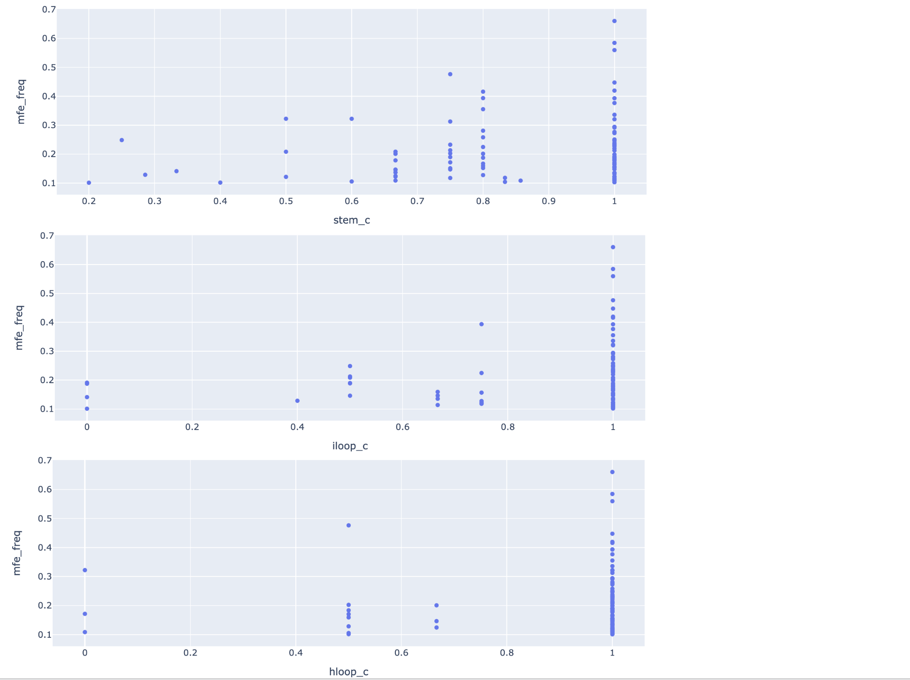

## Investigate S2 baseline model

Following last week's strange result: https://github.com/PSI-Lab/alice-sandbox/tree/8ba16db7867e16e11831af62b447cf5b69ad84bc/meetings/2021_03_30#result,
we'd like to run a few more experiments to understand:
(1) whether there's any bug that's causing the high performance of baseline model,
and if not, (2) how can baseline model achieve such high performance?

Baseline model: 7 input features from 3 categories:
1-hot encoded bb type (3) + bb location (2)
+ bb size (2).

### Without bb type

Dataset:

debug

```
python s2_training/make_dataset_baseline_no_bb_type.py --in_file ../2021_03_23/data/debug_s1_pred_len20_200_100_pruned.pkl.gz --out_file data/debug_s1_pred_len20_200_100_pruned_filtered_baseline_no_bb_type.npz
```

dataset 5000


```
python s2_training/make_dataset_baseline_no_bb_type.py --in_file ../2021_03_30/data/human_transcriptome_segment_high_mfe_freq_s1_pred_len20_200_5000_pruned.pkl.gz --out_file data/human_transcriptome_segment_high_mfe_freq_s1_pred_len20_200_5000_pruned_baseline_no_bb_type.npz
```


Training:

debug

```
cd s2_training/
python train_s2.py --in_file ../data/debug_s1_pred_len20_200_100_pruned_filtered_baseline_no_bb_type.npz --config config_baseline_no_bb_type.yml --out_dir result/debug/
```

dataset 5000

```
cd s2_training/
CUDA_VISIBLE_DEVICES=2 python train_s2.py --in_file ../data/human_transcriptome_segment_high_mfe_freq_s1_pred_len20_200_5000_pruned_baseline_no_bb_type.npz --config config_baseline_no_bb_type.yml --out_dir result/run_baseline_np_bb_type_1/
```

### Without bb location

Dataset:

debug

```
python s2_training/make_dataset_baseline_no_bb_location.py --in_file ../2021_03_23/data/debug_s1_pred_len20_200_100_pruned.pkl.gz --out_file data/debug_s1_pred_len20_200_100_pruned_filtered_baseline_no_bb_location.npz
```

dataset 5000

```
python s2_training/make_dataset_baseline_no_bb_location.py --in_file ../2021_03_30/data/human_transcriptome_segment_high_mfe_freq_s1_pred_len20_200_5000_pruned.pkl.gz --out_file data/human_transcriptome_segment_high_mfe_freq_s1_pred_len20_200_5000_pruned_baseline_no_bb_location.npz
```


Training:

debug

```
cd s2_training/
python train_s2.py --in_file ../data/debug_s1_pred_len20_200_100_pruned_filtered_baseline_no_bb_location.npz --config config_baseline_no_bb_location.yml --out_dir result/debug/
```

dataset 5000

```
cd s2_training/
CUDA_VISIBLE_DEVICES=2 python train_s2.py --in_file ../data/human_transcriptome_segment_high_mfe_freq_s1_pred_len20_200_5000_pruned_baseline_no_bb_location.npz --config config_baseline_no_bb_location.yml --out_dir result/run_baseline_np_bb_location_1/
```


### Without bb size

Dataset:

debug

```
python s2_training/make_dataset_baseline_no_bb_size.py --in_file ../2021_03_23/data/debug_s1_pred_len20_200_100_pruned.pkl.gz --out_file data/debug_s1_pred_len20_200_100_pruned_filtered_baseline_no_bb_size.npz
```

dataset 5000

```
python s2_training/make_dataset_baseline_no_bb_size.py --in_file ../2021_03_30/data/human_transcriptome_segment_high_mfe_freq_s1_pred_len20_200_5000_pruned.pkl.gz --out_file data/human_transcriptome_segment_high_mfe_freq_s1_pred_len20_200_5000_pruned_baseline_no_bb_size.npz
```


Training:

debug

```
cd s2_training/
python train_s2.py --in_file ../data/debug_s1_pred_len20_200_100_pruned_filtered_baseline_no_bb_size.npz --config config_baseline_no_bb_size.yml --out_dir result/debug/
```

dataset 5000

```
cd s2_training/
CUDA_VISIBLE_DEVICES=2 python train_s2.py --in_file ../data/human_transcriptome_segment_high_mfe_freq_s1_pred_len20_200_5000_pruned_baseline_no_bb_size.npz --config config_baseline_no_bb_size.yml --out_dir result/run_baseline_no_bb_size_1/
```

### Only bb location


Dataset:

debug

```
python s2_training/make_dataset_baseline_only_bb_location.py --in_file ../2021_03_23/data/debug_s1_pred_len20_200_100_pruned.pkl.gz --out_file data/debug_s1_pred_len20_200_100_pruned_filtered_baseline_only_bb_location.npz
```

dataset 5000

```
python s2_training/make_dataset_baseline_only_bb_location.py --in_file ../2021_03_30/data/human_transcriptome_segment_high_mfe_freq_s1_pred_len20_200_5000_pruned.pkl.gz --out_file data/human_transcriptome_segment_high_mfe_freq_s1_pred_len20_200_5000_pruned_baseline_only_bb_location.npz
```

Training:

debug

```
cd s2_training/
python train_s2.py --in_file ../data/debug_s1_pred_len20_200_100_pruned_filtered_baseline_only_bb_location.npz --config config_baseline_only_bb_location.yml --out_dir result/debug/
```

dataset 5000

```
cd s2_training/
CUDA_VISIBLE_DEVICES=2 python train_s2.py --in_file ../data/human_transcriptome_segment_high_mfe_freq_s1_pred_len20_200_5000_pruned_baseline_only_bb_location.npz --config config_baseline_only_bb_location.yml --out_dir result/run_baseline_only_bb_location_1/
```


### Result summary

From last week:

- bb type, location, size & S1 feature (n_proposal_norm, median probability): training au-ROC 0.98 validation 0.96

- bb type, location, size (baseline): training au-ROC 0.93 validation 0.87

This week:

- bb location, size (no bb type): training au-ROC 0.91 validation 0.86

- bb type, size (no bb location): training au-ROC 0.81 validation 0.79

- bb type, location (no bb size): training au-ROC 0.90 validation 0.85

- bb location (no type, size): training au-ROC 0.72 validation 0.67


## Investigate S2 LSTM+attn model

```
scp alice@alice-new.dg:/home/alice/work/psi-lab-sandbox/meetings/2021_03_30/s2_training/result/run_1/model_ckpt_ep_49.pth  data/s2_model_lstm_attn_1.pth
```


Concat bb feature with LSTM output:

```
all_features = torch.cat([x_bb, lstm_features], dim=2)
```

In the particular model we trained, the above is 27-dimensional,
with 7 bb features and 20 LSTM features. This is passed throught the
embedding layer:

```
print(model.embed)
Linear(in_features=27, out_features=100, bias=True)
```

With 100x27 weight matrix.


It doesn seem that bb features (7 columns on left) are assigned higher weights
than the LSTM outputs (20 columns on the right).

Generated by [investigate_s2_model_weights.ipynb](investigate_s2_model_weights.ipynb)

## S1 non-conv model

Is CNN the right architecture for predicting per-pixel bb?
Try using FC instead.

To use existing code,
we'll set the first conv layer to have large receptive field
(e.g. 28*2+1=56+1=57),
then set all subsequent layers to be 1x1 conv.
This resembles a FC NN runs as sliding windows on the 2D grid.

```
cd s1_training/
CUDA_VISIBLE_DEVICES=0 python train_s1_conv_net.py --data ../../2021_03_16/data/human_transcriptome_segment_high_mfe_freq_training_len64_200000.pkl.gz --result result/run_non_conv_1 --num_filters 100 100 50 50 50 --filter_width 57 1 1 1 1 --epoch 50 --mask 0 --batch_size 20 --max_length 200 --cpu 8
```

Workstation died, need to re-run. TODO


## Evaluate S1 with both inference methods combined


The above plot illustrates the bb sensitivity performance of:

    Method 1: threshold on p_on >= 0.1

    Method 2: threshold on n_proposal >= 0.5

    Union: union of the above 2 methods

Of course it is not surprising the union has the best performance
(non-decreasing by definition of sensitivity), but the interesting observation
here is that the two methods indeed provide complementary information.


Above plot compares the number of bb proposal for method 1 and 2.
Each point is one example. As shown on the plot,
there doesn't seem to be any systematic shift of either method,
i.e. both methods at the current threshold produce similar number of bb proposals
if we consider the distribution of the whole test dataset (100 examples).
In addition, there does not seem to be any correlation on the number of bb proposals,
which is a bit suprising.



Above plot compares sensitivity with MFE frequency (which was computed
when we generated the test dataset, using RNAfold).
There's an obvious trend that examples with lower sensitivity
all have low MFE frequency.

Thoughts:

- Even if the structure has low MFE freq, it's still > 0.1 (that's how we generated the dataset),
which means a substructure is still plausible (we think),
then why is the model not able to pick those up?

- Maybe another way to generate training dataset is:
instead of thresholding on MFE freq, sample many structures from the ensemble,
then only retain local substructure that occur often.
One concern is whether this will cause the model to only learn the
most likely ones, where what we want are "all plausible ones"?


Generated by [eval_s1_combined_inference.ipynb](eval_s1_combined_inference.ipynb)


## Debug - dataset

Some dataset entries have almost identical sequences?

```
df.iloc[1].seq
'CCAGCAACTGCTGGCCTGTGCCAGGGTGCAAGCTGAGCACTGGAGTGGAGTTTTCCTGTGGAGA'
df.iloc[2].seq
'CAGCAACTGCTGGCCTGTGCCAGGGTGCAAGCTGAGCACTGGAGTGGAGTTTTCCTGTGGAGAG'
```


Some consecutive pairs have low edit distance:

```
for i in range(len(df)):
    for j in range(i+1, len(df)):
        distance = levenshtein(df.iloc[i].seq, df.iloc[j].seq)
        if distance <= 10:
            print(i, j, distance)

1 2 2
27 28 2
29 30 6
54 55 6
93 94 8
```


To be further investigated.


## Investigate S1 model

Check a few example of missed bbs:

https://docs.google.com/presentation/d/1uC8KusmNzV5pydTUGpUpcImvoTHLLCSjjgk1kq0J6c0/edit#slide=id.gce7f2b257c_0_25

Generated by [investigate_s1_model.ipynb](investigate_s1_model.ipynb)


## S2 GNN idea


## TODOs

use only stem bb proposals, initialize GNN connection,
(one base could be connected to multiple ones), predict final edge weights (each node can have 0 or 1 edge),
(but we lose bb?)


PSI meeting TODOs:
LSTM debug: gradient? is it learning anything? check the weight connecting the LSTM outputs
S2 baseline: decrease NN capacity
S2 baseline: try different subsets of input features (bb type, location, size)
S2 baseline naive guess? metric? (but it’s actually pretty clear from the shuffled-label experiment that it’s not predicting all 0's or the naive guess)
S2 other ideas involving ‘background sequence’?

randomize features?

backpropr to s1?

memory network

other ways to summerize s1 pred?

s2: BERT like? predict masked bbs?

s2: sampling -> combination -> rank using a score function (this should be trivial)

s1+2:  global attn -> predict bb?  auxilary target and mask in lower layers (start with cnn?),
last layer has to predict the non-masked bbs. combine all bb and average pixels?

read https://lilianweng.github.io/lil-log/2018/12/27/object-detection-part-4.html#ssd-single-shot-multibox-detector

read https://openreview.net/forum?id=snOgiCYZgJ7

s1: mimic FC (instead of CNN), use only one layer of 2D conv with large receptive field (50x50?),
all subsequent layers are 1x1 2D conv (FC)

multi-resolution?


learn how to combine pixel's predictions


s1 inference: combine both? sensitivity? n proposal?

s1 predict: on/off distribution (per example), percentile?

-S 1 inference: check likelihood of ground truth bb


- S1 inference: (1) mask lower triangular for all softmax! (2) get rid of invalid stem (there could be many if we don’t threshold on probability)

- check training set metric on ep_50 (overfit) to see if it’s better?

- S2 dataset: running S1 inference got rid of more than 50% examples? compare with thresholding on on_off probability


