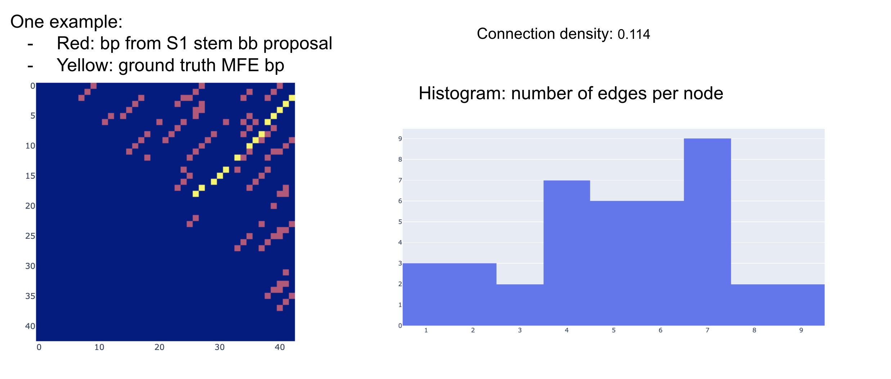
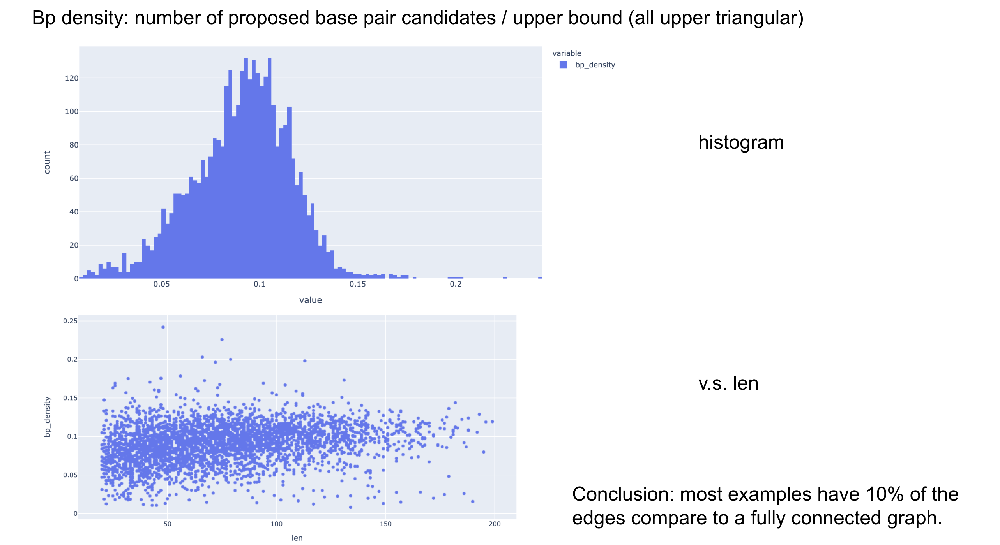
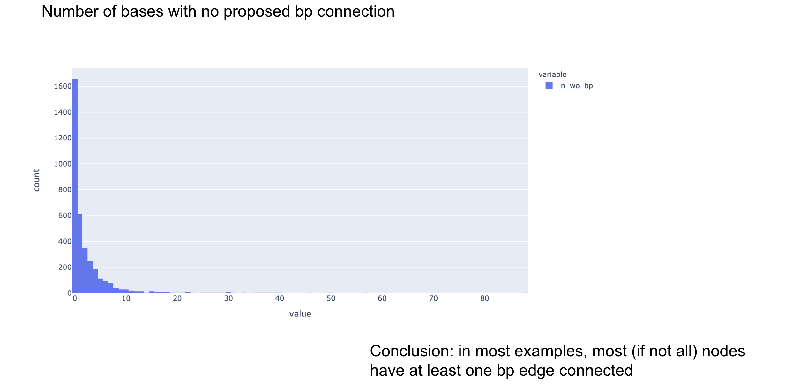
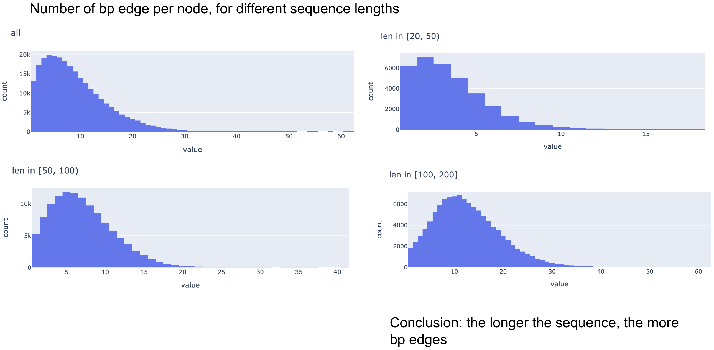

## Debug - dataset

From last week:

Some dataset entries have almost identical sequences?

```
df.iloc[1].seq
'CCAGCAACTGCTGGCCTGTGCCAGGGTGCAAGCTGAGCACTGGAGTGGAGTTTTCCTGTGGAGA'
df.iloc[2].seq
'CAGCAACTGCTGGCCTGTGCCAGGGTGCAAGCTGAGCACTGGAGTGGAGTTTTCCTGTGGAGAG'
```


Some consecutive pairs have low edit distance:

```
for i in range(len(df)):
    for j in range(i+1, len(df)):
        distance = levenshtein(df.iloc[i].seq, df.iloc[j].seq)
        if distance <= 10:
            print(i, j, distance)

1 2 2
27 28 2
29 30 6
54 55 6
93 94 8
```


To be further investigated.


## S1 prediction


TODO re-run S1 pred with both methods combined?

see [tmp_s1_pred_stem_processing.ipynb](tmp_s1_pred_stem_processing.ipynb)

Converted to script:

```
python s1_pred_stem_processing.py --data ../2021_03_23/data/debug_training_len20_200_100.pkl.gz \
--threshold_p 0.1 --threshold_n 0.5 --model ../2021_03_23/s1_training/result/run_7/model_ckpt_ep_17.pth \
--out_file data/debug.pkl.gz
```

Large dataset:

```
python s1_pred_stem_processing.py --data ../2021_03_23/data/human_transcriptome_segment_high_mfe_freq_training_len20_200_5000.pkl.gz \
--threshold_p 0.1 --threshold_n 0.5 --model ../2021_03_23/s1_training/result/run_7/model_ckpt_ep_17.pth \
--out_file data/human_transcriptome_segment_high_mfe_freq_training_len20_200_5000_pred_stem_bps.pkl.gz
```


## S1 non-conv model

TODO


## Read papers on GNN edge labelling/pruning

### Edge-Labeling Graph Neural Network for Few-shot Learning

###EdgeNets:Edge Varying Graph Neural Networks

### Neural Relational Inference for Interacting Systems


## S2 dataset statistics









Produced by [dataset_statistics.ipynb](dataset_statistics.ipynb)

## S2 GNN idea

From last week:


Other advantages:

- S2 model will be able to 'fine-tune' some bbs, e.g. make it 1bp smaller (won't be able to extend it)

debug:


```
python s2_train_gnn_1.py --input_data data/debug_training_len20_200_100_s1_pred_stem_bps.pkl.gz \
--training_proportion 0.95 --learning_rate 0.01 --epochs 1 --batch_size 10 --hid 10 10 --log tmp.log
```


real dataset:


```
python s2_train_gnn_1.py --input_data data/human_transcriptome_segment_high_mfe_freq_training_len20_200_5000_pred_stem_bps.pkl.gz \
--training_proportion 0.95 --learning_rate 0.01 --epochs 1 --hid 10 10 --log tmp.log
```

```
python s2_train_gnn_1.py --input_data data/human_transcriptome_segment_high_mfe_freq_training_len20_200_5000_pred_stem_bps.pkl.gz \
--training_proportion 0.95 --learning_rate 0.001 --epochs 100 --hid 20 20 20 20 20 20 20 20 20 20 --log result/s2_gnn_run_1.log
```


```
python s2_train_gnn_1.py --input_data data/human_transcriptome_segment_high_mfe_freq_training_len20_200_5000_pred_stem_bps.pkl.gz \
--training_proportion 0.95 --learning_rate 0.0005 --epochs 100 --hid 50 50 50 50 50 50 50 50 50 50 --log result/s2_gnn_run_2.log
```

```
python s2_train_gnn_1.py --input_data data/human_transcriptome_segment_high_mfe_freq_training_len20_200_5000_pred_stem_bps.pkl.gz \
--training_proportion 0.95 --learning_rate 0.0005 --epochs 100 --hid 200 200 200 200 --batch_size 20 --log result/s2_gnn_run_3.log
```


### k-mer embedding

```
python s2_train_gnn_2.py --input_data data/debug_training_len20_200_100_s1_pred_stem_bps.pkl.gz \
--training_proportion 0.95 --learning_rate 0.01 --epochs 1 --batch_size 10 --hid 10 10 --log tmp.log --kmer 3 --embed_dim 20
```


```
python s2_train_gnn_2.py --input_data data/human_transcriptome_segment_high_mfe_freq_training_len20_200_5000_pred_stem_bps.pkl.gz \
--training_proportion 0.95 --learning_rate 0.001 --epochs 100 --batch_size 10 --hid 50 50 50 50 50 \
 --log result/s2_gnn_run_4.log --kmer 5 --embed_dim 100
```

overfit?

```
2021-04-18 01:39:45,737 [MainThread  ] [INFO ]  Epoch 99, training, mean loss 0.017095582736049882, mean AUC 0.7990723658650051
2021-04-18 01:39:48,782 [MainThread  ] [INFO ]  Epoch 99, testing, mean loss 0.6578992579819104, mean AUC 0.5951351727922218
```

#### try smaller NN

```
python s2_train_gnn_2.py --input_data data/human_transcriptome_segment_high_mfe_freq_training_len20_200_5000_pred_stem_bps.pkl.gz \
--training_proportion 0.95 --learning_rate 0.001 --epochs 100 --batch_size 10 --hid 20 20 20 20 20 \
 --log result/s2_gnn_run_5.log --kmer 3 --embed_dim 50
```

better?

```
2021-04-18 09:59:59,187 [MainThread  ] [INFO ]  Epoch 99, training, mean loss 0.02624728402795171, mean AUC 0.7104701549247721
2021-04-18 10:00:00,974 [MainThread  ] [INFO ]  Epoch 99, testing, mean loss 0.27273789339558374, mean AUC 0.6843603798848465
```

#### Increase capacity a bit


```
python s2_train_gnn_2.py --input_data data/human_transcriptome_segment_high_mfe_freq_training_len20_200_5000_pred_stem_bps.pkl.gz \
--training_proportion 0.95 --learning_rate 0.001 --epochs 100 --batch_size 10 --hid 50 50 50 50 50 \
 --log result/s2_gnn_run_6.log --kmer 3 --embed_dim 50
```

Overfitting? also note the gap between the two losses

```
2021-04-18 13:52:32,810 [MainThread  ] [INFO ]  Epoch 99, training, mean loss 0.026406431665434642, mean AUC 0.7022502249526361
2021-04-18 13:52:35,316 [MainThread  ] [INFO ]  Epoch 99, testing, mean loss 0.2874277385586467, mean AUC 0.6629097471300608
```

#### Tuning capacity


```
python s2_train_gnn_2.py --input_data data/human_transcriptome_segment_high_mfe_freq_training_len20_200_5000_pred_stem_bps.pkl.gz \
--training_proportion 0.95 --learning_rate 0.001 --epochs 100 --batch_size 10 --hid 10 10 10 10 10 \
 --log result/s2_gnn_run_8.log --kmer 3 --embed_dim 10
```


```
2021-04-18 16:06:03,559 [MainThread  ] [INFO ]  Epoch 99, training, mean loss 0.026875300458549745, mean AUC 0.6969837448916736
2021-04-18 16:06:05,194 [MainThread  ] [INFO ]  Epoch 99, testing, mean loss 0.2894021285562542, mean AUC 0.6788339036915995
```

#### More layers

```
python s2_train_gnn_2.py --input_data data/human_transcriptome_segment_high_mfe_freq_training_len20_200_5000_pred_stem_bps.pkl.gz \
--training_proportion 0.95 --learning_rate 0.001 --epochs 100 --batch_size 10 --hid 10 10 10 10 10 10 10 10 \
 --log result/s2_gnn_run_9.log --kmer 3 --embed_dim 10
```

(log file got overwritten...)

seems to help a little bit?

```
2021-04-19 00:40:53,499 [MainThread  ] [INFO ]  Epoch 99, training, mean loss 0.027050670174628314, mean AUC 0.6915427046019291
2021-04-19 00:40:55,777 [MainThread  ] [INFO ]  Epoch 99, testing, mean loss 0.28041177888156316, mean AUC 0.6806621243559404
```

#### More layers + more epochs

```
python s2_train_gnn_2.py --input_data data/human_transcriptome_segment_high_mfe_freq_training_len20_200_5000_pred_stem_bps.pkl.gz \
--training_proportion 0.95 --learning_rate 0.001 --epochs 200 --batch_size 10 --hid 10 10 10 10 10 10 10 10 10 10 10 10 \
 --log result/s2_gnn_run_9.log --kmer 3 --embed_dim 10
```

not better:

```
2021-04-19 14:48:39,467 [MainThread  ] [INFO ]  Epoch 199, training, mean loss 0.02681501193864811, mean AUC 0.6918375018130758
2021-04-19 14:48:41,861 [MainThread  ] [INFO ]  Epoch 199, testing, mean loss 0.3017125247077569, mean AUC 0.6655066365296489
```


### Per-node softmax

- instead of predicting the binary label for each edge,
predict the picked edge for each node

- output mask should be multiplied before taking softmax

- implemented on top of previous step (i.e. with kmer embedding)

- Caveat: we're not taking care of the case where a node has no connection
(target will be `[0, 0, ..., 0]`, will the gradient work in this case?).
Proper solution would be to predict another per-node binary label,
and mask out softmax gradient for those nodes where ground truth is no connection.

debug:

```
python s2_train_gnn_3.py --input_data data/debug_training_len20_200_100_s1_pred_stem_bps.pkl.gz \
--training_proportion 0.95 --learning_rate 0.01 --epochs 1 --batch_size 10 --hid 10 10 --log tmp.log --kmer 3 --embed_dim 20
```

real data:

```
python s2_train_gnn_3.py --input_data data/human_transcriptome_segment_high_mfe_freq_training_len20_200_5000_pred_stem_bps.pkl.gz \
--training_proportion 0.95 --learning_rate 0.001 --epochs 100 --batch_size 10 --hid 20 20 20 20 20 \
 --log result/s2_gnn_run_7.log --kmer 3 --embed_dim 50
```

why is validation loss so high?

```
2021-04-18 13:22:25,392 [MainThread  ] [INFO ]  Epoch 99, training, mean loss 0.41078687236153866, mean AUC 0.6431484792832344
2021-04-18 13:22:27,617 [MainThread  ] [INFO ]  Epoch 99, testing, mean loss 4.144261710470615, mean AUC 0.6272982001279099
```

updated loss with mask (node without any candidate connections are masked):

```
python s2_train_gnn_3.py --input_data data/human_transcriptome_segment_high_mfe_freq_training_len20_200_5000_pred_stem_bps.pkl.gz \
--training_proportion 0.95 --learning_rate 0.001 --epochs 100 --batch_size 10 --hid 20 20 20 20 20 \
 --log result/s2_gnn_run_7_2.log --kmer 3 --embed_dim 50
```

similar result...

```
2021-04-18 16:55:30,868 [MainThread  ] [INFO ]  Epoch 99, training, mean loss 0.4073270097992123, mean AUC 0.6420452665115585
2021-04-18 16:55:32,563 [MainThread  ] [INFO ]  Epoch 99, testing, mean loss 4.023479684105133, mean AUC 0.6286711335698179
```

### one-hot encoding of edge feature

- instead of binary (easier for NN to pick up features?)

- implemented on top of kmer embedding (s2_train_gnn_2.py)

debug:

```
python s2_train_gnn_4.py --input_data data/debug_training_len20_200_100_s1_pred_stem_bps.pkl.gz \
--training_proportion 0.95 --learning_rate 0.01 --epochs 1 --batch_size 10 --hid 10 10 --log tmp.log --kmer 3 --embed_dim 20
```

real data:

```
python s2_train_gnn_4.py --input_data data/human_transcriptome_segment_high_mfe_freq_training_len20_200_5000_pred_stem_bps.pkl.gz \
--training_proportion 0.95 --learning_rate 0.001 --epochs 100 --batch_size 10 --hid 20 20 20 20 20 \
 --log result/s2_gnn_run_10.log --kmer 3 --embed_dim 50
```


```
2021-04-19 00:42:52,737 [MainThread  ] [INFO ]  Epoch 99, training, mean loss 0.026146557852184987, mean AUC 0.7121764932797567
2021-04-19 00:42:54,509 [MainThread  ] [INFO ]  Epoch 99, testing, mean loss 0.2853089367460938, mean AUC 0.6718298622619296
```


### Shorter sequences

- shorter sequences have fewer number of connections, does it make the problem easier?

- implemented on top of kmer embedding (s2_train_gnn_2.py)

debug

```
python s2_train_gnn_5.py --input_data data/debug_training_len20_200_100_s1_pred_stem_bps.pkl.gz \
--training_proportion 0.95 --learning_rate 0.01 --epochs 1 --batch_size 10 --hid 10 10 \
--log tmp.log --kmer 3 --embed_dim 20 --max_len 50
```

real dataset:

```
python s2_train_gnn_5.py --input_data data/human_transcriptome_segment_high_mfe_freq_training_len20_200_5000_pred_stem_bps.pkl.gz \
--training_proportion 0.95 --learning_rate 0.01 --epochs 100 --batch_size 10 --hid 20 20 20 20 \
--log result/s2_gnn_run_11.log --kmer 3 --embed_dim 20 --max_len 50
```

overfit!

reduce capacity:

```
python s2_train_gnn_5.py --input_data data/human_transcriptome_segment_high_mfe_freq_training_len20_200_5000_pred_stem_bps.pkl.gz \
--training_proportion 0.95 --learning_rate 0.001 --epochs 100 --batch_size 10 --hid 10 10 10 10 \
--log result/s2_gnn_run_11.log --kmer 3 --embed_dim 10 --max_len 50
```

nothing better than use all the lengths:

```
2021-04-19 18:38:13,942 [MainThread  ] [INFO ]  Epoch 99, training, mean loss 0.03799169484306784, mean AUC 0.7273895164274633
2021-04-19 18:38:14,188 [MainThread  ] [INFO ]  Epoch 99, testing, mean loss 0.41748447329909716, mean AUC 0.6775187989761299
```


So using shorter sequences does not make the problem easier? Are we missing some important input features?


### Fewer proposals

- reducing the number of bb proposals also result in fewer number of connections, does it make the problem easier?

- implement in a hacky way:
split proposed bp into target bp (proposal is always a super set, by construction),
and non-target. Sample equal number of non-target. (i.e. make the problem balanced, thus easier?)

- implemented on top of kmer embedding (s2_train_gnn_2.py)

Result summary:

| class ratio | AUC training | AUC validation |
|-------------|--------------|----------------|
| 1:1         | 0.92         | 0.89           |
| 2:1         | 0.84         | 0.83           |
| 3:1         | 0.79         | 0.78           |
| 4:1         | 0.77         | 0.74           |
| 5:1         | 0.75         | 0.72           |
| 6:1         | 0.74         | 0.73           |
| 7:1         | 0.73         | 0.71           |


- thoughts: it seems that the higher the class ratio (i.e. more negative-class edges),
the harder the problem. This result does not seem too surprising,
but makes me think that could the difficulty come from the fact that
all (hydrogen bond candidate) edges are being treated equally in message passing?

- Two solutions to the above problem:
(1) use S1 prediction as edge features, this is not ideal since we can't fine-tune S2 model is S2 sensitivity is not 100%.
(2) propagate edge embedding,
i.e. update edge features as well. By doing this,
the NN can learn to treat edges differently when updating node embeddings
(which in turn affect the node embeddings). We need to look into how to
implement this in pytorch-geometric.


log:

debug

```
python s2_train_gnn_6.py --input_data data/debug_training_len20_200_100_s1_pred_stem_bps.pkl.gz \
--training_proportion 0.95 --learning_rate 0.01 --epochs 1 --batch_size 10 --hid 10 10 \
--log tmp.log --kmer 3 --embed_dim 20
```

real data:

```
python s2_train_gnn_6.py --input_data data/human_transcriptome_segment_high_mfe_freq_training_len20_200_5000_pred_stem_bps.pkl.gz \
--training_proportion 0.95 --learning_rate 0.01 --epochs 100 --batch_size 10 --hid 20 20 20 20 \
--log result/s2_gnn_run_12.log --kmer 3 --embed_dim 20
```

(killed by accident)

```
2021-04-19 21:32:52,558 [MainThread  ] [INFO ]  Epoch 93, training, mean loss 0.03652355214195139, mean AUC 0.9153664666449748
2021-04-19 21:32:53,709 [MainThread  ] [INFO ]  Epoch 93, testing, mean loss 0.41485167994013045, mean AUC 0.8932613979436786
```

ratio `2:1`:

```
python s2_train_gnn_6.py --input_data data/human_transcriptome_segment_high_mfe_freq_training_len20_200_5000_pred_stem_bps.pkl.gz \
--training_proportion 0.95 --learning_rate 0.01 --epochs 100 --batch_size 10 --hid 20 20 20 20 \
--log result/s2_gnn_run_13.log --kmer 3 --embed_dim 20 --class_ratio 2
```

```
2021-04-20 01:44:54,207 [MainThread  ] [INFO ]  Epoch 99, training, mean loss 0.045109673346993485, mean AUC 0.842180624548866
2021-04-20 01:44:58,747 [MainThread  ] [INFO ]  Epoch 99, testing, mean loss 0.4658787787460082, mean AUC 0.8280812596667222
```

ratio `3:1`:

```
python s2_train_gnn_6.py --input_data data/human_transcriptome_segment_high_mfe_freq_training_len20_200_5000_pred_stem_bps.pkl.gz \
--training_proportion 0.95 --learning_rate 0.01 --epochs 100 --batch_size 10 --hid 20 20 20 20 \
--log result/s2_gnn_run_14.log --kmer 3 --embed_dim 20 --class_ratio 3
```

```
2021-04-20 01:58:50,632 [MainThread  ] [INFO ]  Epoch 99, training, mean loss 0.04513125981275852, mean AUC 0.7944396921968713
2021-04-20 01:58:52,106 [MainThread  ] [INFO ]  Epoch 99, testing, mean loss 0.46132132535873177, mean AUC 0.7841428772981031
```

ratio `4:1`:

```
python s2_train_gnn_6.py --input_data data/human_transcriptome_segment_high_mfe_freq_training_len20_200_5000_pred_stem_bps.pkl.gz \
--training_proportion 0.95 --learning_rate 0.01 --epochs 100 --batch_size 10 --hid 20 20 20 20 \
--log result/s2_gnn_run_15.log --kmer 3 --embed_dim 20 --class_ratio 4
```

```
2021-04-20 02:24:24,733 [MainThread  ] [INFO ]  Epoch 99, training, mean loss 0.0424776128939623, mean AUC 0.7678636968284884
2021-04-20 02:24:25,946 [MainThread  ] [INFO ]  Epoch 99, testing, mean loss 0.44685361039039145, mean AUC 0.7398440204208613
```


ratio `5:1`:

```
python s2_train_gnn_6.py --input_data data/human_transcriptome_segment_high_mfe_freq_training_len20_200_5000_pred_stem_bps.pkl.gz \
--training_proportion 0.95 --learning_rate 0.01 --epochs 100 --batch_size 10 --hid 20 20 20 20 \
--log result/s2_gnn_run_16.log --kmer 3 --embed_dim 20 --class_ratio 5
```

```
2021-04-20 03:52:09,555 [MainThread  ] [INFO ]  Epoch 99, training, mean loss 0.03980019794413324, mean AUC 0.7503946940139058
2021-04-20 03:52:10,719 [MainThread  ] [INFO ]  Epoch 99, testing, mean loss 0.41689481948341073, mean AUC 0.7214459235632925
```


ratio `6:1`:

```
python s2_train_gnn_6.py --input_data data/human_transcriptome_segment_high_mfe_freq_training_len20_200_5000_pred_stem_bps.pkl.gz \
--training_proportion 0.95 --learning_rate 0.01 --epochs 100 --batch_size 10 --hid 20 20 20 20 \
--log result/s2_gnn_run_17.log --kmer 3 --embed_dim 20 --class_ratio 6
```

```
2021-04-20 05:20:18,294 [MainThread  ] [INFO ]  Epoch 99, training, mean loss 0.03737643659114837, mean AUC 0.7408531803927315
2021-04-20 05:20:19,534 [MainThread  ] [INFO ]  Epoch 99, testing, mean loss 0.37856194385270164, mean AUC 0.7294182883954133
```


ratio `7:1`:

```
python s2_train_gnn_6.py --input_data data/human_transcriptome_segment_high_mfe_freq_training_len20_200_5000_pred_stem_bps.pkl.gz \
--training_proportion 0.95 --learning_rate 0.01 --epochs 100 --batch_size 10 --hid 20 20 20 20 \
--log result/s2_gnn_run_18.log --kmer 3 --embed_dim 20 --class_ratio 7
```

```
2021-04-20 06:49:09,104 [MainThread  ] [INFO ]  Epoch 99, training, mean loss 0.03537181767486256, mean AUC 0.7317497717552663
2021-04-20 06:49:10,351 [MainThread  ] [INFO ]  Epoch 99, testing, mean loss 0.3578015141313968, mean AUC 0.714786327686034
```


### TODOs


not working?

- make it easier problem: (1) shorter seq, (2) fewer proposals?

- read paper

- jamboard

- re-try softmax: update eval metric to accuracy (not global auc)

- (done, running) k-mer embedding

- update GATEconv -> simpler, just use edge feature

- super node?

- backbone edge directed?

- (done, running) edge feature 0, 1 -> [0, 1] & [1, 0]

- (done -running) per-node softmax (on the matrix, using mask?)

- (done - working) debug loss accumulation

- debug dataset, inspect a few examples, make sure it make sense

- plot, distribution of: num_edges per node, v,s, len?

- incoportate s1 prediction as edge features

- GPU

- (done) sub-class graph conv layer, add in edge features, added GATEConv

- (done, seems to help with performance but not sure if it's overfitting) concat GCN features across multiple layers

- (done, checked that above is overfitting on small data) add validation set

- modify GATEconv?

- simple inner product

- toy task 2: predict base pair binary label

- more layers (more hops - we should cover the size of a typical 'loop')

- other toy tasks?

- convert edge to node? like a factor graph?

- real dataset (more examples)


- node level prediction: whether each base is paired


### Gradient check for loss accumulation

See [gradient_check.ipynb](gradient_check.ipynb)


## S2 GNN - toy task

To test the implementation, we put together a toy dataset as follows:

Graph is being constructed in the same way:

- nodes are the bases

- two types of edges:

    - backbone connection: undirected edges connects i and i+1, for 0 <= i < seq_len

    - putative hydrogen bonds from S1 stem bb proposal: undirected edges connecting all base pairs in predicted stems

Edge targets are constructed to be trivial:
An edge is labelled as 1 if the base pair is G-C (or C-G), and 0 otherwise.
Any reasonable model should be able to achieve close to 100% AUC on this dataset.

Model architecture:

- 1 layer of graph convolution (graph attention convolution)

- outer concatenate node features after graph conv

- 1x1 convolution (equivalent to FC for each node pair)

- sigmoid output with BCE loss

Result:

```
Epoch 0, mean loss 0.6725149569766862, mean AUC 0.6756173759394002
Epoch 1, mean loss 0.6480377220681736, mean AUC 0.9750365592911423
Epoch 2, mean loss 0.5782683294798646, mean AUC 0.9929219380802792
Epoch 3, mean loss 0.428862168852772, mean AUC 0.9985667497092067
Epoch 4, mean loss 0.24169315450957843, mean AUC 0.9997053254384118
Epoch 5, mean loss 0.12639604535486018, mean AUC 0.9999354404240066
Epoch 6, mean loss 0.07895537938124367, mean AUC 0.9999469424885264
Epoch 7, mean loss 0.058380261595760076, mean AUC 0.9999701805995238
Epoch 8, mean loss 0.047000310400367847, mean AUC 0.9999729680559698
Epoch 9, mean loss 0.040260948573372195, mean AUC 0.9999848190217681
```

Generated by: [tmp_gnn_toy_task.ipynb](tmp_gnn_toy_task.ipynb)


## S2 GNN implementation

### Dataset


To generate training dataset for S2, we run S1 model (combined inferences?),
and keep those example whose stem bb sensitivity is 100%.

The following annotations are generated for each example:

- sequence

- length

- base pair indices for all stem bbs

- target base pair indices


TODO:

- sensitivity for identical bb

- sensitivity for: predicted bb >= target bb

- add in 'missing' bb for s2


### Feature encoding


Node feature

Edge feature


### Training

target

link?


## TODOs

use only stem bb proposals, initialize GNN connection,
(one base could be connected to multiple ones), predict final edge weights (each node can have 0 or 1 edge),
(but we lose bb?)


PSI meeting TODOs:
LSTM debug: gradient? is it learning anything? check the weight connecting the LSTM outputs
S2 baseline: decrease NN capacity
S2 baseline: try different subsets of input features (bb type, location, size)
S2 baseline naive guess? metric? (but it’s actually pretty clear from the shuffled-label experiment that it’s not predicting all 0's or the naive guess)
S2 other ideas involving ‘background sequence’?

randomize features?

backpropr to s1?

memory network

other ways to summerize s1 pred?

s2: BERT like? predict masked bbs?

s2: sampling -> combination -> rank using a score function (this should be trivial)

s1+2:  global attn -> predict bb?  auxilary target and mask in lower layers (start with cnn?),
last layer has to predict the non-masked bbs. combine all bb and average pixels?

read https://lilianweng.github.io/lil-log/2018/12/27/object-detection-part-4.html#ssd-single-shot-multibox-detector

read https://openreview.net/forum?id=snOgiCYZgJ7

s1: mimic FC (instead of CNN), use only one layer of 2D conv with large receptive field (50x50?),
all subsequent layers are 1x1 2D conv (FC)

multi-resolution?


learn how to combine pixel's predictions


s1 inference: combine both? sensitivity? n proposal?

s1 predict: on/off distribution (per example), percentile?

-S 1 inference: check likelihood of ground truth bb


- S1 inference: (1) mask lower triangular for all softmax! (2) get rid of invalid stem (there could be many if we don’t threshold on probability)

- check training set metric on ep_50 (overfit) to see if it’s better?

- S2 dataset: running S1 inference got rid of more than 50% examples? compare with thresholding on on_off probability


