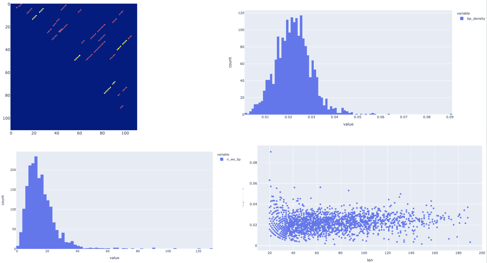
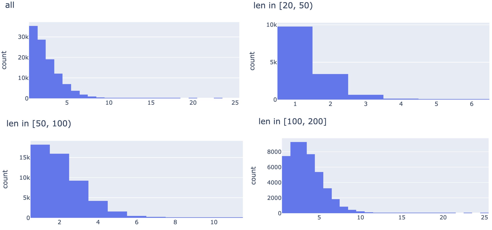
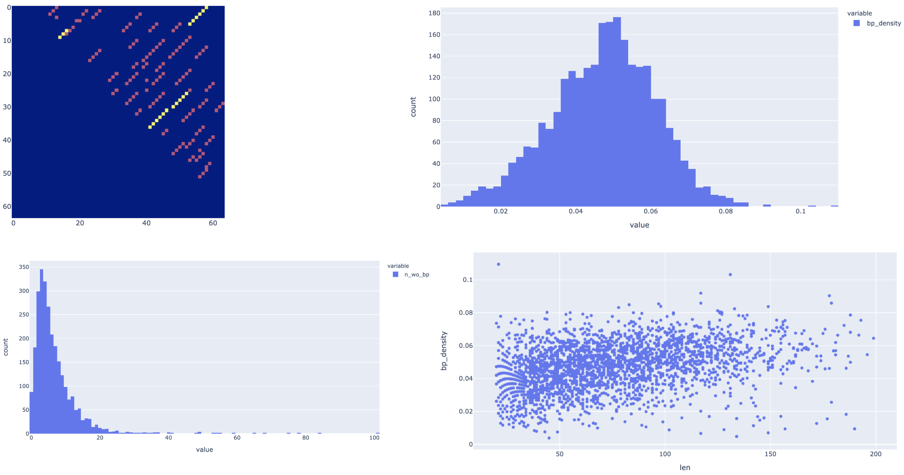
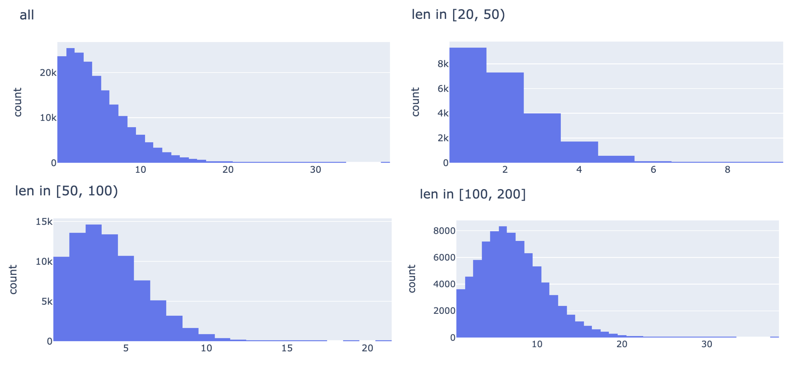

## Summary

### Finished + WIP

- S1 inference: fixed a swapped input argument (threshold for prob_on
and n_proposal got swapped)

- Regenerated dataset for S2 training. See updated dataset statistics (fewer bbs now): `Re-generated dataset S1 pred`.
Doesn't seem to improve the performance. Will try more hyperparameters.

- Generate new dataset with S1 prediction as edge features. See `S1 pred prob_on only with S1 features`.
Improves performance (validation auROC ~0.77). Will try more hyperparameters.

### Ideas to try


- Now that we only care about stems, even when we're relying on S1 predictions and S1 sensitivity is not 100%,
we can still train S2 model: just predict labels for those bp edges that's present (by S1 proposal).
This was possible when we were predicting whether a bb should be included (the previous self-attention NN),
since iloop and hloop bb needs stem bb next to them (so in the case where the stem is missing from S1 prediction,
just including the iloop/hloop bb won't be a valid configuration).
On the hand, any configuration of stems is valid as long as each base pair with no more than one other base,
since iloop/hloop will be implied.

- softmax with new dataset

- other toy problems?

- try real dataset

- super node

## Debug - dataset

From last week:

Some dataset entries have almost identical sequences?

```
df.iloc[1].seq
'CCAGCAACTGCTGGCCTGTGCCAGGGTGCAAGCTGAGCACTGGAGTGGAGTTTTCCTGTGGAGA'
df.iloc[2].seq
'CAGCAACTGCTGGCCTGTGCCAGGGTGCAAGCTGAGCACTGGAGTGGAGTTTTCCTGTGGAGAG'
```


Some consecutive pairs have low edit distance:

```
for i in range(len(df)):
    for j in range(i+1, len(df)):
        distance = levenshtein(df.iloc[i].seq, df.iloc[j].seq)
        if distance <= 10:
            print(i, j, distance)

1 2 2
27 28 2
29 30 6
54 55 6
93 94 8
```


To be further investigated.


## S1 non-conv model

TODO


## Read papers on GNN edge labelling/pruning

### Edge-Labeling Graph Neural Network for Few-shot Learning

###EdgeNets:Edge Varying Graph Neural Networks

### Neural Relational Inference for Interacting Systems


## S2 GNN Per-node softmax


From last week:

- instead of predicting the binary label for each edge,
predict the picked edge for each node

- output mask should be multiplied before taking softmax

- implemented on top of previous step (i.e. with kmer embedding)

- Caveat: we're not taking care of the case where a node has no connection
(target will be `[0, 0, ..., 0]`, will the gradient work in this case?).
Proper solution would be to predict another per-node binary label,
and mask out softmax gradient for those nodes where ground truth is no connection.


debug:

```
python s2_train_gnn_3.py --input_data ../2021_04_20/data/debug_training_len20_200_100_s1_pred_stem_bps.pkl.gz \
--training_proportion 0.95 --learning_rate 0.01 --epochs 1 --batch_size 10 --hid 10 10 --log tmp.log --kmer 3 --embed_dim 20
```


real data:

```
python s2_train_gnn_3.py --input_data ../2021_04_20/data/human_transcriptome_segment_high_mfe_freq_training_len20_200_5000_pred_stem_bps.pkl.gz \
--training_proportion 0.95 --learning_rate 0.001 --epochs 100 --batch_size 10 --hid 20 20 20 20 20 \
 --log result/s2_gnn_run_3_1.log --kmer 3 --embed_dim 50
```

Reporting accuracy:


```
2021-04-21 18:56:32,590 [MainThread  ] [INFO ]  Epoch 99, training, mean loss 0.4069409890287727, mean accuracy 0.3617328405380249
2021-04-21 18:56:34,138 [MainThread  ] [INFO ]  Epoch 99, testing, mean loss 4.129653316636325, mean accuracy 0.36053499579429626
```

increase capacity (also fixed loss scale):

```
python s2_train_gnn_3.py --input_data ../2021_04_20/data/human_transcriptome_segment_high_mfe_freq_training_len20_200_5000_pred_stem_bps.pkl.gz \
--training_proportion 0.95 --learning_rate 0.001 --epochs 100 --batch_size 10 --hid 50 50 50 50 50 \
 --log result/s2_gnn_run_3_2.log --kmer 3 --embed_dim 50
```

Worse?

```
2021-04-21 22:24:26,825 [MainThread  ] [INFO ]  Epoch 99, training, mean loss 4.087395023312089, mean accuracy 0.3486366271972656
2021-04-21 22:24:28,940 [MainThread  ] [INFO ]  Epoch 99, testing, mean loss 4.096872229815862, mean accuracy 0.3481420576572418
```

less hid, more layers, more epochs:


```
python s2_train_gnn_3.py --input_data ../2021_04_20/data/human_transcriptome_segment_high_mfe_freq_training_len20_200_5000_pred_stem_bps.pkl.gz \
--training_proportion 0.95 --learning_rate 0.001 --epochs 300 --batch_size 10 --hid 20 20 20 20 20 20 20 20 20 20 20 20 20 \
 --log result/s2_gnn_run_3_3.log --kmer 3 --embed_dim 50
```

not better?

```
2021-04-22 11:44:10,445 [MainThread  ] [INFO ]  Epoch 299, training, mean loss 4.0800846166159275, mean accuracy 0.3542194962501526
2021-04-22 11:44:13,616 [MainThread  ] [INFO ]  Epoch 299, testing, mean loss 4.09298229883503, mean accuracy 0.3535439372062683
```

more hid:

```
python s2_train_gnn_3.py --input_data ../2021_04_20/data/human_transcriptome_segment_high_mfe_freq_training_len20_200_5000_pred_stem_bps.pkl.gz \
--training_proportion 0.95 --learning_rate 0.001 --epochs 300 --batch_size 10 --hid 50 50 50 50 50 50 50 50 50 50 50 50 50 \
 --log result/s2_gnn_run_3_5.log --kmer 3 --embed_dim 50
```


not improving, killed:

```
2021-04-23 09:18:39,519 [MainThread  ] [INFO ]  Epoch 247, training, mean loss 4.069418679327654, mean accuracy 0.36138656735420227
2021-04-23 09:18:48,268 [MainThread  ] [INFO ]  Epoch 247, testing, mean loss 4.12243588543471, mean accuracy 0.3603347837924957
```


## S2 GNN edge emdedding propagation

- in additon to message passing from/to node, also update edge embedding

- code is a bit hacky since torch-geometric is very node-centric

- implemented on top of kmer embedding (s2_train_gnn_2.py)

debug:

```
python s2_train_gnn_7.py --input_data ../2021_04_20/data/debug_training_len20_200_100_s1_pred_stem_bps.pkl.gz \
--training_proportion 0.95 --learning_rate 0.01 --epochs 1 --batch_size 10 --hid 10 10 --log tmp.log --kmer 3 --embed_dim 20
```

real data:

```
python s2_train_gnn_7.py --input_data ../2021_04_20/data/human_transcriptome_segment_high_mfe_freq_training_len20_200_5000_pred_stem_bps.pkl.gz \
--training_proportion 0.95 --learning_rate 0.001 --epochs 100 --batch_size 10 --hid 20 20 20 20 20 \
 --log result/s2_gnn_run_7_1.log --kmer 3 --embed_dim 50
```

result:

```
2021-04-23 02:10:32,724 [MainThread  ] [INFO ]  Epoch 99, training, mean loss 0.2654233895374473, mean AUC 0.7058786503717474
2021-04-23 02:10:35,798 [MainThread  ] [INFO ]  Epoch 99, testing, mean loss 0.2888682255698316, mean AUC 0.6614296693889244
```

increase capacity, more epochs:

```
python s2_train_gnn_7.py --input_data ../2021_04_20/data/human_transcriptome_segment_high_mfe_freq_training_len20_200_5000_pred_stem_bps.pkl.gz \
--training_proportion 0.95 --learning_rate 0.001 --epochs 300 --batch_size 10 --hid 50 50 50 50 50 50 50 \
 --log result/s2_gnn_run_7_2.log --kmer 3 --embed_dim 50
```

just a bit better?

```
2021-04-23 12:08:02,828 [MainThread  ] [INFO ]  Epoch 57, training, mean loss 0.2675480474029067, mean AUC 0.7024948767062614
2021-04-23 12:08:07,157 [MainThread  ] [INFO ]  Epoch 57, testing, mean loss 0.2774090698228202, mean AUC 0.6810982886434293
...
2021-04-24 02:18:21,968 [MainThread  ] [INFO ]  Epoch 299, training, mean loss 0.2514461593250551, mean AUC 0.7250451571831195
2021-04-24 02:18:26,514 [MainThread  ] [INFO ]  Epoch 299, testing, mean loss 0.2865985522889558, mean AUC 0.674690356001376
```

increase capacity:

```
python s2_train_gnn_7.py --input_data ../2021_04_20/data/human_transcriptome_segment_high_mfe_freq_training_len20_200_5000_pred_stem_bps.pkl.gz \
--training_proportion 0.95 --learning_rate 0.001 --epochs 100 --batch_size 10 --hid 50 50 50 50 50 50 50 50 50 50  \
 --log result/s2_gnn_run_7_3.log --kmer 3 --embed_dim 50
```

hard to train?

```
2021-04-24 15:16:59,993 [MainThread  ] [INFO ]  Epoch 99, training, mean loss 0.26334368375807826, mean AUC 0.7091461235427682
2021-04-24 15:17:05,831 [MainThread  ] [INFO ]  Epoch 99, testing, mean loss 0.2754515443184522, mean AUC 0.6679091314705228
```


- implement edge embedding update to be invariant to the order the two nodes

- simple sum for now

- final prediction using edge feature only

- based on s2_train_gnn_7.py

debug:

```
python s2_train_gnn_8.py --input_data ../2021_04_20/data/debug_training_len20_200_100_s1_pred_stem_bps.pkl.gz \
--training_proportion 0.95 --learning_rate 0.01 --epochs 1 --batch_size 10 --hid 10 10 --log tmp.log --kmer 3 --embed_dim 20
```

real data (limit to 4 cpus):

```
taskset --cpu-list 1,2,3,4 python s2_train_gnn_8.py --input_data ../2021_04_20/data/human_transcriptome_segment_high_mfe_freq_training_len20_200_5000_pred_stem_bps.pkl.gz \
--training_proportion 0.95 --learning_rate 0.001 --epochs 100 --batch_size 10 --hid 20 20 20 20 20 \
 --log result/s2_gnn_run_8_1.log --kmer 3 --embed_dim 50
```

worse than before the update? (both training & validation)

```
2021-04-24 18:38:46,281 [MainThread  ] [INFO ]  Epoch 99, training, mean loss 0.28246543265482377, mean AUC 0.6138910077351167
2021-04-24 18:38:47,504 [MainThread  ] [INFO ]  Epoch 99, testing, mean loss 0.2933745011271045, mean AUC 0.5908308700931046
```

try increasing capacity:

```
taskset --cpu-list 1,2,3,4 python s2_train_gnn_8.py --input_data ../2021_04_20/data/human_transcriptome_segment_high_mfe_freq_training_len20_200_5000_pred_stem_bps.pkl.gz \
--training_proportion 0.95 --learning_rate 0.001 --epochs 100 --batch_size 10 --hid 50 50 50 50 50 50 \
 --log result/s2_gnn_run_8_2.log --kmer 3 --embed_dim 50
```

just a little bit better (still worse than before update):

```
2021-04-25 00:48:27,940 [MainThread  ] [INFO ]  Epoch 99, training, mean loss 0.27966785497037616, mean AUC 0.632661739916439
2021-04-25 00:48:30,706 [MainThread  ] [INFO ]  Epoch 99, testing, mean loss 0.2855208409148888, mean AUC 0.6010982839204979
```

keep increasing capacity:


```
taskset --cpu-list 1,2,3,4 python s2_train_gnn_8.py --input_data ../2021_04_20/data/human_transcriptome_segment_high_mfe_freq_training_len20_200_5000_pred_stem_bps.pkl.gz \
--training_proportion 0.95 --learning_rate 0.001 --epochs 100 --batch_size 10 --hid 20 20 50 50 100 100 \
 --log result/s2_gnn_run_8_3.log --kmer 3 --embed_dim 50
```

similar:

```
2021-04-25 11:39:41,615 [MainThread  ] [INFO ]  Epoch 99, training, mean loss 0.28366550269740576, mean AUC 0.6228195107485749
2021-04-25 11:39:44,091 [MainThread  ] [INFO ]  Epoch 99, testing, mean loss 0.30203319245210575, mean AUC 0.6144182726527286
```


## S2 GNN simple message update with edge feature

- simplify GATEconv

- based on s2_train_gnn_2.py

debug:

```
python s2_train_gnn_9.py --input_data ../2021_04_20/data/debug_training_len20_200_100_s1_pred_stem_bps.pkl.gz \
--training_proportion 0.95 --learning_rate 0.01 --epochs 1 --batch_size 10 --hid 10 10 --log tmp.log --kmer 3 --embed_dim 20
```

real data:

```
taskset --cpu-list 5,6,7,8 python s2_train_gnn_9.py --input_data ../2021_04_20/data/human_transcriptome_segment_high_mfe_freq_training_len20_200_5000_pred_stem_bps.pkl.gz \
--training_proportion 0.95 --learning_rate 0.001 --epochs 100 --batch_size 10 --hid 20 20 20 20 \
 --log result/s2_gnn_run_9_1.log --kmer 3 --embed_dim 50
```

Worse than the one with attention?

```
2021-04-25 01:16:33,568 [MainThread  ] [INFO ]  Epoch 99, training, mean loss 0.2577127876013694, mean AUC 0.6684263270964065
2021-04-25 01:16:35,129 [MainThread  ] [INFO ]  Epoch 99, testing, mean loss 0.3315555193570739, mean AUC 0.6302760780168382
```

increase capacity:


```
taskset --cpu-list 5,6,7,8 python s2_train_gnn_9.py --input_data ../2021_04_20/data/human_transcriptome_segment_high_mfe_freq_training_len20_200_5000_pred_stem_bps.pkl.gz \
--training_proportion 0.95 --learning_rate 0.001 --epochs 100 --batch_size 10 --hid 50 50 50 50 50 50 \
 --log result/s2_gnn_run_9_2.log --kmer 3 --embed_dim 50
```

not training?

```
2021-04-25 14:40:40,081 [MainThread  ] [INFO ]  Epoch 99, training, mean loss 0.2781434572307316, mean AUC 0.5763223610222877
2021-04-25 14:40:43,298 [MainThread  ] [INFO ]  Epoch 99, testing, mean loss 0.3150100047445164, mean AUC 0.5579085950089016
```


## S1 pred prob_on only with S1 features

### Data

- to reduce number of proposals, only use inference by thresholding on prob_on

- modified script such that if threshold is not set, that inference method is being ignored

- NOTE previous inference seems to have swapped threshold_on and threshold_n_proposal when calling main() O_O!!

- added options to genenrated features using s1 pred


debug:

```
python s1_pred_stem_processing.py --data ../2021_03_23/data/debug_training_len20_200_100.pkl.gz \
--threshold_p 0.1 --model ../2021_03_23/s1_training/result/run_7/model_ckpt_ep_17.pth \
--out_file data/debug_only_prob_on.pkl.gz --features
```

Large dataset:

```
taskset --cpu-list 21,22,23,24 python s1_pred_stem_processing.py --data ../2021_03_23/data/human_transcriptome_segment_high_mfe_freq_training_len20_200_5000.pkl.gz \
--threshold_p 0.1 --model ../2021_03_23/s1_training/result/run_7/model_ckpt_ep_17.pth \
--out_file data/human_transcriptome_segment_high_mfe_freq_training_len20_200_5000_pred_stem_bps_only_prob_on.pkl.gz \
--features
```

running


Dataset statistics:





- bp density 2.5% (0.025 /(6/16) = 6.7% if only consider valid bps)

- much fewer connections per node, 1-2 on average

## training

- add edge feature: n_bb_sm, n_bb_sl, med_p_on_sm, med_p_other_sm, med_p_on_sl, med_p_other_sl

- backbond edges will have all 0 features

- based on s2_train_gnn_2.py

debug:

```
python s2_train_gnn_10.py --input_data data/debug_only_prob_on.pkl.gz \
--training_proportion 0.95 --learning_rate 0.01 --epochs 1 \
--batch_size 10 --hid 10 10 --log tmp.log --kmer 3 --embed_dim 20
```

real data:

```
taskset --cpu-list 5,6,7,8 python s2_train_gnn_10.py --input_data data/human_transcriptome_segment_high_mfe_freq_training_len20_200_5000_pred_stem_bps_only_prob_on.pkl.gz \
--training_proportion 0.95 --learning_rate 0.001 --epochs 100 --batch_size 10 --hid 20 20 20 20 20 \
 --log result/s2_gnn_run_10_1.log --kmer 3 --embed_dim 50
```


```
2021-04-26 00:06:39,196 [MainThread  ] [INFO ]  Epoch 99, training, mean loss 0.4223538310904252, mean AUC 0.792593912580884
2021-04-26 00:06:40,907 [MainThread  ] [INFO ]  Epoch 99, testing, mean loss 0.48912978976374805, mean AUC 0.7484517071711267
```


increase capacity, more epochs:


```
taskset --cpu-list 1,2,3,4 python s2_train_gnn_10.py --input_data data/human_transcriptome_segment_high_mfe_freq_training_len20_200_5000_pred_stem_bps_only_prob_on.pkl.gz \
--training_proportion 0.95 --learning_rate 0.001 --epochs 200 --batch_size 10 --hid 50 50 50 100 100 100 \
 --log result/s2_gnn_run_10_2.log --kmer 3 --embed_dim 50
```

```
2021-04-26 05:36:56,016 [MainThread  ] [INFO ]  Epoch 199, training, mean loss 0.35858662638225053, mean AUC 0.833590398739407
2021-04-26 05:36:59,147 [MainThread  ] [INFO ]  Epoch 199, testing, mean loss 1.0612060781383867, mean AUC 0.7509325688816187
```

fewer hid dim, more layers:

```
taskset --cpu-list 5,6,7,8 python s2_train_gnn_10.py --input_data data/human_transcriptome_segment_high_mfe_freq_training_len20_200_5000_pred_stem_bps_only_prob_on.pkl.gz \
--training_proportion 0.95 --learning_rate 0.001 --epochs 100 --batch_size 10 --hid 20 20 20 20 20 50 50 50 50 50 \
 --log result/s2_gnn_run_10_3.log --kmer 3 --embed_dim 50
```

not better? too few hid?

```
2021-04-26 11:30:58,358 [MainThread  ] [INFO ]  Epoch 98, training, mean loss 0.3993701803841089, mean AUC 0.8076114866563684
2021-04-26 11:31:03,924 [MainThread  ] [INFO ]  Epoch 98, testing, mean loss 0.5133302681480009, mean AUC 0.7443100519018624
1904it [03:37,  8.74it/s]
2021-04-26 11:34:41,803 [MainThread  ] [INFO ]  Epoch 99, training, mean loss 0.3966070695142997, mean AUC 0.8091392796804088
2021-04-26 11:34:45,497 [MainThread  ] [INFO ]  Epoch 99, testing, mean loss 0.5205580007174228, mean AUC 0.7385360713947043
```

more hid dim, more layers, more epochs:

```
taskset --cpu-list 1,2,3,4 python s2_train_gnn_10.py --input_data data/human_transcriptome_segment_high_mfe_freq_training_len20_200_5000_pred_stem_bps_only_prob_on.pkl.gz \
--training_proportion 0.95 --learning_rate 0.001 --epochs 200 --batch_size 10 --hid 20 20 20 20 20 50 50 50 50 50 100 100 \
 --log result/s2_gnn_run_10_4.log --kmer 3 --embed_dim 50
```

a little bit better?

```
2021-04-26 19:16:55,852 [MainThread  ] [INFO ]  Epoch 196, training, mean loss 0.3800988471037463, mean AUC 0.8165906603195353
2021-04-26 19:16:59,648 [MainThread  ] [INFO ]  Epoch 196, testing, mean loss 0.5141868271216435, mean AUC 0.7735673611375103
1904it [02:26, 12.96it/s]
2021-04-26 19:19:26,613 [MainThread  ] [INFO ]  Epoch 197, training, mean loss 0.37652536905125567, mean AUC 0.8174127248735553
2021-04-26 19:19:30,313 [MainThread  ] [INFO ]  Epoch 197, testing, mean loss 0.5024306403769478, mean AUC 0.7667929903586915
1904it [02:30, 12.65it/s]
2021-04-26 19:22:00,888 [MainThread  ] [INFO ]  Epoch 198, training, mean loss 0.376108884183984, mean AUC 0.8174849130077365
2021-04-26 19:22:04,565 [MainThread  ] [INFO ]  Epoch 198, testing, mean loss 0.5125255980728716, mean AUC 0.7692825518051348
1904it [02:27, 12.87it/s]
2021-04-26 19:24:32,459 [MainThread  ] [INFO ]  Epoch 199, training, mean loss 0.3771052502487835, mean AUC 0.817049923343341
2021-04-26 19:24:36,226 [MainThread  ] [INFO ]  Epoch 199, testing, mean loss 0.5097983856585866, mean AUC 0.7682182368529487
```


even more layers:

```
taskset --cpu-list 5,6,7,8 python s2_train_gnn_10.py --input_data data/human_transcriptome_segment_high_mfe_freq_training_len20_200_5000_pred_stem_bps_only_prob_on.pkl.gz \
--training_proportion 0.95 --learning_rate 0.001 --epochs 200 --batch_size 10 --hid 20 20 20 20 20 50 50 50 50 50 100 100 100 100 \
 --log result/s2_gnn_run_10_5.log --kmer 3 --embed_dim 50
```

running

## Re-generated dataset S1 pred

### Data

- fix swapped threshold_on and threshold_n_proposal

debug:

```
python s1_pred_stem_processing.py --data ../2021_03_23/data/debug_training_len20_200_100.pkl.gz \
--threshold_p 0.1 --threshold_n 0.5 --model ../2021_03_23/s1_training/result/run_7/model_ckpt_ep_17.pth \
--out_file data/debug.pkl.gz
```


real data:

```
python s1_pred_stem_processing.py --data ../2021_03_23/data/human_transcriptome_segment_high_mfe_freq_training_len20_200_5000.pkl.gz \
--threshold_p 0.1 --threshold_n 0.5 --model ../2021_03_23/s1_training/result/run_7/model_ckpt_ep_17.pth \
--out_file data/human_transcriptome_segment_high_mfe_freq_training_len20_200_5000_pred_stem_bps.pkl.gz
```


Dataset statistics:





- after fixing the parameter swapping, we have fewer bbs than before

- bp density dropped to ~5% (from 11%) (if we normalize by the expected number of valid bps, this is about 0.05/(6/16) = 13%)

- more nodes with no hydrogen bond candidate connnection

- fewer edges connected to each node: 4-5 on average


### Training

```
taskset --cpu-list 1,2,3,4 python s2_train_gnn_2.py --input_data data/human_transcriptome_segment_high_mfe_freq_training_len20_200_5000_pred_stem_bps.pkl.gz \
--training_proportion 0.95 --learning_rate 0.001 --epochs 100 --batch_size 10 --hid 20 20 20 20 20 \
 --log result/s2_gnn_run_2_new_data_1.log --kmer 3 --embed_dim 50
```

worse than before?

```
2021-04-25 22:30:15,804 [MainThread  ] [INFO ]  Epoch 99, training, mean loss 0.3881137306873615, mean AUC 0.6649199043971883
2021-04-25 22:30:17,467 [MainThread  ] [INFO ]  Epoch 99, testing, mean loss 0.4203000130212825, mean AUC 0.628060039868836
```

increase capacity? todo


### TODOs


not working?

<!--- (done) cut down num connections, only use n_prob proposals? (1/2-2/3?)-->

<!--- (not doing this) use s1 pred (sanity check?), missing bb -> set p = 0.5?  (NN will learn to always pick 0.5?)-->


- s2 dataset: only predict the target that's in proposal (makes it possible to fine-tune on real dataset)

- also use edge features in final prediction

<!--- (done) modified GATEconv to make it simple (just node + edge feature)-->


- MessagePassing(aggr="add", flow="source_to_target", node_dim=-2):
... the node_dim attribute indicates along which axis to propagate.

- Note that propagate() is not limited to exchange messages in symmetric adjacency matrices
of shape [N, N] only, but can also exchange messages in general sparse assignment matrices,
.e.g., bipartite graphs, of shape [N, M]

- modify graph attention to incoporate edge feature?


<!--- (done) lmit num cpu-->

<!--- (done) update edge embed NN to be invariant (sum?)-->

<!--- (done) make it easier problem: (1) shorter seq, (2) fewer proposals?-->


<!--- (done) re-try softmax: update eval metric to accuracy (not global auc)-->

<!--- (done, worse)update GATEconv -> simpler, just use edge feature-->

- super node?

<!--- (not doing this) backbone edge directed?-->

- debug dataset, inspect a few examples, make sure it make sense

<!--- (done) plot, distribution of: num_edges per node, v,s, len?-->

<!--- (done) incoportate s1 prediction as edge features-->


- simple inner product


- other toy tasks?


- node level prediction: whether each base is paired


