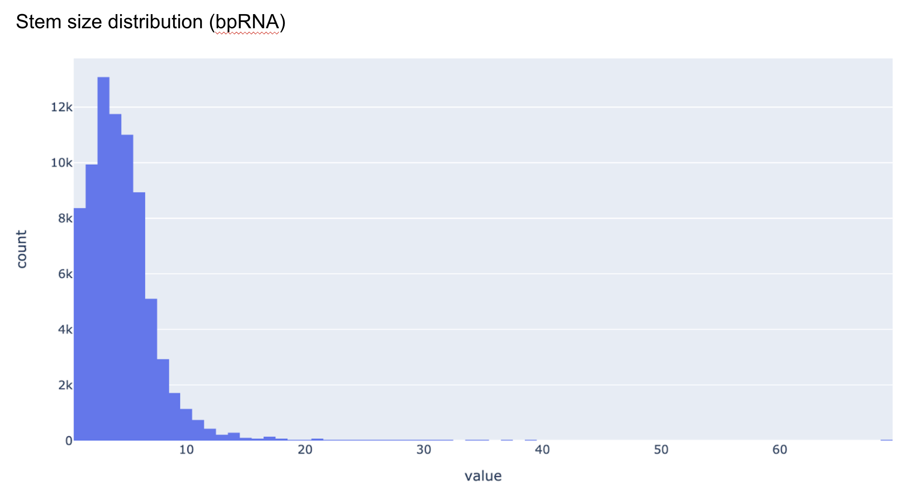
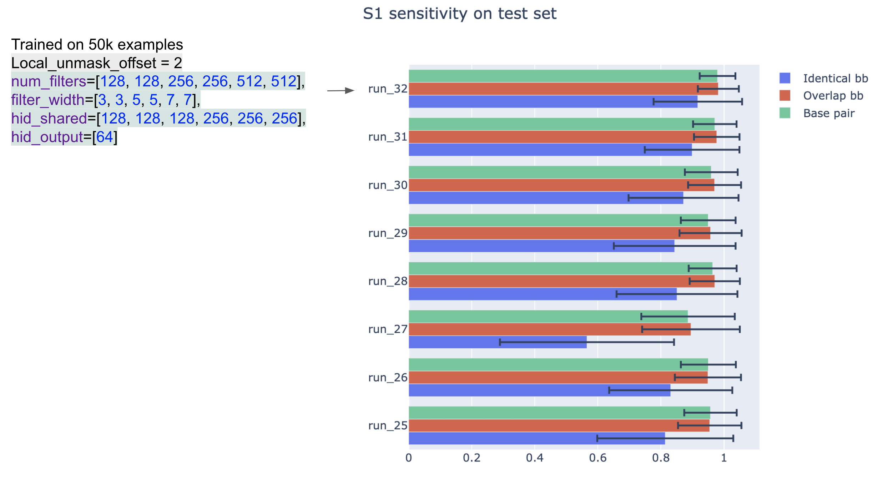

## S1 dataset

- try to improve stem bb sensitivity

- since we're only dealing with stem bb now

- not only predicting stem bb in MFE struct (since we still have potential FN
even when we mask most of the 'background')

- no need to limit MFE struct freq when generating data?

- for each sequence, we'll sample a couple structures using RNAfold (unique?),
and 'merge' their stem bbs

- challenge: stem bbs from different structures might be
in conflict with each other


- test dataset: no merge, since we'll be evaluating s1 bb sensitivity


### first pass: generate multiple examples from the same sequence

- and hope for the best that model will pick up the commenality

- shorter seq (since the longest stem sizes are typically smaller than iloop and hloop)



- also reduce unmasked region size?


debug:


```
cd s1_data_gen/
python generate_human_transcriptome_segment_high_mfe_freq_multi_struct.py \
--len 40 --num_data 100 --num_sample 10 --chromosomes chr1 --out ../data/s1_train_debug.pkl.gz
```


data 20000:

```
cd s1_data_gen/
taskset --cpu-list 1,2,3,4 python generate_human_transcriptome_segment_high_mfe_freq_multi_struct.py \
--len 40 --num_data 20000 --num_sample 10 \
--chromosomes chr2 chr3 chr4 chr5 chr6 chr7 chr8 chr9 chr10 chr11 chr12 chr13 chr14 chr15 chr16 chr17 chr18 chr19 chr20 chr21 \
--out ../data/s1_train_multi_structs_len40_20000.pkl.gz
```


training:

- FC?

- smaller unmask offset


```
cd s1_training/
CUDA_VISIBLE_DEVICES=2 taskset --cpu-list 1,2,3,4 python train_conv_pixel_stem_bb.py \
--data ../data/s1_train_multi_structs_len40_20000.pkl.gz \
--result result/run_25 --num_filters 128 128 --filter_width 9 9 \
--hid_shared 50 50 50 --hid_output 20 --lr 0.0005 \
--epoch 50 --mask 0 --local_unmask_offset 4 --batch_size 10 --max_length 200 --cpu 4
```

0.94/0.93 auc?


- increase capacity of FC layers, more epochs

```
cd s1_training/
CUDA_VISIBLE_DEVICES=2 taskset --cpu-list 1,2,3,4 python train_conv_pixel_stem_bb.py \
--data ../data/s1_train_multi_structs_len40_20000.pkl.gz \
--result result/run_26 --num_filters 128 128 --filter_width 9 9 \
--hid_shared 64 64 64 64 64 --hid_output 20 --lr 0.0005 \
--epoch 200 --mask 0 --local_unmask_offset 4 --batch_size 10 --max_length 200 --cpu 4
```


- increase capacity of FC layers

```
cd s1_training/
CUDA_VISIBLE_DEVICES=2 taskset --cpu-list 1,2,3,4 python train_conv_pixel_stem_bb.py \
--data ../data/s1_train_multi_structs_len40_20000.pkl.gz \
--result result/run_26 --num_filters 128 128 --filter_width 9 9 \
--hid_shared 64 64 64 128 128 128 --hid_output 20 --lr 0.0005 \
--epoch 200 --mask 0 --local_unmask_offset 4 --batch_size 10 --max_length 200 --cpu 4
```

- increase LR

```
cd s1_training/
CUDA_VISIBLE_DEVICES=2 taskset --cpu-list 1,2,3,4 python train_conv_pixel_stem_bb.py \
--data ../data/s1_train_multi_structs_len40_20000.pkl.gz \
--result result/run_26 --num_filters 128 128 --filter_width 9 9 \
--hid_shared 64 64 64 128 128 128 --hid_output 20 --lr 0.001 \
--epoch 200 --mask 0 --local_unmask_offset 4 --batch_size 10 --max_length 200 --cpu 4
```


- update code to save model every 10th epochs

- FC architecture (i.e. only 1 layer of 2D conv, followed by 1x1 convs)

- reduce unmask offset, increase LR, more epochs


```
cd s1_training/
CUDA_VISIBLE_DEVICES=2 taskset --cpu-list 1,2,3,4 python train_conv_pixel_stem_bb.py \
--data ../data/s1_train_multi_structs_len40_20000.pkl.gz \
--result result/run_27 --num_filters 512 --filter_width 21 \
--hid_shared 64 64 64 128 128 128 --hid_output 32 --lr 0.005 \
--epoch 400 --mask 0 --local_unmask_offset 2 --batch_size 10 --max_length 200 --cpu 4
```


- hard to train? back to prev architecture (run_26), but keep the small unmask offset


```
cd s1_training/
CUDA_VISIBLE_DEVICES=2 taskset --cpu-list 1,2,3,4 python train_conv_pixel_stem_bb.py \
--data ../data/s1_train_multi_structs_len40_20000.pkl.gz \
--result result/run_28 --num_filters 128 128 --filter_width 9 9 \
--hid_shared 64 64 64 128 128 128 --hid_output 20 --lr 0.001 \
--epoch 200 --mask 0 --local_unmask_offset 2 --batch_size 10 --max_length 200 --cpu 4
```


- one more conv layer


```
cd s1_training/
CUDA_VISIBLE_DEVICES=2 taskset --cpu-list 1,2,3,4 python train_conv_pixel_stem_bb.py \
--data ../data/s1_train_multi_structs_len40_20000.pkl.gz \
--result result/run_29 --num_filters 128 128 128 --filter_width 9 9 9 \
--hid_shared 64 64 64 128 128 128 --hid_output 20 --lr 0.001 \
--epoch 200 --mask 0 --local_unmask_offset 2 --batch_size 10 --max_length 200 --cpu 4
```


- does 2d conv help? smaller filters more layers


```
cd s1_training/
CUDA_VISIBLE_DEVICES=1 taskset --cpu-list 7,8,9,10 python train_conv_pixel_stem_bb.py \
--data ../data/s1_train_multi_structs_len40_20000.pkl.gz \
--result result/run_30 --num_filters 64 64 128 128 128 --filter_width 5 5 5 5 5 \
--hid_shared 64 64 64 128 128 128 --hid_output 20 --lr 0.001 \
--epoch 200 --mask 0 --local_unmask_offset 2 --batch_size 10 --max_length 200 --cpu 4
```


- even smaller...

```
cd s1_training/
CUDA_VISIBLE_DEVICES=1 taskset --cpu-list 7,8,9,10 python train_conv_pixel_stem_bb.py \
--data ../data/s1_train_multi_structs_len40_20000.pkl.gz \
--result result/run_31 --num_filters 64 64 128 128 256 256 --filter_width 3 3 5 5 7 7 \
--hid_shared 64 64 64 128 128 128 --hid_output 20 --lr 0.001 \
--epoch 200 --mask 0 --local_unmask_offset 2 --batch_size 10 --max_length 200 --cpu 4
```


data 50000:

- larger dataset for s1 (no MFE freq cutoff so we can defintely generate more examples)

```
cd s1_data_gen/
taskset --cpu-list 1,2,3,4 python generate_human_transcriptome_segment_high_mfe_freq_multi_struct.py \
--len 40 --num_data 50000 --num_sample 10 \
--chromosomes chr2 chr3 chr4 chr5 chr6 chr7 chr8 chr9 chr10 chr11 chr12 chr13 chr14 chr15 chr16 chr17 chr18 chr19 chr20 chr21 \
--out ../data/s1_train_multi_structs_len40_50000.pkl.gz
```


- train on data 50000:


```
cd s1_training/
CUDA_VISIBLE_DEVICES=2 taskset --cpu-list 1,2,3,4 python train_conv_pixel_stem_bb.py \
--data ../data/s1_train_multi_structs_len40_50000.pkl.gz \
--result result/run_32 --num_filters 128 128 256 256 512 512 --filter_width 3 3 5 5 7 7 \
--hid_shared 128 128 128 256 256 256 --hid_output 64 --lr 0.001 \
--epoch 200 --mask 0 --local_unmask_offset 2 --batch_size 10 --max_length 200 --cpu 4
```


### Evaluation


- test set: 1000 examples, MFE struct only, variable length seq

- to mimic the actual scenario of the end-to-end model

- use S2 data gen script

env `rna_ss_py3`

```
cd s2_data_gen
taskset --cpu-list 21,22,23,24 python generate_human_transcriptome_segment_high_mfe_freq_var_len.py \
--len_min 20 --len_max 200 --num_seq 1000 --threshold_mfe_freq 0.02 \
--chromosomes chr2 chr3 chr4 chr5 chr6 chr7 chr8 chr9 chr10 chr11 chr12 chr13 chr14 chr15 chr16 chr17 chr18 chr19 chr20 chr21 \
--out ../data/human_transcriptome_segment_high_mfe_freq_training_len20_200_1000.pkl.gz
```


- inference update (stem only)

- filter invalid, out of bound bbs

debug

```
python run_s1_inference.py --data data/s1_train_debug.pkl.gz --threshold 0.1 \
--out data/debug_metric.csv
```


on test dataset (MFE struct only, longer seqs) `../2021_05_18/data/human_transcriptome_segment_high_mfe_freq_training_len20_200_1000.pkl.gz`:

```
taskset --cpu-list 21,22,23,24 python run_s1_inference.py --data ../2021_05_18/data/human_transcriptome_segment_high_mfe_freq_training_len20_200_1000.pkl.gz \
 --threshold 0.1 --out data/s1_eval_metric_1.csv
```


See result on exisitng models: [data/s1_eval_metric_1.csv](data/s1_eval_metric_1.csv)





Configurations that seem to help with 'generalization' (since test task is not exactly the same training) performance:

- more data points

- multi struct per input, with smaller unmask offset
(although it's hard to do a fair comparison, since in theory the p_on probability used in inference need to change)

- more conv layers, as opposed to shallow or single FC layer.
maybe there are certain low-level features that are translational invariant?


## S2 dataset

- use the 'best model so far' (picked on generalization test set) S1 model

```
taskset --cpu-list 21,22,23,24 python s1_pred_stem_processing.py --data ../2021_03_23/data/human_transcriptome_segment_high_mfe_freq_training_len20_200_5000.pkl.gz \
--threshold_p 0.1 --model ../2021_05_18/s1_training/result/run_32/model_ckpt_ep_79.pth \
--out_file data/s2_train_len20_200_5000_pred_stem.pkl.gz \
--features  --include_all
```

running


- TODO dataset statisics (also check S1 n proposal, connection density) tradeoff?

- TODO s2 training

- TODO s2 eval

- TODO end-to-end eval


- TODO s1 larger dataset, add in res connection, batch norm, etc.

