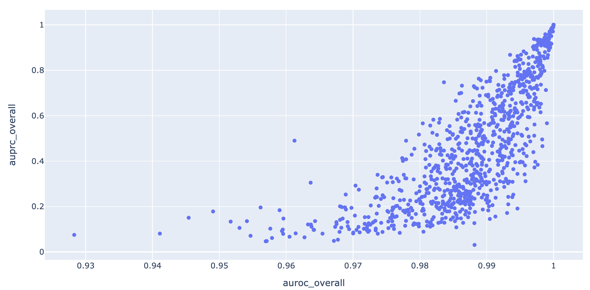
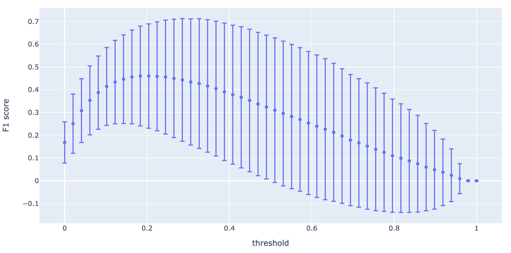
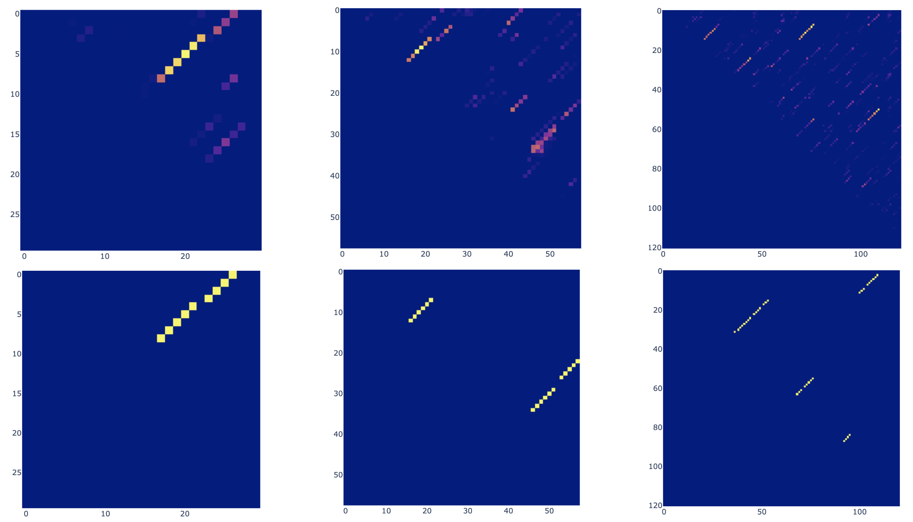
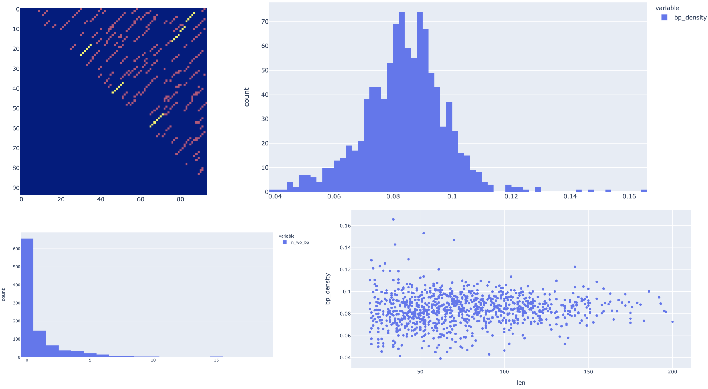
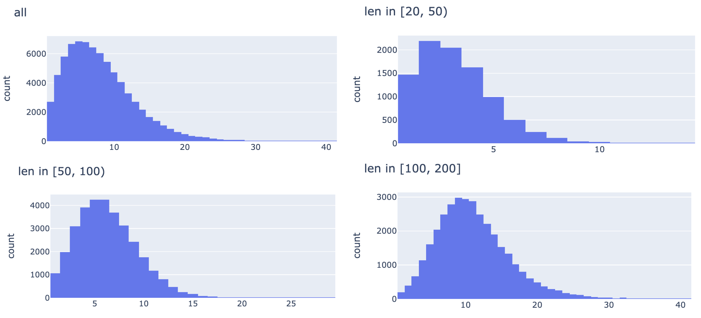

Last week:

- updated s1 model to only predict stem bbs

- updated S1 dataset to have multiple structures per sequence,
to better capture all 'plausible' stem bbs

- trained a couple of S1 models with different hyperparameters

- best model so far: `../2021_05_18/s1_training/result/run_32/model_ckpt_ep_79.pth`,
picked

- s2 model: generated dataset 5k & 20k, run s1 inference, started S2 model training


## S2 model

- from last week (ran from 2021_05_18):

```
taskset --cpu-list 21,22,23,24 python s2_train_gnn_10.py --input_data ../2021_05_18/data/s2_train_len20_200_5000_pred_stem.pkl.gz \
--training_proportion 0.95 --learning_rate 0.002 --epochs 100 --batch_size 10 --hid 20 20 40 40 40 40 40 50 50 50 50 50 50 50 100 100 100 100 100 \
 --log result/s2_gnn_run_20.log --kmer 3 --embed_dim 50
```


done:

```
2021-05-19 15:29:41,175 [MainThread  ] [INFO ]  Epoch 99, training, mean loss 0.19616395260158337, mean AUC 0.8493221776461274
2021-05-19 15:30:08,489 [MainThread  ] [INFO ]  Epoch 99, testing, mean loss 0.22929173196852207, mean AUC 0.823974386476366
2021-05-19 15:30:08,569 [MainThread  ] [INFO ]  Model checkpoint saved at: result/s2_gnn_run_20.model_ckpt_ep_99.pth
```

TODO evaluate (note model saved in 2021_05_18)

- train on dataset 20000

```
taskset --cpu-list 21,22,23,24 python s2_train_gnn_10.py --input_data ../2021_05_18/data/s2_train_len20_200_20000_pred_stem.pkl.gz \
--training_proportion 0.95 --learning_rate 0.002 --epochs 100 --batch_size 10 --hid 20 20 40 40 40 40 40 50 50 50 50 50 50 50 100 100 100 100 100 \
 --log result/s2_gnn_run_21.log --kmer 3 --embed_dim 50
```

converging, killed:

```
2021-05-24 04:18:33,977 [MainThread  ] [INFO ]  Epoch 59, training, mean loss 0.19933206619792862, mean AUC 0.8562251076428037
2021-05-24 04:20:35,410 [MainThread  ] [INFO ]  Epoch 59, testing, mean loss 0.20370890066213906, mean AUC 0.8485104911934849
2021-05-24 04:20:35,489 [MainThread  ] [INFO ]  Model checkpoint saved at: result/s2_gnn_run_21.model_ckpt_ep_59.pth
19000it [1:20:33,  3.93it/s]
2021-05-24 05:41:08,704 [MainThread  ] [INFO ]  Epoch 60, training, mean loss 0.20045924536491697, mean AUC 0.8550921072895757
2021-05-24 05:43:08,448 [MainThread  ] [INFO ]  Epoch 60, testing, mean loss 0.20395975487772375, mean AUC 0.850140074835163
19000it [1:21:05,  3.91it/s]
2021-05-24 07:04:13,563 [MainThread  ] [INFO ]  Epoch 61, training, mean loss 0.19894003595568632, mean AUC 0.8560722224193609
2021-05-24 07:06:05,330 [MainThread  ] [INFO ]  Epoch 61, testing, mean loss 0.20389578810893, mean AUC 0.8490768413815991
19000it [1:20:47,  3.92it/s]
2021-05-24 08:26:53,268 [MainThread  ] [INFO ]  Epoch 62, training, mean loss 0.198684681583392, mean AUC 0.8564012520885252
2021-05-24 08:28:54,101 [MainThread  ] [INFO ]  Epoch 62, testing, mean loss 0.20325134566333145, mean AUC 0.8486555489933459
19000it [1:21:03,  3.91it/s]
2021-05-24 09:49:57,412 [MainThread  ] [INFO ]  Epoch 63, training, mean loss 0.19946232989822563, mean AUC 0.856105875084904
2021-05-24 09:51:58,751 [MainThread  ] [INFO ]  Epoch 63, testing, mean loss 0.20568562783114613, mean AUC 0.8494987699596593
19000it [1:20:52,  3.92it/s]
2021-05-24 11:12:51,371 [MainThread  ] [INFO ]  Epoch 64, training, mean loss 0.19977944682695364, mean AUC 0.8555558332512828
2021-05-24 11:14:52,121 [MainThread  ] [INFO ]  Epoch 64, testing, mean loss 0.20641932594124227, mean AUC 0.8476127695473283
```

- increase capacity:


```
taskset --cpu-list 11,12,13,14 python s2_train_gnn_10.py --input_data ../2021_05_18/data/s2_train_len20_200_20000_pred_stem.pkl.gz \
--training_proportion 0.95 --learning_rate 0.002 --epochs 100 --batch_size 10 --hid 32 32 32 64 64 64 64 128 128 128 128 256 256 256 256 512 512 512 512 \
 --log result/s2_gnn_run_22.log --kmer 5 --embed_dim 512
```

diverged, killed:


```
2021-05-23 17:51:27,044 [MainThread  ] [INFO ]  Epoch 5, training, mean loss 0.21470135487223926, mean AUC 0.8294947660891208
2021-05-23 17:59:00,882 [MainThread  ] [INFO ]  Epoch 5, testing, mean loss 0.21589280089363455, mean AUC 0.8252016727356928
19000it [5:09:36,  1.02it/s]
2021-05-23 23:08:37,229 [MainThread  ] [INFO ]  Epoch 6, training, mean loss 0.21346428236679027, mean AUC 0.8318990121641899
2021-05-23 23:16:10,714 [MainThread  ] [INFO ]  Epoch 6, testing, mean loss 0.2297008763551712, mean AUC 0.8224835688014699
19000it [5:09:50,  1.02it/s]
2021-05-24 04:26:01,647 [MainThread  ] [INFO ]  Epoch 7, training, mean loss 6.600521000411949, mean AUC 0.5972971423715593
2021-05-24 04:33:33,846 [MainThread  ] [INFO ]  Epoch 7, testing, mean loss 9.031825340390206, mean AUC 0.5
19000it [5:10:26,  1.02it/s]
2021-05-24 09:44:00,007 [MainThread  ] [INFO ]  Epoch 8, training, mean loss 9.290388475217318, mean AUC 0.5
2021-05-24 09:51:37,428 [MainThread  ] [INFO ]  Epoch 8, testing, mean loss 9.031825340390206, mean AUC 0.5
```


- test set 1000

```
cd s2_data_gen
taskset --cpu-list 11,12,13,14 python generate_human_transcriptome_segment_high_mfe_freq_var_len.py \
--len_min 20 --len_max 200 --num_seq 1000 --threshold_mfe_freq 0.02 \
--chromosomes chr1 \
--out ../data/human_transcriptome_segment_high_mfe_freq_test_len20_200_1000.pkl.gz
```


```
taskset --cpu-list 11,12,13,14 python s1_pred_stem_processing.py --data ../2021_05_25/data/human_transcriptome_segment_high_mfe_freq_test_len20_200_1000.pkl.gz \
--threshold_p 0.1 --model ../2021_05_18/s1_training/result/run_32/model_ckpt_ep_79.pth \
--out_file data/s2_test_len20_200_1000_pred_stem.pkl.gz \
--features  --include_all
```

done: `2021_05_25/data/s2_test_len20_200_1000_pred_stem.pkl.gz`


Performance:




Similar to [previous result](https://github.com/PSI-Lab/alice-sandbox/tree/0b348a6a82db14222146776b5d8f6f477f18b522/meetings/2021_05_04#training-1)
(but with more datapoints)?

F1 scores:



Does the actual prediction make sense? (selected examples with various lengths)



Generated by [tmp_s2_pred.ipynb](tmp_s2_pred.ipynb)


### Dataset statistics





Generated by [dataset_statistics.ipynb](dataset_statistics.ipynb)

Compared with [previous dataset statistics](https://github.com/PSI-Lab/alice-sandbox/tree/da4e50adee41549d3559dddcfcd5263e2d9da077/meetings/2021_04_27#data),
<!--Compared with [previous dataset statistics](https://github.com/PSI-Lab/alice-sandbox/tree/da4e50adee41549d3559dddcfcd5263e2d9da077/meetings/2021_04_27#data-1),-->
we observe a significant increase in connectivity density, which could make S2 task more difficult.
We might need to adjust the p_on threshold used when running S2 inference
(which controls the tradeoff between S1 sensitivity (also determines the upper bound of
S2 sensitivity), and S2 modeling task difficulty).


## Re-run S1 inference

- Re-run with higher threshold to reduce the S2 GNN connectivity density

### Threshold 0.2

- parse 100 examples from test set (using debug option `--num`) so we can quickly evaluate dataset statistics:

```
taskset --cpu-list 11,12,13,14 python s1_pred_stem_processing.py --data ../2021_05_25/data/human_transcriptome_segment_high_mfe_freq_test_len20_200_1000.pkl.gz \
--threshold_p 0.2 --model ../2021_05_18/s1_training/result/run_32/model_ckpt_ep_79.pth \
--num 100 --out_file data/debug_pred_0p2.pkl.gz \
--features  --include_all
```

Mean density: `0.07`

- evaluate S2 sensitivity at the same threshold (using debug option `--num`):

```
python run_s1_inference_run32_ep79.py --data ../2021_05_25/data/human_transcriptome_segment_high_mfe_freq_test_len20_200_1000.pkl.gz \
--threshold 0.2 --num 100
```

Result:

```
   threshold  bb_identical_mean  bb_identical_std  bb_overlap_mean  bb_overlap_std   bp_mean    bp_std
0        0.2           0.902355          0.157149         0.968099        0.093034  0.970153  0.082864
```


### Threshold 0.5

- parse 100 examples from test set (using debug option `--num`) so we can quickly evaluate dataset statistics:

```
taskset --cpu-list 11,12,13,14 python s1_pred_stem_processing.py --data ../2021_05_25/data/human_transcriptome_segment_high_mfe_freq_test_len20_200_1000.pkl.gz \
--threshold_p 0.5 --model ../2021_05_18/s1_training/result/run_32/model_ckpt_ep_79.pth \
--num 100 --out_file data/debug_pred_0p5.pkl.gz \
--features  --include_all
```

Mean density: `0.043`

- evaluate S2 sensitivity at the same threshold (using debug option `--num`):

```
python run_s1_inference_run32_ep79.py --data ../2021_05_25/data/human_transcriptome_segment_high_mfe_freq_test_len20_200_1000.pkl.gz \
--threshold 0.5 --num 100
```

Result:

```
   threshold  bb_identical_mean  bb_identical_std  bb_overlap_mean  bb_overlap_std   bp_mean    bp_std
0        0.5           0.815131          0.189959         0.907873          0.1353  0.919245  0.110961
```


### Threshold 0.6

- parse 100 examples from test set (using debug option `--num`) so we can quickly evaluate dataset statistics:

```
taskset --cpu-list 11,12,13,14 python s1_pred_stem_processing.py --data ../2021_05_25/data/human_transcriptome_segment_high_mfe_freq_test_len20_200_1000.pkl.gz \
--threshold_p 0.6 --model ../2021_05_18/s1_training/result/run_32/model_ckpt_ep_79.pth \
--num 100 --out_file data/debug_pred_0p6.pkl.gz \
--features  --include_all
```

Mean density: `0.036`

- evaluate S2 sensitivity at the same threshold (using debug option `--num`):

```
python run_s1_inference_run32_ep79.py --data ../2021_05_25/data/human_transcriptome_segment_high_mfe_freq_test_len20_200_1000.pkl.gz \
--threshold 0.6 --num 100
```

Result:

```
   threshold  bb_identical_mean  bb_identical_std  bb_overlap_mean  bb_overlap_std   bp_mean    bp_std
0        0.6           0.772415          0.203461         0.855419        0.169437  0.884645  0.144411
```


### Threshold 0.75

- parse 100 examples from test set (using debug option `--num`) so we can quickly evaluate dataset statistics:

```
taskset --cpu-list 11,12,13,14 python s1_pred_stem_processing.py --data ../2021_05_25/data/human_transcriptome_segment_high_mfe_freq_test_len20_200_1000.pkl.gz \
--threshold_p 0.75 --model ../2021_05_18/s1_training/result/run_32/model_ckpt_ep_79.pth \
--num 100 --out_file data/debug_pred_0p75.pkl.gz \
--features  --include_all
```

Mean density: `0.025`

- evaluate S2 sensitivity at the same threshold (using debug option `--num`):

```
python run_s1_inference_run32_ep79.py --data ../2021_05_25/data/human_transcriptome_segment_high_mfe_freq_test_len20_200_1000.pkl.gz \
--threshold 0.75 --num 100
```

Result:

```
   threshold  bb_identical_mean  bb_identical_std  bb_overlap_mean  bb_overlap_std   bp_mean    bp_std
0       0.75           0.657657          0.265961         0.744423        0.250634  0.779385  0.250513
```

## Re-train S2 model


### Threshold 0.5

- updated feature gen script to not compute sensitivity and target_bps (since we don't need it for setting
training target: using one_idx for setting edge target label):

- run on entire dataset with threshold=0.5:

```
taskset --cpu-list 11,12,13,14 python s1_pred_stem_processing.py --data ../2021_05_18/data/human_transcriptome_segment_high_mfe_freq_training_len20_200_20000.pkl.gz \
--threshold_p 0.5 --model ../2021_05_18/s1_training/result/run_32/model_ckpt_ep_79.pth \
--out_file data/s2_train_len20_200_20000_pred_stem_0p5.pkl.gz
```

running


TODO s2 training: fewer epochs, add other metrics

TODO sigmoid + softmax


## Writing


## TODOs

- end-to-end hyperparameter tuning?
S1 inference threshold

- baseline comparison