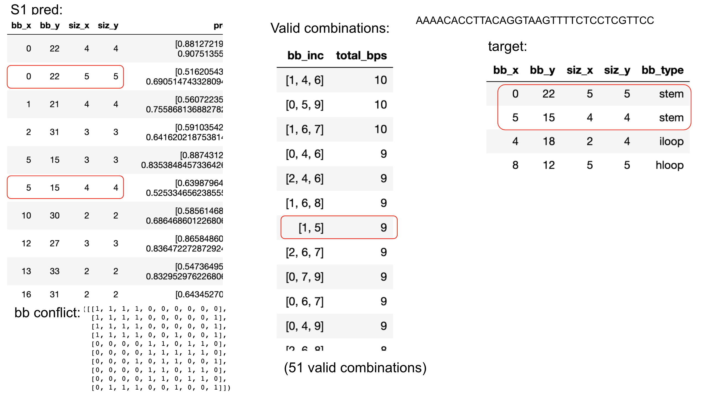

Last week:

- tried training one model on new S2 dataset (with updated S1 model), performance is similar
as before, ~0.45 overall F1 score, which is not very good (given dataset was generated in a
deterministic way)

- run S1 inference with different thresholds,
observed tradeoff between bb sensitivity and connection density


## S2 model re-training

### Dataset

- from last week: running S1 inference with threshold = 0.5,
dataset generated at: `/home/alice/work/psi-lab-sandbox/meetings/2021_05_25/data/s2_train_len20_200_20000_pred_stem_0p5.pkl.gz`

- from last week: this dataset has mean density = `0.043`
and S1 sensitivity:

```
   threshold  bb_identical_mean  bb_identical_std  bb_overlap_mean  bb_overlap_std   bp_mean    bp_std
0        0.5           0.815131          0.189959         0.907873          0.1353  0.919245  0.110961
```

- realized that we forgot to set `--feature` option so edge feature were not generated,
re-running and generating a small dataset for quick experimenting with ideas

```
taskset --cpu-list 11,12,13,14 python s1_pred_stem_processing.py --data ../2021_05_18/data/human_transcriptome_segment_high_mfe_freq_training_len20_200_20000.pkl.gz \
--threshold_p 0.5 --model ../2021_05_18/s1_training/result/run_32/model_ckpt_ep_79.pth \
--out_file data/s2_train_len20_200_2000_pred_stem_0p5.pkl.gz \
--num 2000 --features
```

done, dataset: `2021_06_01/data/s2_train_len20_200_2000_pred_stem_0p5.pkl.gz`

- also generate the large (20000) dataset for future use:


```
taskset --cpu-list 11,12,13,14 python s1_pred_stem_processing.py --data ../2021_05_18/data/human_transcriptome_segment_high_mfe_freq_training_len20_200_20000.pkl.gz \
--threshold_p 0.5 --model ../2021_05_18/s1_training/result/run_32/model_ckpt_ep_79.pth \
--out_file data/s2_train_len20_200_20000_pred_stem_0p5.pkl.gz \
--features
```

running

### Training

- update training script to report more metrics

- model training (fewer epoch, reduce size):

```
taskset --cpu-list 1,2,3,4 python s2_train_gnn_10.py --input_data ../2021_06_01/data/s2_train_len20_200_2000_pred_stem_0p5.pkl.gz \
--training_proportion 0.95 --learning_rate 0.002 --epochs 20 --batch_size 10 --hid 40 40 40 40 40 50 50 50 100 100  \
 --log result/s2_gnn_run_30.log --kmer 3 --embed_dim 50
```

result:

```
2021-05-26 22:50:52,247 [MainThread  ] [INFO ]  Epoch 19, training, mean loss 0.3240662878281192, mean auROC 0.7701367283177467, mean auPRC 0.4668170926817506, mean f1 [0.27028453 0.40398598 0.40856787 0.34995222 0.28469343 0.22200932
 0.16617787 0.11765508 0.06634635 0.        ]
2021-05-26 22:50:57,301 [MainThread  ] [INFO ]  Epoch 19, validation, mean loss 0.41990539081394673, mean auROC 0.7180676901085397, mean auPRC 0.417597913916521, mean f1 [0.28293613 0.37242551 0.3401235  0.22596997 0.15398225 0.10835893
 0.06752545 0.04856264 0.02411977 0.        ]
2021-05-26 22:50:57,341 [MainThread  ] [INFO ]  Model checkpoint saved at: result/s2_gnn_run_30.model_ckpt_ep_19.pth
```


- increase capacity:


```
taskset --cpu-list 1,2,3,4 python s2_train_gnn_10.py --input_data ../2021_06_01/data/s2_train_len20_200_2000_pred_stem_0p5.pkl.gz \
--training_proportion 0.95 --learning_rate 0.002 --epochs 20 --batch_size 10 --hid 40 40 40 40 40 50 50 50 50 50 100 100  \
 --log result/s2_gnn_run_31.log --kmer 3 --embed_dim 50
```


result:

```
2021-05-27 00:36:06,911 [MainThread  ] [INFO ]  Epoch 19, training, mean loss 0.32362801244384365, mean auROC 0.7815786811518118, mean auPRC 0.4868720750457153, mean f1 [0.27092005 0.41438595 0.43728999 0.38898076 0.31375879 0.22970953
 0.12410922 0.08503396 0.04834781 0.        ]
2021-05-27 00:36:13,896 [MainThread  ] [INFO ]  Epoch 19, validation, mean loss 0.35113039828836917, mean auROC 0.7706388248801238, mean auPRC 0.4578393522679051, mean f1 [0.27092481 0.42865815 0.38619271 0.29906127 0.22315387 0.15761148
 0.11031212 0.08733325 0.05839705 0.        ]
2021-05-27 00:36:13,942 [MainThread  ] [INFO ]  Model checkpoint saved at: result/s2_gnn_run_31.model_ckpt_ep_19.pth
```

- increase capacity and LR, more epochs:


```
taskset --cpu-list 1,2,3,4 python s2_train_gnn_10.py --input_data ../2021_06_01/data/s2_train_len20_200_2000_pred_stem_0p5.pkl.gz \
--training_proportion 0.95 --learning_rate 0.005 --epochs 50 --batch_size 10 --hid 40 40 40 40 40 40 50 50 50 50 50 50 100 100 100  \
 --log result/s2_gnn_run_33.log --kmer 3 --embed_dim 50
```


```
2021-05-27 19:04:09,363 [MainThread  ] [INFO ]  Epoch 49, training, mean loss 0.32725535293943003, mean auROC 0.7681449754745555, mean auPRC 0.4690498567215277, mean f1 [0.27078926 0.403593   0.41966581 0.36664482 0.29760516 0.22880923
 0.16500378 0.10362864 0.         0.        ]
2021-05-27 19:04:17,475 [MainThread  ] [INFO ]  Epoch 49, validation, mean loss 0.39419276900589467, mean auROC 0.7129690340284073, mean auPRC 0.41105380899558097, mean f1 [0.27339664 0.36211834 0.3624627  0.31902063 0.24634883 0.17374655
 0.10554885 0.04916739 0.         0.        ]
2021-05-27 19:04:17,537 [MainThread  ] [INFO ]  Model checkpoint saved at: result/s2_gnn_run_33.model_ckpt_ep_49.pth
```

not better?

- increase capacity

```
taskset --cpu-list 1,2,3,4 python s2_train_gnn_10.py --input_data ../2021_06_01/data/s2_train_len20_200_2000_pred_stem_0p5.pkl.gz \
--training_proportion 0.95 --learning_rate 0.005 --epochs 50 --batch_size 10 --hid 64 64 64 64 128 128 128 128 256 256 256 256 256 512 512  \
 --log result/s2_gnn_run_33.log --kmer 3 --embed_dim 50
```


```
2021-05-28 14:43:03,478 [MainThread  ] [INFO ]  Epoch 49, training, mean loss 0.34559915081450815, mean auROC 0.7333188661192176, mean auPRC 0.4208362331764368, mean f1 [0.27121716 0.36823862 0.36334302 0.30574655 0.23779615 0.17991602
 0.12985286 0.08170142 0.         0.        ]
2021-05-28 14:43:31,522 [MainThread  ] [INFO ]  Epoch 49, validation, mean loss 0.39739930227398873, mean auROC 0.7129159446075686, mean auPRC 0.3970404632122272, mean f1 [0.26530939 0.31454131 0.35854031 0.35289865 0.297938   0.21180708
 0.13397147 0.06093099 0.         0.        ]
2021-05-28 14:43:32,167 [MainThread  ] [INFO ]  Model checkpoint saved at: result/s2_gnn_run_33.model_ckpt_ep_49.pth
```

even worse?

- on larger dataset 20000:


```
taskset --cpu-list 1,2,3,4,5,6 python s2_train_gnn_10.py --input_data ../2021_06_01/data/s2_train_len20_200_20000_pred_stem_0p5.pkl.gz \
--training_proportion 0.95 --learning_rate 0.005 --epochs 50 --batch_size 10 --hid 64 64 64 64 128 128 128 128 256 256 256 256 256 512 512  \
 --log result/s2_gnn_run_35.log --kmer 3 --embed_dim 50
```


## S2 predict binary label for each node


```
taskset --cpu-list 21,22,23,24 python s2_train_gnn_11.py --input_data ../2021_06_01/data/s2_train_len20_200_2000_pred_stem_0p5.pkl.gz \
--training_proportion 0.95 --learning_rate 0.002 --epochs 20 --batch_size 10 --hid 40 40 40 40 40 50 50 50 100 100  \
 --log result/s2_gnn_run_32.log --kmer 3 --embed_dim 50
```


result:


```
2021-05-27 00:12:30,512 [MainThread  ] [INFO ]  Epoch 19, training, mean loss 0.48962761053913517, mean auROC 0.8292296788954922, mean auPRC 0.8288044326969924, mean f1 [0.64510091 0.71516857 0.7475444  0.7621602  0.7595871  0.73050436
 0.65726933 0.50669971 0.24866875 0.        ]
2021-05-27 00:12:32,158 [MainThread  ] [INFO ]  Epoch 19, validation, mean loss 0.5260720935463905, mean auROC 0.8188195105039243, mean auPRC 0.82730767216509, mean f1 [0.65307186 0.71155804 0.73235309 0.74508181 0.74921137 0.72102582
 0.65723754 0.53034718 0.2912619  0.        ]
2021-05-27 00:12:32,194 [MainThread  ] [INFO ]  Model checkpoint saved at: result/s2_gnn_run_32.model_ckpt_ep_19.pth
```

- increase capacity and LR, more epochs:

```
taskset --cpu-list 21,22,23,24 python s2_train_gnn_11.py --input_data ../2021_06_01/data/s2_train_len20_200_2000_pred_stem_0p5.pkl.gz \
--training_proportion 0.95 --learning_rate 0.005 --epochs 50 --batch_size 10 --hid 40 40 40 40 40 40 50 50 50 50 100 100 100 \
 --log result/s2_gnn_run_34.log --kmer 3 --embed_dim 50
```


```
2021-05-27 15:52:45,524 [MainThread  ] [INFO ]  Epoch 49, training, mean loss 0.4592469533807353, mean auROC 0.8431880848949366, mean auPRC 0.8465933251167249, mean f1 [0.64591986 0.73006679 0.763235   0.77933091 0.77775907 0.75432255
 0.68322958 0.55222958 0.33861646 0.        ]
2021-05-27 15:52:47,413 [MainThread  ] [INFO ]  Epoch 49, validation, mean loss 0.5340177404880524, mean auROC 0.8177829071203871, mean auPRC 0.8009644136322335, mean f1 [0.63751178 0.71211328 0.73610334 0.74228449 0.73665855 0.70817453
 0.65737934 0.54906288 0.33524071 0.        ]
2021-05-27 15:52:47,462 [MainThread  ] [INFO ]  Model checkpoint saved at: result/s2_gnn_run_34.model_ckpt_ep_49.pth
```

- increase capacity:

```
taskset --cpu-list 21,22,23,24 python s2_train_gnn_11.py --input_data ../2021_06_01/data/s2_train_len20_200_2000_pred_stem_0p5.pkl.gz \
--training_proportion 0.95 --learning_rate 0.005 --epochs 50 --batch_size 10 --hid 64 64 64 64 128 128 128 128 256 256 256 256 256 \
 --log result/s2_gnn_run_34.log --kmer 3 --embed_dim 50
```

```
2021-05-28 01:06:41,045 [MainThread  ] [INFO ]  Epoch 49, training, mean loss 0.4722100488449398, mean auROC 0.8384060637496783, mean auPRC 0.8409171415052847, mean f1 [0.64519354 0.71934224 0.75468028 0.77240049 0.77104968 0.74735599
 0.68264884 0.54269114 0.31288048 0.        ]
2021-05-28 01:06:44,402 [MainThread  ] [INFO ]  Epoch 49, validation, mean loss 0.5213509066775441, mean auROC 0.8093715645713695, mean auPRC 0.8137024591723465, mean f1 [0.65131185 0.7096176  0.73870115 0.74756023 0.73962604 0.71260677
 0.64291321 0.50560744 0.29512308 0.        ]
2021-05-28 01:06:44,699 [MainThread  ] [INFO ]  Model checkpoint saved at: result/s2_gnn_run_34.model_ckpt_ep_49.pth
```


not better?

- on larger dataset 20000:


```
taskset --cpu-list 21,22,23,24,25,26 python s2_train_gnn_11.py --input_data ../2021_06_01/data/s2_train_len20_200_20000_pred_stem_0p5.pkl.gz \
--training_proportion 0.95 --learning_rate 0.005 --epochs 50 --batch_size 10 --hid 64 64 64 64 128 128 128 128 256 256 256 256 256 \
 --log result/s2_gnn_run_36.log --kmer 3 --embed_dim 50
```

diverged...

- descrease LR:

```
taskset --cpu-list 21,22,23,24,25,26 python s2_train_gnn_11.py --input_data ../2021_06_01/data/s2_train_len20_200_20000_pred_stem_0p5.pkl.gz \
--training_proportion 0.95 --learning_rate 0.002 --epochs 50 --batch_size 10 --hid 64 64 64 64 128 128 128 128 256 256 256 256 256 \
 --log result/s2_gnn_run_36.log --kmer 3 --embed_dim 50
```


## Read paper: Combinatorial Optimization and Reasoning with Graph Neural Networks

- 2021 review paper

- GNN applied to combinatorial optimization (CO):
directly predict a solution, or as an integrated component of an existing solver.
GNNs can serve as a tool for representing problem instances, states of an iterative algorithm, or both

- How to address the problem that the output is a set (no ordering):
GNN served as the function approximator for the value function in a Deep Q-learning (DQN)
formulation of CO on graphs. See `Khalil et al., 2017`

- handling constraints:restricting the RL action space

- Graph matching using GNN: two stage approach:
s1: node embedding for similarity based on local info,
s2: differentiable, iterative refinement. See `Fey et al. (2020)`

- Use GNN to learn hybrid heuristics: guide search using GNN. see `section 3.1.2`

- Algorithmic reasoning:
motivation: NN tends to struggle when extrapolating.
For example, merely increasing the test input size, e.g.,
the number of nodes in the input graph, is often sufficient to lose most of the training’s predictive power.

- GNNs align with dynamic programming, which is a language in which most algorithms can be expressed.

- hierarchy of neural algorithmic reasoning approaches:

    - Algo-level: learning entire algorithms, end-to-end, from inputs to outputs.

    - Step-level: learning atomic steps of algorithms, through strong intermediate supervision.

    - Unit-level: learning primitive units of computation, then specifying hard-coded or nonparametric means of combining such units.

- Limitation of GNN: non-isomorphic graph, poor generalization on dense graph,


## Re-think S2 as combinatorial problem

- Now S1 only predicts stem bbs, the combinatorial problem is simpler
(only black-list constraints). Valid combination of stem bbs satisfies the constraints
that no triplet (or more) exist (this still allows for pesudoknot).

- We can perform a depth-first search on binary tree, with number of levels equal to
number of stem bbs. The two branchs correspond to the bb (at that level) being included or not.
Branching is terminated when either:
(1) we reach the bottom of the tree, (2) the bb being included is in conflict with any bb that's already included.

- In practise, the search space is much smaller than 2^N, due to the black-list constraints.
Also, the more bbs predicted the more likely it'll be in conflict with another one (for a fixed sequence length).

- If we manage to design the search procedure in a smart way, such that the ground truth global structure always end up
in the top-k, then we can design a 'S2 scoring model' that predict the free energy (which should be easy to do),
and use this model to score all top-k structures and pick the 'best' one.

- When exploring the combinatorial space, heuristics can be utlized. (validity to be confirmed)

    - No need to consider 'partial structure', e.g.
    structure include stem (bb1, bb2, bb3) is always better than (bb1, bb2).
    I.e. we always go as deep as possile on the binary tree.

    - We'd like to prioritize searching for 'good' structures. Number of bases being paired
    can be used as an approximation. Shall we prioritize including the larger bbs?
    Shall we prioritize including bbs that have fewer conflicts?

    - Can we build a model to learn (and go beyond) the heuristics? RL?


## Naive brute-force imlpementation on short sequences

Experimenting with short sequences (and small number of bbs), trying out brute-force construction:




Produced by [tmp_enumerate_search_space_short_seq.ipynb](tmp_enumerate_search_space_short_seq.ipynb)


TODOs

- experiment: generate dataset of short seqs (so it's feasible to enumerate), train a score network (2D conv with 5-ch, seq + binary)
to predict FE of each valid global structure. Enumerate all valid global structures
(won't be 2^n due to: 1. constraints, 2. we don't want sub structure, e.g. each global struct
is the biggest, and cannot be extended further).
how to enumerate? condider a graph whether nodes are bbs, edge connecting i and j if i and j can NOT
be both included. Then the enumeration problem is finding all biggest subset
such that all nodes in the subset are disjoint.

- super node (bb-level)

- thoughts: GNN architecture

- predict p(x), basepair probability,
local bb informative for this target? need to run RNAfold and generate this data.

- base S2 model, no GNN update,
just node 1 feature + node 2 feature -> target,
can be done by outer product -> 1x1 2D conv, mask gradient

-double check GATEConv

- sigmoid + softmax

- add position as feature

- discrete, constraint enforcement

- algorithmic NN? find paper


