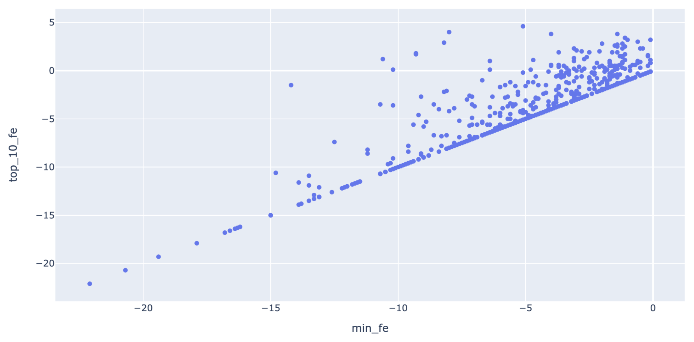
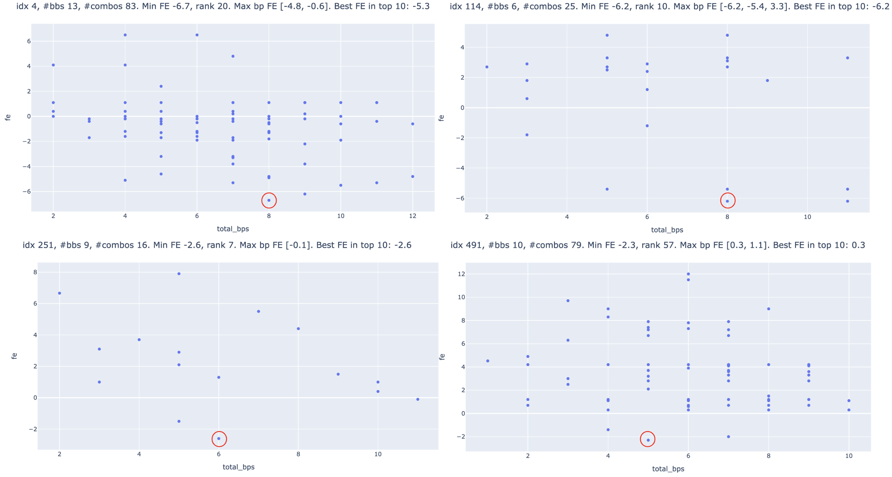
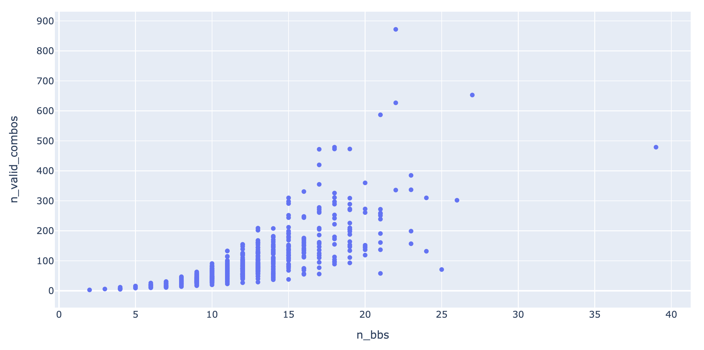

Last week:

- Direct application of GNN to solve S2 problem seem to have hit a bottleneck


## Is max bps a good heuristic for global free enerygy?

### Generate dataset


- for now focus on short seq with fewer bb proposals (before we implement efficient search)

- generate fixed length short seq, len=40, no threshold on mfe_freq:

env `rna_ss_py3`

```
cd s2_data_gen
taskset --cpu-list 21,22,23,24 python generate_human_transcriptome_segment_high_mfe_freq_var_len.py \
--len_min 40 --len_max 40 --num_seq 1000 --threshold_mfe_freq 0 \
--chromosomes chr2 chr3 chr4 chr5 chr6 chr7 chr8 chr9 chr10 chr11 chr12 chr13 chr14 chr15 chr16 chr17 chr18 chr19 chr20 chr21 \
--out ../data/human_transcriptome_segment_high_mfe_freq_training_len40_1000.pkl.gz
```


- run S1 inference:

debug

```
python run_s1_inference_run32_ep79.py --data ../2021_06_01/data/s2_train_len20_200_2000_pred_stem_0p5.pkl.gz \
--threshold 0.5 --out data/debug.pkl.gz --num 10
```

env `pytorch_plot_py3`

```
taskset --cpu-list 21,22,23,24 python run_s1_inference_run32_ep79.py --data data/human_transcriptome_segment_high_mfe_freq_training_len40_1000.pkl.gz \
--threshold 0.5 --out data/data_len40_1000_s1_stem_bb.pkl.gz
```

- generate all valid stem bb combinations

- for now, subset to those with bb sensitivity = 100%,
subset to those with <= 15 s1 proposal bbs (since we're brute-forcing the search)

```
python process_dataset_for_scoring_network_training.py
```

output: `data/data_len40_1000_s1_stem_bb_le10_combos.pkl.gz`


### Compare MFE with best from top 10

- for each valid stem bb combination, using `RNAeval` to compute its free energy

- some combos have FE > 0 (pseudoknot? I thought RNAeval returns a super large number? no? did they update?)
(see example ID 18 max bp struct)




- x axis: FE of the MFE structure by RNAfold

- y axis: min FE of the top-10 stem bb combinations, ranked by number of bps

- note that to achieve this performance, we'll need:

    1. a perfect S2 scoring model that can rank structure in the same order as FE

    2. a perfect search procedure that can give us top-k

- observation: sequence having lower FE tend to have their
MFE = best_in_top_10

### Visualize a few examples




Produced by [num_bps_vs_fe.ipynb](num_bps_vs_fe.ipynb)


## S2 scoring network - CNN


- training in a siamese setting with tied weights

- shall we leave out pesudoknot structures for now?
Based on the current setup, they would be considered as worse than other structures
(since the 'best' is always the RNAfold MFE one), but in reality they might not.
We could be giving the NN a hard time learning the actual relative energy if we
include those as negative examples.

- caveat: we're using short fixed length sequence for now,
the trained model might not generalize


### Dataset

- at training time, each 'example' consists of a pair of structures of the same sequence,
one being the MFE structure, the other being one of the non-MFE structures (any valid stem bb combination)

- each epoch we randomly sample a non-MFE structure per sequence

- each sequence+structure is encoded as LxLx9 array, where 9 channels are from
outer concatenation of 1-hot encoding (8 chs) and 1 channel of base pairing feature

- both LxLx9 arrays are passed through the same scoring network


### Training

- scoring network consists:

    - multiple layers of 2D conv, Relu, BatchNorm and 2D pooling

    - 2D Global average pooling

    - FC along channel dimension

- siamese network:

    - 2 copies of the scoring network, outputs y1 and y2

    - sigmoid(y1 - y2)

- due to the way we construct the training example pairs,
 target label is always 1 for the siamese network.
 Ideally we would use a loss function that only penalize if siamese network output < 0.5,
 but for now we're being lazy so we use the binary cross entropy directly
 (which always encourage a big gap between y1 and y2).


debug:

```
python train_siamese_nn.py --data data/data_len40_1000_s1_stem_bb_le10_combos.pkl.gz \
--num_filters 16 32 --filter_width 5 5 --pooling_size 2 2 \
--epoch 2 --lr 0.01 --batch_size 10 --cpu 1
```

training:


```
CUDA_VISIBLE_DEVICES=1 taskset --cpu-list 11,12,13,14 python train_siamese_nn.py --data data/data_len40_1000_s1_stem_bb_le10_combos.pkl.gz \
--num_filters 16 32 32 --filter_width 5 5 5 --pooling_size 2 2 2 \
--epoch 100 --lr 0.001 --batch_size 20 --cpu 4
```


```
CUDA_VISIBLE_DEVICES=1 taskset --cpu-list 11,12,13,14 python train_siamese_nn.py --data data/data_len40_1000_s1_stem_bb_le10_combos.pkl.gz \
--num_filters 16 16 32 32 64 --filter_width 3 3 3 3 3 --pooling_size 1 1 2 2 2 \
--epoch 200 --lr 0.001 --batch_size 20 --cpu 4
```

Result (some variability exist due to sampling of the a different x2 per example in each epoch):

```
Epoch 191/200, training, loss 9.195406442432028e-05, accuracy 1.0
Epoch 191/200, validation, loss 0.017489025078248233, accuracy 0.9916666666666667
Epoch 192/200, training, loss 0.00014824492228356014, accuracy 1.0
Epoch 192/200, validation, loss 0.17132017657907758, accuracy 0.9666666666666667
Epoch 193/200, training, loss 0.00022066570242410913, accuracy 1.0
Epoch 193/200, validation, loss 0.013750523600416878, accuracy 1.0
Epoch 194/200, training, loss 0.00015041776819116204, accuracy 1.0
Epoch 194/200, validation, loss 0.0708746289613676, accuracy 0.9750000000000001
Epoch 195/200, training, loss 0.00029027424883073155, accuracy 1.0
Epoch 195/200, validation, loss 0.040629656662834655, accuracy 0.9916666666666667
Epoch 196/200, training, loss 0.00029275031255473376, accuracy 1.0
Epoch 196/200, validation, loss 0.04313411534773574, accuracy 0.9833333333333334
Epoch 197/200, training, loss 0.00011829329945845486, accuracy 1.0
Epoch 197/200, validation, loss 0.03416939794260543, accuracy 0.9833333333333334
Epoch 198/200, training, loss 8.659864678996936e-05, accuracy 1.0
Epoch 198/200, validation, loss 0.07024196327256504, accuracy 0.9583333333333334
Epoch 199/200, training, loss 5.404166326375811e-05, accuracy 1.0
Epoch 199/200, validation, loss 0.13684896282696477, accuracy 0.9333333333333332
```

- focus on more difficult examples (top 100 rows sorted by total_bps) as the second in pair

```
CUDA_VISIBLE_DEVICES=1 taskset --cpu-list 11,12,13,14 python train_siamese_nn.py --data data/data_len40_1000_s1_stem_bb_le10_combos.pkl.gz \
--num_filters 16 16 32 32 64 --filter_width 3 3 3 3 3 --pooling_size 1 1 2 2 2 \
--epoch 200 --lr 0.001 --batch_size 20 --cpu 4 --top_bps_negative 100
```

Result:

```
Epoch 191/200, training, loss 6.196074402472125e-05, accuracy 1.0
Epoch 191/200, validation, loss 0.24673992046155035, accuracy 0.9333333333333332
Epoch 192/200, training, loss 0.0003079393919544297, accuracy 1.0
Epoch 192/200, validation, loss 0.11335775087354705, accuracy 0.975
Epoch 193/200, training, loss 0.00030579138184466935, accuracy 1.0
Epoch 193/200, validation, loss 0.16569800985356173, accuracy 0.9583333333333334
Epoch 194/200, training, loss 0.00012603603153409147, accuracy 1.0
Epoch 194/200, validation, loss 0.37529122286165756, accuracy 0.85
Epoch 195/200, training, loss 0.00011689527288386412, accuracy 1.0
Epoch 195/200, validation, loss 0.08637037345518668, accuracy 0.9916666666666667
Epoch 196/200, training, loss 7.234924774141269e-05, accuracy 1.0
Epoch 196/200, validation, loss 0.09039298769857851, accuracy 0.9583333333333334
Epoch 197/200, training, loss 0.0002227490178634233, accuracy 1.0
Epoch 197/200, validation, loss 0.1891506847096025, accuracy 0.9416666666666668
Epoch 198/200, training, loss 0.00027129283803752795, accuracy 1.0
Epoch 198/200, validation, loss 0.37893882805171114, accuracy 0.9416666666666665
Epoch 199/200, training, loss 0.0005937063324036476, accuracy 1.0
Epoch 199/200, validation, loss 0.5210146643221378, accuracy 0.7666666666666667
```


- increase difficulty: focus on more difficult examples (top 10 rows sorted by total_bps) as the second in pair

```
CUDA_VISIBLE_DEVICES=1 taskset --cpu-list 11,12,13,14 python train_siamese_nn.py --data data/data_len40_1000_s1_stem_bb_le10_combos.pkl.gz \
--num_filters 16 16 32 32 64 --filter_width 3 3 3 3 3 --pooling_size 1 1 2 2 2 \
--epoch 200 --lr 0.001 --batch_size 20 --cpu 4 --top_bps_negative 10
```

Result:

```
Epoch 191/200, training, loss 0.0006471005122182847, accuracy 1.0
Epoch 191/200, validation, loss 0.12869562945949534, accuracy 0.9416666666666665
Epoch 192/200, training, loss 0.0008982494660553389, accuracy 1.0
Epoch 192/200, validation, loss 0.11933280217150848, accuracy 0.975
Epoch 193/200, training, loss 0.00047537701985198683, accuracy 1.0
Epoch 193/200, validation, loss 0.5822154503936569, accuracy 0.8833333333333334
Epoch 194/200, training, loss 0.0004976102035081047, accuracy 1.0
Epoch 194/200, validation, loss 0.20043927273945883, accuracy 0.9083333333333332
Epoch 195/200, training, loss 0.0014954052711843922, accuracy 1.0
Epoch 195/200, validation, loss 0.18025470214585462, accuracy 0.9416666666666668
Epoch 196/200, training, loss 0.0008549933933993868, accuracy 1.0
Epoch 196/200, validation, loss 0.1767099618058031, accuracy 0.9249999999999999
Epoch 197/200, training, loss 0.0004553604754359445, accuracy 1.0
Epoch 197/200, validation, loss 0.8594377257298523, accuracy 0.8166666666666668
Epoch 198/200, training, loss 0.0005472850746064935, accuracy 1.0
Epoch 198/200, validation, loss 0.06827679579146206, accuracy 0.975
Epoch 199/200, training, loss 0.0007195991602202412, accuracy 1.0
Epoch 199/200, validation, loss 0.11356006702408195, accuracy 0.9500000000000001
```


### Conclusion

- as a proof of concept, simple CNN seems to be working well for scoring relative 'goodness' of structures
from the same sequence (up to the avobe mentioned caveat

- some overfitting is observed due to the small dataset size, we need to train model on larger dataset
if we were to put this model into production

- TODO: evaluate on all pairs, on an independent dataset. what metric to use? 1 v.s. n


## S2 scoring network - GNN

(not doing this right now since simple CNN seems to be working sufficiently well so far)

- might make more sense to use 'super node'

- for a given structure, we can add one super node per 'sub structure',
including stem, iloop, hloop, multi-branch loop


## S2 binary tree search with constraints

### Implementation

- tree search implementation in [utils_s2_tree_search.py](utils_s2_tree_search.py)

- Except for the root node, all other nodes in tree each
correspond to a partial or complete assignment to stem bbs

- Each level of the tree extends the assignment from previous level,
adding in assignment of a new bb

- class `Node` keeps track of:
1) the 'current' bb we're assigning a label to,
2) binary array of assignment to all bbs, including current one,
3) left child, 4) right child

- class `StemBbTree`:

    - construct binary tree from:
    1) a list of `N` `BoundingBox` objects,
    2) `NxN` binary array with `1` indicating bb conflict

    - first the dummy root node and its immediate children are initialized.
    Root node gets a dummy bb idx of `-1` and all bbs are assigned `0`.
    Left child assigns `1` to bb idx `0`,
    and right child assigns `0` to bb idx `0` (no change in assignment from root).

    - Grow the tree recursively `grow_the_tree`:
    starting with the root node, if both children are `None`,
    we grow the node (see below `grow_node`), otherwise call `grow_the_tree`
    on left child (if present) and then on right child (if present).

    - Grow one node `grow_node`:
    grow immediate children from a node,
    as long as there is no conflict,
    otherwise the child node with conflict will be set to None

    - After the full tree is grown, we get all its leaves
    by calling `get_all_leaves`, which fetchs all leaves recursively


- we've verified the results are the same as generated by brute force 2^n,
see [sanity_check_binary_tree_search.ipynb](sanity_check_binary_tree_search.ipynb)


### Run on dataset



- number of bbs v.s. number of valid stem bb combinations,
on dataset of len=40 sequences

- tree search is quite efficient for this size of dataset (1-2 sec for 600+ examples)

- so far it doesn't look like the step of "generating all valid combinations" would be the bottleneck


Plot generated by [tmp_tree_search_run_on_dataset_statistics.ipynb](tmp_tree_search_run_on_dataset_statistics.ipynb)

TODO check tree search efficiency on longer seq with more bbs


### Heuristics?

(not doing this right now since it doesn't look like this is the bottleneck)

- heuristic: use S1 probability?

- bb size, bb local connectivity (n-hop?)


## Alternative formulation of the combinarorial problem

(not doing this right now since it doesn't look like this is the bottleneck)

- valid combination of bbs

- convert to a known CO?

## RL formulation of tree search

- approximate value using scoring network?

- read papers


## DP formulation on bb?

- can we decompose global score? if so,
we can use DP to significantly cut down the computation.
No need to score every single valid bb combination separately.

- Can we do it in a way to still allow for pseudoknot?

- can we train it? RL?


## Read papers
