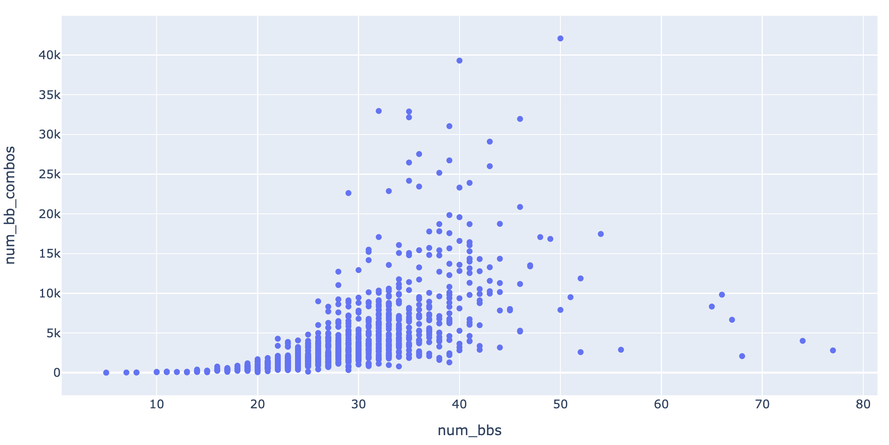
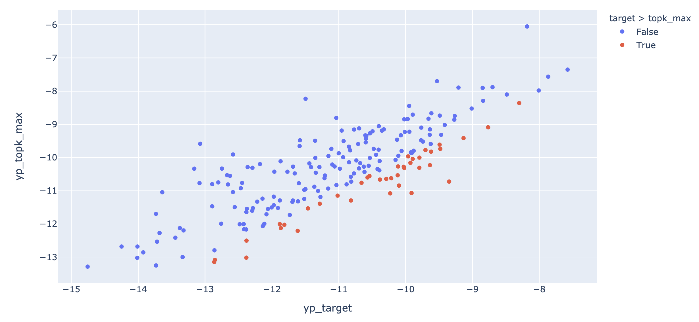

Last week:

We've demonstrated feasibility of 3 things, using a small dataset with len=40 sequences:

- all valid stem bb combinations can be recovered by binary tree search with constraints

- a scoring network for global structure can be learned via siamese network training

- num_bps is a reasonable heuristics if we only want to check a small subset of stem bb combinations


## S2 model: putting it together

- increase seq len to `100`, but still fixed length (before we update training script for scoring network)

- increase dataset size to ???

- also generate evaluation dataset on chr1

### Generate dataset

- len=100, no threshold on mfe_freq

env `rna_ss_py3`

```
cd s2_data_gen
taskset --cpu-list 21,22,23,24 python generate_human_transcriptome_segment_high_mfe_freq_var_len.py \
--len_min 100 --len_max 100 --num_seq 10000 --threshold_mfe_freq 0 \
--chromosomes chr2 chr3 chr4 chr5 chr6 chr7 chr8 chr9 chr10 chr11 chr12 chr13 chr14 chr15 chr16 chr17 chr18 chr19 chr20 chr21 \
--out ../data/human_transcriptome_segment_high_mfe_freq_training_len100_train_10000.pkl.gz
```


```
taskset --cpu-list 21,22,23,24 python generate_human_transcriptome_segment_high_mfe_freq_var_len.py \
--len_min 100 --len_max 100 --num_seq 1000 --threshold_mfe_freq 0 \
--chromosomes chr1 \
--out ../data/human_transcriptome_segment_high_mfe_freq_training_len100_test_1000.pkl.gz
```

- run S1 inference

env `pytorch_plot_py3`

```
cd ../
taskset --cpu-list 21,22,23,24 python run_s1_inference_run32_ep79.py \
--data data/human_transcriptome_segment_high_mfe_freq_training_len100_train_10000.pkl.gz \
--threshold 0.5 --out data/data_len100_train_10000_s1_stem_bb.pkl.gz
```


```
taskset --cpu-list 21,22,23,24 python run_s1_inference_run32_ep79.py \
--data data/human_transcriptome_segment_high_mfe_freq_training_len100_test_1000.pkl.gz \
--threshold 0.5 --out data/data_len100_test_1000_s1_stem_bb.pkl.gz
```

### Generate all valid stem bb combinations

debug:

```
python run_s2_stem_bb_combo_tree_search.py --data data/data_len100_test_1000_s1_stem_bb.pkl.gz \
--out data/data_len100_test_1000_s1_stem_bb_combos.pkl.gz
```

Seems to be running forever with 92 bbs? O_O!


## S2 model: putting it together - second try

- increase seq len to `60`, but still fixed length (before we update training script for scoring network)

- also generate evaluation dataset on chr1

### Generate dataset

- len=60, no threshold on mfe_freq

env `rna_ss_py3`

```
cd s2_data_gen
taskset --cpu-list 21,22,23,24 python generate_human_transcriptome_segment_high_mfe_freq_var_len.py \
--len_min 60 --len_max 60 --num_seq 10000 --threshold_mfe_freq 0 \
--chromosomes chr2 chr3 chr4 chr5 chr6 chr7 chr8 chr9 chr10 chr11 chr12 chr13 chr14 chr15 chr16 chr17 chr18 chr19 chr20 chr21 \
--out ../data/human_transcriptome_segment_high_mfe_freq_training_len60_train_10000.pkl.gz
```


```
taskset --cpu-list 21,22,23,24 python generate_human_transcriptome_segment_high_mfe_freq_var_len.py \
--len_min 60 --len_max 60 --num_seq 1000 --threshold_mfe_freq 0 \
--chromosomes chr1 \
--out ../data/human_transcriptome_segment_high_mfe_freq_training_len60_test_1000.pkl.gz
```

- run S1 inference

env `pytorch_plot_py3`

```
cd ../
taskset --cpu-list 21,22,23,24 python run_s1_inference_run32_ep79.py \
--data data/human_transcriptome_segment_high_mfe_freq_training_len60_train_10000.pkl.gz \
--threshold 0.5 --out data/data_len60_train_10000_s1_stem_bb.pkl.gz
```


```
taskset --cpu-list 11,12,13,14 python run_s1_inference_run32_ep79.py \
--data data/human_transcriptome_segment_high_mfe_freq_training_len60_test_1000.pkl.gz \
--threshold 0.5 --out data/data_len60_test_1000_s1_stem_bb.pkl.gz
```

### Generate all valid stem bb combinations


test set:


```
taskset --cpu-list 11,12,13,14 python run_s2_stem_bb_combo_tree_search.py --data data/data_len60_test_1000_s1_stem_bb.pkl.gz \
--out data/data_len60_test_1000_s1_stem_bb_combos.pkl.gz
```

dataset statistics (len=60, num_bbs v.s. num_valid_bb_combos):



(plot produced by [check_bb_combo_statistics.ipynb](check_bb_combo_statistics.ipynb))

Observation: compare to last week (len=40), we now have significantly more valid combos,
even for the same number of bbs (x-axis), which is expected.

training set:


```
taskset --cpu-list 21,22,23,24 python run_s2_stem_bb_combo_tree_search.py --data data/data_len60_train_10000_s1_stem_bb.pkl.gz \
--out data/data_len60_train_10000_s1_stem_bb_combos.pkl.gz
```

### Training

- subset to those with S1 bb sensitivity = 100%. We need this for training (not required for inference).

```python
import pandas as pd
df = pd.read_pickle('data/data_len60_train_10000_s1_stem_bb_combos.pkl.gz')
df = df[df['bb_identical'] == 1]
df.to_pickle('data/data_len60_train_10000_s1_stem_bb_combos_s1s100.pkl.gz', compression='gzip')
```


- training (save scoring network model and parameters):


```
CUDA_VISIBLE_DEVICES=1 taskset --cpu-list 11,12,13,14 python train_siamese_nn.py \
--data data/data_len60_train_10000_s1_stem_bb_combos_s1s100.pkl.gz \
--num_filters 16 16 32 32 64 --filter_width 3 3 3 3 3 --pooling_size 1 1 2 2 2 \
--epoch 50 --lr 0.001 --batch_size 20 --cpu 4 --top_bps_negative 100 \
--result result/run_1
```

result:


```
2021-06-13 16:49:24,194 [MainThread  ] [INFO ]  Epoch 44/50, validation, loss 0.00012403925072862346, accuracy 1.0
2021-06-13 16:50:06,804 [MainThread  ] [INFO ]  Epoch 45/50, training, loss 7.484573053475711e-05, accuracy 1.0
2021-06-13 16:50:12,165 [MainThread  ] [INFO ]  Epoch 45/50, validation, loss 9.254413386537804e-05, accuracy 1.0
2021-06-13 16:50:55,003 [MainThread  ] [INFO ]  Epoch 46/50, training, loss 5.1075273600729835e-05, accuracy 1.0
2021-06-13 16:51:01,022 [MainThread  ] [INFO ]  Epoch 46/50, validation, loss 5.3397105761558674e-05, accuracy 1.0
2021-06-13 16:51:44,906 [MainThread  ] [INFO ]  Epoch 47/50, training, loss 3.849877213980996e-05, accuracy 1.0
2021-06-13 16:51:50,502 [MainThread  ] [INFO ]  Epoch 47/50, validation, loss 4.437309710706464e-05, accuracy 1.0
2021-06-13 16:52:33,186 [MainThread  ] [INFO ]  Epoch 48/50, training, loss 2.231152410145828e-05, accuracy 1.0
2021-06-13 16:52:38,321 [MainThread  ] [INFO ]  Epoch 48/50, validation, loss 2.4753271452746682e-05, accuracy 1.0
2021-06-13 16:53:19,527 [MainThread  ] [INFO ]  Epoch 49/50, training, loss 2.3807680947831434e-05, accuracy 1.0
2021-06-13 16:53:19,544 [MainThread  ] [INFO ]  Model checkpoint saved at: result/run_1/model_ckpt_ep_49.pth
2021-06-13 16:53:24,906 [MainThread  ] [INFO ]  Epoch 49/50, validation, loss 2.83518276382681e-05, accuracy 1.0
```

### Predict on test set

- for each example, sort all valid stem bb combinations by num_bps,
take the top `k=50`, and predict score using the scoring network,
pick the one with highest predicted score

- we first look at the examples where target structure is within the top `k=50`
stem bb combinations (sorted by num_bps). According to the siamese network training performance,
this subset should have close to perfect performance, but it doesn't seem to be the case:


```
f1_score
count	49.000000
mean	0.405245
std	0.306096
min	0.000000
25%	0.176471
50%	0.444444
75%	0.611111
max	1.000000
```

also look at a few target & best predicted bb combinations, they seem to be quite different in many cases:

```
target:
[BoundingBox(bb_x=0, bb_y=58, siz_x=6, siz_y=6),
 BoundingBox(bb_x=19, bb_y=50, siz_x=3, siz_y=3),
 BoundingBox(bb_x=23, bb_y=46, siz_x=4, siz_y=4),
 BoundingBox(bb_x=27, bb_y=41, siz_x=5, siz_y=5)]
prediction (best score):
[BoundingBox(bb_x=1, bb_y=28, siz_x=2, siz_y=2),
 BoundingBox(bb_x=4, bb_y=15, siz_x=2, siz_y=2),
 BoundingBox(bb_x=30, bb_y=52, siz_x=5, siz_y=5),
 BoundingBox(bb_x=35, bb_y=58, siz_x=5, siz_y=5)]
f1 score: 0.0


target:
[BoundingBox(bb_x=2, bb_y=59, siz_x=5, siz_y=5),
 BoundingBox(bb_x=8, bb_y=52, siz_x=7, siz_y=7),
 BoundingBox(bb_x=16, bb_y=43, siz_x=5, siz_y=5),
 BoundingBox(bb_x=23, bb_y=36, siz_x=3, siz_y=3)]
prediction (best score):
[BoundingBox(bb_x=0, bb_y=45, siz_x=2, siz_y=2),
 BoundingBox(bb_x=4, bb_y=37, siz_x=3, siz_y=3),
 BoundingBox(bb_x=8, bb_y=31, siz_x=4, siz_y=4),
 BoundingBox(bb_x=12, bb_y=57, siz_x=4, siz_y=4),
 BoundingBox(bb_x=16, bb_y=43, siz_x=5, siz_y=5),
 BoundingBox(bb_x=23, bb_y=59, siz_x=2, siz_y=2)]
f1 score: 0.25

target:
[BoundingBox(bb_x=0, bb_y=58, siz_x=2, siz_y=2),
 BoundingBox(bb_x=3, bb_y=55, siz_x=3, siz_y=3),
 BoundingBox(bb_x=6, bb_y=51, siz_x=6, siz_y=6),
 BoundingBox(bb_x=14, bb_y=42, siz_x=4, siz_y=4),
 BoundingBox(bb_x=18, bb_y=35, siz_x=4, siz_y=4)]
prediction (best score):
[BoundingBox(bb_x=0, bb_y=58, siz_x=2, siz_y=2),
 BoundingBox(bb_x=3, bb_y=55, siz_x=3, siz_y=3),
 BoundingBox(bb_x=6, bb_y=51, siz_x=6, siz_y=6),
 BoundingBox(bb_x=16, bb_y=30, siz_x=4, siz_y=4),
 BoundingBox(bb_x=23, bb_y=35, siz_x=3, siz_y=3)]
f1 score: 0.5945945945945946

target:
[BoundingBox(bb_x=0, bb_y=10, siz_x=4, siz_y=4),
 BoundingBox(bb_x=20, bb_y=59, siz_x=9, siz_y=9),
 BoundingBox(bb_x=32, bb_y=49, siz_x=3, siz_y=3),
 BoundingBox(bb_x=36, bb_y=45, siz_x=3, siz_y=3)]
prediction (best score):
[BoundingBox(bb_x=0, bb_y=10, siz_x=4, siz_y=4),
 BoundingBox(bb_x=20, bb_y=59, siz_x=9, siz_y=9),
 BoundingBox(bb_x=32, bb_y=49, siz_x=3, siz_y=3),
 BoundingBox(bb_x=36, bb_y=45, siz_x=3, siz_y=3)]
f1 score: 1.0
```

- we wonder where this descrepancy comes from.
One observation is that for those examples where target structure is within all valid bb combinations (i.w. s1 stem bb sensitivity = 100%),
most do NOT have target with in top `k=50` (sorted by num_bps).
We hypothesize that this could have made the siamese network training task trivial,
since if in most cases the target have smaller num_bps, then the NN can just pick that up.
We found that for those examples that could have been included in training,
only ~10% have target within the top `k=50`.


```
print(n_target_in_combo)
412

print(n_target_in_topk)
49
```


- next we check whether the NN is doing something trivial.
For those examples where target is within all combos but out of top `k=50`
(i.e. target num_bps < any of those in topk), we check the NN predicted score
for the target, as well as the best score in topk.
Suprisingly we didn't find what we expected (we thought that NN might have picked up something trivial,
like the few bps the higher score, but it doesn't seem to be the case here):



(above produced by [check_s2_data.ipynb](check_s2_data.ipynb) and
[eval_s2.ipynb](eval_s2.ipynb))


Conclusion: more investigation is needed regarding gap in performance between trainig and testing.


## Var length


## MCTS

pre-trained score network

DP??

which node to add next should depend on:
(1) value of the next state,
(2) embedding from node constraint graph? and given current assignment? (similar to Khalil 2017)


## Read paper

2017


