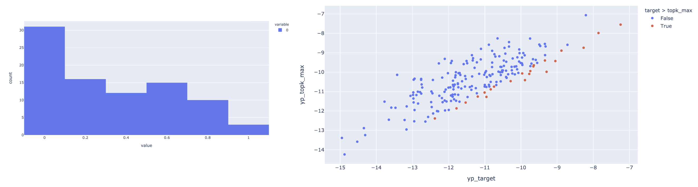

Last week:

- investigating performance gap between training & testing of S2 scoring model

- hypothesis: gap is due to the construction of pairs for siamese training,
where the target structure is out of topk in most cases

- above hypothesis is not fully validated yet, conflicting lines of evidence


## S2 scoring network investigation

### check performance on a subset of training examples

- use a subset (first 1000 examples?)

- as opposed to using test set

- use top `k=100` (used in training)



- similar to (or even worse than) when we checked on test dataset,
so it is at least consistent

- maybe there was a major bug in training code?

### check prediction while training

- add prints

```
CUDA_VISIBLE_DEVICES=1 taskset --cpu-list 11,12,13,14 python train_siamese_nn.py \
--data ../2021_06_15/data/data_len60_train_10000_s1_stem_bb_combos_s1s100.pkl.gz \
--num_filters 16 16 32 32 64 --filter_width 3 3 3 3 3 --pooling_size 1 1 2 2 2 \
--epoch 50 --lr 0.001 --batch_size 20 --cpu 4 --top_bps_negative 100 \
--result result/run_2
```

it looks ok:

```
2021-06-16 11:04:46,483 [MainThread  ] [INFO ]  Traning set prediction on one mini batch:
2021-06-16 11:04:46,514 [MainThread  ] [INFO ]  tensor([-12.9372, -14.1801, -14.0160, -13.4197, -13.0079])
2021-06-16 11:04:46,515 [MainThread  ] [INFO ]  tensor([-29.1718, -30.8552, -27.8266, -26.4349, -26.7740])
2021-06-16 11:04:46,515 [MainThread  ] [INFO ]  tensor([1.0000, 1.0000, 1.0000, 1.0000, 1.0000])
2021-06-16 11:04:46,533 [MainThread  ] [INFO ]  Model checkpoint saved at: result/run_2/model_ckpt_ep_49.pth
2021-06-16 11:04:52,330 [MainThread  ] [INFO ]  Epoch 49/50, validation, loss 2.1685099524834082e-06, accuracy 1.0
2021-06-16 11:04:52,331 [MainThread  ] [INFO ]  Validation set prediction on one mini batch:
2021-06-16 11:04:52,387 [MainThread  ] [INFO ]  tensor([-12.5233, -11.5862, -11.1246, -10.4690, -10.6371, -11.6527, -11.4476,
        -10.2162, -14.5068, -12.9998, -11.9970, -10.2970, -13.3060, -10.5709,
        -11.0013, -11.2804])
2021-06-16 11:04:52,388 [MainThread  ] [INFO ]  tensor([-28.7984, -28.8926, -33.9650, -27.0648, -25.3786, -31.6698, -28.7553,
        -23.5326, -34.3791, -29.5859, -32.4950, -26.8912, -31.2923, -25.4116,
        -29.2777, -28.1765])
2021-06-16 11:04:52,388 [MainThread  ] [INFO ]  tensor([1.0000, 1.0000, 1.0000, 1.0000, 1.0000, 1.0000, 1.0000, 1.0000, 1.0000,
        1.0000, 1.0000, 1.0000, 1.0000, 1.0000, 1.0000, 1.0000])
```


- create a subset of test set to be included for eval during training
(subset to those with S1 bb sensitivity = 100%):

```
import pandas as pd
df = pd.read_pickle('../2021_06_15/data/data_len60_test_1000_s1_stem_bb_combos.pkl.gz')
df = df[df['bb_identical'] == 1]
df.to_pickle('data/data_len60_test_1000_s1_stem_bb_combos_s1s100.pkl.gz', compression='gzip')
```

- now update script to take in the test set and print predictions during training:

```
CUDA_VISIBLE_DEVICES=1 taskset --cpu-list 11,12,13,14 python train_siamese_nn.py \
--data ../2021_06_15/data/data_len60_train_10000_s1_stem_bb_combos_s1s100.pkl.gz \
--num_filters 16 16 32 32 64 --filter_width 3 3 3 3 3 --pooling_size 1 1 2 2 2 \
--epoch 50 --lr 0.001 --batch_size 20 --cpu 4 --top_bps_negative 100 \
--tdata data/data_len60_test_1000_s1_stem_bb_combos_s1s100.pkl.gz \
--result result/run_3
```


test set looks perfectly OK:

```
2021-06-16 12:37:12,629 [MainThread  ] [INFO ]  Epoch 49/50, training, loss 5.107338271244668e-07, accuracy 1.0
2021-06-16 12:37:12,630 [MainThread  ] [INFO ]  Traning set prediction on one mini batch:
2021-06-16 12:37:12,692 [MainThread  ] [INFO ]  tensor([-13.0568, -14.4322, -14.1569, -13.3331, -13.4061])
2021-06-16 12:37:12,693 [MainThread  ] [INFO ]  tensor([-34.5635, -33.6871, -33.9334, -34.4746, -31.9808])
2021-06-16 12:37:12,694 [MainThread  ] [INFO ]  tensor([1., 1., 1., 1., 1.])
2021-06-16 12:37:12,711 [MainThread  ] [INFO ]  Model checkpoint saved at: result/run_3/model_ckpt_ep_49.pth
2021-06-16 12:37:18,160 [MainThread  ] [INFO ]  Epoch 49/50, validation, loss 5.465654193216757e-07, accuracy 1.0
2021-06-16 12:37:18,160 [MainThread  ] [INFO ]  Validation set prediction on one mini batch:
2021-06-16 12:37:18,281 [MainThread  ] [INFO ]  tensor([-16.5527, -16.1835, -16.5324, -15.3925, -16.3132, -15.7626, -16.9620,
        -17.9779, -16.4540, -16.8232, -15.2111, -16.7399, -15.5730, -15.1008,
        -15.5977, -15.5643])
2021-06-16 12:37:18,283 [MainThread  ] [INFO ]  tensor([-33.7943, -32.6268, -33.2176, -34.3184, -32.4016, -35.4819, -32.6468,
        -33.3209, -33.6892, -33.8151, -27.5203, -32.9303, -32.6798, -28.8015,
        -32.8706, -27.2491])
2021-06-16 12:37:18,284 [MainThread  ] [INFO ]  tensor([1.0000, 1.0000, 1.0000, 1.0000, 1.0000, 1.0000, 1.0000, 1.0000, 1.0000,
        1.0000, 1.0000, 1.0000, 1.0000, 1.0000, 1.0000, 1.0000])
2021-06-16 12:37:21,815 [MainThread  ] [INFO ]  Epoch 49/50, test, loss 4.069209248077262e-07, accuracy 1.0
2021-06-16 12:37:21,815 [MainThread  ] [INFO ]  Test set prediction on one mini batch:
2021-06-16 12:37:21,855 [MainThread  ] [INFO ]  tensor([-14.4087, -15.5758, -17.0214, -14.4267, -15.6156, -16.8769, -16.4265,
        -16.0759, -14.7876, -16.6451, -14.0676, -15.0492])
2021-06-16 12:37:21,856 [MainThread  ] [INFO ]  tensor([-26.7708, -30.5890, -33.4122, -29.7261, -31.9005, -33.5392, -33.6450,
        -32.5671, -32.4738, -33.9782, -29.2691, -34.2125])
2021-06-16 12:37:21,856 [MainThread  ] [INFO ]  tensor([1.0000, 1.0000, 1.0000, 1.0000, 1.0000, 1.0000, 1.0000, 1.0000, 1.0000,
        1.0000, 1.0000, 1.0000])
```


- check what parameters were saved in model export (all?) -> checked, all layers with parameters were saved

```
ScoreNetwork(
  (score_network): Sequential(
    (0): Conv2d(9, 16, kernel_size=(3, 3), stride=(1, 1))
    (1): BatchNorm2d(16, eps=1e-05, momentum=0.1, affine=True, track_running_stats=True)
    (2): ReLU()
    (3): MaxPool2d(kernel_size=1, stride=1, padding=0, dilation=1, ceil_mode=False)
    (4): Conv2d(16, 16, kernel_size=(3, 3), stride=(1, 1))
    (5): BatchNorm2d(16, eps=1e-05, momentum=0.1, affine=True, track_running_stats=True)
    (6): ReLU()
    (7): MaxPool2d(kernel_size=1, stride=1, padding=0, dilation=1, ceil_mode=False)
    (8): Conv2d(16, 32, kernel_size=(3, 3), stride=(1, 1))
    (9): BatchNorm2d(32, eps=1e-05, momentum=0.1, affine=True, track_running_stats=True)
    (10): ReLU()
    (11): MaxPool2d(kernel_size=2, stride=2, padding=0, dilation=1, ceil_mode=False)
    (12): Conv2d(32, 32, kernel_size=(3, 3), stride=(1, 1))
    (13): BatchNorm2d(32, eps=1e-05, momentum=0.1, affine=True, track_running_stats=True)
    (14): ReLU()
    (15): MaxPool2d(kernel_size=2, stride=2, padding=0, dilation=1, ceil_mode=False)
    (16): Conv2d(32, 64, kernel_size=(3, 3), stride=(1, 1))
    (17): BatchNorm2d(64, eps=1e-05, momentum=0.1, affine=True, track_running_stats=True)
    (18): ReLU()
    (19): MaxPool2d(kernel_size=2, stride=2, padding=0, dilation=1, ceil_mode=False)
    (20): AdaptiveAvgPool2d(output_size=(1, 1))
    (21): Conv2d(64, 1, kernel_size=(1, 1), stride=(1, 1))
  )
  (out): Sigmoid()
)

odict_keys(['score_network.0.weight', 'score_network.0.bias', 'score_network.1.weight', 'score_network.1.bias', 'score_network.1.running_mean', 'score_network.1.running_var', 'score_network.1.num_batches_tracked', 'score_network.4.weight', 'score_network.4.bias', 'score_network.5.weight', 'score_network.5.bias', 'score_network.5.running_mean', 'score_network.5.running_var', 'score_network.5.num_batches_tracked', 'score_network.8.weight', 'score_network.8.bias', 'score_network.9.weight', 'score_network.9.bias', 'score_network.9.running_mean', 'score_network.9.running_var', 'score_network.9.num_batches_tracked', 'score_network.12.weight', 'score_network.12.bias', 'score_network.13.weight', 'score_network.13.bias', 'score_network.13.running_mean', 'score_network.13.running_var', 'score_network.13.num_batches_tracked', 'score_network.16.weight', 'score_network.16.bias', 'score_network.17.weight', 'score_network.17.bias', 'score_network.17.running_mean', 'score_network.17.running_var', 'score_network.17.num_batches_tracked', 'score_network.21.weight', 'score_network.21.bias'])
```

- add print test set prediction on all structs for one example"

```
CUDA_VISIBLE_DEVICES=1 taskset --cpu-list 11,12,13,14 python train_siamese_nn.py \
--data ../2021_06_15/data/data_len60_train_10000_s1_stem_bb_combos_s1s100.pkl.gz \
--num_filters 16 16 32 32 64 --filter_width 3 3 3 3 3 --pooling_size 1 1 2 2 2 \
--epoch 50 --lr 0.001 --batch_size 20 --cpu 4 --top_bps_negative 100 \
--tdata data/data_len60_test_1000_s1_stem_bb_combos_s1s100.pkl.gz \
--result result/run_4
```


weird:

```
2021-06-17 01:18:45,094 [MainThread  ] [INFO ]  Epoch 49/50, test, loss 3.5496449895401295e-05, accuracy 1.0
2021-06-17 01:18:45,094 [MainThread  ] [INFO ]  Test set prediction on one mini batch:
2021-06-17 01:18:45,178 [MainThread  ] [INFO ]  tensor([ 1.6638,  0.5382,  2.6930,  4.2799,  5.0584,  0.8293,  3.4741,  0.3740,
        -2.7752, -0.6235,  1.7135,  2.3271])
2021-06-17 01:18:45,178 [MainThread  ] [INFO ]  tensor([-12.7996,  -8.7810, -11.3714,  -7.1254,  -8.6860, -12.1125,  -9.1955,
        -13.0842, -14.6033, -11.9707, -13.4309, -11.8369])
2021-06-17 01:18:45,179 [MainThread  ] [INFO ]  tensor([1.0000, 0.9999, 1.0000, 1.0000, 1.0000, 1.0000, 1.0000, 1.0000, 1.0000,
        1.0000, 1.0000, 1.0000])
2021-06-17 01:18:45,179 [MainThread  ] [INFO ]  Test set prediction on all structures of one example:
2021-06-17 01:18:45,356 [MainThread  ] [INFO ]  tensor([-11.7582, -12.2218, -11.2842, -12.9620, -12.4901, -12.6997, -12.0582,
        -12.2749, -12.6071, -12.3349, -12.3826, -12.5893, -11.1974, -11.5502,
        -12.7232, -11.5954, -12.6735, -13.1397, -11.0073, -12.6519, -11.4625,
        -12.5358, -11.6346, -11.0796, -11.7549, -12.1015, -12.4323, -11.9719,
        -12.1416, -11.1674, -13.1243, -12.5552, -13.1198, -12.2218, -11.2336,
        -12.6760, -12.7951, -11.8822, -11.1915, -11.8624, -12.4995, -13.1671,
        -11.5808, -11.7181, -11.0477, -11.4604, -12.8106, -12.3673, -13.3146,
        -12.3037, -12.5974, -11.8963, -11.8387, -10.9657, -11.6306, -12.7449,
        -13.1974, -11.4395, -12.8965, -12.1601, -12.6272, -11.3745, -12.9620,
        -12.5893, -12.2925, -10.6834, -12.3138, -12.3826, -11.8814, -12.4901,
        -12.9714, -12.0429, -11.0371, -12.6009, -11.4719, -10.8265, -12.4606,
        -11.1343, -12.2031, -12.3903, -11.4689, -12.8194, -10.9952, -12.5735,
        -11.5686, -11.9624, -11.6346, -12.6830, -12.7859, -11.6048, -11.8074,
        -12.4973, -12.3729, -10.8585, -12.4478, -12.2178, -12.1905, -11.2169,
        -12.5380, -12.1673, -11.7473])

```

Same test set, minibatch prediction looks really good, but when predicting on all structures of one example
(first entry being target) the predicted values are all very low.
Does not make much sense, there must be a bug somewhere in code?

- we wonder if there's any different between `data_loader` and `dataset`?
Add logging for example pair from dataset:

```
CUDA_VISIBLE_DEVICES=1 taskset --cpu-list 11,12,13,14 python train_siamese_nn.py \
--data ../2021_06_15/data/data_len60_train_10000_s1_stem_bb_combos_s1s100.pkl.gz \
--num_filters 16 16 32 32 64 --filter_width 3 3 3 3 3 --pooling_size 1 1 2 2 2 \
--epoch 50 --lr 0.001 --batch_size 20 --cpu 4 --top_bps_negative 100 \
--tdata data/data_len60_test_1000_s1_stem_bb_combos_s1s100.pkl.gz \
--result result/run_5
```

all checks off except when we make batch prediction:

```
2021-06-19 16:10:26,620 [MainThread  ] [INFO ]  Epoch 15/50, test, loss 1.1151903338811411e-05, accuracy 1.0
2021-06-19 16:10:26,621 [MainThread  ] [INFO ]  Test set prediction on one mini batch (from data loader):
2021-06-19 16:10:26,691 [MainThread  ] [INFO ]  tensor([-5.2891, -2.7169, -4.7053, -4.7900, -4.3972, -3.7777, -3.2864, -3.4161,
        -4.0007, -4.7171, -3.8302, -4.4956])
2021-06-19 16:10:26,692 [MainThread  ] [INFO ]  tensor([-14.0152, -13.8944, -14.9781, -14.5821, -16.5590, -16.5775, -14.2702,
        -14.6061, -16.5304, -14.5749, -15.4701, -16.2816])
2021-06-19 16:10:26,693 [MainThread  ] [INFO ]  tensor([0.9998, 1.0000, 1.0000, 0.9999, 1.0000, 1.0000, 1.0000, 1.0000, 1.0000,
        0.9999, 1.0000, 1.0000])
2021-06-19 16:10:26,693 [MainThread  ] [INFO ]  Test set prediction on one pair of one example (from dataset):
2021-06-19 16:10:26,703 [MainThread  ] [INFO ]  tensor(-4.5147)
2021-06-19 16:10:26,704 [MainThread  ] [INFO ]  tensor(-16.3404)
2021-06-19 16:10:26,704 [MainThread  ] [INFO ]  tensor(1.0000)
2021-06-19 16:10:26,705 [MainThread  ] [INFO ]  Test set prediction on all structures of one example (from dataset):
2021-06-19 16:10:26,873 [MainThread  ] [INFO ]  tensor([-15.9167, -19.0404, -16.8278, -18.1865, -16.3161, -16.7041, -17.8249,
        -19.1339, -17.8103, -15.7797, -17.9260, -19.2209, -16.7290, -15.3012,
        -17.1845, -15.2457, -16.4867, -19.2782, -15.6386, -19.1106, -14.9830,
        -18.1444, -17.4815, -16.9582, -15.7290, -17.3879, -17.6340, -16.0052,
        -17.5094, -15.1314, -17.3961, -15.5922, -19.8784, -19.0404, -16.8623,
        -17.2464, -15.2279, -15.9078, -17.1637, -15.5663, -16.1108, -17.3239,
        -14.4020, -17.6231, -14.9306, -15.2026, -18.4057, -17.5543, -19.4982,
        -16.5413, -18.6047, -18.7806, -15.3034, -15.8440, -16.5499, -18.1477,
        -19.3781, -18.1579, -17.2797, -17.4462, -18.6252, -14.8848, -18.1865,
        -19.2209, -16.2683, -16.7487, -17.5956, -17.9260, -15.6990, -16.3161,
        -17.9812, -17.9294, -14.7168, -17.8351, -14.7777, -14.8723, -17.5140,
        -16.0451, -16.7073, -16.6427, -16.6358, -16.2958, -14.7034, -15.7138,
        -15.2953, -15.1207, -17.4815, -16.2814, -17.9203, -15.0404, -17.2563,
        -17.2460, -17.2580, -16.9757, -17.4384, -18.1495, -16.3774, -16.5026,
        -16.1067, -16.8633, -17.2648])
2021-06-19 16:10:26,875 [MainThread  ] [INFO ]  Test set prediction on pair selected from all structures of one example (from dataset):
2021-06-19 16:10:26,883 [MainThread  ] [INFO ]  tensor(-4.5147)
2021-06-19 16:10:26,884 [MainThread  ] [INFO ]  tensor(-16.5671)
2021-06-19 16:10:26,884 [MainThread  ] [INFO ]  tensor(1.0000)
2021-06-19 16:10:26,884 [MainThread  ] [INFO ]  Test set prediction on single struct, iterate from from all structures of one example (from dataset):
2021-06-19 16:10:26,889 [MainThread  ] [INFO ]  0: -4.514749526977539
2021-06-19 16:10:26,893 [MainThread  ] [INFO ]  1: -16.567110061645508
...
```

- looks like `forward_single` applied on a batch of inputs (bx9xLxL) yield
different result than applied on single input (1x9xLxL) one-by-one.
Is `AdaptiveAvgPool2d` causing the problem?  (but we're passing in batches during training (although from different sequences))

- replace with `AvgPool2d` for now (won't work with variable length input!)

```
CUDA_VISIBLE_DEVICES=1 taskset --cpu-list 11,12,13,14 python train_siamese_nn.py \
--data ../2021_06_15/data/data_len60_train_10000_s1_stem_bb_combos_s1s100.pkl.gz \
--num_filters 16 16 32 32 64 --filter_width 3 3 3 3 3 --pooling_size 1 1 2 2 2 --in_size 60 \
--epoch 50 --lr 0.001 --batch_size 20 --cpu 4 --top_bps_negative 100 \
--tdata data/data_len60_test_1000_s1_stem_bb_combos_s1s100.pkl.gz \
--result result/run_6
```

Doesn't look like this is solving the problem?

```
2021-06-19 16:51:11,480 [MainThread  ] [INFO ]  Test set prediction on all structures of one example (from dataset):
2021-06-19 16:51:11,649 [MainThread  ] [INFO ]  tensor([-14.1670, -15.4671, -13.9390, -16.8085, -16.0193, -14.5621, -13.6505,
        -15.4018, -15.4657, -14.8090, -14.8767, -15.4428, -14.0123, -13.4639,
        -15.7450, -13.6910, -16.0983, -16.0661, -13.1148, -15.3300, -13.4125,
        -14.9438, -13.5038, -14.8377, -15.0306, -14.4695, -15.4444, -12.0671,
        -15.1890, -12.9163, -15.6750, -14.8357, -15.8303, -15.4671, -14.2427,
        -13.9577, -13.8702, -15.1460, -14.9376, -13.8211, -15.6193, -15.5768,
        -12.2453, -13.5279, -13.5355, -13.5370, -14.5725, -15.0630, -16.2257,
        -14.7085, -15.7101, -15.0605, -13.3966, -13.9674, -14.2200, -15.1728,
        -15.4161, -14.7920, -15.7544, -15.1744, -14.9131, -13.4879, -16.8085,
        -15.4428, -12.6730, -14.7502, -15.1847, -14.8767, -15.1049, -16.0193,
        -16.4085, -15.1949, -12.3721, -15.4798, -13.0125, -11.4835, -14.0623,
        -14.0028, -14.8414, -13.8819, -13.9784, -14.1955, -13.3961, -15.1567,
        -12.7197, -14.2565, -13.5038, -15.6983, -14.1556, -13.2911, -12.9608,
        -15.0530, -14.6177, -14.9077, -13.9025, -15.3544, -13.3277, -14.3439,
        -14.1157, -14.1554, -14.7670])
2021-06-19 16:51:11,651 [MainThread  ] [INFO ]  Test set prediction on pair selected from all structures of one example (from dataset):
2021-06-19 16:51:11,659 [MainThread  ] [INFO ]  tensor(-8.4810)
2021-06-19 16:51:11,660 [MainThread  ] [INFO ]  tensor(-13.6424)
2021-06-19 16:51:11,660 [MainThread  ] [INFO ]  tensor(0.9943)
2021-06-19 16:51:11,661 [MainThread  ] [INFO ]  Test set prediction on single struct, iterate from from all structures of one example (from dataset):
2021-06-19 16:51:11,665 [MainThread  ] [INFO ]  0: -8.481009483337402
2021-06-19 16:51:11,669 [MainThread  ] [INFO ]  1: -13.64238166809082
2021-06-19 16:51:11,673 [MainThread  ] [INFO ]  2: -11.201952934265137
```


- replace final size=1 2D conv, by squeeze and linear layer

```
CUDA_VISIBLE_DEVICES=1 taskset --cpu-list 11,12,13,14 python train_siamese_nn.py \
--data ../2021_06_15/data/data_len60_train_10000_s1_stem_bb_combos_s1s100.pkl.gz \
--num_filters 16 16 32 32 64 --filter_width 3 3 3 3 3 --pooling_size 1 1 2 2 2 --in_size 60 \
--epoch 50 --lr 0.001 --batch_size 20 --cpu 4 --top_bps_negative 100 \
--tdata data/data_len60_test_1000_s1_stem_bb_combos_s1s100.pkl.gz \
--result result/run_7
```

still not working?


```
2021-06-19 17:14:19,522 [MainThread  ] [INFO ]  Test set prediction on all structures of one example (from dataset):
2021-06-19 17:14:19,689 [MainThread  ] [INFO ]  tensor([-15.2182, -16.4836, -14.7570, -15.9296, -15.2845, -14.8943, -16.0871,
        -16.4944, -15.1534, -15.4686, -16.0127, -16.8574, -14.7297, -14.1328,
        -15.1124, -14.1377, -15.3898, -16.9456, -14.5751, -16.7831, -14.2048,
        -16.1197, -15.4740, -15.1753, -15.2305, -15.9720, -15.4253, -14.7025,
        -14.6231, -14.1994, -15.9401, -15.2111, -16.8104, -16.4836, -15.2430,
        -15.6624, -15.3938, -15.3110, -15.2368, -14.0733, -15.1160, -14.8071,
        -13.4261, -15.5684, -14.4475, -14.1084, -16.5363, -15.5931, -16.8689,
        -14.7440, -16.0216, -16.3884, -14.1847, -14.3806, -14.7587, -16.1635,
        -17.0008, -16.0658, -15.1812, -15.9325, -16.8871, -14.1736, -15.9296,
        -16.8574, -15.0175, -15.2501, -14.7239, -16.0127, -15.2987, -15.2845,
        -15.7612, -15.8654, -14.0276, -15.4751, -14.0363, -13.9665, -16.0968,
        -14.4304, -15.0659, -16.0331, -14.8927, -14.9923, -14.4818, -15.3824,
        -14.5506, -15.1049, -15.4740, -15.2214, -16.6403, -13.9692, -15.6664,
        -14.7759, -15.3139, -15.1593, -15.6269, -15.7888, -15.1340, -15.0062,
        -14.5044, -14.7930, -15.7276])
2021-06-19 17:14:19,691 [MainThread  ] [INFO ]  Test set prediction on pair selected from all structures of one example (from dataset):
2021-06-19 17:14:19,700 [MainThread  ] [INFO ]  tensor(-2.7536)
2021-06-19 17:14:19,700 [MainThread  ] [INFO ]  tensor(-15.2632)
2021-06-19 17:14:19,701 [MainThread  ] [INFO ]  tensor(1.0000)
2021-06-19 17:14:19,701 [MainThread  ] [INFO ]  Test set prediction on single struct, iterate from from all structures of one example (from dataset):
2021-06-19 17:14:19,705 [MainThread  ] [INFO ]  0: -2.7536113262176514
2021-06-19 17:14:19,709 [MainThread  ] [INFO ]  1: -15.26317310333252
2021-06-19 17:14:19,713 [MainThread  ] [INFO ]  2: -10.590729713439941
```


- add more logging

```
CUDA_VISIBLE_DEVICES=1 taskset --cpu-list 11,12,13,14 python train_siamese_nn.py \
--data ../2021_06_15/data/data_len60_train_10000_s1_stem_bb_combos_s1s100.pkl.gz \
--num_filters 16 16 32 32 64 --filter_width 3 3 3 3 3 --pooling_size 1 1 2 2 2 --in_size 60 \
--epoch 50 --lr 0.001 --batch_size 20 --cpu 4 --top_bps_negative 100 \
--tdata data/data_len60_test_1000_s1_stem_bb_combos_s1s100.pkl.gz \
--result result/run_8
```


- try batch size 1 to make sure at least training is working...


```
CUDA_VISIBLE_DEVICES=1 taskset --cpu-list 11,12,13,14 python train_siamese_nn.py \
--data ../2021_06_15/data/data_len60_train_10000_s1_stem_bb_combos_s1s100.pkl.gz \
--num_filters 16 16 32 32 64 --filter_width 3 3 3 3 3 --pooling_size 1 1 2 2 2 --in_size 60 \
--epoch 50 --lr 0.001 --batch_size 1 --cpu 4 --top_bps_negative 100 \
--tdata data/data_len60_test_1000_s1_stem_bb_combos_s1s100.pkl.gz \
--result result/run_9
```

can't have batch size 1 because of:

```
Traceback (most recent call last):
  File "train_siamese_nn.py", line 422, in <module>
    args.top_bps_negative, args.result, args.cpu, args.tdata)
  File "train_siamese_nn.py", line 310, in main
    acc_all.append(compute_accuracy(yp, y))
  File "train_siamese_nn.py", line 251, in compute_accuracy
    return np.sum(yp == y)/len(y)
TypeError: len() of unsized object
```

(accuracy needs update if we want to support batch size 1)

- remove batch norm

```
CUDA_VISIBLE_DEVICES=1 taskset --cpu-list 11,12,13,14 python train_siamese_nn.py \
--data ../2021_06_15/data/data_len60_train_10000_s1_stem_bb_combos_s1s100.pkl.gz \
--num_filters 16 16 32 32 64 --filter_width 3 3 3 3 3 --pooling_size 1 1 2 2 2 --in_size 60 \
--epoch 50 --lr 0.001 --batch_size 20 --cpu 4 --top_bps_negative 100 \
--tdata data/data_len60_test_1000_s1_stem_bb_combos_s1s100.pkl.gz \
--result result/run_10
```


FIXED!!!!!


## S2 scoring network improvement

- some training example might be too trivial:
TODO


- instead of thresholding on TOPK, threhsold on
num_bps (relative to target). e.g. all negative example will
be >= 0.8 * num_bps_tgt.
Note that this is only possible at training time,
at test time we still need to pick a K.

- replace old with new param `perc_bps_negative`, also added subsample for negative example (so we don't hold onto
too many arrays in memory):

```
CUDA_VISIBLE_DEVICES=1 taskset --cpu-list 11,12,13,14 python train_siamese_nn.py \
--data ../2021_06_15/data/data_len60_train_10000_s1_stem_bb_combos_s1s100.pkl.gz \
--num_filters 16 16 32 32 64 --filter_width 3 3 3 3 3 --pooling_size 1 1 2 2 2 --in_size 60 \
--epoch 50 --lr 0.001 --batch_size 20 --cpu 4 --perc_bps_negative 0.8 \
--tdata data/data_len60_test_1000_s1_stem_bb_combos_s1s100.pkl.gz \
--result result/run_11
```


### Check correlation between FE and predicted score


## GNN score network?


## RL

## Paper notes

## TODOs

- score network is unnormalized, raw score can all be very hgh/low
