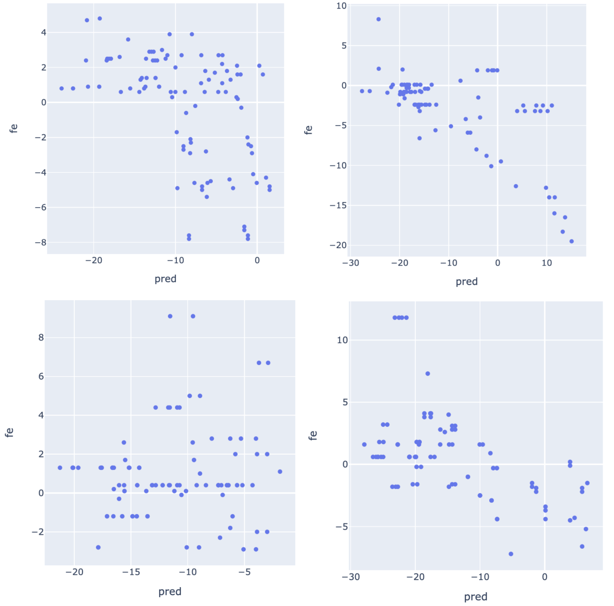

Last week:

- fixed major bug during siamese network training

    - CNN includes BatchNorm

    - due to the way we set up training, a 'batch' is either a batch of
    'best structures' or a batch of 'sub optimal structures',
    which represent different distributions (that we should not normalize!).
    Also, the 'batch' at test time usually includes zero or one 'ground truth structure',
    which is a different distribution.

    - TODO jamboard

    - For now we fix it by removing the BatchNorm layer
    (not needed since the NN is quite shallow and easy to train)


## Re-training S2 scoring network and verify test time prediction makes sense

`run_11` from last week:
https://github.com/PSI-Lab/alice-sandbox/tree/c5035700988a8a6ff0d62db49017dd408dc9ee3e/meetings/2021_06_22#s2-scoring-network-improvement


TODO add plot & script

TODO summarize so we can compare with other improvements?


## Imporve S2 scoring network training

- make training pair less trivial

- subsample from different subsets:

    - from those with n_bps == tgt, up to 30

    - from those with n_bps very close (+/-1) to tgt (to increase chance we compare with these), up to 30

    - the rest, sample it so the total is up to 100

- TODO add plot jamboard?


```
CUDA_VISIBLE_DEVICES=1 taskset --cpu-list 11,12,13,14 python train_siamese_nn.py \
--data ../2021_06_15/data/data_len60_train_10000_s1_stem_bb_combos_s1s100.pkl.gz \
--num_filters 16 16 32 32 64 --filter_width 3 3 3 3 3 --pooling_size 1 1 2 2 2 --in_size 60 \
--epoch 50 --lr 0.001 --batch_size 20 --cpu 4 --perc_bps_negative 0.8 \
--tdata ../2021_06_22/data/data_len60_test_1000_s1_stem_bb_combos_s1s100.pkl.gz \
--result result/run_12
```

improving!  TODO add plot


- reduce total number of 'negatives' so we get to use them during training (only training 50 epochs...)

- reduce from 100 to 20: distributed as 8-8-6

- TODO remove debug print

```
CUDA_VISIBLE_DEVICES=1 taskset --cpu-list 11,12,13,14 python train_siamese_nn.py \
--data ../2021_06_15/data/data_len60_train_10000_s1_stem_bb_combos_s1s100.pkl.gz \
--num_filters 16 16 32 32 64 --filter_width 3 3 3 3 3 --pooling_size 1 1 2 2 2 --in_size 60 \
--epoch 50 --lr 0.001 --batch_size 20 --cpu 4 --perc_bps_negative 0.8 \
--result result/run_13
```

this one is similar to above


- increase NN capacity + more epochs


```
CUDA_VISIBLE_DEVICES=1 taskset --cpu-list 11,12,13,14 python train_siamese_nn.py \
--data ../2021_06_15/data/data_len60_train_10000_s1_stem_bb_combos_s1s100.pkl.gz \
--num_filters 32 32 64 64 128 --filter_width 3 3 3 3 3 --pooling_size 1 1 2 2 2 --in_size 60 \
--epoch 100 --lr 0.001 --batch_size 20 --cpu 4 --perc_bps_negative 0.8 \
--result result/run_14
```


similar?


- one more try: increase NN capacity + decrease LR


```
CUDA_VISIBLE_DEVICES=1 taskset --cpu-list 11,12,13,14 python train_siamese_nn.py \
--data ../2021_06_15/data/data_len60_train_10000_s1_stem_bb_combos_s1s100.pkl.gz \
--num_filters 64 64 128 128 256 --filter_width 3 3 3 3 3 --pooling_size 1 1 2 2 2 --in_size 60 \
--epoch 100 --lr 0.0001 --batch_size 20 --cpu 4 --perc_bps_negative 0.8 \
--result result/run_15
```


### Model comparison

- run_11: instead of thresholding on TOPK, threhsold on num_bps (relative to target). e.g. all negative example will be >= 0.8 * num_bps_tgt.
added subsample for negative example (so we don't hold onto too many arrays in memory).

- run_12: subsample from different subsets: (1) from those with n_bps == tgt, up to 30,
(2) from those with n_bps very close (+/-1) to tgt (to increase chance we compare with these), up to 30,
(3) the rest, sample it so the total is up to 100

- run_13: reduce total number of 'negatives' so we get to use them during training.
reduce from 100 to 20: distributed as 8-8-6.

- run_14: increase NN capacity + more epochs

- run_15: further increase NN capacity + decrease LR


| f1     | target in topK (mean) | (median) | target FE <= -15 (mean) | (median) | all examples (mean) | (median) |
|--------|-----------------------|----------|-------------------------|----------|---------------------|----------|
| run_11 | 0.678046              | 0.881944 | 0.585009                | 0.693457 |            0.493349 | 0.557778 |
| run_12 | 0.738495              | 0.942434 |                0.590972 | 0.657658 | 0.523861            | 0.585784 |
| run_13 | 0.735797              | 0.937500 | 0.593788                | 0.704293 | 0.505284            | 0.557112 |
| run_14 | 0.721544              | 0.947368 | 0.625596                | 0.768939 | 0.516801            | 0.575188 |
| run_15 | 0.629554              | 0.843206 | 0.608418                | 0.736111 | 0.502606            | 0.579796 |


### Predicted score v.s. FE

Check correlation between FE and predicted score on selected examples.





todo: score network is unnormalized, raw score can all be very high/low

todo: as a proof-of-concept, train score network on FE directly?
