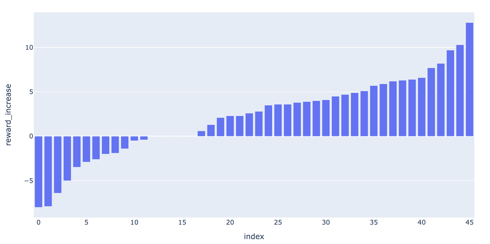

Last week:

- evaluate end-to-end model with S2 scoring network on full test set,
performance (f1) isn't great

- tried a couple of different ways to evaluate,
by focusing on high confidence targets,
or allowing best-n prediction.
AS expected, performance increased in both cases.

- interestingly, by training the scoring network with a difficult
contrastive learning objective (1 v.s. other), the network
was able to approximate the energy function.

- investigated upper bound of performance,
by using RNAfold as the 'scoring model' (WIP)


- prototyped deep Q network,
with reward = - FE_{n} - (- FE_{n-1})

## Debug FE calculation

Some bb combo seems to be invalid! e.g.

```
[BoundingBox(bb_x=2, bb_y=9, siz_x=2, siz_y=2),
 BoundingBox(bb_x=4, bb_y=48, siz_x=3, siz_y=3),
 BoundingBox(bb_x=9, bb_y=43, siz_x=7, siz_y=7),
 BoundingBox(bb_x=21, bb_y=36, siz_x=3, siz_y=3)]
```

In the above example, `BoundingBox(bb_x=2, bb_y=9, siz_x=2, siz_y=2)` is
actually in conflict with `BoundingBox(bb_x=9, bb_y=43, siz_x=7, siz_y=7)`,
since base position `9` is shared!


Since the above combo is invalid, when we try to convert it to db str,
it does not make sense:

```
db_str_pred, _ = arr2db(stem_bbs2arr(bb_combos[idx_best], len(seq)))
print(db_str_pred)
..[[(((.](((((((.....(((..........))))))))))..)))...........
```

The first square left bracket `[` does not have the corresponding right one, since
position `9` is paired with `43`, and that overwrites the square bracket when
we generated the db str.

Oddly, RNAeval can still compute the FE for the above structure,
and it returns the same value as the one without the conflicting
`BoundingBox(bb_x=2, bb_y=9, siz_x=2, siz_y=2)`:

```
print(db_str_tgt)
....(((..(((((((.....(((..........))))))))))..)))...........
compute_fe(seq, db_str_tgt)
-7.7
compute_fe(seq, db_str_pred)
-7.7
```

To make sure the above is not due to the way we implemented RNAeval wrapper,
we also tried computing it directly using CLI, which gives the same result:

```
length = 60
CCCAAGGAUGAUUGUACCCUCAGCACUCAAGACCGCUUGCGGUUCCCCUACACACUUUUU
....(((..(((((((.....(((..........))))))))))..)))...........
 energy =  -7.70 kcal/mol

 length = 60
CCCAAGGAUGAUUGUACCCUCAGCACUCAAGACCGCUUGCGGUUCCCCUACACACUUUUU
..[[(((.](((((((.....(((..........))))))))))..)))...........
 energy =  -7.70 kcal/mol
```


Produced by [debug_fe.ipynb](debug_fe.ipynb)


## Fix bb conflict


Old implementation:

```
# old implementation, from https://github.com/PSI-Lab/alice-sandbox/blob/cb56ce55d65db772375aa3e8d5304afcf9aaefbe/meetings/2021_06_15/utils_s2_tree_search.py#L17

def range_overlap(r1, r2):
    if r2[0] < r1[1] <= r2[1] or r1[0] < r2[1] <= r1[1]:
        return True
    else:
        return False

def bb_conflict_old(bb1, bb2):
    r11 = (bb1.bb_x, bb1.bb_x + bb1.siz_x)
    r12 = (bb1.bb_y - bb1.siz_y, bb1.bb_y)
    r21 = (bb2.bb_x, bb2.bb_x + bb2.siz_x)
    r22 = (bb2.bb_y - bb2.siz_y, bb2.bb_y)
    print(r11, r12, r21, r22)
    if range_overlap(r11, r21) or range_overlap(r11, r22) or range_overlap(r12, r21) or range_overlap(r12, r22):
        return True
    else:
        return False
```

was wrong when computing the range along y dimension,
since `bb_y` is the last index (inclusive), correct implementation should be:

```
def bb_conflict_new(bb1, bb2):
    r11 = (bb1.bb_x, bb1.bb_x + bb1.siz_x)
    r12 = (bb1.bb_y - bb1.siz_y + 1, bb1.bb_y + 1)
    r21 = (bb2.bb_x, bb2.bb_x + bb2.siz_x)
    r22 = (bb2.bb_y - bb2.siz_y + 1, bb2.bb_y + 1)
    print(r11, r12, r21, r22)
    if range_overlap(r11, r21) or range_overlap(r11, r22) or range_overlap(r12, r21) or range_overlap(r12, r22):
        return True
    else:
        return False
```


## Re-run bb combos

Re-generate dataset of bb combos:


```
taskset --cpu-list 11,12,13,14 python run_s2_stem_bb_combo_tree_search.py \
--data ../2021_06_15/data/data_len60_test_1000_s1_stem_bb.pkl.gz \
--out data/data_len60_test_1000_s1_stem_bb_combos.pkl.gz
```

```
taskset --cpu-list 21,22,23,24 python run_s2_stem_bb_combo_tree_search.py \
--data ../2021_06_15/data/data_len60_train_10000_s1_stem_bb.pkl.gz \
--out data/data_len60_train_10000_s1_stem_bb_combos.pkl.gz
```


## Re-train S2 scoring network


subset to those with S1 bb sensitivity = 100%. We need this for training (not required for inference).

```
import pandas as pd
df = pd.read_pickle('data/data_len60_train_10000_s1_stem_bb_combos.pkl.gz')
df = df[df['bb_identical'] == 1]
df.to_pickle('data/data_len60_train_10000_s1_stem_bb_combos_s1s100.pkl.gz', compression='gzip')
```

training (same setting as run_13):

```
CUDA_VISIBLE_DEVICES=1 taskset --cpu-list 11,12,13,14 python train_siamese_nn.py \
--data ../2021_07_14/data/data_len60_train_10000_s1_stem_bb_combos_s1s100.pkl.gz \
--num_filters 16 16 32 32 64 --filter_width 3 3 3 3 3 --pooling_size 1 1 2 2 2 --in_size 60 \
--epoch 50 --lr 0.001 --batch_size 20 --cpu 4 --perc_bps_negative 0.8 \
--result result/run_16
```

Done:

```
2021-07-07 15:14:45,591 [MainThread  ] [INFO ]  Epoch 44/50, validation, loss 0.02624297055095921, accuracy 0.991860465116279
2021-07-07 15:15:17,681 [MainThread  ] [INFO ]  Epoch 45/50, training, loss 0.020341797429306276, accuracy 0.991860465116279
2021-07-07 15:15:21,498 [MainThread  ] [INFO ]  Epoch 45/50, validation, loss 0.021625566219205042, accuracy 0.9941860465116279
2021-07-07 15:15:52,862 [MainThread  ] [INFO ]  Epoch 46/50, training, loss 0.02689871009038883, accuracy 0.990406976744186
2021-07-07 15:15:56,613 [MainThread  ] [INFO ]  Epoch 46/50, validation, loss 0.042373225561341106, accuracy 0.9813953488372094
2021-07-07 15:16:27,853 [MainThread  ] [INFO ]  Epoch 47/50, training, loss 0.024455568097354587, accuracy 0.9921511627906976
2021-07-07 15:16:31,277 [MainThread  ] [INFO ]  Epoch 47/50, validation, loss 0.0358348335801904, accuracy 0.9879844961240308
2021-07-07 15:17:00,818 [MainThread  ] [INFO ]  Epoch 48/50, training, loss 0.0233443699482918, accuracy 0.9906976744186046
2021-07-07 15:17:04,552 [MainThread  ] [INFO ]  Epoch 48/50, validation, loss 0.033495646451651845, accuracy 0.9883720930232558
2021-07-07 15:17:34,282 [MainThread  ] [INFO ]  Epoch 49/50, training, loss 0.023389552860836313, accuracy 0.9918604651162789
2021-07-07 15:17:34,299 [MainThread  ] [INFO ]  Model checkpoint saved at: result/run_16/model_ckpt_ep_49.pth
2021-07-07 15:17:38,183 [MainThread  ] [INFO ]  Epoch 49/50, validation, loss 0.02041495510165141, accuracy 0.991860465116279
```


## Re-eval


```
python eval_s2_full_test_set.py --run_id run_16 > result/eval_s2_log/run_16.txt
```

| f1                                  | run_13 (old) | run_16 (new) |
|-------------------------------------|--------------|--------------|
| target in topK, best-1 predicted    |              |              |
| mean                                | 0.738815     | 0.71591      |
| median                              | 0.9375       | 0.926829     |
| target FE <= -25, best-1 predicted  |              |              |
| mean                                | 0.585713     | 0.49022      |
| median                              | 0.676984     | 0.493243     |
| target FE <= -25, best-3 predicted  |              |              |
| mean                                | 0.660674     | 0.587388     |
| median                              | 0.746429     | 0.605556     |
| target FE <= -25, best-5 predicted  |              |              |
| mean                                | 0.694731     | 0.627413     |
| median                              | 0.786063     | 0.656907     |
| target FE <= -25, best-10 predicted |              |              |
| mean                                | 0.737752     | 0.658011     |
| median                              | 0.838877     | 0.726351     |
| target FE <= -15, best-1 predicted  |              |              |
| mean                                | 0.490824     | 0.457163     |
| median                              | 0.519969     | 0.453571     |
| target FE <= -15, best-3 predicted  |              |              |
| mean                                | 0.585754     | 0.561997     |
| median                              | 0.637073     | 0.613248     |
| target FE <= -15, best-5 predicted  |              |              |
| mean                                | 0.635757     | 0.60465      |
| median                              | 0.70778      | 0.683569     |
| target FE <= -15, best-10 predicted |              |              |
| mean                                | 0.69604      | 0.660896     |
| median                              | 0.781746     | 0.72949      |
| all, best-1 predicted               |              |              |
| mean                                | 0.424741     | 0.419958     |
| median                              | 0.422648     | 0.424242     |
| all, best-3 predicted               |              |              |
| mean                                | 0.527244     | 0.511575     |
| median                              | 0.567766     | 0.540541     |
| all, best-5 predicted               |              |              |
| mean                                | 0.573895     | 0.565487     |
| median                              | 0.625        | 0.606061     |
| all, best-10 predicted              |              |              |
| mean                                | 0.632936     | 0.626486     |
| median                              | 0.6875       | 0.666667     |


It looks like the performance is consistently lower after the bug fix.


## Investigate upper bound of performance

rerun after bug fix:

(run in this week's folder)

```
mkdir -p result/ub_s2_log/
taskset --cpu-list 15,16,17,18 python s2_score_upper_bound.py --topk 50 > result/ub_s2_log/k_50.txt
taskset --cpu-list 15,16,17,18 python s2_score_upper_bound.py --topk 100 > result/ub_s2_log/k_100.txt
taskset --cpu-list 15,16,17,18 python s2_score_upper_bound.py --topk 200 > result/ub_s2_log/k_200.txt
taskset --cpu-list 15,16,17,18 python s2_score_upper_bound.py --topk 500 > result/ub_s2_log/k_500.txt
taskset --cpu-list 15,16,17,18 python s2_score_upper_bound.py --topk 1000 > result/ub_s2_log/k_1000.txt

taskset --cpu-list 15,16,17,18 python s2_score_upper_bound.py --topk 2000 > result/ub_s2_log/k_2000.txt


taskset --cpu-list 15,16,17,18 python s2_score_upper_bound.py --topk 5000 > result/ub_s2_log/k_5000.txt
```


Check n_bb_combo statistics:

```
In [2]: import pandas as pd

In [3]: df = pd.read_pickle('../2021_06_15/data/data_len60_test_1000_s1_stem_bb_combos.pkl.gz')

In [7]: df['num_bb_combos'].describe()
Out[7]:
count     1000.000000
mean      4315.180000
std       5086.982382
min         12.000000
25%       1258.750000
50%       2676.000000
75%       5340.000000
max      42092.000000
Name: num_bb_combos, dtype: float64
```


Result:

| K    | f1_mean  | f1_median |
|------|----------|-----------|
| 50 | 0.407221 | 0.390244  |
| 100 | 0.460992 | 0.470588  |
| 200 | 0.534921 | 0.607378  |
| 500 | 0.613301 | 0.72  |
| 1000 | 0.669828 | 0.805405  |
| 2000 | xxx | xxx  |
| 5000 | xxx | xxx  |
| +inf | xxx | xxx  |


## DQN


- FE diff might not make sense!! Since big open loop will result in a large positive FE (thus negative score)
-> only assign reward at final state (FE of full structure)


- this makes the learning more difficult, since the only state that gives any information
is the final one

- use an extra replay buffer for the final state only `dqn_2.py`

- fixed bug: if next state is final state: next_state_value is 0 but reward is not!

- cap RNAfold energy: avoid FE like `99999`, cap FE at 10, i.e. cap score at -10

```
python dqn_2.py --data ../2021_06_22/data/data_len60_test_1000_s1_stem_bb_combos_s1s100.pkl.gz \
--result result/debug/ --episode 10 --lr 0.01 --batch_size 4 --memory_size 100 --verbose
```


- expose model hyperparam

- add loss report

- add reward history report

debug:

```
python dqn_2.py --data ../2021_06_22/data/data_len60_test_1000_s1_stem_bb_combos_s1s100.pkl.gz \
--result result/debug/ --num_filters 16 32 --filter_width 3 3 --pooling_size 2 2 \
--episode 10 --lr 0.01 --batch_size 4 --memory_size 100 --verbose
```

workstation:


```
taskset --cpu-list 21,22,23,24 python dqn_2.py \
--data ../2021_06_22/data/data_len60_test_1000_s1_stem_bb_combos_s1s100.pkl.gz \
--result result/dqn_2_3/ --num_filters 128 128 256 256 --filter_width 3 3 3 3 --pooling_size 2 2 2 2 \
--episode 1000 --lr 0.001 --batch_size 50 --memory_size 200
```


```
taskset --cpu-list 21,22,23,24 python dqn_2.py \
--data ../2021_06_22/data/data_len60_test_1000_s1_stem_bb_combos_s1s100.pkl.gz \
--result result/dqn_2_4/ --num_filters 256 512 1024 2048 --filter_width 3 3 3 3 --pooling_size 2 2 2 2 \
--episode 2000 --lr 0.001 --batch_size 50 --memory_size 200
```

running


with fewer param (faster before we switch to GPU)

```
taskset --cpu-list 11,12,13,14 python dqn_2.py \
--data ../2021_06_22/data/data_len60_test_1000_s1_stem_bb_combos_s1s100.pkl.gz \
--result result/dqn_2_5/ --num_filters 32 32 64 64 --filter_width 3 3 3 3 --pooling_size 2 2 2 2 \
--episode 1000 --lr 0.001 --batch_size 50 --memory_size 200
```


### Evaluation

Based on run `dqn_2_5` (others still running).

Training losses over episodes on batches sampled from the two replay buffers:


We next look at the change in reward for each particular example.
Since we haven't set up an independent validation dataset, we're looking at training data for now.
We do the following:

- subset to example IDs that have at least one evaluation point <=ep_100 and one >=ep_700

- for each example, find its reward at the earliest episode,
and the reward at the latest episode, and compute the diff,
this gives us a rough idea of whether the reward is increasing overall



- we can also plot all episode, but the plot is quite messy and not very informative:


generated by [plot/dqn_all_reward.png](plot/dqn_all_reward.png)


TODOs:

- larger dataset (bb pred, no need to subset to s1s100)

- validation data, inference pipeline

- state(-action) value function: also conditioned on the 'action space', i.e. set of valid bbs?
For example, intuitively, if including one bb eliminates a lot of potential bb optionals, it might not be a good choice.


- debug neg FE

```
GTACCGTGGACAATCCCAGGGCTGCCGGCGAGTCATGCCATCCTTACATGTTTCTCCTTG
(((.........................................))).............
```


- debug same FE diff struct (after bb conflict bug fix, this is something different):

```
FE equal but structure differ:
target:
[BoundingBox(bb_x=5, bb_y=18, siz_x=3, siz_y=3),
 BoundingBox(bb_x=26, bb_y=59, siz_x=6, siz_y=6),
 BoundingBox(bb_x=34, bb_y=51, siz_x=6, siz_y=6)]
predicted:
[BoundingBox(bb_x=0, bb_y=13, siz_x=4, siz_y=4),
 BoundingBox(bb_x=5, bb_y=18, siz_x=3, siz_y=3),
 BoundingBox(bb_x=26, bb_y=59, siz_x=6, siz_y=6),
 BoundingBox(bb_x=34, bb_y=51, siz_x=6, siz_y=6)]
Target FE -17.3, best in topk FE -17.3, f1=0.8823529411764706
```
