# RNA SS Meeting 2019-06-21

## Dataset

Dataset to be used for training/testing. Original doc is at: https://docs.google.com/spreadsheets/d/1IXpudUpZBc3TEr0IehDg1EzE3n0T9XvWh70NbAP6Gc0/edit#gid=0

| Name                              | Author            | Type           | Organism                                                     | Size                                                                                                                                                                        | Source                                                                                                            | Paper                                                                                                       | Note                                                                                                                                                                                                                                                                                                                                                                                                                                                                                                                                         |
|-----------------------------------|-------------------|----------------|--------------------------------------------------------------|-----------------------------------------------------------------------------------------------------------------------------------------------------------------------------|-------------------------------------------------------------------------------------------------------------------|-------------------------------------------------------------------------------------------------------------|----------------------------------------------------------------------------------------------------------------------------------------------------------------------------------------------------------------------------------------------------------------------------------------------------------------------------------------------------------------------------------------------------------------------------------------------------------------------------------------------------------------------------------------------|
| CRW, Comparative RNA Web          | Gutell Lab        | Low Throughput | various                                                      | 16S: 17032, or 13118 after removing similar ones. Other: TBD                                                                                                                | http://www.rna.icmb.utexas.edu/                                                                                   |                                                                                                             | Processed version pf 16S can be downloaded frmo link in https://github.com/dwillmott/rna-state-inf                                                                                                                                                                                                                                                                                                                                                                                                                                           |
|                                   | Matthew Halvorsen | Computational  | human                                                        | 19 (more in SI?)                                                                                                                                                            | see paper Table 1 (and S1?)                                                                                       | "Disease-Associated Mutations That Alter the RNA Structural Ensemble"                                       | studied disease associated HGMD mutation in UTR, structure change were predicted (RNAfold, local correlation, ensemble)                                                                                                                                                                                                                                                                                                                                                                                                                      |
| RMDB, RNA Mapping Database (RMDB, |                   |                |                                                              | With a total of 15,425,996 datapoints , RMDB currently houses 688 entries, describing more than 1,138 experiments of 138,324 RNA constructs in several solution conditions. | https://rmdb.stanford.edu/                                                                                        |                                                                                                             |                                                                                                                                                                                                                                                                                                                                                                                                                                                                                                                                              |
| ribosnitches                      | Amanda C. Solem   | Review paper   |                                                              | FTL(1 pos and 1 neg), RMRP(many? but not all measured by SHAPE),                                                                                                            |                                                                                                                   | "The potential of the riboSNitch in personalized medicine"                                                  |                                                                                                                                                                                                                                                                                                                                                                                                                                                                                                                                              |
| RNA STRAND                        |                   |                | various                                                      | 4666                                                                                                                                                                        | http://www.rnasoft.ca/strand/                                                                                     | "Rna strand: the rna secondary structure and statistical analysis database"                                 |                                                                                                                                                                                                                                                                                                                                                                                                                                                                                                                                              |
| Sukosd                            |                   |                |                                                              | 16 (16S)                                                                                                                                                                    |                                                                                                                   | "Evaluating the accuracy of shape-directed rna secondary structure predictions"                             | ?                                                                                                                                                                                                                                                                                                                                                                                                                                                                                                                                            |
| Rogers                            |                   |                |                                                              | 35                                                                                                                                                                          |                                                                                                                   | "Conditioning and robustness of rna boltzmann sampling under thermodynamic parameter perturba- tions"       | The data on tRNA, 5S rRNA, and 16S rRNA families were taken from the Comparative RNA Website (51), the data on RNaseP from the RNase P Database (52), and the data on intron group I from Rfam (53).                                                                                                                                                                                                                                                                                                                                         |
| Rfam                              |                   |                |                                                              |                                                                                                                                                                             | http://rfam.sanger.ac.uk                                                                                          |                                                                                                             |                                                                                                                                                                                                                                                                                                                                                                                                                                                                                                                                              |
| compaRNA                          |                   |                |                                                              |                                                                                                                                                                             | http://iimcb.genesilico.pl/comparna/                                                                              |                                                                                                             | web site down                                                                                                                                                                                                                                                                                                                                                                                                                                                                                                                                |
| S-151Rfam                         |                   |                |                                                              | 151                                                                                                                                                                         | http://www.rnasoft.ca/CG/data/S-151Rfam.txt                                                                       | "CONTRAfold: RNA secondary structure prediction without physics-based models"                               | 151 sequences, each from one of the different families tagged as published by Rfam. The total number of residues is 20,581 of which 9848 are base paired (48%). Sequence length varies from 23–568 nt, with an average of 136 nt. An early version of CONTRAfold (v1.0) was trained on S-151Rfam.                                                                                                                                                                                                                                            |
| S-Processed-TRA                   |                   |                |                                                              | 3439                                                                                                                                                                        | http://www.rnasoft.ca/CG/data/S-Processed-TRA.txt                                                                 | "Efficient parameter estimation for RNA secondary structure prediction"                                     | http://www.rnasoft.ca/CG/ 3439 sequences, 612,414 residues of which 339,420 are base paired (55%). Sequence length varies from 10–695 nt, with an average of 178 nt. “S-Processed-TRA” includes a mixture of SRP RNAs, RNaseP RNAs, tmRNAs, and rRNAs as well as some other secondary structures inferred from tertiary structures in the Protein Data Bank. Models trained on “S-Processed-TRA” include CONTRAfold v2.02, and Simfold-CG 1.1.                                                                                               |
| S-Full-Train                      |                   |                |                                                              |                                                                                                                                                                             | http://www.rnasoft.ca/CG/data/S-Full.zip                                                                          | " Computational approaches for RNA energy parameter estimation"                                             | “S-Full-Train” contains 2586 sequences, 691,343 residues of which 371,428 are base paired (61%). Sequence length varies from 10–699 nt, with an average length of 267 nt. The type of RNA molecules in this test set is similar to those of “S-Processed-TRA.” Models trained on “S-Full-Train” include Simfold-BL*, Simfold-BL-FR*, and ContextFold.                                                                                                                                                                                        |
| rRNAdom                           |                   |                |                                                              |                                                                                                                                                                             |                                                                                                                   | "Improved RNA secondary structure prediction by maximizing expected pair accuracy"                          | 88 small-subunit and 27 large-subunit rRNA domains, archived for this work in the Supplemental Material under the name “rRNAdom.” “rRNAdom” contains a total of 45,700 residues, of which 24,382 are base paired (53%). Sequence length varies from 72–734 nt, with an average length of 397 nt.                                                                                                                                                                                                                                             |
| Steinberg                         | Steinberg         |                |                                                              |                                                                                                                                                                             |                                                                                                                   | "Compilation of tRNA sequences and sequences of tRNA genes"                                                 | 1415 tRNAs                                                                                                                                                                                                                                                                                                                                                                                                                                                                                                                                   |
| Dowell                            | Dowell            |                |                                                              |                                                                                                                                                                             |                                                                                                                   | "Evaluation of several lightweight stochastic context-free grammars for RNA secondary structure prediction" | 81 SRP RNAs (the Signal Recognition Particle database) (Gorodkin et al. 2001), 97 tmRNAs (the transfer messenger RNA database) (Williams 1999), and 225 RNaseP RNAs (the Ribonuclease P RNA database) (Brown 1999)                                                                                                                                                                                                                                                                                                                           |
|                                   |                   |                |                                                              |                                                                                                                                                                             |                                                                                                                   | " Improved RNA secondary structure prediction by maximizing expected pair accuracy"                         | 309 5S rRNAs, 37 telomerase RNA, 16 group I introns, and three group II introns                                                                                                                                                                                                                                                                                                                                                                                                                                                              |
| S-Processed-TES                   |                   |                |                                                              |                                                                                                                                                                             | http://www.rnasoft.ca/CG/data/S-Processed-TES.txt                                                                 | "Efficient parameter estimation for RNA secondary structure prediction"                                     | 974 sequences, obtained from “http://www.rnasoft.ca/CG/.” The type of RNA molecules in this test set is similar to those of “S-Processed-TRA.” “S-Processed-TES” has been used in previous benchmarks in conjunction with “S-Processed-TRA” as a training set (Andronescu et al. 2007).                                                                                                                                                                                                                                                      |
| S-Full-Test                       |                   |                |                                                              |                                                                                                                                                                             |                                                                                                                   | " Computational approaches for RNA energy parameter estimation"                                             | 659 sequences obtained from “http://www.rnasoft.ca/CG/.” The type of RNA molecules in this test set is similar to those of “S-Processed-TRA.” “S-Full-Test” has been used for benchmarking in conjunction with “S-Full-Train” as a training set (Andronescu et al. 2010; Zakov et al. 2011).                                                                                                                                                                                                                                                 |
| RNAStralign                       |                   |                |                                                              |                                                                                                                                                                             | http://rna.urmc.rochester.edu/RNAStralign.tar.gz                                                                  |                                                                                                             | tRNA, 5S ribosomal RNA, and group I intron sequences                                                                                                                                                                                                                                                                                                                                                                                                                                                                                         |
|                                   |                   |                | human                                                        | 30                                                                                                                                                                          | https://onlinelibrary.wiley.com/action/downloadSupplement?doi=10.1002%2Fhumu.22273&file=humu22273-sup-0001-S1.pdf | "RNAsnp: Efficient Detection of Local RNA Secondary Structure Changes Induced by SNPs"                      | We compiled a list 30 known SNPs (Supp. Table S1) for which an effect on the RNA structures has been discussed. Of these 30 SNPs, 25 SNPs are from human mRNAs, one is from a rat mRNA, and the remaining four are from viral sequences. The structural changes were verified experimentally in only four ofthem using chemical or enzymatic structure probing methods [Grover et al., 2011; Shen et al., 1999; Westerhout et al., 2005; You et al., 2004]. In the remaining cases, only a careful computational analysis has been reported. |
|                                   | Oz Solomon        | PARS           | human HepG2                                                  |                                                                                                                                                                             |                                                                                                                   | "RNA editing by ADAR1 leads to context-dependent transcriptome-wide changes in RNA secondary structure"     | partially processed by Omar: /dg-shared/for_omar/data/SS_RNA_mapping/studies/solomon2017 (is that control or ADAR-knock-down?)                                                                                                                                                                                                                                                                                                                                                                                                               |
|                                   | Yue Wan           | PARS           | Human lymphoblastoid cell lines GM12878, GM12891 and GM12892 |                                                                                                                                                                             |                                                                                                                   | "Landscape and variation of RNA secondary structure across the human transcriptome"                         | family trio! Omar processed this datset: /dg-shared/for_omar/data/SS_RNA_mapping/studies/wan2014                                                                                                                                                                                                                                                                                                                                                                                                                                             |
|                                   | Silvi Rouskin     | DMS            | K562, fibroblast                                             |                                                                                                                                                                             |                                                                                                                   | "Genome-wide probing of RNA structure reveals active unfolding of mRNA structures in vivo"                  | partially processed by Omar: /dg-shared/for_omar/data/SS_RNA_mapping/studies/rouskin2014/                                                                                                                                                                                                                                                                                                                                                                                                                                                    |
|                                   | Meghan Zubradt    | DMS-Mapseq     | human HEK293T + Drosophila                                   |                                                                                                                                                                             | https://www.ncbi.nlm.nih.gov/geo/query/acc.cgi?acc=GSE84537                                                       | "	DMS-MaPseq: A genome-wide or targeted approach for RNA structure probing in vivo"                          | in vivo? in Omar's list                                                                                                                                                                                                                                                                                                                                                                                                                                                                                                                      |

## Related Work

Related work using deep learning to model RNN SS.
So far I haven't found any work that uses deep learning to model RNA probing data.
Original doc is at: https://docs.google.com/spreadsheets/d/1IXpudUpZBc3TEr0IehDg1EzE3n0T9XvWh70NbAP6Gc0/edit#gid=0


| Author         | Paper                                                                                                                                              | Training Data                                                  | Test Data                                              | Model                                          | Note                                                             |
|----------------|----------------------------------------------------------------------------------------------------------------------------------------------------|----------------------------------------------------------------|--------------------------------------------------------|------------------------------------------------|------------------------------------------------------------------|
| Devin Willmott | "State inference of RNA secondary structures with deep recurrent neural networks"                                                                  | 13118 sequence-structure pairs of 16S RNAs from CRW            | 16 sequences (also 16SA, or 18S?)                      | RNN-LSTM                                       | All sequences from same family                                   |
| Devin Willmot  | "Recurrent Neural Networks and Their Applications to RNA Secondary Structure Inference"                                                            | 1711 sequences (16S, 5S, 23S, etc.) from RNA STRAND            | 16 sequences (16S) Sukosd set, 35 sequences Rogers set | BLSTM + CNN, predicting 2D map (Fig 5.1)       | again, not generalizing across families, structure needs cleanup |
| Linyu Wang     | "DMfold: A Novel Method to Predict RNA Secondary Structure With Pseudoknots Based on Deep Learning and Improved Base Pair Maximization Principle." | 2345 sequence-structure (5sRNA, tRNA, tmRNA, and RNaseP) pairs | N/A? only showing validation performance?              | BLSTM, predicting 7-class dot-bracket notation | not generalizing across families,  structure needs cleanup       |


## Current Progress

- Trained model on one probing data (DMS-seq, K562, in vivo): [../../model/shape_seq](../../model/shape_seq)


- Re-implemented DMfold with proper CV: [../../model/dmfold](../../model/dmfold)


## Investigation of Training Dataset

### Family Trio


- RNAseq of the child needs re-processing, since the coverage is suspiciously low:

```
father: loaded 2000000 rows, with 1117008 rows (0.558504) missing reactivity
mother: loaded 2000000 rows, with 1112389 rows (0.5561945) missing reactivity
child_rep1: loaded 2000000 rows, with 1914630 rows (0.957315) missing reactivity
child_rep2: loaded 2000000 rows, with 1863138 rows (0.931569) missing reactivity
```

Produced by running `python analyze_family_trio_data.py`.


- Correlation (per each transcript) between father and mother is quite low, but increases with more stringent coverage cutoff.
A good baseline will be to compare between reps (need to re-process the child data).

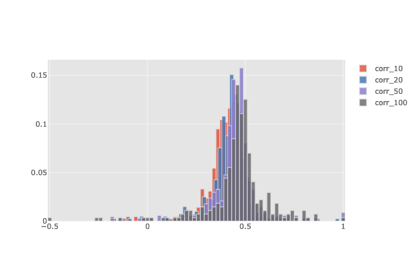

(interactive version at: [../plot/family_pair_correlation_histogram.html](plot/family_pair_correlation_histogram.html))

Example of high, median and low correlations:

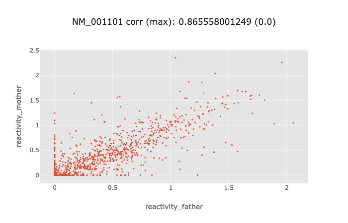

(interactive version at: plot/family_pair_transcript_scatter_max.html)


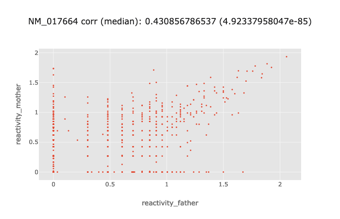

(interactive version at: plot/family_pair_transcript_scatter_median.html)

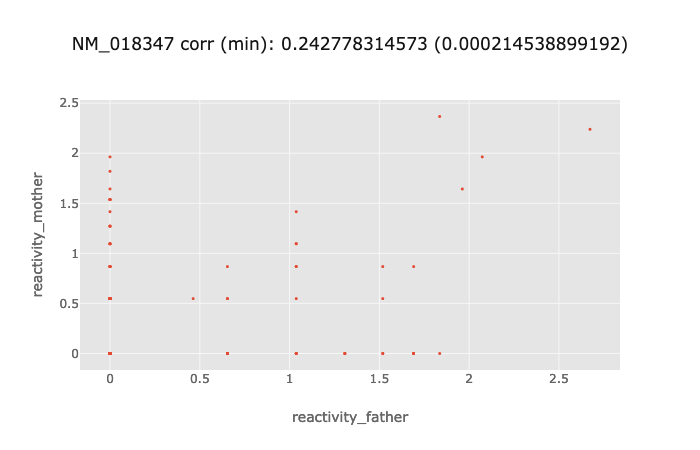

(interactive version at: plot/family_pair_transcript_scatter_min.html)

Produced by running `python analyze_family_pair_data.py`.


### K562

- correlation between two in vivo dataset looks good. (TODO difference between the two, not rep!)

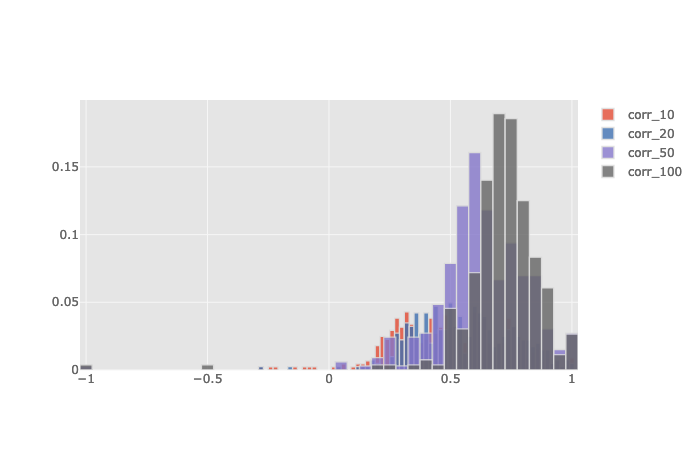

(interactive version at: [plot/k562_vivo1_vivo2_correlation_histogram.html](plot/k562_vivo1_vivo2_correlation_histogram.html))

Example of high, median and low correlations:

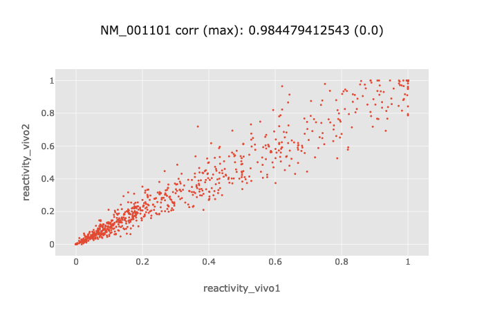

(interactive version at: [plot/k562_vivo1_vivo2_transcript_scatter_max.html](plot/k562_vivo1_vivo2_transcript_scatter_max.html))

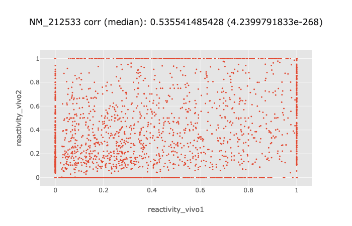

(interactive version at: [plot/k562_vivo1_vivo2_transcript_scatter_median.html](plot/k562_vivo1_vivo2_transcript_scatter_median.html))


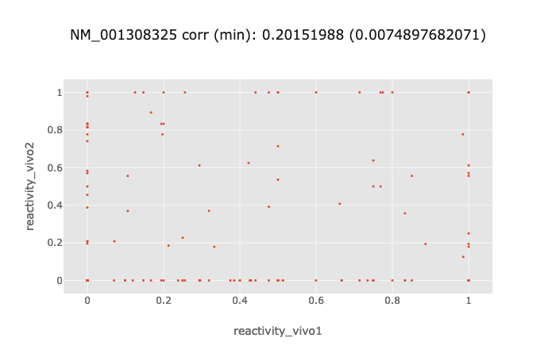

(interactive version at: [plot/k562_vivo1_vivo2_transcript_scatter_min.html](plot/k562_vivo1_vivo2_transcript_scatter_min.html))


- correlation between vivo and vitro also looks good.

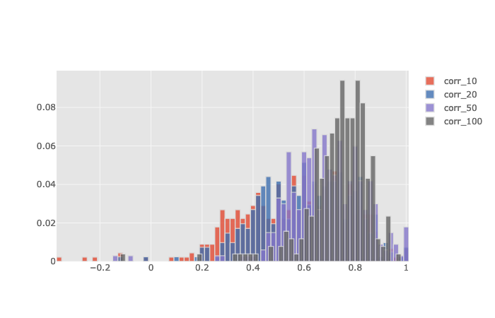

(interactive version at: [plot/k562_vivo1_vitro_correlation_histogram.html](plot/k562_vivo1_vitro_correlation_histogram.html))

Example of high, median and low correlations:

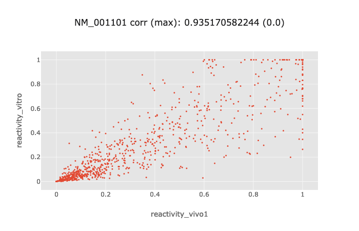

(interactive version at: [plot/k562_vivo1_vitro_transcript_scatter_max.html](plot/k562_vivo1_vitro_transcript_scatter_max.html))


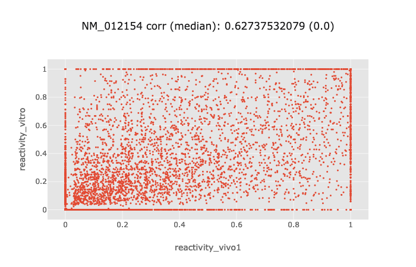

(interactive version at: [plot/k562_vivo1_vitro_transcript_scatter_median.html](plot/k562_vivo1_vitro_transcript_scatter_median.html))


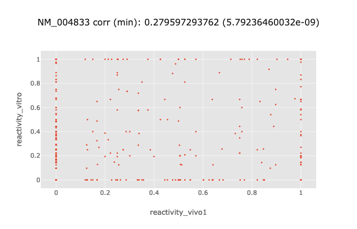

(interactive version at: [plot/k562_vivo1_vitro_transcript_scatter_min.html](plot/k562_vivo1_vitro_transcript_scatter_min.html))


## Paper Summary

These are the paper I've read in-depth.

TODO


## Meeting Notes and Action Items

Proposed items:

- Reprocess family trio child dataset

- Process HEK293T dataset


To be completed during and after meeting.
