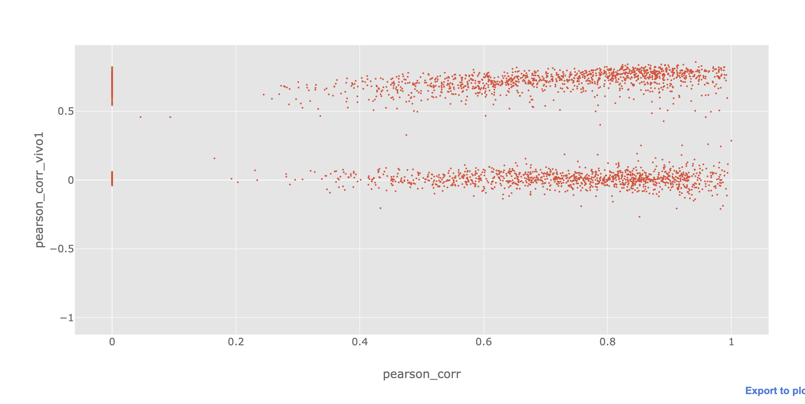

# 2019-07-19

- Found a major bug in generating training data

About half of the data were incorrect, result in model’s performance on those being close to corr 0 (lower cluster on the plot).
x-axis: corr between reps in the dataset, y-axis: corr between model prediction (CV) and the target

- New dataset generated for K562 (vitro, vivo1, vivo2): `oovVmC`

Instead of hacking GenomeKit track format, simply store sequence and array for each transcript.

Added TPM from ProteinAtlas, and rep correlation.

- Re-trained all models (hyper parameter tuning not completed yet)

Filter out low confidence examples for training.

Re-weight training example based on transcript log TPM and rep correlation.

- Genome-wide performance eval

See [eval.ipynb](eval.ipynb)

Predictions have been pre-computed and loaded, more plots can be generated during the meeting.

- Processed solved human structures from 'RNA Strand' Database

See [eval.ipynb](eval.ipynb) (focus on A/C nucleotide only), still not as good as RNAfold

- Family trio

See [eval.ipynb](eval.ipynb), still no performance

- RNAprobing server

Only SHAPE data supported, might be able to pass in missing val? TODO

TODOs:

- Network architecture and hyperparam searching

- Fix data generation bug in other cell line dataset

- Train on yeast data? (there's more solved structure and validation in the paper)

- K562 half life dataset?

Note:

- `data/` generated by: TODO 'prediction/'

