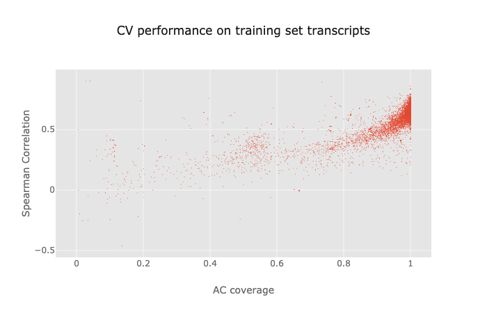
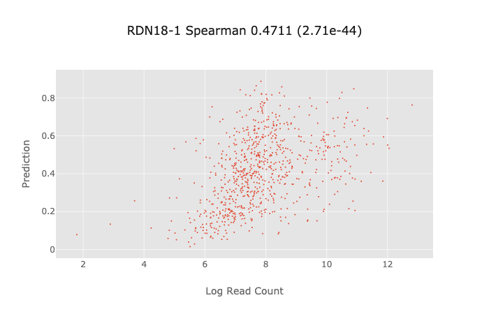
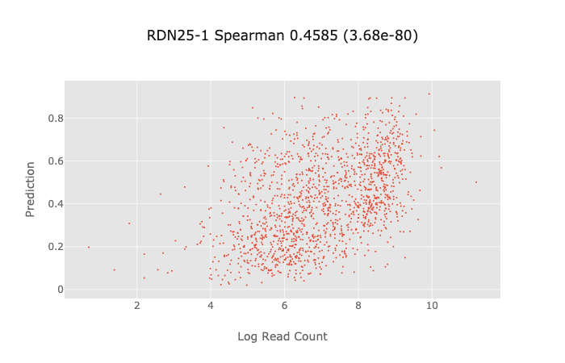
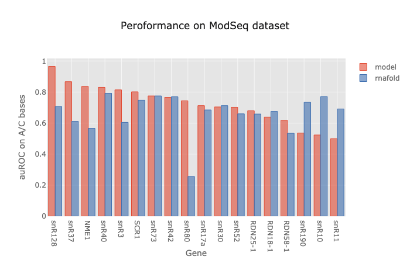
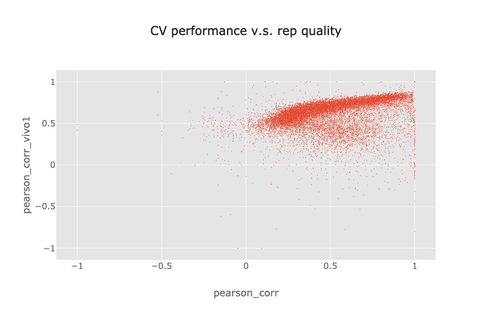
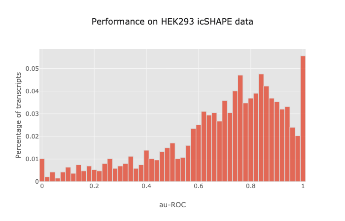

# Predict in-vivo RNA Secondary Structure

## Introduction & Background

- RNA plays an important part in regulating gene expression,
 both as an intermediate molecule for coding genes,
 and as a direct regulator via noncoding genes and noncoding parts of coding genes.

- The regulatory function of noncoding RNAs (and noncoding parts of coding genes)
is enabled by RNA's versatility in adopting complex secondary and tertiary structures

- Existing RNA secondary structure prediction algorithms mainly focus on
finding the minimum free energy structure, or an ensemble of structures,
which is insufficient for predicting RNA folding in vivo,
due to the presence of RBPs, proteins, etc.

- Recent advance in combing chemical probing and high throughput sequencing
enabled the discovery of whole transcriptome RNA structure in multiple species and cell types

- Purpose of this work is to construct computational models for RNA secondary structure
 in multiple species/cell types

## Yeast

### Data


- Yeast strain BY4741

- treated with DMS (only react with A/C base)

- poly-A selected, fragmented and sequenced

- Removed outlier positions by 90% Winsorization,
and normalized raw read counts by dividing by the max in each 100nt window

### Model


We used 5-layer densely connected dilated convolutional neural network,
where the input and output of each conv layer are concatenated and passed on to the next layer.
For each base in the RNA sequence, the model predicts the probability of it being accessible.
Layer parameters are:

```
- {dilation: 1, filter_width: 16, num_filter: 128}
- {dilation: 2, filter_width: 16, num_filter: 128}
- {dilation: 4, filter_width: 16, num_filter: 256}
- {dilation: 8, filter_width: 16, num_filter: 256}
- {dilation: 16, filter_width: 16, num_filter: 512}
```

RNA positions with non-A/C bases are masked out in the loss function and back propagation.

BatchNorm is added for each conv layer,
and L1 and L2 regularization was applied to all conv layer filters.

Model was trained using 5-fold CV with early stopping.

### CV Performance




### Evaluation

#### Yeast ribosomal RNA structure





#### Yeast ModSeq Dataset



## Human

### Data


- K562 cell line

- treated with DMS (only react with A/C base)

- poly-A selected, fragmented and sequenced

- Removed outlier positions by 90% Winsorization,
and normalized raw read counts by dividing by the max in each 100nt window

- Filtered out transcripts where the gene expression log TPM is below 1,
or the correlation between the two biological reps is below 0.2


### Model

Similar to the yeast model, with added example weighting for each transcript:

```
# tpm weight
w1 = 1/(1 + np.exp(-1.5 * (log_tpm - 3)))
# corr weight
w2 = 1/(1 + np.exp(-10 * (rep_corr - 0.5)))
transcript_weight = w1 * w2
```


### CV Performance




### Evaluation

#### HEK293 icSHAPE Dataset



## Future Work

- Combine prediction with thermodynamic models to predict the actual base-pairing for sequences in vivo

- Multi-task training of multiple species and cell types


