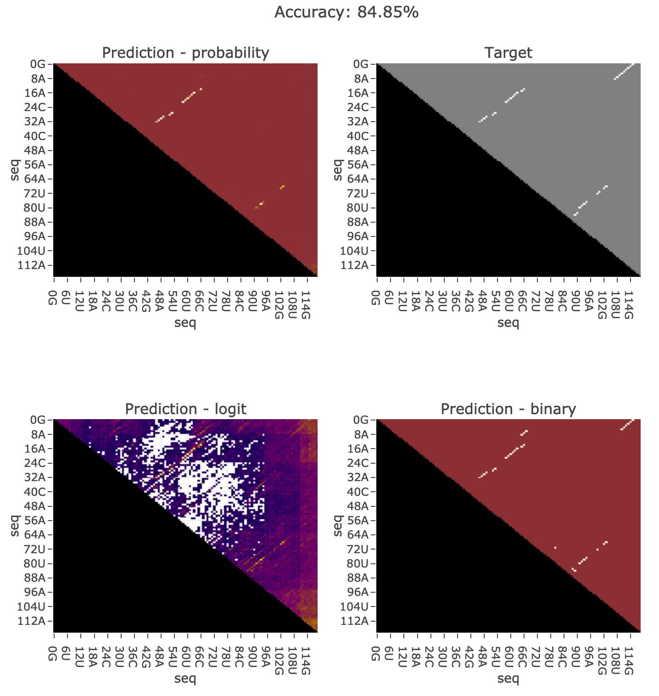

# Reimplementation of DMfold (+ additional work)

DMfold paper (https://www.frontiersin.org/articles/10.3389/fgene.2019.00143/full) reports `87.8%` test set accuracy using the neural net alone,
we want to investigate whether this result can be trusted.

## Paper Summary

- Dataset is a subset of the public database of Mathews lab.
The original dataset comprises 3,975 known RNA primary sequences and structure pairs.
The processed version (downloaded from their github) consists of `2345` RNA sequence and structure pairs (5sRNA, tRNA, tmRNA, and RNaseP).

- Their model consists of two parts: PU (prediction unit) and CU (correction unit).

- The prediction unit is a RNN that takes as input the full RNA sequence
(redundant 8-channel encoding, not sure why they're doing that, see Table 1 in the paper),
and outputs a 7-class softmax per each base.
The 7 classes correspond to different types in the dot-bracket notation.
See Table 2 in the paper for more details.

- The correction unit is quite complicated and I didn't have time to go through the details (since the focus of this analysis is on the neural net part).
Basically, for a given sequence, the 7-class probabilities the neural net outputs across all bases is not guaranteed to yield a valid dot-bracket notation,
so the correction unit is used to process that into valid secondary structure format.

- The paper reports `87.8%` test set accuracy on their neural net alone.


## Reimplementation and analysis

### Dataset

The `2345` RNA sequence in their dataset consists of only a few different RNA types:

```
1059 5s
 422 RNaseP
 486 tRNA
 378 tmRNA
```

Since RNA sequence and structure within the same type can be highly similar, a random split of training/validation might not be the right thing to do,
if the objective is to learn causal relationship between sequence and structure that can generalize to a completely unseen RNA sequence.
Otherwise the neural net will probably achieve a high validation/test performance just by memorizing the training set.

In all analysis below, we'll try two different strategies of training/validation split:

- random: each (of the `2345`) RNA sequence is randomly selected to be in validation set with 20% probability.

- leave-one-RNA-type-out: one RNA type (out of the `4`) is selected, and all RNA sequences belong to that type is used as validation data.

To generate data for the training/analysis below, run:

```
mkdir -p data
python make_data.py
```

### Multiclass output - dot-bracket notation - RNN

We've re-implemented the 7-class output model in the paper, with a few modifications:

- 8-channel encoding replaced with 4-channel (since I don't understand why they need to use 8-channel)

- different number of LSTM cells and hidden units (performance doesn't change much, feel free to modify it in [train.py](train.py) to replicate what's described in section 'prediction unit' in the paper)

- proper masking for padding bases

| split | validation accuracy | command |
|-------|---------------------|---------|
| random | 88%  | CUDA_VISIBLE_DEVICES={gpu_id} python train.py --split random |
| 5s RNA as validation | 60% | CUDA_VISIBLE_DEVICES={gpu_id} python train.py --split 5s |
| RNaseP RNA as validation | 47% | CUDA_VISIBLE_DEVICES={gpu_id} python train.py --split rnasep |
| tRNA as validation | 59% | CUDA_VISIBLE_DEVICES={gpu_id} python train.py --split trna |
| tmRNA as validation | 48% | CUDA_VISIBLE_DEVICES={gpu_id} python train.py --split tmrna |

## Additional Work

### Multiclass output - dot-bracket notation - conv net

The above RNN training is quite slow, so we've also implemented a conv net version (these conv nets takes a few minutes to train), with similar performance.

Note the performance is slightly higher than the one reported in the paper, which might be due to early stopping (so we're reporting the highest validation performance here).
Didn't bother to do the nested cross validation setup since we're not going to use these models. But the general conclusion still holds.

Also note that performance on non-random split might be a bit higher if we do some hyperparameter tuning, since the model is likely to have overfitted within the first epoch.
But again, the general conclusion still holds.

| split | validation accuracy | command |
|-------|---------------------|---------|
| random | 91%  | CUDA_VISIBLE_DEVICES={gpu_id} python train_conv.py --split random |
| 5s RNA as validation | 57% | CUDA_VISIBLE_DEVICES={gpu_id} python train_conv.py --split 5s |
| RNaseP RNA as validation | 49% | CUDA_VISIBLE_DEVICES={gpu_id} python train_conv.py --split rnasep |
| tRNA as validation | 63% | CUDA_VISIBLE_DEVICES={gpu_id} python train_conv.py --split trna |
| tmRNA as validation | 48% | CUDA_VISIBLE_DEVICES={gpu_id} python train_conv.py --split tmrna |

### Binary output - pair probability

This is not implemented in the paper, but we did the analysis anyways just for completeness. Implemented using conv net since RNN is too slow to train.
Since the raw data ct files has the paired position index for each base in the RNA (0 if unpaired), we can convert that to binary labels and predict the paired probability.
Same as above, we did it in both random and non-random split setting.

| split | validation accuracy | command |
|-------|---------------------|---------|
| random | 93%  | CUDA_VISIBLE_DEVICES={gpu_id} python train_binary.py --split random |
| 5s RNA as validation | 70% | CUDA_VISIBLE_DEVICES={gpu_id} python train_binary.py --split 5s |
| RNaseP RNA as validation | 66% | CUDA_VISIBLE_DEVICES={gpu_id} train_binary train.py --split rnasep |
| tRNA as validation | 74% | CUDA_VISIBLE_DEVICES={gpu_id} python train_binary.py --split trna |
| tmRNA as validation | 67% | CUDA_VISIBLE_DEVICES={gpu_id} python train_binary.py --split tmrna |


### Predict paired position - 2D output

This is something we tried just for fun. Not fully debugged.

The model takes as input a sequence and outputs a 2D matrix, where the value at location `[i, j]` is the probability that base `i` is paired with `j`.

We report the accuracy of predicting, for each base, its paired location across all locations in the sequence.
Specifically, we only consider positions that are paired in the dataset (for now we consider predicting paired/unpaired a separate task).
Also, to avoid double-counting, for each pair of positions (i, j) we only count it once for min(i, j).
The accuracy is reported to be number_of_position_with_correct_pairing_index/total_number_of_paired_positions.

| split | validation accuracy (top 1) | validation accuracy (top 3) | validation accuracy (top 5) | validation accuracy (top 10) | command | model DC ID |
|-------|---------------------|---------|---------|---------|---------|----|
| random | 94%  | 97%  | 98%  | 99%  | CUDA_VISIBLE_DEVICES={gpu_id} python train_2d.py --split random | nIHGC4 |
| 5s | 45%  | 71%  | 81%  | 91%  | CUDA_VISIBLE_DEVICES={gpu_id} python train_2d.py --split 5s | 3oDyXh |
| rnasep | 48%  | 72%  | 79%  | 88%  | CUDA_VISIBLE_DEVICES={gpu_id} python train_2d.py --split rnasep | uVQluV |
| trna | 51%  | 75%  | 84%  | 93%  | CUDA_VISIBLE_DEVICES={gpu_id} python train_2d.py --split trna | k7o1cE |
| tmrna | 45%  | 68%  | 77%  | 86%  | CUDA_VISIBLE_DEVICES={gpu_id} python train_2d.py --split tmrna | 1UIbXA |


Note that `train_2d.py` doesn't use early stopping and we're displaying the best validation performance within the first 50 epochs here.

The following plots demonstrate examples in the validation set, where plot title is the top-1 accuracy.

- random split (generalization within same RNA type)

    (note that since we forgot to fix the random seed when doing the random split for training, we can't reproduce the exact split. Will fix in the next round)

    - example with best performance

    

    - example with intermediate performance

    

- train on non-5s RNAs, use all 5s RNAs for validation (generalization to different RNA types)

    - example with best performance

    

    - example with intermediate performance

    

For plots on other models (different validation split), see [plot/](plot/). HTML plots can be reproduced by running:

```bash
CUDA_VISIBLE_DEVICES={gpu_id} python make_plot_2d.py random
CUDA_VISIBLE_DEVICES={gpu_id} python make_plot_2d.py 5s
CUDA_VISIBLE_DEVICES={gpu_id} python make_plot_2d.py rnasep
CUDA_VISIBLE_DEVICES={gpu_id} python make_plot_2d.py trna
CUDA_VISIBLE_DEVICES={gpu_id} python make_plot_2d.py tmrna
```

## Conclusion

- 7-class classification (training objective in the paper) accuracy reported in paper reflect the generalization performance **within** the same RNA type

- 7-class classification (training objective in the paper) accuracy drops significantly (from 90% to 50%-60%) if looking at generalization performance to different RNA types

- Consistently, binary classification accuracy drops from 93% to ~70%, but it is not as bad as the 7-class model.

- For predicting 2D map, similar performance drop from random split to leave-one-type-out was observed.

- It's pretty exciting that predicting 2D matrix from sequence alone works. =)
